# Setting up the Xilinx Vivado development environment <br /> for Linux/Windows operating systems
[[**Home**](../../../README.md)] [[**Back**](../README.md)] [[**Tips&Tricks**]](TIPS.md) [[**KPAS**]](KPAS.md)

# Contents

* [**Introduction**](#introduction)
* [**Required softwares**](#required-softwares)
* [**Command line usage**](#command-line-usage)
   * [Linux terminal](#linux-terminal)
   * [Windows terminal](#windows-terminal)
* [**Text editor**](#text-editor)<br />
* [**Preliminary installations and configurations for Windows users**](#preliminary-installations-and-configurations-for-windows-users)
   * [Install Notepad++](#install-notepad-plus-plus)
   * [Install 7-Zip](#install-7-zip)
   * [Improve the Windows Command Prompt appearance](#improve-the-windows-command-prompt-appearance)
   * [Install a Linux-like TAB completion](#install-a-linux-like-tab-completion)
   * [Enable file extensions visualization](#enable-file-extensions-visualization)
   * [Add a login script for the Command Prompt](#add-a-login-script-for-the-command-prompt)
   * [Add Notepad++ executable to search path](#add-notepad-executable-to-search-path)
   * [Add Linux executables to search path](#add-linux-executables-to-search-path)
   * [Install Nano and Vim command-line text editors](#install-nano-and-vim-command-line-text-editors)
* [**Install Git**](#install-git)
   * [Linux installation](#install-git-linux-installation)
   * [Windows installation](#install-git-windows-installation)
* [**Clone and update the Git repository for the course**](#clone-and-update-the-git-repository-for-the-course)
   * [Initial configuration](#initial-configuration)
   * [Repository download](#repository-download)
   * [Create your personal development branch](#create-your-personal-development-branch)
   * [Update the repository](#update-the-repository)
* [**Install Tcl**](#install-tcl)
   * [Linux installation](#install-tcl-linux-installation)
   * [Windows installation](#install-tcl-windows-installation)
   * [tclsh init script](#tclsh-init-script)
* [**Install ROOT and PyROOT**](#install-root-and-pyroot)
* [**Install PuTTY**](#install-putty)
   * [Linux installation](#install-putty-linux-installation)
   * [Windows installation](#install-putty-windows-installation)
* [**Install Xilinx Vivado**](#install-xilinx-vivado)
   * [Download](#download)
   * [Extraction](#extraction)
   * [Installation wizard](#installation-wizard)
   * [Licensing](#licensing)
* [**Install cable drivers**](#install-cable-drivers)
   * [Linux installation](#install-cable-drivers-linux-installation)
   * [Windows installation](#install-cable-drivers-windows-installation)
* [**Add Xilinx Vivado executables to search path**](#add-xilinx-vivado-executables-to-search-path)
   * [Locate and execute Vivado setup scripts](#locate-and-execute-vivado-setup-scripts)
   * [Experiment with Vivado commands](#experiment-with-vivado-commands)
* [**Sample Xilinx Vivado simulation and implementation flows**](#sample-xilinx-vivado-simulation-and-implementation-flows)
   * [Navigate to the test directory](#navigate-to-the-test-directory)
   * [Setup the working area](#setup-the-working-area)
   * [Compile IP cores](#compile-ip-cores)
   * [Run a behavioral simulation using XSim](#run-a-behavioral-simulation-using-xsim)
   * [Implement the design on a target FPGA](#implement-the-design-on-a-target-fpga)
   * [Install and debug the firmware (optional)](#install-and-debug-the-firmware)

<br />
<!--------------------------------------------------------------------->

# Introduction
[**[Contents]**](#contents)

These notes in form of **step-by-step instructions** are meant to help students
to setup a suitable development environment for FPGA programming using the **Xilinx Vivado design suite**.

Please, be aware that <b>Xilinx <u><i>only</i></u> supports Linux and Windows platforms</b>, not MacOS.
Students using a MacOS personal computer must either install
a supported operating system (Linux Ubuntu would be preferable)
using a dual-boot or a virtualization software (VirtualBox is fine)
or find another computer running a Linux distribution or Windows 7/10.

>
> **IMPORTANT**
>
> Most of screenshots included in this guide are mainly from a _Windows 7 Ultimate_ operating system. 
> Small differences can arise from Windows 7 and new versions Windows 10 and Windows 11.
> Additionally, screenshots referring Xilinx Vivado installation steps are from a **2019.2 installer**.
> The content of the wizard for the latest version available for download on the Xilinx website can be
> slightly different.
>

<br />
<!--------------------------------------------------------------------->


# Required softwares
[**[Contents]**](#contents)

The main software used in the course is called **Xilinx Vivado**. It is a professional and complete
CAD suite to program **Field Programmable Gate Array (FPGA)** devices from Xilinx using industry-standard
**Hardware Description Languages (HDL)** such as **Verilog** and **VHDL**.

As part of the suite Vivado also provides a good **digital simulator** called **XSim** that will be used
in the course to simulate our digital designs before mapping them to real hardware.<br />
Despite many other professional digital simulators exist on the market (e.g. ModelSim) the goal of the course is
mainly to introduce FPGA programming fundamentals targeting Xilinx devices, therefore **installing this software is MANDATORY**.
Additionally, XSim supports the simulation of **mixed-language designs** (Verilog + VHDL) without the need of a commercial license.


Apart from Vivado, students are **requested** to have the following programs installed for the course.

For Windows:

* **Notepad++**  - text editor
* **Nano**       - command line text editor
* **7-Zip**      - archive utility to extract `.tar.gz` files under Windows
* **Clink**      - Linux-like TAB completion for the Windows _Command Prompt_
* **GNU Win**    - basic Bash and Linux shell executables for Windows
* **Tcl/Tk**     - Tcl shell
* **Git**        - versioning tool
* **PuTTY**      - terminal emulator to work with serial communication
* **ROOT**       - the ROOT data analysis framework by CERN
* **Python**     - required to load ROOT libraries into Python (PyROOT)

<br />

For Linux:

* **Gedit**     - text editor
* **Nano**      - command line text editor
* **Tcl/Tk**    - Tcl shell
* **Git**       - versioning tool
* **PuTTY**     - terminal emulator to work with serial communication
* **ROOT**      - the ROOT data analysis framework by CERN
* **Python**    - required to load ROOT libraries into Python (PyROOT)


All required installation instructions are provided in the text.

<br />
<!--------------------------------------------------------------------->


# Command line usage
[**[Contents]**](#contents)

The approach adopted in this introductory FPGA programming course will be **script-based** and **command-line based**.
That is, we will create/edit source code and run Xilinx Vivado flows from the command-line.
This working methodology in fact is extensively used in **professional ASIC and FPGA digital design research fields**.

Moreover in order to ensure **portable flows** between Linux and Windows operating systems we will
assume a **Linux-like development environment**. Additional information regarding how to setup a suitable
Linux-like development environment under Windows are provided to support Windows users.

All students are **requested** to have some familiarity with **Linux basic shell commands** to work with files and
directories (`pwd`, `cd`, `ls`, `cp`, `mv`, `mkdir`, `rm`), with the **GNU Makefile** (`make`) and with a **text editor** for source coding.
Additionally, as described later in the guide we will use the **Git versioning tool** to keep track of the code presented in this course.

<br />

>
> **NOTE**
>
> The number of Linux shell commands used through the course is very small indeed.
> If you are unfamiliar to work with the Linux command line a complete list of basic commands used in the course can be
> reviewed [**here**](../../../doc/bash/README.md).
>
> An endless number of online tutorials and examples is available otherwise, just search for "Linux basic commands" or similar.<br />
> Here a few examples:
>
>
>
> * _<https://linuxize.com/post/basic-linux-commands>_
> * _<https://www.hostinger.com/tutorials/linux-commands>_
> * _<https://maker.pro/linux/tutorial/basic-linux-commands-for-beginners>_
> * _<https://www.guru99.com/must-know-linux-commands.html>_
>

<br />

## Linux terminal
[**[Contents]**](#contents)

Students working with a **Linux operating system** must be able to locate and open a **_shell application_**.
As an example, on Ubuntu distributions the so called _Terminal_ can be launched from
_Applications > Accessories > Terminal_ .

<br />

## Windows terminal
[**[Contents]**](#contents)

Students working on a **Windows operating system** will use the **_Command Prompt_** application instead.
On both Windows 7 and Windows 10 this application can be launched by typing "prompt" in the search function
of the _Start_ menu, or from _Start > All Programs > Accessories > Command Prompt_ .

See also:

* _<https://www.lifewire.com/how-to-open-command-prompt-2618089>_
* _<https://www.ionos.com/digitalguide/server/tools/open-command-prompt>_
* _<https://www.howtogeek.com/235101/10-ways-to-open-the-command-prompt-in-windows-10>_

<br />

>
> **IMPORTANT**
>
> For students using Windows it is **highly recommended to create a shortcut** to the Windows terminal and
> to **place it on the desktop** for easier and faster access during lectures.
> To do this, simply right-click on the _Command Prompt_ icon accessible from <br />
>
> _Start > All Programs > Accessories > Command Prompt_
>
> and then select _Send to > Desktop (create shortcut)_. You can then **rename the icon** created on the desktop as you prefer if you want.
>
> 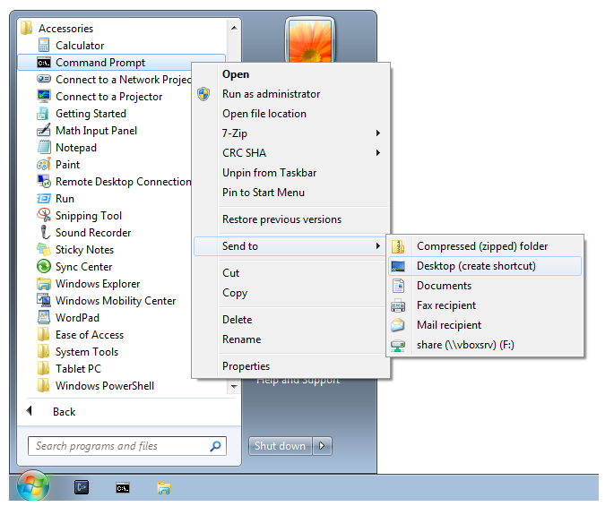

<br />

Unfortunately the Windows command line **requires several improvements and installations** in order to be used as
a profitable tool for FPGA programming.
Detailed instructions are therefore part of this guide to help Windows users to install and configure all additional components required to run
the proposed flows from the _Command Prompt_.

<br />
<!--------------------------------------------------------------------->


# Text editor
[**[Contents]**](#contents)

During the course we will write and discuss a lot of **source code** in form of **plain-text files**
(HDL sources, XDC constraints, Tcl scripts, GNU Makefiles etc.).
Familiarity with a good **text editor** for coding is therefore assumed for the course.

<br />

>
> **IMPORTANT**
>
> The source code will be always in form of **plain-text** files. That is, you need a **text editor** application
> to open, write and edit them, **NOT  a word processor** application with text formatting capabilities!
> Do not use programs such as **Microsoft WordPad/Word**, **OpenOffice** etc. to work with sources! 
>

<br />

Despite the choice is completely up to students, for those that are not already familiar with
programming it is recommended to use:

* **Gedit** for Linux
* **Notepad++** for Windows

<br />

>
> **NOTE**
>
> Feel free to use your preferred text editor application. However all cut-and-paste instructions in `README` files will always <br />
> assume to use **Gedit** (Linux) and **Notepad++** (Windows) executables.
>

<br />

**Gedit** is the default text editor on many Linux distributions. You can check if `gedit` is already installed
on your system using the `which` command. **Open a terminal** and type:

```
% which gedit
```

The output of the above command should be `/usr/bin/gedit`. To open a source file the syntax will be always in form of:

```
% gedit filename.txt &
```

Do not forget to **add the ampersand** character `&` at the end of the command to **launch the executable in background** and
leave the shell alive to accept more commands.
Many other good text editors exists under Linux, e.g. **Atom**, **Emacs** or **Eclipse**. For fast modifications it would be also
recommended to have some familiarity with **command line text editors** such as `nano` or `vim`.

<br />

For Windows users an excellent text editor is **Notepad++** instead.
Despite Windows natively provides Notepad in fact, Notepad++ is foreseen for programming
and offers additional features such as syntax highlighting, line numbering and automated code indentation. 
Notepad++ installation details are provided in the next section. We will also learn how to use Notepad++
effectively **from the Windows command line**, along with how to install and use `nano` and `vim`
command line text editors also under Windows.

<br />

<hr>

**Students working with a Linux system can skip the following details and jump to the [Install Git](#install-git) section.**

<hr>

<br />
<!--------------------------------------------------------------------->


# Preliminary installations and configurations for Windows users
[**[Contents]**](#contents)

The following section contains detailed instructions  **ONLY for Windows users** to help them in installing additional software components<br />
and improving the _Command Prompt_ environment for an effective usage.

<br />

>
> **IMPORTANT**
>
> The usual software installation procedure under Windows is to download some **automated installer** (either `.exe` or `.msi` file) for the
> application and then to launch **with administrator privileges** a guided **installation wizard** with a double left-click on the executable.
> During the installation the **default installation directory** proposed by these installers is usually<br />
>
> * `C:\Program Files` for 64-bit applications and
> * `C:\Program Files (x86)` for legacy 32-bit applications <br />
>
> both containing **empty spaces (blanks) in the path**.
> Despite you are completely free to leave unchanged the default installation directory it is **highly recommended** to install
> all proposed extra software components by choosing **target directories without empty spaces in the path** instead.
> For instance you can decide that new programs required for the course will be installed in a common directory `C:\opt` (similar to `/opt` under Linux)
> to remark that they are not "essential" programs for the operating system itself but "optional".
> You can also decide to use the **data partition** `D:\` instead of the usual system partition `C:\`. <br />
>
> Even better, you can "install" all new programs for the course by choosing a **local non-administrator installation**.
> That is, simply **download and extract** in some meaningful place (e.g. `C:\Users\username\local` or `D:\local`) the `.zip`
> file of the application containing all required executables and libraries (DLLs) **without** performing any installation with **elevated privileges**.
> All proposed software components provide in fact a portable `.zip` of the tool and allow to adopt this approach.
> We will then learn how to easily **update the system search path** using  a **Batch script** in order to be able to
> invoke the executables from the Windows _Command Prompt_.
>

<br />


## <a name="install-notepad-plus-plus"></a> Install Notepad++
[**[Contents]**](#contents)

**Notepad++** is the recommended text editor for programming under Windows.
It is a free and open-source software. It can be downloaded and installed from the project official page:

_<https://notepad-plus-plus.org/downloads>_


You can either decide to download and launch the automated installer (`.exe`) or to simply download and extract a portable `.zip`
file and perform a **non-administrator installation**.

Alternatively a `.zip` file containing both 32- and 64-bit versions of the tool has been **already prepared for you**
and tested on both Windows 7 and Windows 10 systems:

_<https://personalpages.to.infn.it/~pacher/teaching/FPGA/software/windows/Notepad++.zip>_

Download and extract the `.zip` file in some meaningful place on your machine. Once the extraction process is completed
you will find the `notepad++.exe` executable in `Notepad++\x86` and `Notepad++\x86_64` directories.

Later in the guide we will discuss how to **add Notepad++ executable to the search path** in order to invoke the text editor
also from the Windows command line.

<br />


## Install 7-Zip
[**[Contents]**](#contents)

The **7-Zip** archive utility is required to **extract compressed archives** in the `.tar.gz` (but not only) format under Windows.
As described later, this will be the case of the main Xilinx Vivado download.

7-Zip is a free and open-source program. To install the utility download
the automated installer (`.exe`) from the project official page

_<https://www.7-zip.org>_

and launch the installer by double-clicking on the file, then simply follow the installation wizard. <br />
A short tutorial can be also found at:

_<https://www.newsgroupreviews.com/7-zip-installation.html>_

<br />


## Improve the Windows Command Prompt appearance
[**[Contents]**](#contents)

If you never used the Windows command line before, the first time you open it you will find
a very uncomfortable and terrifying environment, starting from nasty default fonts.

As a first step it is therefore recommended to **change default font and font size** in order to
**improve the text readability**. To do this open a _Command Prompt_ instance, then right-click on the title bar of the window and select the _Font_ TAB.
A choice that immediately improves the overall appearance is _Lucida Console_ with a font size 12.


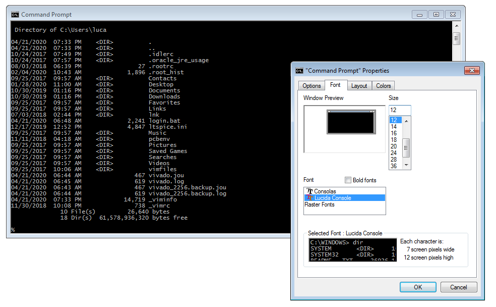


You can also easily change the default "prompt string". This can be done through the `PROMPT` reserved **environment variable**.
The default value for this variable is `$P$G$S` which displays the absolute path of the current working directory (`$P`)
followed by the `>` character (`$G`) and an empty space (`$S`), but you can customize this behaviour.
To make changes persistent you must set the `PROMPT` variable either through the
[_Edit environment variables for your account_](https://www.architectryan.com/2018/08/31/how-to-change-environment-variables-on-windows-10)
graphical interface (type _env_ or _variable_ in the search entry of the _Start_ menu or go
through _Control Panel > User Accounts > Change my environment variables_) or using the native `setx` command.
Type `prompt /?` at the command line to get the complete list of supported special placeholders to set the prompt string.

As an example,

```
setx PROMPT %$S
```

changes the `PROMPT` variable permanently and sets for the prompt string the `%` character followed
by one empty space (`$S`) as used during lectures and into cut-and-paste instructions.

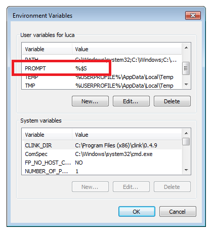


See also:

* _<https://docs.microsoft.com/en-us/windows-server/administration/windows-commands/prompt>_
* _<https://stackoverflow.com/questions/12028372/how-do-i-change-the-command-line-prompt-in-windows>_
* _<https://superuser.com/questions/325213/how-can-i-permanently-change-the-command-prompt-in-windows-7>_


<br />

## Install a Linux-like TAB completion
[**[Contents]**](#contents)

Without doubts another frustrating aspect of the original Windows command line is the lack of an efficient **TAB completion**
as the Linux one (based on the C GNU Readline libraries) in order to automatically complete partially-typed commands and expressions
using the TAB key. By default the native Windows _Command Prompt_ in fact only supports the TAB completion on directories paths, but not
for command executables.

As an example, if you open the _Command Prompt_ and you start writing

```
% note
```

and then you **press the TAB key** you will immediately realize that the expression is not automatically completed into
`notepad.exe`, which is the name of the Notepad executable.

A **port for Windows** of the TAB completion implemented for the Linux Bash shell exists and comes with a free
program called **Clink** which can be downloaded from:

_<https://mridgers.github.io/clink>_

For a **more efficient usage of the Windows command line** it is therefore **highly recommended**
to download and install this executable:


_<https://github.com/mridgers/clink/releases/download/0.4.9/clink_0.4.9_setup.exe>_

At the end of the installation process a new `AutoRun` variable is created for your account by the installer
in the **Windows Registry Editor** (just invoke `regedit` in the terminal to open the register) as


`HKEY_CURRENT_USER > Software > Microsoft > Command Processor > AutoRun`

starting the `clink` executable for you each time a _Command Prompt_ instance is launched.

<p>

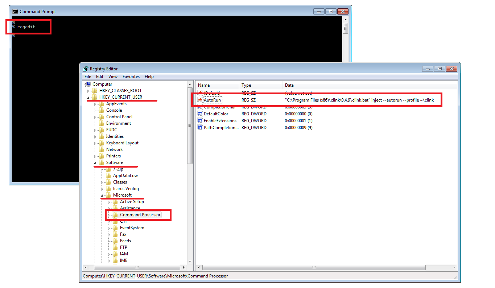

</p>


If the installation process completed successfully, the next time you will open a new
terminal windows you will see a **banner with copyright information** indicating that
the TAB completion has been added to the command interpreter.

<p>

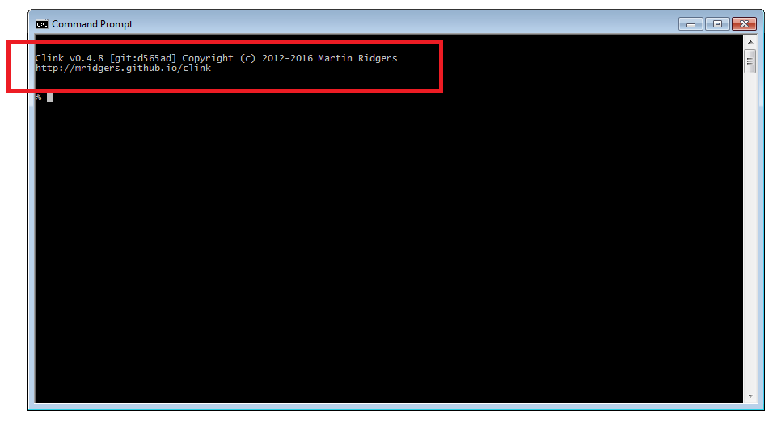

</p>


If you later want to **suppress the annoying copyright banner** you can simply edit the


`HKEY_CURRENT_USER > Software > Microsoft > Command Processor > AutoRun`

variable in the _Registry Editor_ and **redirect the output** of the `clink` executable to `nul` (the Windows equivalent
of `/dev/null` under Linux).

<p>

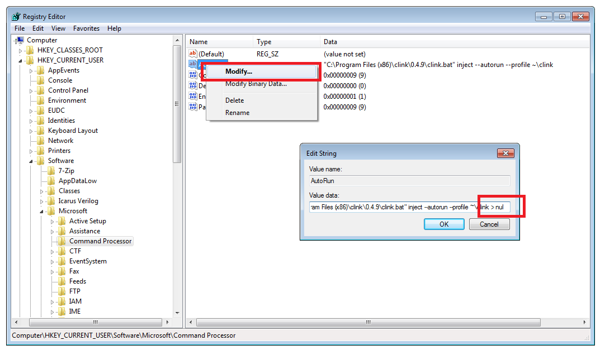

</p>

As already mentioned you can also choose to perform a **non-administrator installation**, simply download
and extract somewhere this portable `.zip` file

_<https://github.com/mridgers/clink/releases/download/0.4.9/clink_0.4.9.zip>_

without performing any operation that requires elevated privileges. However, with this choice you will
have to create the `AutoRun` variable in the  _Registry Editor_ by hand to "inject" clink each time a new
_Command Prompt_ is started with the following statement:

```
\path\to\clink.exe inject > nul
```

A more effective solution to collect such kind of customizations and extensions is to
[**use a login script**, as described later in this guide](#add-a-login-script-for-the-command-prompt).

<br />

## Enable file extensions visualization
[**[Contents]**](#contents)

Another frustrating aspect when we deal with programming and coding on a Windows operating
system is the fact that by default **most of file extensions are hidden to the user**.

As an example, a text file created under Linux named `README.txt` and then copied on a Windows system
by default will be displayed as `README`, hiding the fact that it is a text file (`.txt`) in the displayed file name.
On the contrary, the same text file created under Linux but simply named `README` without extension
will be not recognized by Notepad (the default text editor on any Windows system) and you will not be able to open it
with a double-click on the file icon.

This behaviour arises from the fact that file extensions under Windows are important because
they are used by the operating system to know which programs have to be used to open the files using the so called
_registered file associations_, while on a Linux
system the file extension has no particular importance, but helps the user to easily recognize the type
of the file.

Things only get worse when you install new programs registering somehow "new" file extensions for the operating
system. As an example, a simple text file containing some experimental measurements and named `data.dat`
will be recognized as an LTspice waveform after installing LTspice and registering (either consciously during the installation or not)
the `.dat` extension to the operating system.

As a result it becomes very important to fix this and **enable the visualization of file extensions** for all files,
making the system more similar to a Linux system. This can be easily done from any window of the file browser _Explorer_
as follows:

* on Windows 7 navigate through _Organize > Folder and search options > View_ <br />
  and **disable** the option _Hide extensions for know file types_ <br />
* on Windows 10 use _View > Options > Change folder and search options_ instead

<p>

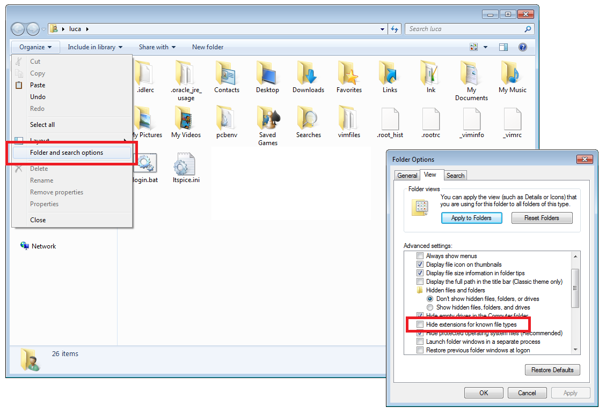

</p>

<br />

## Add a login script for the Command Prompt
[**[Contents]**](#contents)


A final additional frustrating aspect when we try to work effectively with the Windows
command line is the lack (by default) of a **login script** executed when an instance
of the _Command Prompt_ is launched.<br />

On the contrary this feature is natively supported by all Linux shells.
For instance, if a file named `.bashrc` exists in the
**user's home directory** on a Linux system it is executed each time a **Bash shell** is invoked.

The possibility to execute some kind of initialization script also for the _Command Prompt_
becomes very useful to **add customizations, extensions** etc. to the command line environment.
As an example, we can **add executables to the search path** (e.g. Notepad++, Xilinx tools)
such that they can be directly **invoked from the command interpreter** at any time.

In order to add this feature to the Windows terminal we can either:

* use the `AutoRun` variable in the Windows _Registry Editor_ or
* [modify the **shortcut** used to launch the _Command Prompt_](https://superuser.com/questions/144347/is-there-windows-equivalent-to-the-bashrc-file-in-linux)


Creating/editing entries in the main _Registry Editor_ of a
Windows system is **NOT RECOMMENDED for non-experienced users**. The second option
is safer, faster and easier for any user, thus will be adopted for the course.

When you invoke the _Command Prompt_ from the _Start_ menu in fact,
you are just executing a Windows **shortcut application** created for the actual
shell executable `C:\Windows\System32\cmd.exe`. You can therefore easily
**modify shortcut properties** in order to force `cmd.exe` to also execute a script at startup.

To modify shortcut properties, locate the _Command Prompt_ shortcut (either the default one or your own copy on the desktop)
and **right-click** on it instead of launching the application. This allows you to edit the
shortcut _Properties_. In particular, select the _Shortcut_ TAB.

The default value in the _Target_ entry should be:

```
%windir%\System32\cmd.exe
```

<p>

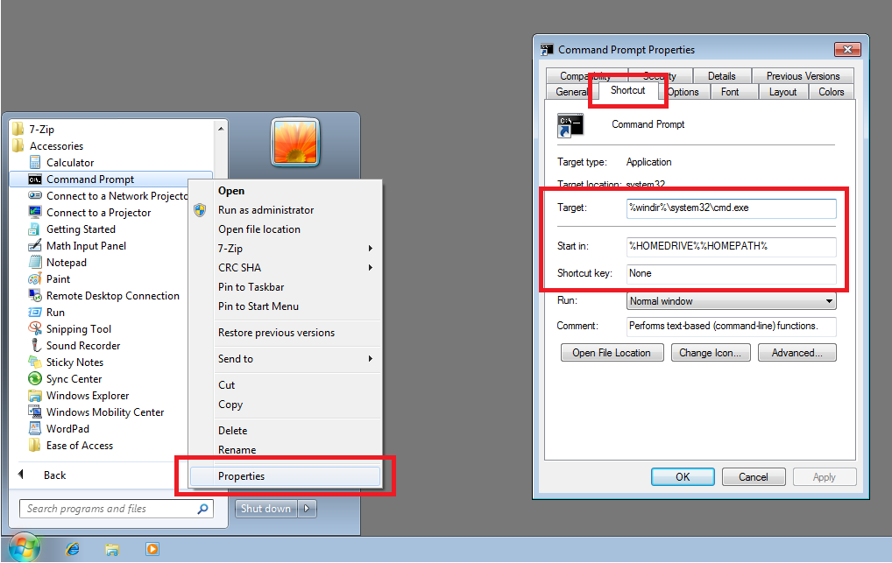

</p>


In order to force the `cmd.exe` executable to load a script at startup simply edit the _Target_ entry as follows:

```
%windir%\System32\cmd.exe /K %USERPROFILE%\login.bat
```

The additional `/K` option in fact executes the `%USERPROFILE%\login.bat` script (if exists)
each time the _Command Prompt_ shortcut is launched, similarly to what happens in the Linux Bash shell with the `.bashrc`.
As you might expect the `USERPROFILE` environment variable is the Windows equivalent for `HOME` in Linux
and locates the user's home directory on the system, usually `C:\Users\username`.

You can also force the _Command Prompt_ to always start in your home directory. This is already the
default behaviour, but for better readability you can replace `%HOMEDRIVE%%HOMEPATH%` with a simpler
`%USERPROFILE%` in the _Start in_ entry. Left-click on _Apply_ and then _OK_ when done.

<p>

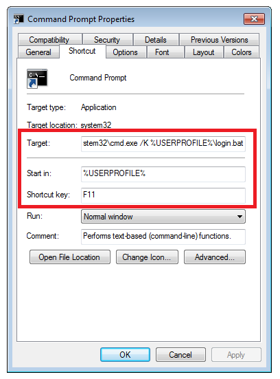

</p>

At this point we can finally **create our new login script** `login.bat` in the home directory
and start adding customizations. For this purpose we will start using the default text editor Notepad.

Open a new _Command Prompt_ and type:

```
% notepad login.bat
```

The `.bat` extension is mandatory and the code added to the file must be written following
the syntax of the **Windows Batch scripting language**.

As a first step try to write these lines of code:

```
:: login script

@echo off

echo.
echo Loading %USERPROFILE%\login.bat
echo.
```

<p>

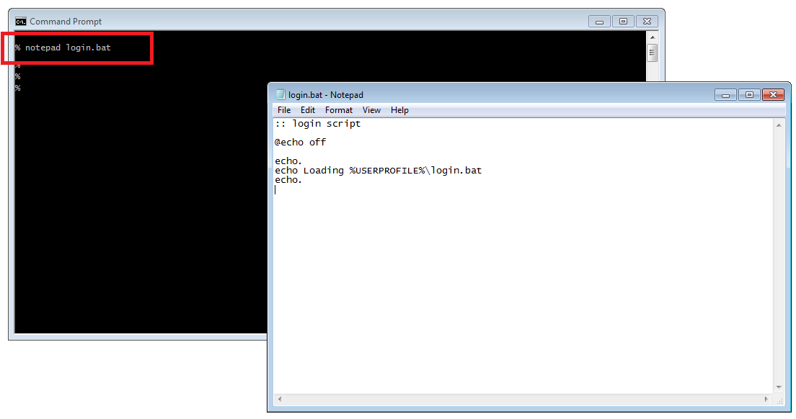

</p>


Save and close Notepad when done. In order to check your new setup, close also
the _Command Prompt_ and open a new one. If everything has been properly configured you will see
that the `login.bat` script is loaded at startup. You will also see the Clink banner if you
have already installed it without redirecting the output of the command to `nul`.

<p>

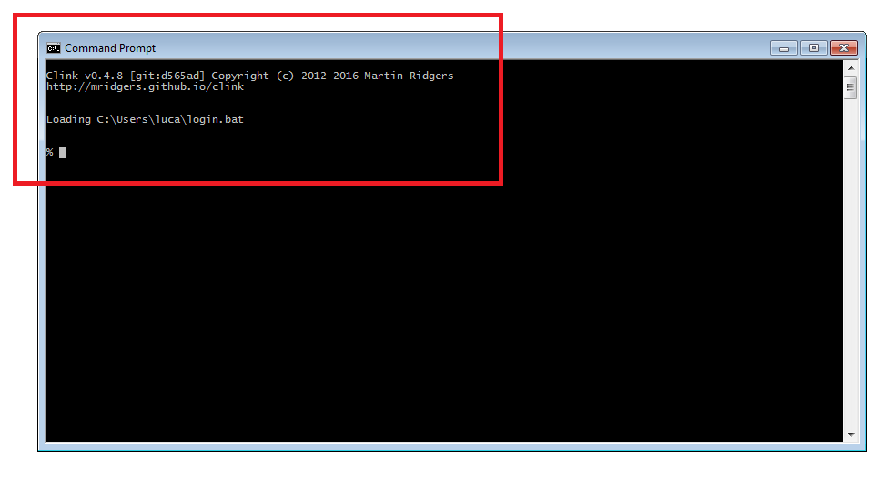

</p>

<br />

>
> **IMPORTANT**
>
> Do not forget to **always SAVE** the `login.bat` file after **modifications** in order to later load new customizations in the _Command Prompt_ !
>

<br />


## Add Notepad++ executable to search path
[**[Contents]**](#contents)

After all improvements made to the Windows command line we can
start using this tool more efficiently. Additional **customizations or extensions for the command line environment**
can now be added to the `login.bat` initialization script automatically executed for you
when the _Command Prompt_ is launched.

As a first example we can **add the Notepad++ executable to the Windows
search path** such that it can be invoked from the command line.
For this purpose we have to **extend the system search path**,
that is the list of directories in which executables and scripts
are searched when invoked at the command line.<br />

As on Linux systems, also Windows uses the `PATH` environment variable
for this purpose. We can use Notepad to edit the `login.bat` script
and update the `PATH` environment variable by adding also the directory containing
the Notepad++ executable, called `notepad++.exe`.

Reopen the `login.bat` from the command line using Notepad,

```
% notepad login.bat
```

and **add and customize** the following statements in the batch file:

```
:: include Notepad++ executable to search path
set PATH=\path\to\Notepad++\installation\directory;%PATH%
```

where `\path\to\Notepad++\installation\directory` is the path to the directory containing the `notepad++.exe` executable.

<br />

>
> **EXAMPLE**
>
> Let suppose that you decided to install Notepad++ in `D:\local\Notepad++\x86_64`, then the syntax will be:
>
> ```
> set PATH=D:\local\Notepad++\x86_64;%PATH%
> ```
>
> Please, **customize the syntax** according to your actual installation path!
>

<br />

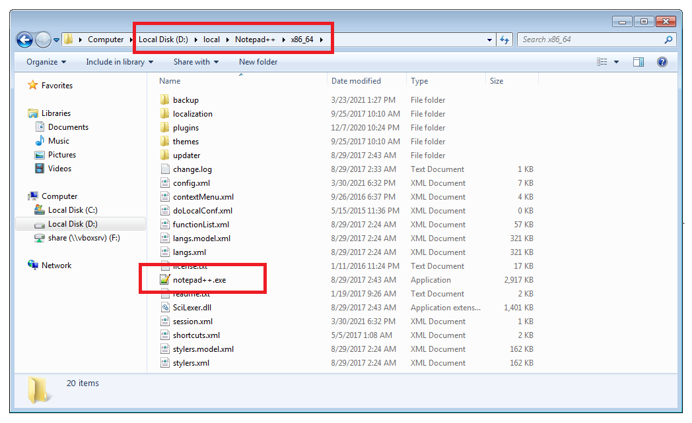

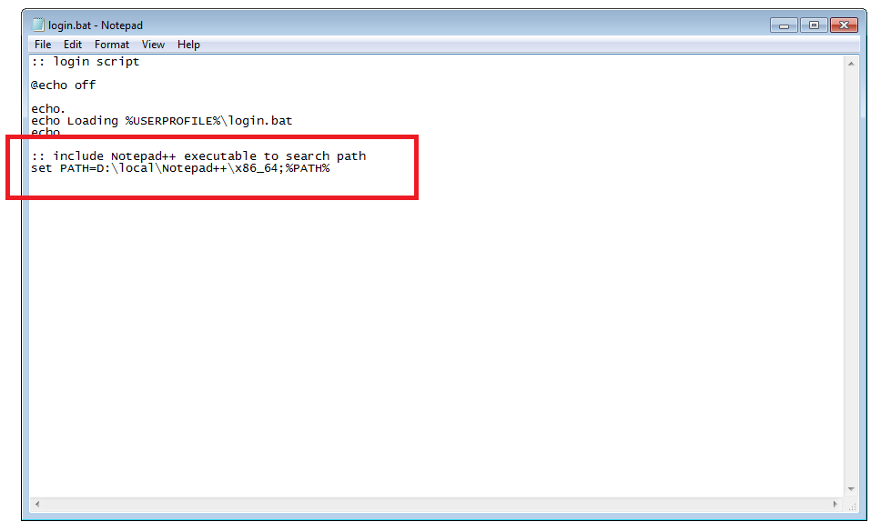


Do not forget to always save the file after new modifications. Close Notepad once done.
You can then **reload the content of the script** without the need of
close/reopen the terminal. You can use in fact the `call` command, which is
the Windows equivalent of the `source` command on Linux systems:

```
% call login.bat
```

Once the search path has been updated you can verify that the `notepad++.exe` executable
is found on the system using the `where` command, the Windows equivalent of the `which`
command on Linux systems:

```
% where notepad++
```

Finally try to open a text file using Notepad++ from the command line:

```
% notepad++ login.bat
```

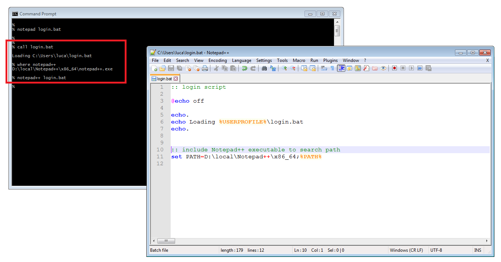


Since the name of the executable is quite long, for **less and faster tying** at the
command line we can also create a simpler **alias** e.g. `n++` in place of the longer `notepad++`
using the `doskey` command (the Windows equivalent of the `alias` command on Linux systems).

For this purpose, add the following code to the `login.bat` script:

```
:: create a shorter alias (doskey) for notepad++.exe for faster typing
doskey n++=notepad++.exe $*
```

Save the file and reload the script at the command line with the `call` command to apply your changes:

```
% call login.bat
```

At this point we have a **very good text editor** for programming that we can also use efficiently from the
Windows _Command Prompt_, as an example let's try to create a VHDL file:

```
% n++ counter.vhd
```


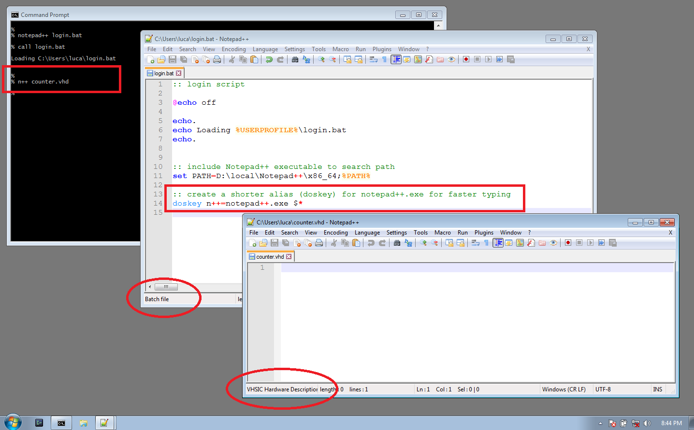


You can notice that Notepad++ properly **recognizes the language** from the extension of the source file
(Batch file for `login.bat`, VHDL for `counter.vhd`). Close the VHDL file without saving it.

In the following section we discuss how to use `login.bat` to **add also Linux executables**
to the Windows command line.

<br />

## Add Linux executables to search path
[**[Contents]**](#contents)

<br />

>
> **IMPORTANT**
>
> Windows 10 comes with the so called **Windows Subsystem for Linux (WSL)** layer that allows to natively run
> Linux binary executables on Windows, providing also a Bash shell and all basic commands used in the course. <br />
>
> **HOWEVER** WSL cannot be used to invoke **Xilinx executables**, that require to be run into a Windows
> environment instead. In practice you can't simply invoke Vivado executables for Windows (actually `.bat` wrappers) from the WSL
> terminal without generating errors. This remains true also if you try to use the updated version, **WSL2**.
>
> Beside this, WSL/WSL2 are Windows 10 only features, thus in order to support also students still working on a Windows 7
> system the below solution is proposed for both versions.
>

<br />

As already mentioned this introductory FPGA programming course will
be script-based and command-line based. We will run all Xilinx Vivado flows
from the command-line assuming a **Linux-like development environment**.<br />
There are no drawbacks in using Windows native shell commands to run
the flows with this approach and Xilinx extensively supports both Linux and Windows scripting
environments with no preference.<br />
However for teaching purposes it becomes essential to minimize differences between
Linux and Windows operating systems, providing flows that can run seamless on both platforms.

As a result we must be able to use **basic Linux commands** from the Linux **Bash shell**
(`pwd`, `cd`, `ls`, `cp`, `mv`, `mkdir`, `rm` etc.) also under Windows.

There are many different software solutions for this, most popular are:


* **Cygwin**   <br /> _<https://www.cygwin.com>_
* **WinBash**  <br /> _<http://win-bash.sourceforge.net>_
* **GNU Win**  <br /> _<http://gnuwin32.sourceforge.net>_
* **MinGW**    <br /> _<https://sourceforge.net/projects/mingw>_
* **UnxUtils** <br /> _<https://sourceforge.net/projects/unxutils>_
* **BusyBox**  <br /> _<https://frippery.org/busybox/>_

If installed, the Cygwin package provides a very large collection of Linux commands and programs
that can be invoked from the Windows command line, from very basic commands such as `ls`, `pwd` etc.
up to `gcc/g++` compilers along with C/C++ libraries and sources or advanced networking commands.

The other software solutions offer smaller collections of Linux executables, foreseen to provide
a basic Linux-like environment on Windows.

For this course we will use the **GNU Win** package. Despite you can download and
install the package from the official website it is **highly recommended**
to download the following `.zip` file **already prepared for you**:

_<https://personalpages.to.infn.it/~pacher/teaching/FPGA/software/windows/GnuWin.zip>_

The main reason for this is that the proposed `.zip` file contains fully verified executables on both
Windows 7 and Windows 10 systems. Some commands from other installations showed in the past different behaviours
from version 7 to version 10.
Moreover the proposed `.zip` file contains additional networking commands (e.g. `wget`, `curl`, `ssh`) that
usually must be installed independently.

Download and extract the `.zip` file in some meaningful place on your machine.
Once the extraction process is completed you will
find all Linux executables in the `GnuWin\bin` directory.


In order to invoke these executables from the Windows _Command Prompt_ we have to
**update the search path** to include in the `PATH` environment variable also the `GnuWin\bin` directory.

Please **add and customize** the following code to the `login.bat` using Notepad++ from the terminal:


```
:: add GNU Win executables to search path
set PATH=\path\to\GnuWin\bin;%PATH%
```

where `\path\to\GnuWin\bin` is the path to the directory containing all Linux executables.

<br />

>
> **EXAMPLE**
>
> Let suppose that you extracted the `GnuWin.zip` file in `D:\local`, then the syntax will be:
>
> ```
> set PATH=D:\local\GnuWin\bin;%PATH%
> ```
>
> Please, **customize the syntax** according to your actual installation path!
>

<br />

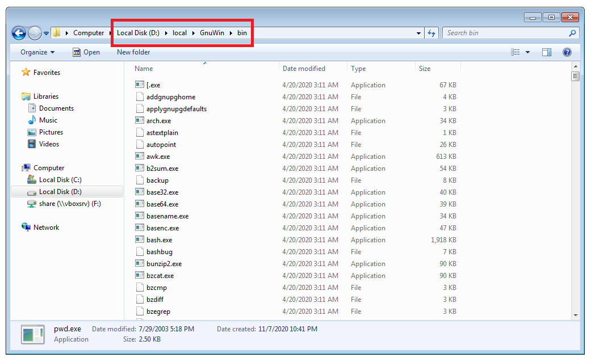


<br />

Additionally we must prevent **name clashes** between native Windows executables and Linux executables.
As an example, `mkdir` is a Windows built-in command, but we want to be sure that `\path\to\GnuWin\bin\mkdir.exe` is used instead. <br />
To force the _Command Prompt_ to search built-in executables in `PATH`
we have to **create doskeys** for those Linux commands that also exists in Windows with the same name.

Please **add the following statements** to your `login.bat` script:

```
:: force the Command Prompt to search built-in executables in PATH
doskey mkdir="mkdir.exe" $*
doskey rmdir="rmdir.exe" $*
doskey echo="echo.exe" $*
doskey more="more.exe" $*
```

Ref. also to:

_<https://superuser.com/questions/1253369/gnuwin32-makefile-mkdir-p>_


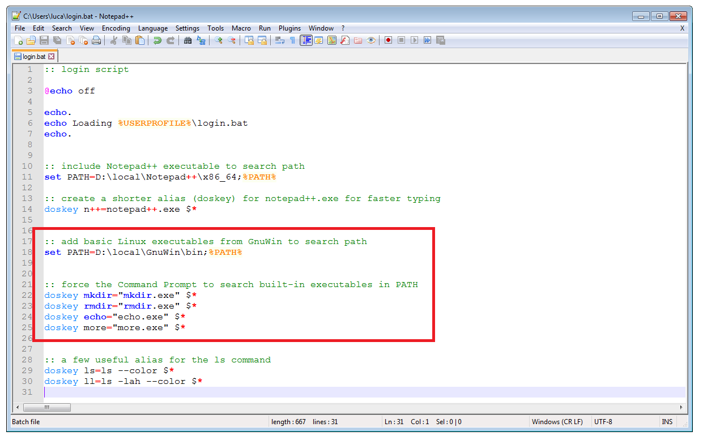


<br />

Save and reload the `login.bat` script once done:

```
% call login.bat
```

At this point we can use basic Linux commands such as `ls`, `pwd`, `which` etc. also
from the Windows command interpreter.

Try the following commands to check that the new environment is properly configured:

```
% cd Desktop
% pwd
% mkdir -p test/bin
% touch test/README
% ls -l test/
% rm -rf test/
% which mspaint
```

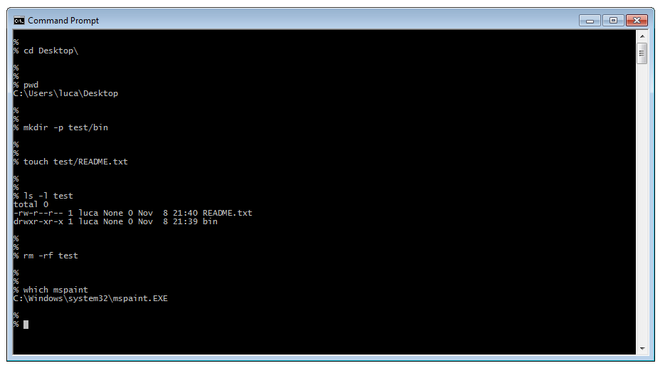


<br />

>
> **IMPORTANT**
>
> The `cd` command is a **built-in command** part of the shell program itself, not a standalone executable!
> That is, there is no `cd.exe` executable as part of the GNU Win package:
>
> ```
> % where cd
> INFO: Could not find files for the given pattern(s).
> ```
>
> When you type `cd` in the Windows _Command Prompt_ you are invoking the native `cd` command from MS/DOS, not the Linux one! <br />
> For this reason you cannot use special `cd` cases  as under Linux.
> 
> As a first example, if you just execute `cd` without a target directory:
>
> * you move to the **home directory** on Linux
> * it shows the **current working directory** on Windows (same as `pwd`)
>
> Additionally, in Linux `cd -` allows to come back to the previous working directory, while under Windows `-` is simply interpreted as a non-existing directory.
>
> If you work under Windows you can play a little bit to improve this and create an additional `doskey` for `cd` in the `login.bat` script
> and force the native command to behave like the Linux one as follows:
>
> ```
> :: force the built in 'cd' command to behave as the Linux one
> doskey cd=if /i "$1" == "" ( cd /d %%USERPROFILE%% ^& set OLDCD=%%CD%% ) else ( if /i "$1" == "-" ( cd /d %%OLDCD%% ^& set OLDCD=%%CD%% ) else ( cd /d "$1" ^& set OLDCD=%%CD%% )) 
> ```
>
> With this solution the `if/else` statement parses what comes after the `cd` command and
> if you execute `cd` without a target directory you move to the user's home `%USERPROFILE%`,
> while `cd -` moves back to the previous working directory.
>
> <br />
> <br />
>
> Beside `cd` you might want to fix also the default behaviour of the `pwd.exe` command and redefine `pwd` in order to 
> display paths with a forward slash `/` directory separator instead of the usual backslash `\` used by Windows:
>
> ```
> :: redefine 'pwd' in order to display paths with / separator instead of \ as under Linux
> doskey pwd=echo %%CD%% ^| sed -e "s/\\\\/\//g"
> ```
>

<br />


You can also define additional UNIX-like doskeys for the `ls` command to enable the output coloring:

```
:: a few useful aliases for ls commands
doskey ls=ls --color $*
doskey ll=ls --color -lah $*
```

A complete example of `login.bat` can be found in the `sample/` directory
at the top of the Git repository.


<br />

## Install Nano and Vim command-line text editors
[**[Contents]**](#contents)

Notepad++ is an excellent text-editor for programming under Windows. However there are several
situations for which the usage of a **command line text editor** is simply faster and more efficient. <br />
As an example, if you want to make small changes to some HDL source file while working in the
terminal it might be faster to open the file in the terminal itself, make the modifications
and then come back to the shell without the need of launching a graphical application.
This working approach is even mandatory if you are connecting to some remote hardware server without a
graphical interface running behind.

Command line text editors are also extensively used in the **professional ASIC and FPGA digital design research fields**,
thus it is highly recommended for students to learn how to use **at least one popular Linux command line text editor**
between `nano` and `vim`. <br />
Windows users have to install them as additional software components and then
**update the system search path** in order to be able to invoke the executable from the terminal.


### Install Nano
[**[Contents]**](#contents)

[GNU Nano](https://en.wikipedia.org/wiki/GNU_nano) is a free and open-source command line text editor part of the GNU Project.
It is **much much easier to learn and to use** with respect to Vim, thus this is the **recommended command line text editor** to start
with for non experienced users.

Sources, documentation and HowTo's are available starting from the project official page at:

_<https://www.nano-editor.org>_

To install Nano on Windows you can simply download **pre-compiled binaries** from the project official download area,

_<https://www.nano-editor.org/dist/win32-support>_

_<https://www.nano-editor.org/dist/v2.5/NT>_

of from a third-party website, a good one is the following:

_<https://files.lhmouse.com/nano-win>_

In this case there is **no automated installer**, just download and rename as `nano.exe` the executable to be invoked
from the terminal. Alternatively you can download a `.zip` or a `.7z` file with the executable along with additional sources
(e.g. syntax-highlighting configuration files for many different  languages).

A few short tutorials can be also found at:

* _<https://oznetnerd.com/2017/09/02/git-nano-windows>_
* _<https://showtop.info/install-nano-text-editor-windows-10-command-prompt>_


<br />

Moreover a `.zip` file containing both 32- and 64-bit versions of the tool has been **already prepared for you** and tested
on both Windows 7 and Windows 10 systems:

_<https://personalpages.to.infn.it/~pacher/teaching/FPGA/software/windows/Nano.zip>_

Download and extract the `.zip` file in some meaningful place on your machine. Once the extraction process is completed
you will find the `nano.exe` executable in `Nano\x86\bin` and `Nano\x86_64\bin` directories.

<br />

As already done with Linux executables from the GNU Win package, in order to invoke `nano` from the Windows _Command Prompt_ we have to
**update the search path** to include in the `PATH` environment variable also the directory containing the `nano.exe`
executable itself.


Please **add and customize** the following code to the `login.bat` using Notepad++ from the terminal:

```
:: add Nano executable to search path
set PATH=\path\to\Nano\<architecture>\bin;%PATH%
```

<br />

>
>  **EXAMPLE**
>
> Let suppose that you extracted the `Nano.zip` file in `D:\local` and that you want to use the 64-bit version of the tool, then
> the syntax will be:
>
> ```
> set PATH=D:\local\Nano\x86_64\bin;%PATH%
> ```
>
> Please, **customize the syntax** according to your actual installation path and preferred architecture!
>

<br />

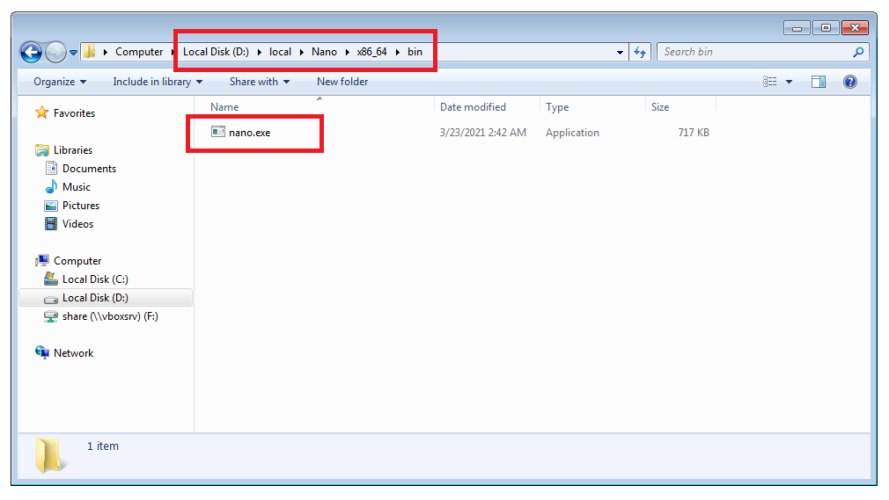

Save and reload the `login.bat` script once done:

```
% call login.bat
```

You can now verify that the `nano.exe` executable is found on the system using either the Windows  native `where` command or
the Linux `which` command part of the GNU Win package:

```
% where nano
% which nano
```


Finally, try to **open a text file** from the command line using `nano`, as an example:

```
% nano login.bat
```


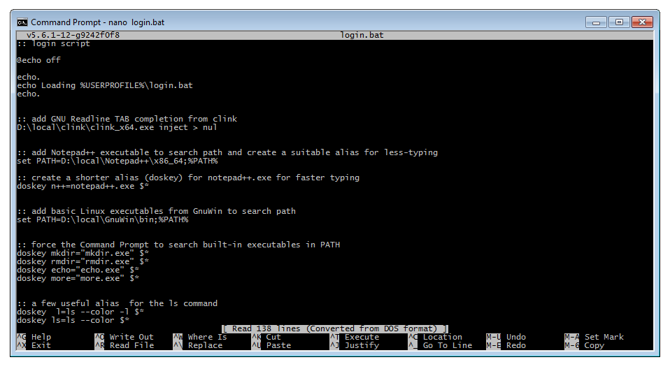

The editor is quite intuitive to use, with most important commands already listed at the bottom of the command window.
Simply remind that the `^` character always represents the **Ctrl** key, thus `^X` means "press the Ctrl key and then
the X key while keeping Ctrl pressed".

Try to use the combination **Ctrl+G** to open the help, while use the combination **Ctrl+X** twice to exit from the
help and then to close Nano and come back to the command interpreter.

An endless number of online tutorials, examples and HowTo's is available on the web, just search for "Nano tutorial" or similar. <br />
Here a few examples:

* _<https://www.howtogeek.com/howto/42980/the-beginners-guide-to-nano-the-linux-command-line-text-editor>_
* _<https://linuxize.com/post/how-to-use-nano-text-editor>_
* _<https://www.tutorialspoint.com/how-to-use-nano-text-editor>_

<br />

>
> **NOTE**
>
> As for Linux, you can use a configuration file named `.nanorc` placed in the user's home directory `%USERPROFILE%`
> to customize the behaviour of the text-editor (e.g. enable syntax coloring for different programming languages).
>
> A sample configuration file can be found in the `sample/` directory at the top of the repository.
>


<br />

### Install Vim (optional)
[**[Contents]**](#contents)

Beside Nano, [Vim](https://en.wikipedia.org/wiki/Vim_(text_editor)) is the second most widespread command-line text-editor
on Linux systems. In the software programming community it is considered one of the **most powerful and efficient**
text editors for coding. However it is certainly **more difficult and hard to learn** for non experienced users with respect to Nano. The
installation of Vim under Windows is therefore left **optional** for the student, despite it might be useful to learn how to use `vim`
for your future research work.

Vim is free and open-source. Similar to Nano, you can install **pre-compiled binaries** for Windows downloading
the automated installer from the official website:

_<https://www.vim.org/download.php>_

Alternatively also for Vim a `.zip` has been already prepared for you and tested on both Windows 7 and Windows 10 systems:

_<https://personalpages.to.infn.it/~pacher/teaching/FPGA/software/windows/Vim.zip>_

Either if you install Vim using the official installer or if you decide to simply extract the `.zip` file
then you have to **update the search path** in `login.bat` to include in the `PATH` environment variable also
the directory containing the `vim.exe` executable itself in order to invoke `vim` from the Windows command
interpreter.

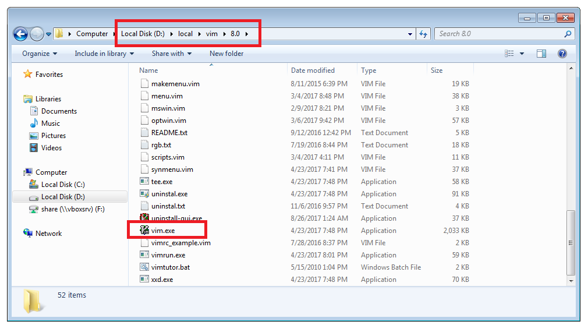


Please **add and customize** the following code to the `login.bat` using Notepad++ from the terminal:

```
:: add Nano executable to search path
set PATH=\path\to\Vim;%PATH%
```


As usual save and reload the `login.bat` script once done:

```
% call login.bat
```

Finally you can verify that the `vim.exe` executable is found on the system using either the Windows  native `where` command or
the Linux `which` command part of the GNU Win package:

```
% where vim
% which vim
```


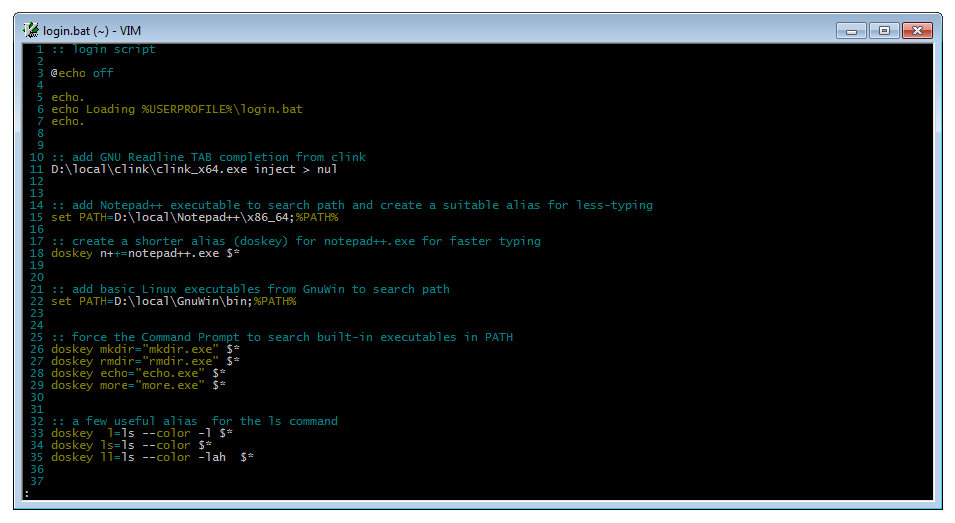

If you want to learn how to use Vim you can find many tutorials, examples and HowTo's on the web,
just search for "Vim tutorial" or similar. Here a few examples:

* _<https://opensource.com/article/19/3/getting-started-vim>_
* _<https://danielmiessler.com/study/vim>_
* _<https://riptutorial.com/vim>_

<br />
<!--------------------------------------------------------------------->


# Install Git
[**[Contents]**](#contents)

All sources and Markdown documentation files for the course will be **tracked** using the
[**Git versioning tool**](https://en.wikipedia.org/wiki/Git).
All students are therefore **requested to have a working Git installation** to clone the
repository and get updates from the command line.

<br />

## <a name="install-git-linux-installation"></a>Linux installation
[**[Contents]**](#contents)

Usually `git` is already installed by default on most Linux distributions.
In order to verify that `git` is found in your search path **open a terminal** and type:

```
% which git
```

The output of the above command should be `/usr/bin/git` or `/usr/local/bin/git`.

In case the Git package is not installed on your Linux system, simply use

```
% sudo yum install git
```

or

```
% sudo apt-get install git
```

according to the package manager of the Linux distribution you are working with.

<br />


## <a name="install-git-windows-installation"></a>Windows installation
[**[Contents]**](#contents)

Students working on a Windows system can download and install **Git for Windows**
from one of these official projects:

* _<https://git-scm.com/downloads/win>_
* _<https://gitforwindows.org>_

As for all previous software components you can decide to download and launch the
**automated installer** `.exe` or to simply download and extract a portable `.zip` file
and perform a **non-administrator installation**.

If you choose the automated installer here you can find a detailed step-by-step tutorial:

_<https://phoenixnap.com/kb/how-to-install-git-windows>_

<br />

>
> **NOTE**
>
> The **Git for Windows** download page offer both a fully-featured installation package and a 
> more compact and lighter installation package called **MinGit**.
> In order to **save disk space** it is recommended to download and install MinGit.
>

<br />


Alternatively a `.zip` file containing both 32- and 64-bit executables (approx. 50 MB) has been **already prepared for you** and tested
on both Windows 7 and Windows 10 systems,

_<https://personalpages.to.infn.it/~pacher/teaching/FPGA/software/windows/MinGit.zip>_

simply download and extract the file in some meaningful place on your machine.
Once the extraction process is completed you will find the `git.exe` executable in `MinGit\x86\cmd` and `MinGit\x86_64\cmd` directories.


<br />

By default the automated installer already updates the `PATH` environment variable and adds
the `git.exe` executable to the search path for you. At the end of the installation process
open a _Command Prompt_ and check if the `git` command is found in the search path with:

```
% which git
```

If you select in the installation wizard to skip to automatically modify the `PATH` environment variable
or if you prefer to simply extract the portable `.zip` file you have to **update the search path by hand**
in the `login.bat` script as usual in order to invoke `git` from the command interpreter.
Just include `\path\to\MinGit\<achitecture>\cmd` in the `PATH` environment variable.

Please **add and customize** the following code to the `login.bat` using Notepad++ from the terminal:

```
:: add git executable to search path
set PATH=\path\to\MinGit\<architecture>\cmd;%PATH%
```

Once done, save and reload the `login.bat` script and check if the `git` executable is available
from the command line:

```
% call login.bat
% which git
```

<br />

>
> **EXAMPLE**
>
> Let suppose that you decided to extract the `.zip` file as `D:\local\MinGit` and that you want
> to use the 64-bit version of the tool, then the syntax will be:
>
> ```
> set PATH=D:\local\MinGit\x86_64\cmd;%PATH%
> ```
>
> Please, **customize the syntax** according to your actual installation path!
>

<br />

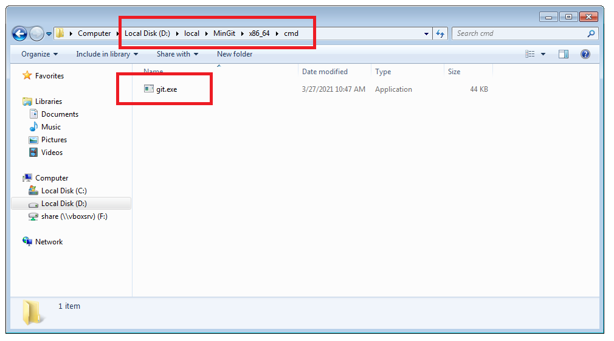


<br />
<!--------------------------------------------------------------------->


# Clone and update the Git repository for the course
[**[Contents]**](#contents)

All students are requested to use `git` from the command-line to **download the repository**
and to **keep track of updates**. In the following we describe how to configure Git for the first
time and how to use it for the course.

<br/>

## Initial configuration
[**[Contents]**](#contents)

As a first step, **open a terminal** and verify that the `git` executable is found:

```
% which git
```

Before starting to use `git` you are requested to do some **initial configuration** as follows:

```
% git config --global user.name "Your Name"
% git config --global user.email your.email@example.com
```

These settings are internal to Git and local to your machine. For the email address you can use
your official `name.surname@edu.unito.it` address. You can then check your configuration at any time with:

```
% git config --list
```

<br />

## Repository download
[**[Contents]**](#contents)

In order to **download the repository** for the first time use:

```
% cd Desktop
% git clone https://github.com/lpacher/lae.git [optional target directory]
```

<br />

>
> **IMPORTANT**
>
> All cut-and-paste instructions in `README` files assume that you clone the repository as `lae` on your Desktop.
> If you decide to clone the repository **either with a different name or into a different location** it will be up to you
> to properly change the path to the repository wherever required.
> Please, also keep in mind that all `git` commands **must be invoked** inside the top `lae/` directory or
> from any other sub-directory of the repository!

<br />

By default a new `lae/` directory containing the repository will be created
where you invoked the above `git` command, unless you specify a different target directory as optional parameter.

Feel free to use a different target directory. As an example:

```
% cd Desktop/Documents
% git clone https://github.com/lpacher/lae.git LAE
```

<br />

>
> **IMPORTANT**
>
> For Windows users. Starting from Windows 10 all personal documents and stuff can be accessed
> using the **Microsoft OneDrive cloud storage**. This is also true for folders and documents
> placed on the main "desktop". As a result the actual absolute path that locates the `Desktop`
> directory is not `C:\Users\username\Desktop` but `C:\Users\username\OneDrive\Desktop`.
>
> Please, be aware that if you type
>
> ```
> % cd C:\Users\username\Desktop
> % ls
> ```
>
> <br />
>
> into your Windows _Command Prompt_ and you don't see the content placed on you actual "desktop"
> this is due to the fact that OneDrive is used (this is the default behaviour).
>
> If this is the case in order to access the real "desktop" you have to use: 
>
> ```
> cd C:\Users\username\OneDrive\Desktop
> ```
>
> <br />
>
> If you don't use OneDrive you can also move your Desktop outside OneDrive. See also:
>
> _<https://www.addictivetips.com/windows-tips/move-the-desktop-folder-out-of-onedrive-on-windows-10>_
>

<br />

## Create your personal development branch
[**[Contents]**](#contents)

According to Git jargon, the first time you download ("clone") the repository you
are in the `master` branch. The `master` branch should always represent the "stable version" of the project:

```
% git branch
   *master
```

The asterisk indicates the **current working branch**.

As a first step after downloading the repository for the first time you are requested to
**create your personal development branch** named `student` as follows:

```
%  git branch student
%  git checkout student
```

You can now **list all branches** on your local machine with:

```
% git branch
   master
   *student
```

Please, be sure that the asterisk now points to your own development branch `student`
and not to the `master` branch.


<br />

## Update the repository
[**[Contents]**](#contents)

Each time you will need to **update your local copy of the repository** simply
perform a **_pull_ from the remote repository** using:

```
% git pull origin master
```

With his command you will immediately re-synchronize your **local** copy of the repository by downloading all latest updates
to sources and documentation provided by the instructor. 

<br />
<!--------------------------------------------------------------------->


# Install Tcl
[**[Contents]**](#contents)


The **Tool Command Language (Tcl)** is the **scripting language** officially
supported by Xilinx Vivado. We will also use Tcl to make all flows **platform-independent**
and **portable between Linux and Windows operating systems**. For this purpose, the Tcl shell
executable `tclsh` must be available at the command line.

<br />

## <a name="install-tcl-linux-installation"></a>Linux installation
[**[Contents]**](#contents)

Usually `tclsh` is already installed by default on most Linux distributions. In order to verify that `tclsh`
is found in your search path **open a terminal** and type:

```
% which tclsh
```

The output of the above command might be `/bin/tclsh`, `/usr/bin/tclsh` or `/usr/local/bin/tclsh`.

In case the Tcl package is not installed on your Linux system, use

```
% sudo yum install tcl tcllib
```

or

```
% sudo apt-get install tcl tcllib
```

according to the package manager of the Linux distribution you are working with.

<br />

## <a name="install-tcl-windows-installation"></a>Windows installation
[**[Contents]**](#contents)

Students working on a Windows system are requested to download and install **pre-compiled binaries** of the Tcl shell for Windows.
You can download and install this package from different online sources. We recommend
to use the **WinTclTk package** from _sourceforge.net_ :

_<http://prdownloads.sourceforge.net/wintcltk/WinTclTk-8.5.6.exe>_

<br />

>
> **IMPORTANT**
>
> At the end of the automated installation process the **name of the executable** that comes with the above installer is **NOT** `tclsh.exe`
> but `tclsh85.exe` tracing the version number in the name!
> In order to run the proposed flows you have to **make a copy** of the `tclsh85.exe` file ad then **rename** the copy as `tclsh.exe`.
>
> 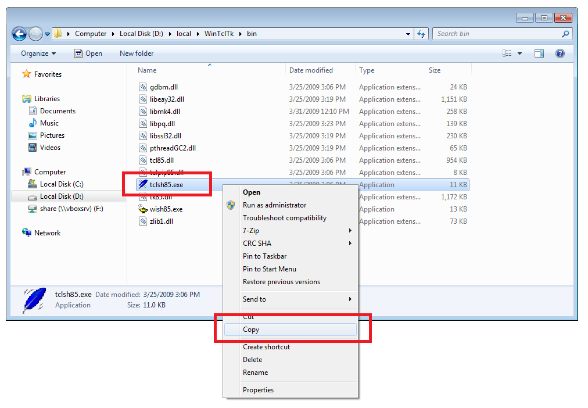
>
> <br />
>
> 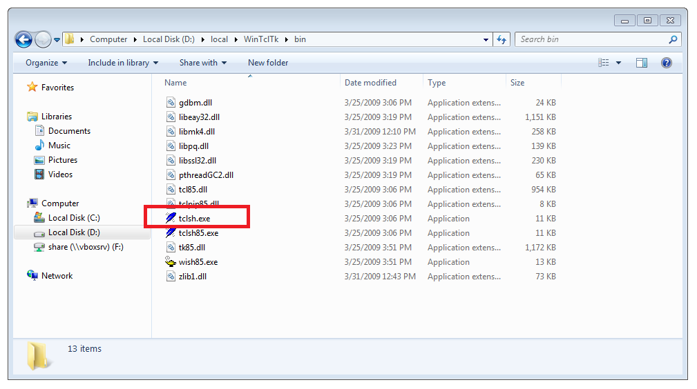
>
> Alternatively you have to create an **alias** in the `login.bat` script using the `doskey` command:
>
> ```
> doskey tclsh=tclsh85.exe $*
> ```
>
<br />


If you prefer a **non-administrator installation** instead a portable `.zip` file has been
**already prepared for you** and is available at:

_<https://personalpages.to.infn.it/~pacher/teaching/FPGA/software/windows/WinTclTk.zip>_


<br />

>
> **NOTE**
>
> The proposed `.zip` file already contains a copy of the `tclsh85.exe` executable as `tclsh.exe`.
>

<br />

Download and extract the file in some meaningful place on your machine and then
**update the search path** in the `login.bat` script to include the `WinTclTk\bin`
directory in the `PATH` environment variable.

Please **add and customize** the following code to the `login.bat` using Notepad++ from the terminal:

```
:: add tclsh executable to search path
set PATH=\path\to\WinTclTk\bin;%PATH%
```

Once done, save and reload the `login.bat` script and check if the `tclsh` executable is available
from the command line:

```
% call login.bat
% which tclsh
```


<br />

>
> **EXAMPLE**
>
> Let suppose that you decided to extract the `.zip` file as `D:\local\WinTclTk`, then the syntax will be:
>
> ```
> set PATH=D:\local\WinTclTk\bin;%PATH%
> ```
>
> Please, **customize the syntax** according to your actual installation path!
>

<br />

## tclsh init script
[**[Contents]**](#contents)

The `tclsh` shell can [automatically execute commands from an initialization file](https://wiki.tcl-lang.org/page/tclshrc)
when invoked in the terminal. This file has to be placed in the **user's home directory** (`$HOME` on Linux, `%USERPROFILE%` on Windows)
and named as follows:

* `$HOME/.tclshrc` for Linux
* `%USERPROFILE%\tclshrc.tcl` for Windows

Sample init files `.tclshrc` (Linux) and `tclshrc.tcl` (Windows)
can be found in the `sample/` directory at the top of the repository
and can be used as a starting point to collect user's customizations.

Copy the proper init file in your home directory and try to launch a `tclsh` session:

```
% tclsh
```

If everything is properly configured the console prompt will change as follows:


```
% tclsh
Tcl version 8.5

Loading C:\Users\username\tclshrc.tcl

tclsh$
```

Type `exit` to quit the `tclsh` session:

```
tclsh$ exit
```


<br />
<!--------------------------------------------------------------------->


# Install ROOT and PyROOT
[**[Contents]**](#contents)

The free and open-source **ROOT package by CERN** will be used for data analysis in this course.
For all installation details please refer to the following README page:

_<https://github.com/lpacher/lae/tree/master/sample/ROOT/README.md>_

<br />
<!--------------------------------------------------------------------->


# Install PuTTY
[**[Contents]**](#contents)

During the course students will learn how to implement on FPGA a **serial communication system** based
on the **Universal Asynchronous Receiver/Transmitter (UART) protocol**. This will allow to
**connect the FPGA to your personal computer** and then to send/receive data between the two systems.
You will need therefore dedicated software components installed on the computer to work with serial communication.

There are several different free online programs for this purpose, most popular used in the FPGA community are:

* **PuTTY**     <br /> _<https://www.putty.org>_
* **TeraTerm**  <br /> _<https://ttssh2.osdn.jp/index.html.en>_


These programs are **_terminal emulator_ applications** and support **remote-connections** using different protocols such as serial, SSH and Telnet.
They are both valid solutions for this purpose and can be installed on Linux and Windows.
Since the PuTTY graphical interface is a little bit simpler and intuitive to use **we assume to use PuTTY** during the course, but feel
free to install and use TeraTerm instead.


<br />

## <a name="install-putty-linux-installation"></a>Linux installation
[**[Contents]**](#contents)

The PuTTY package is usually not installed by default on Linux distributions.
To install it, **open a terminal** and either use

```
% sudo apt-get install putty
```

or

```
% sudo yum install putty
```


according to the package manager of the Linux distribution you are working with. In case the `putty`
package is not found you might need to update the list of known repositories.

Alternatively you can download and install the package by hand from _<https://pkgs.org>_ :

_<https://pkgs.org/search/?q=putty>_

At the end of the installation process verify that the `putty` executable is found in the system search path:

```
% which putty
```

The output of the above command should be `/usr/bin/putty`.

See also:

* _<https://numato.com/blog/how-to-install-putty-on-linux>_
* _<https://itsfoss.com/putty-linux>_
* _<https://www.tecmint.com/install-putty-on-linux>_ 

<br />

## <a name="install-putty-windows-installation"></a>Windows installation
[**[Contents]**](#contents)

Students working on Windows systems can download and install PuTTY executables from the project official download page:

_<https://www.chiark.greenend.org.uk/~sgtatham/putty/latest.html>_


As usual you can decide to download and launch the automated Windows installer (`.msi`) or to download and extract a portable `.zip`
file and perform a **non-administrator installation**.

A `.zip` file containing all PuTTY utilities has been **already prepared for you** and is available at:

_<https://personalpages.to.infn.it/~pacher/teaching/FPGA/software/windows/PuTTY.zip>_

Download and extract the file in some meaningful place on your machine. Once the extraction process is completed you will
find the `putty.exe` executable in the `PuTTY` directory, along with additional command line utilities such as `pscp.exe` and `psftp.exe`
for SSH and SFTP remote file transfers.

By default the automated `.msi` installer already updates the `PATH` environment variable for you. If you decide to simply extract the
portable `.zip` file you have to **update the search path by hand** in the `login.bat` script in order to invoke `putty`
from the command interpreter. Just include `\path\to\PuTTY` in the `PATH` environment variable.

Please **add and customize** the following code to the `login.bat` script using Notepad++ from the terminal:

```
:: add PuTTY executables to search path
set PATH=\path\to\PuTTY;%PATH%
```

Once done, save and reload the `login.bat` script and check if the `putty` executable is available from the _Command Prompt_
using either `where` or `which` commands:

```
% call login.bat
% where putty
```

<br />

>
> **EXAMPLE**
>
> Let suppose that you decided to extract the `.zip` file as `D:\local\PuTTY`, then the syntax will be:
>
> ```
> set PATH=D:\local\PuTTY;%PATH%
> ```
>
> Please, **customize the syntax** according to your actual installation path!
>

<br />


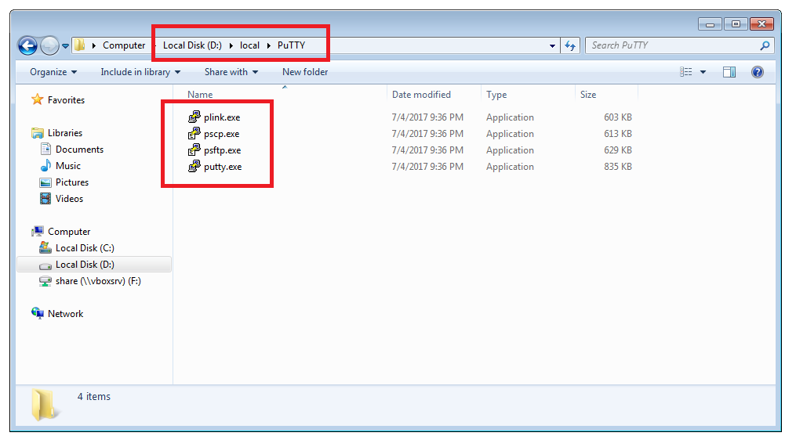


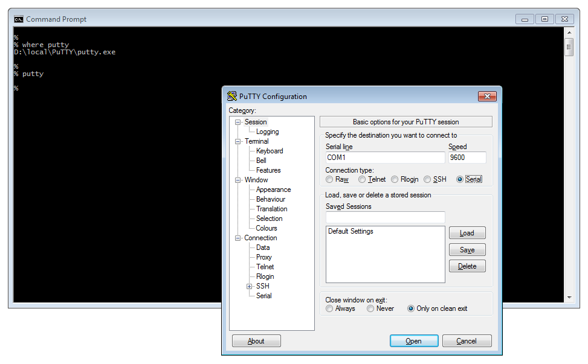


<br />

>
> **NOTE**
>
> Since the PuTTY installation provides **SSH under Windows** it might be useful also for your future research work.
>

<br />

<br />
<!--------------------------------------------------------------------->


# Install Xilinx Vivado
[**[Contents]**](#contents)

<br />

>
> **IMPORTANT**
>
> The software **version** used by the instructor during remote lectures will be **2019.2**
> and screenshots referring to Xilinx Vivado installation steps are from the **2019.2 installer**.
> The content of the wizard for another version available for download on the Xilinx website
> can be slightly different.
>

<br />

## Download
[**[Contents]**](#contents)

Xilinx softwares can be downloaded free of charge from the official Xilinx website:

_<https://www.xilinx.com/support/download.html>_

<br />

In order to download the software and to obtain a free license you must **register and create an account** on the Xilinx website.

At the time of writing the latest version of the software available on the site is **2023.2**. Older versions
can be downloaded from:

_<https://www.xilinx.com/support/download/index.html/content/xilinx/en/downloadNav/vivado-design-tools/archive.html>_

<br />

Unless special requirements in your research work (e.g. backward compatibility with some old FPGA board) it is always
recommended to install and use the **latest available version of the software** but if you already installed Xilinx Vivado
in the past **any older version of the tool will be fine for the course**. The version used during lectures will be **2019.2**.

Starting from version 2021.2 the package to be downloaded is called **Vivado ML Edition**. For older versions
of the tool the name of the package was  **Vivado Design Suite - HLx Editions** instead. 

As already mentioned the software is available **_only_ for Linux and Windows operating systems**.
Both Windows 7 and Windows 10 as well as the new Windows 11 are supported.

<br />

>
> **IMPORTANT**
>
> Windows 11 is only supported starting from version **2022.2** !
> 
> _<https://support.xilinx.com/s/question/0D54U00005ZMhHxSAL/does-windows-11-support-vivado-software?language=en_US>_
>

<br />

It is recommended to prefer a **single-file download** (largest file in the list) with respect to a _Self Extracting Web Installer_
(smaller file). In fact many times splitted downloads or downloads using the _Self Extracting Web Installer_ option just gave troubles.

Please, be aware that **the size of file to be downloaded is EXTREMELY HUGE** (several tens of GB) due to the increasing
support for new complex devices. Indeed, the final installation will consume less disk space.

<br />

>
> **IMPORTANT**
>
> If you have **space issues on your disk** you can install an older version of the tool.
> As an example, the size of the installer for the **2015.4** version was about 10 GB.
>

<br />
<br />


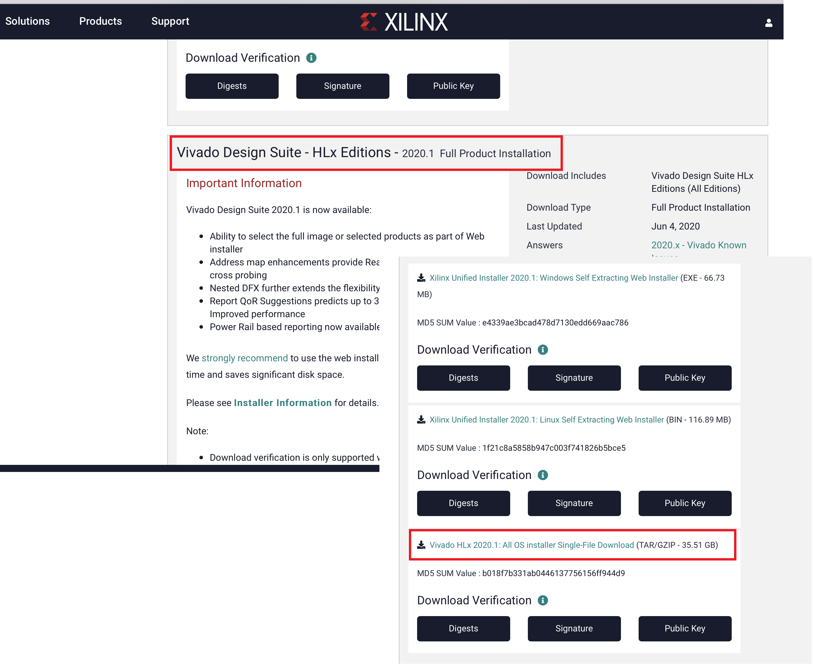

At the end of the download process you will have a single compressed tar file with extension `.tar.gz`.

<br />

## Extraction
[**[Contents]**](#contents)

Linux users can easily extract the file at the command line with the usual `tar` command. To do this,
**open a terminal** and type:

```
% cd /path/to/download/directory
% tar -xzf  Xilinx_Vivado_<version>.tar.gz
```

<br />

Windows users have to use the **7-Zip** utility instead. The extraction process requires two steps.
At first you have to uncompress the file. Right-click on the `.tar.gz` file and select the _Extract Here_ option
under the 7-Zip sub-menu.


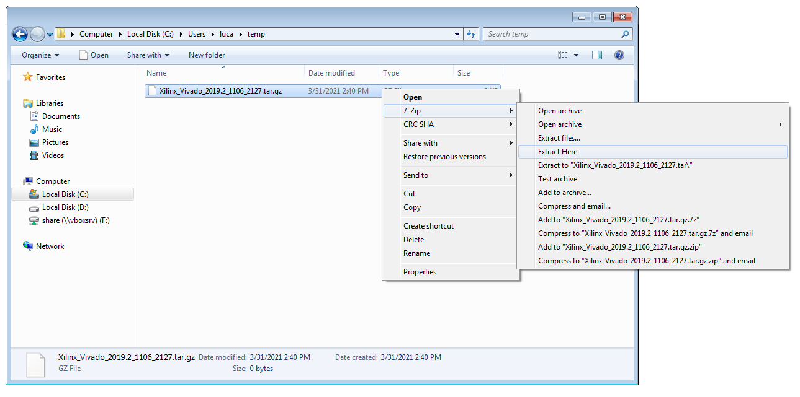


<br />

At the end of the first extraction process you will find a `.tar` archive. Right-click on the `.tar` file and select again
the _Extract Here_ option under the 7-Zip sub-menu.


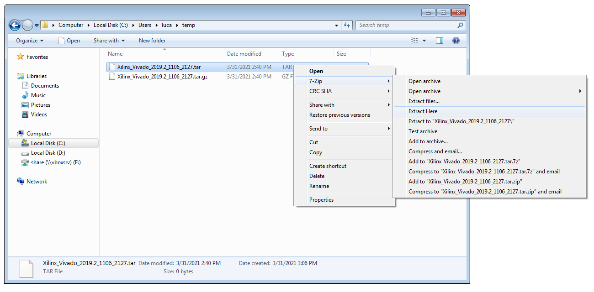

<br />

>
> **IMPORTANT**
>
> Do not forget to **DELETE all compressed files and the extracted directory**
> at the end of the installation process in order to **recover several GB of disk space**!
>

<br />


## Installation wizard
[**[Contents]**](#contents)

Once the extraction process is completed you will find the main **Xilinx Vivado installation executable**
in the extracted directory:

* `xsetup` for Linux
* `xsetup.exe` for Windows


<br />

Linux users can start the installation process from the command line as follows:

```
% cd Xilinx_Vivado_<version>
% chmod +x xsetup
% sudo ./xsetup
```

<br />

Windows users can start the installation process by **running as administrator** the `xsetup.exe` executable instead.


Most important installation steps are:

* accept all license agreements
* select software packages to be installed
* select supported devices
* select a top installation directory
* obtain a free license


<br />


**LICENSE AGREEMENTS**

As a first step you have to accept all license agreements:

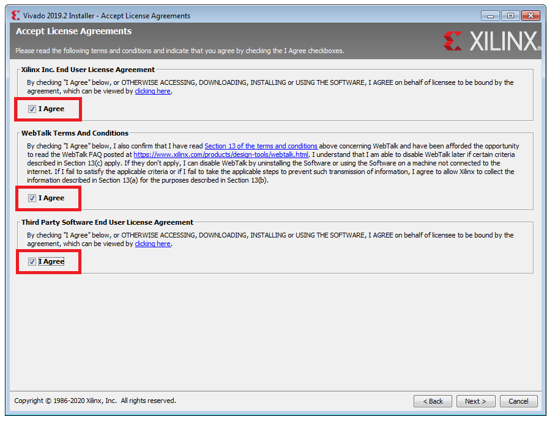

<br />


**PACKAGE SELECTION**

After accepting all license agreements you are requested to choose software packages to be installed.
Despite there are no drawbacks in installing the complete Xilinx suite, called **Vivado HL System Edition**,
in order to **reduce the consumed disk space** it is recommended to select the **Vivado HL WebPACK** option:

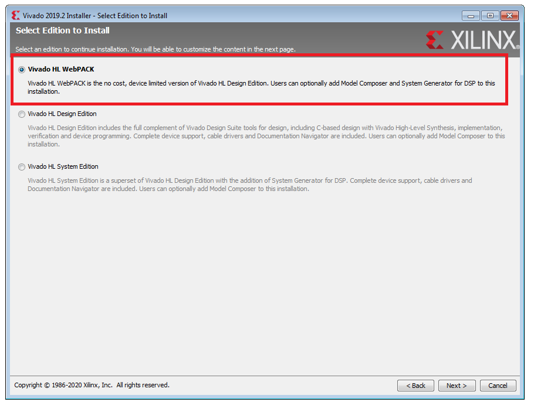

<br />


**DEVICE SUPPORT SELECTION**

For the same reason, if you want to **save disk space** it is recommended to **NOT install**
libraries for very advanced and complex FPGA devices. In particular you can **deselect**
all **SoC**  and **UltraScale** devices, leaving the check only on the **7-Series** entry
(during the course we will refer to an Artix-7 device in fact):

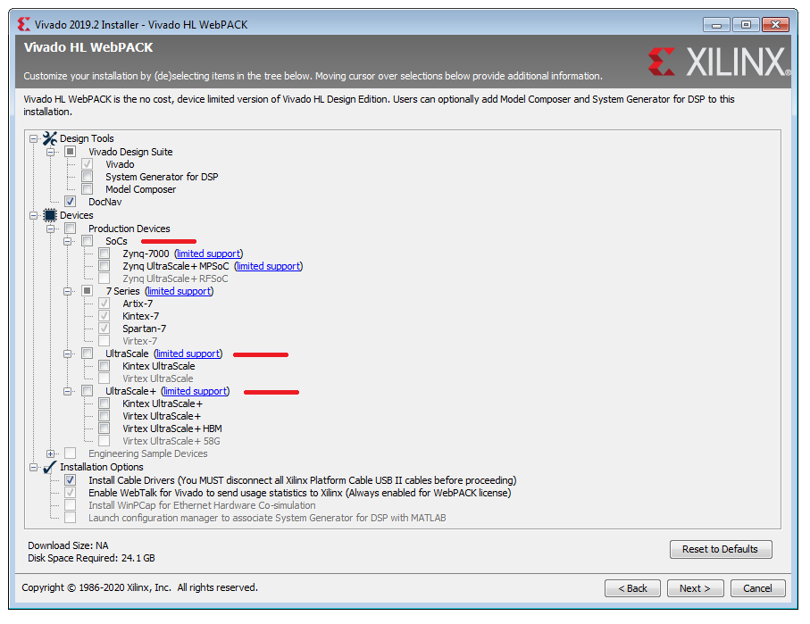

<br />

>
> **IMPORTANT**
>
> In order to be able to **connect your PC to a real FPGA board** in the lab to install programming files
> be sure that the **_Install Cable Drivers_** option is selected in the wizard!
>

<br />


**TARGET INSTALLATION DIRECTORY SELECTION**

Finally, in the **choice of the installation directory** it is highly recommended to **avoid paths containing empty spaces**.
The default path proposed by the wizard is:

* `/opt/Xilinx` for Linux
* `C:\Xilinx` for Windows

If you do not have special requirements you can leave the default value. Indeed, for **Windows users**
it is highly recommended to **change the default path** and install Xilinx Vivado in the **data-partition** `D:\`
if available (e.g. `D:\Xilinx`) without cluttering the system partition `C:\` with several GB of additional software.

<p>

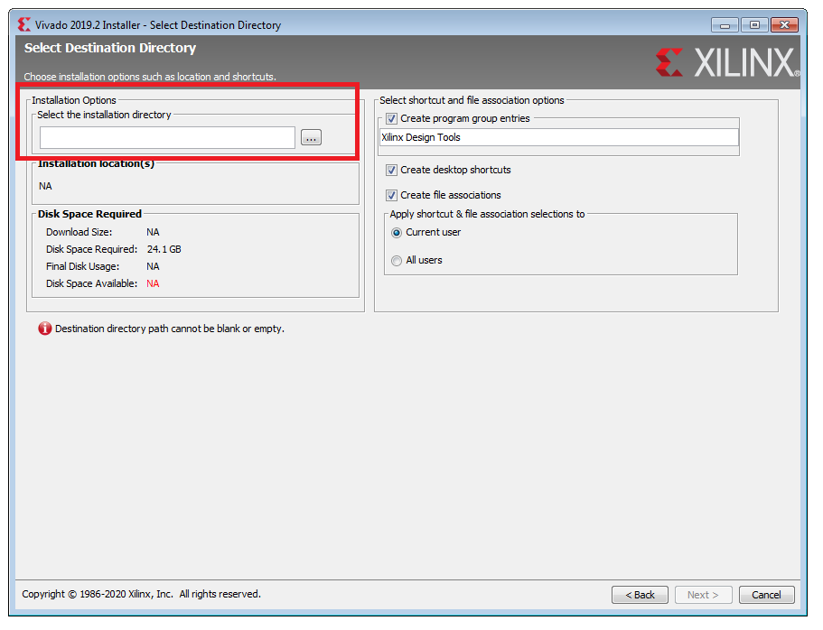

</p>


<br />

>
> **IMPORTANT**
>
> Later in this guide we will assume that a `XILINX_DIR` **environment variable** will be used to locate
> the **main installation directory** as specified in the wizard during the installation setup.
>

<br />


**POST-INSTALLATION CLEANUP**

The overall installation process will last several minutes, also depending on your machine performance.
At the end of the installation you can
**DELETE** both the original `.tar.gz` compressed archive downloaded from the Xilinx website and its uncompressed folder
in order to **recover several GB of disk space** on your machine.
On Windows do not forget to delete also the intermediate `.tar` archive.

You can easily do this from the command line, just **open a terminal** and type:


```
% cd /path/to/download/area
% rm -rf Xilinx_Vivado_<version>
% rm -f  Xilinx*.tar
% rm -f  Xilinx*.tar.gz
``` 

<br />

>
> **WARNING**
>
> As a safe choice it would be preferable to **delete** the original `.tar.gz` installer only **AFTER** having verified
> that everything is working properly, otherwise you will have to download again several GB in case of troubles.
> It is therefore recommended to use
>
> ```
> % rm -f Xilinx*.tar.gz
> ```
>
> only at the very end of this tutorial.
>

<br />

For more details about the installation ref. also to [_Vivado Design Suite User Guide: Release Notes, Installation, and Licensing_](
https://www.xilinx.com/support/documentation/sw_manuals/xilinx2019_2/ug973-vivado-release-notes-install-license.pdf).

<br />

## Licensing
[**[Contents]**](#contents)

The Xilinx Vivado is a professional CAD suite, thus requiring to have a valid **license file** in order to
access **all software features** and to implement HDL designs targeting **any Xilinx FPGA device** without limitations:

_<https://www.xilinx.com/products/design-tools/vivado/vivado-webpack.html>_

The **FREE version** and **device-limited** of the Vivado software, which is called **Vivado WebPACK Edition**,
will be enough for this course indeed. Starting from Vivado version **2016.x** a license is **no longer required**
to run Xilinx tools for WebPACK. Vivado version **2015.x** and earlier requires a free WebPACK license file instead:

_<https://www.xilinx.com/support/answers/42066.html>_

If you install Vivado 2015.x or before at the end of the installation process you will be automatically redirected
to the Xilinx website to obtain and install the required free license. If you install the latest available version
of the tool simply run Vivado and don't care about licensing.

<br />

>
> **NOTE**
>
> Just for reference. You can also use the `XILINXD_LICENSE_FILE` environment variable to locate the licence file:
>
> ```
> export XILINXD_LICENSE_FILE=/path/to/Xilinx.lic   for Linux
> set XILINXD_LICENSE_FILE=\path\to\Xilinx.lic      for Windows
> ```
>
> This can be useful to specify a **device-locked** license file (e.g. for the popular
> [KC705 evaluation board](https://www.xilinx.com/products/boards-and-kits/ek-k7-kc705-g.html) equipped with a Kintex-7 device,
> which is used by many research groups in the department).
>

<br />

For more details about licensing ref. also to [_Vivado Design Suite User Guide: Release Notes, Installation, and Licensing_](
https://www.xilinx.com/support/documentation/sw_manuals/xilinx2019_2/ug973-vivado-release-notes-install-license.pdf).

<br />
<!--------------------------------------------------------------------->

# Install cable drivers
[**[Contents]**](#contents)

<br />

>
> **IMPORTANT**
>
> The following instructions are provided **only for reference**, you will check your actual cable drivers installation in the lab.
> However **you MUST have cable drivers installed** on your machine in order to be able to physically connect your PC 
> to a real Xilinx FPGA device!
>

<br />

Xilinx FPGAs are programmed using the **JTAG protocol**. In the past a dedicated (and expensive)
**programming cable**, namely _Xilinx USB Platform Cable_, was required
to program FPGA boards from a host computer. This dedicated cable (still in use for particular applications)
**connects to a host computer USB port** (in the past to the "old style" serial port instead) and converts
USB data into JTAG data.<br />
Please ref. to [_USB Cable Installation Guide (UG344)_](https://www.xilinx.com/support/documentation/user_guides/ug344.pdf)
Xilinx official documentation for more details. Be aware that this PDF document is old (2016) and refers to
the legacy _Xilinx ISE Design Suite_.

For easier programming, the majority of new modern FPGA boards equipped with a Xilinx device provides 
an **on-board dedicated circuitry** (usually NOT documented in board schematics) that **converts USB to JTAG without the need
of a dedicated cable**. That is, you can easily program your board by using a simple **USB Type A/Type B** or **USB Type A/micro USB**
cable connected between the host computer and the board without the need of a dedicated programming cable.

However, in order to make the board visible to the host computer the operating system has
to **properly recognize the on-board USB/JTAG hardware** requiring a specific **driver**.
The **Xilinx USB/Digilent driver** is responsible for this.

By default the _Install Cable Drivers_ option is already selected in the installation wizard, thus
at the end of the Vivado installation process cable drivers **should be automatically installed for you** on the system
(this is the reason for which admin privileges are required to install the software).

In case cable drivers are **NOT installed** on the machine you can always **manually install cable drivers** at any time
without the need of a new scratch installation of the Vivado Design Suite.

<br />

## <a name="install-cable-drivers-linux-installation"></a>Linux installation
[**[Contents]**](#contents)

In order to [**install cable drivers on Linux**](https://www.xilinx.com/support/answers/59128.html)
run as `root` or with `sudo` the following **Bash install script**

`<install dir>/Vivado/<version>/data/xicom/cable_drivers/lin/install_script/install_drivers`

provided with the Vivado installation:

```
% cd <install dir>/Vivado/<version>/data/xicom/cable_drivers/lin/install_script/
% sudo chmod +x install_drivers
% sudo ./install_drivers
```

Ref. also to [_Vivado Design Suite User Guide: Release Notes, Installation, and Licensing_](
https://www.xilinx.com/support/documentation/sw_manuals/xilinx2019_2/ug973-vivado-release-notes-install-license.pdf) pp. 18-19.


<br />

## <a name="install-cable-drivers-windows-installation"></a>Windows installation
[**[Contents]**](#contents)

Similarly to Linux, a **Batch install script** is provided for the Windows _Command Prompt_ as follows:

```
<install dir>/Vivado/<version>/data/xicom/cable_drivers/nt64/install_drivers_wrapper.bat
```

Simply run the script as administrator:

```
% cd <install dir>/Vivado/<version>/data/xicom/cable_drivers/nt64
% install_drivers_wrapper.bat
```

<br />
<!--------------------------------------------------------------------->


# Add Xilinx Vivado executables to search path
[**[Contents]**](#contents)

At the end of the Xilinx Vivado installation it is possible that a shortcut has been created
on your desktop, along with a new entry in the programs menu.
In order to **invoke Vivado executables from the command line** we must **update the system search path** as usual
and include a certain number of installation directories in the `PATH` environment variable of the operating system.

<br />

## Locate and execute Vivado setup scripts
[**[Contents]**](#contents)

The Vivado installation **already provides initialization scripts** for both Linux and Windows
for this purpose. The only thing to do is to add a `source` (Linux) or `call` (Windows) statement to
`.bashrc` (Linux) and `login.bat` (Windows) **login scripts** respectively.

In the following we assume that a `XILINX_DIR` environment variable will be used to locate
the **main installation directory** specified during the Vivado installation process.

For Linux users, please **add and customize** the following statements in the home `.bashrc` using `gedit` or with
your preferred text editor:

```
# variable to locate the main Xilinx installation directory
export XILINX_DIR=/path/to/Xilinx/main/installation/directory
```

<br />

>
> **EXAMPLE**
>
> If you decided to install the software in `/opt/Xilinx` (default) you will use:
>
> ```
> export XILINX_DIR=/opt/Xilinx
> ```
>

<br />

For Windows users instead, please **add and customize** the following statements in the `login.bat` script using Notepad++ from the terminal:

```
:: variable to locate the main Xilinx installation directory
set XILINX_DIR=\path\to\Xilinx\main\installation\directory
```

<br />

>
> **EXAMPLE**
>
> If you decided to install the software in `C:\Xilinx` (default) you will use:
>
> ```
> set XILINX_DIR=C:\Xilinx
> ```
>

<br />


At this point there are no more differences between Linux and Windows because the tree of directories
that comes after the installation is the same on both operating systems. In particular the main directory containing
Vivado will be accessible as:

* `$XILINX_DIR/Vivado/<version>` on Linux
* `%XILINX_DIR%\Vivado\<version>` on Windows


<br />

Inside the `XILINX_DIR/Vivado/<version>` directory you will find the required **initialization script**:

* `settings64.sh` for Linux
* `settings64.bat` for Windows


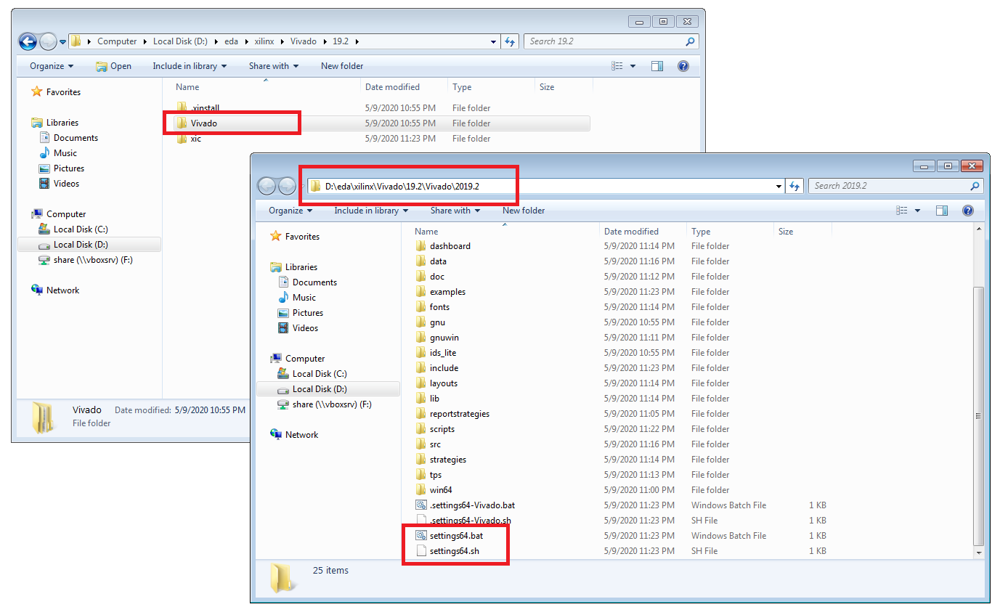


If executed from the command line the `settings64` script updates the `PATH` environment variable for you and
**adds all required Vivado executables to the system search path**.
In order to have all Vivado executables whenever a new terminal is invoked, just `source` (Linux) or `call` (Windows)
the proper script in the main login script.

For Linux users, please **add and customize** the following `source` statement in your home `.bashrc` script:

```
# add Vivado executables to search path
source $XILINX_DIR/Vivado/<version>/settings64.sh
```

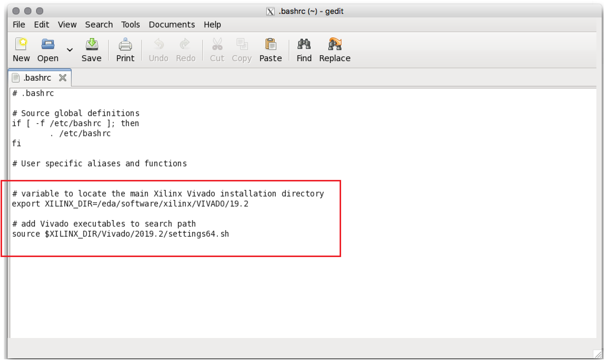

For Windows users instead, please **add and customize** the following `call` statement in your `login.bat` script:

```
:: add Vivado executables to search path
call %XILINX_DIR%\Vivado\<version>\settings64.bat
```

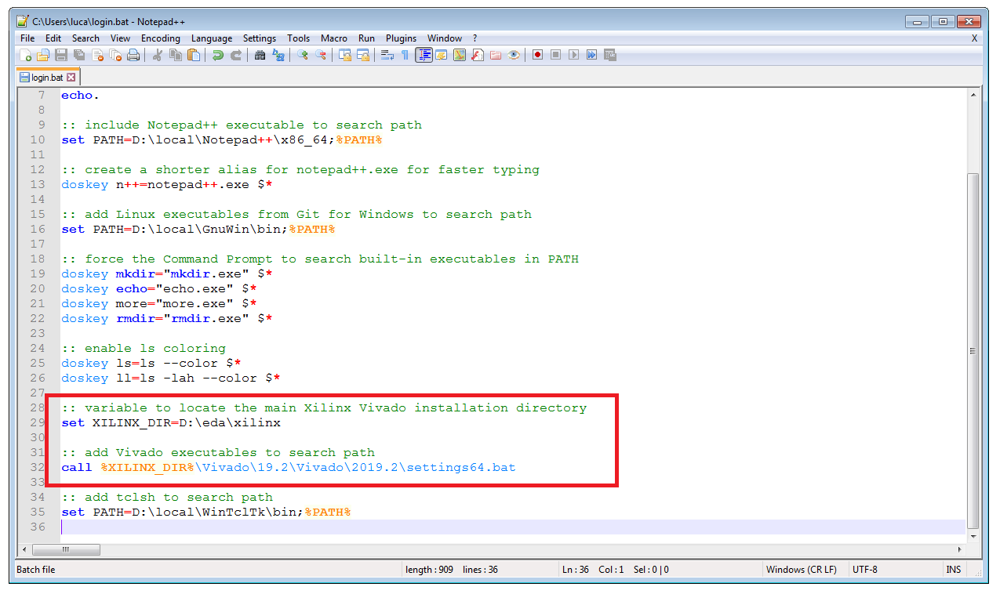


<br />

>
> **EXAMPLE**
>
> If you installed the **2019.2** version of Xilinx Vivado you will use:
>
> * `source $XILINX_DIR/Vivado/2019.2/settings64.sh` for Linux
> * `call %XILINX_DIR%\Vivado\2019.2\settings64.bat` for Windows
>

<br />

At this point each time you will open a new terminal `settings64.sh` (Linux) or `settings64.bat` (Windows)
will be **automatically loaded** and Vivado executables will be available from the command line.

<br />

## Experiment with Vivado commands
[**[Contents]**](#contents)

In order to **test your Xilinx Vivado installation**, please **open a terminal** and try to observe the output of the following commands:


```
% which vivado
% vivado -help
% which xsim
% xsim -help
```

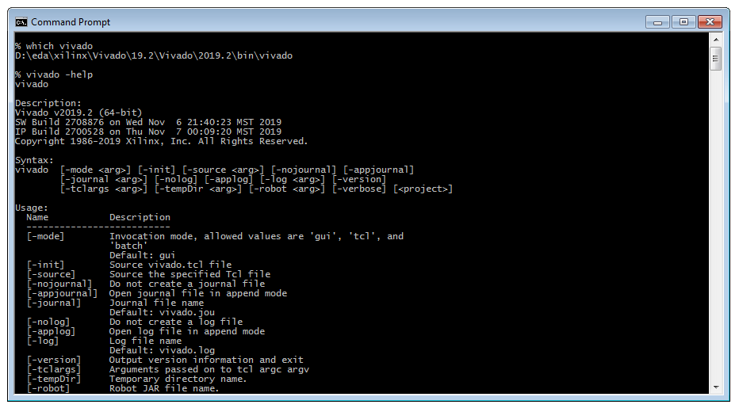


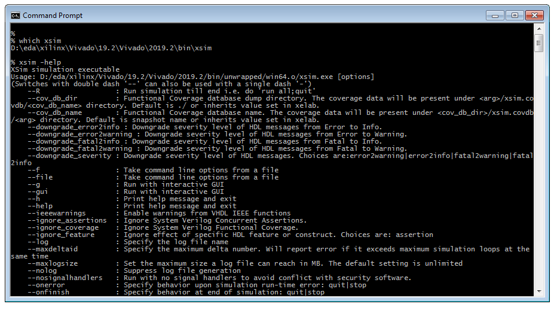


<br />


Let's try now to **open the Vivado Graphical User Interface (GUI)** from the command line after creating a dedicated test directory:

```
% cd Desktop
% mkdir test 
% cd test
% vivado -mode gui
```


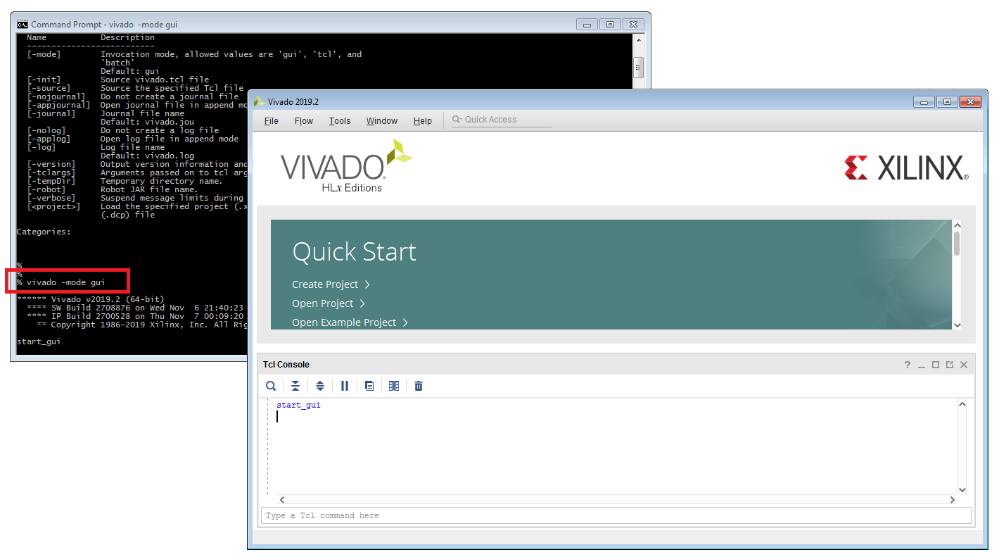

<br />

Close the Vivado main startup window by typing `stop_gui` followed by a RETURN
in the **Vivado Tcl console** placed at the bottom-left of the startup window (you can also find the hint _Type a Tcl command here_):

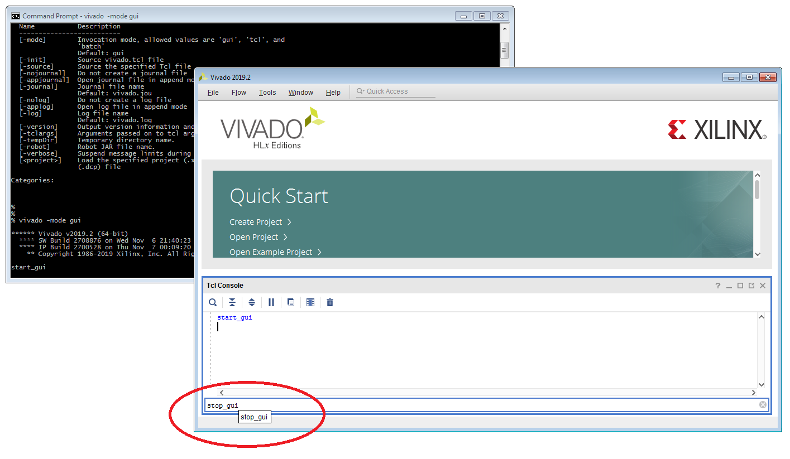

<br />

At this point you are using Vivado in the so called **interactive mode (Tcl-mode)**. The prompt of the command line
has changed and now is the **Vivado prompt**, where you can issue Vivado-specific commands:

```
Vivado%
```

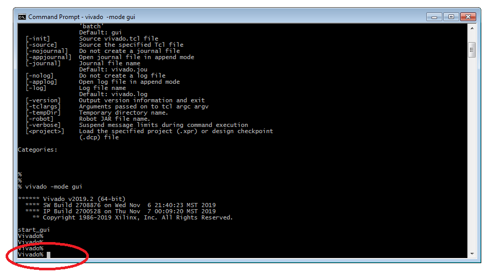

<br />

Issue the following commands at the Vivado command prompt and observe the output:

```
Vivado% puts [version -short]
Vivado% create_clock -help
Vivado& read_verilog -help
Vivado% synth_design -help
```

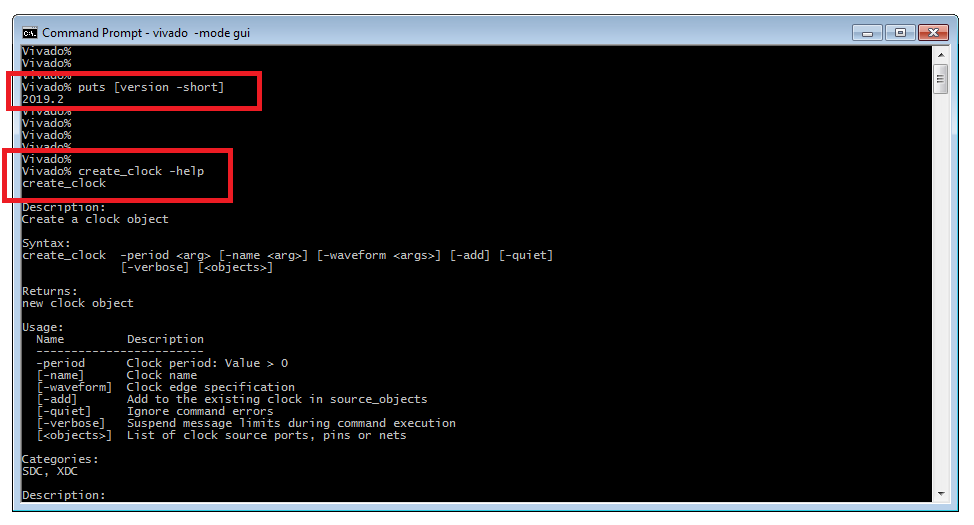

<br />

Exit from the Tcl console and quit Vivado:

```
Vivado% exit
```

<br />

List and explore the content of the test directory:


```
% ls -l
% cat vivado.jou
```

<br />

Remove the temporary directory that you created for this test:

```
% pwd
% cd ..
% rm -rf test/
```

<br />

>
> **NOTE**
>
> Just for reference. Vivado "executables" added to search path by the `settings64` script are actually **wrappers**, not true binaries.
> That is, when you invoke a Vivado command in the terminal you are not launching immediately its binary executable
> but only either a Bash (Linux) or a Batch (Windows) shell script which in turn calls the actual binary file according
> to the operating system. This approach is common to many other CAD tools.
>
> As an example, when you type `vivado` in the Windows _Command Prompt_ you are executing a script called `vivado.bat` from
> 
>
> `%XILINX_DIR%\Vivado\<version>\bin`
>
> Then this script is responsible to launch the actual `vivado.exe` binary executable placed in the
>
> `%XILINX_DIR%\Vivado\<version>\bin\unwrapped\win64.o`
>
> directory. This is the main reason for which you cannot run "as is" Vivado executables from the new **Windows Subsystem for Linux (WSL)**
> available under Windows 10.
>

<br />


<br />
<!--------------------------------------------------------------------->


# Sample Xilinx Vivado simulation and implementation flows
[**[Contents]**](#contents)


A small **mixed-language HDL design example** is provided to help students in testing their overall **command-line environment setup**
and all **software installations** required for the course.

The proposed digital system is a **26-bit synchronous counter** with count-enable and active-high synchronous reset
described in Verilog. The code also instantiates a compiled **Phase-Locked Loop (PLL)** clock-management **Xilinx IP core**
to divide by a factor 10 the input clock and additional **FPGA device primitives** in form of **pre-placed buffer cells**
in order to demonstrate how to use and simulate device primitives in your projects.
For test purposes, one of these buffers has been "wrapped" into a **VHDL component**. <br />

The behaviour of the counter can be simulated using a **Verilog testbench module** that generates clock, reset
and enable control signals to verify the expected functionality of the design before mapping the code to FPGA.
Also the testbench has mixed-language features, with the main clock stimulus generated by another VHDL component
to show how we can simulate mixed-language designs using the **Xilinx XSim simulator** without the need
of a commercial license (on the contrary, other professional digital simulators such as Mentor ModelSim/QuestaSim
or Cadence IES/Xcelium require a full license).

The code is synthesizable and can be implemented on real FPGA hardware targeting
the [**Digilent Arty A7 development board**](https://store.digilentinc.com/arty-a7-artix-7-fpga-development-board-for-makers-and-hobbyists/)
as used through the course. Additional debug features are also part of the implemented design.

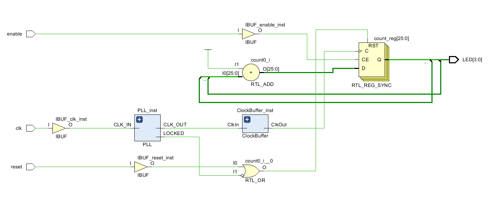

<br />
<!--------------------------------------------------------------------->


## Navigate to the test directory
[**[Contents]**](#contents)

To run the test flows, **open a terminal** window and change into the `fpga/test/` directory from the top of the Git repository:

```
% cd Desktop/lae/fpga/test
```

List content of the directory:

```
% ls -l
```

List all available `Makefile` targets with:

```
% make help
```

<br />

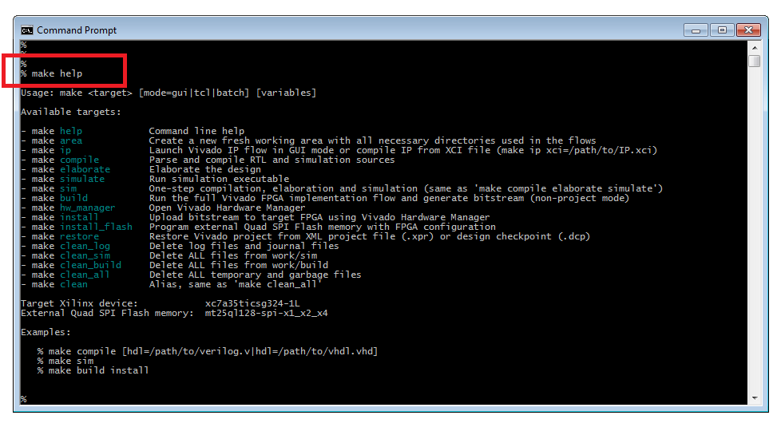

<br />

<br />

>
> **IMPORTANT**
>
> Each target in the `Makefile` is actually executed invoking a `bash` shell. Windows users might notice that
> a strange warning is generated when executing `make` targets:
>
> ```
> bash.exe: warning: could not find /tmp, please create
> ```
>
> This is a known problem and can be easily fixed by opening a `bash` session and creating the missing `/tmp` directory
> as expected by `bash`. To to this, launch `bash` in the _Command Prompt_ and create the missing directory:
>
> ```
> % bash
>
> Loading C:\Users\username\.bashrc
>
> bash$ mkdir /tmp
> bash$ exit
> %
> ```
>
> See also [this note](KPAS.md) or _<https://stackoverflow.com/questions/22492715/bash-exe-warning-could-not-find-tmp-please-create>_.
>

<br />


<!--------------------------------------------------------------------->


## Setup the working area
[**[Contents]**](#contents)

Create a new fresh working area with:

```
% make area
```

Once done, explore the new content of the test directory:

```
% ls -l
```

<br />
<!--------------------------------------------------------------------->


## Compile IP cores
[**[Contents]**](#contents)

A Phase-Locked Loop (PLL) clock-management IP core is used to divide by a factor 10 the frequency of the input clock.
The IP is provided by Xilinx and has been customized using the _Clocking Wizard_ part of the **Vivado IP Catalog**.

Compile the IP to generate all related simulation and implementation sources as follows:

```
% make ip mode=batch xci=cores/PLL/PLL.xci
```

<br />

List new design data generated by the flow:

```
% ls -l cores/PLL
```

<br />
<!--------------------------------------------------------------------->


## Run a behavioral simulation using XSim
[**[Contents]**](#contents)

Compile and elaborate the example HDL design and run the resulting simulation executable with:

```
% make compile
% make elaborate
% make simulate
```

<br />

>
> **IMPORTANT**
>
> Students working with **Linux Ubuntu** reported that by default `make elaborate` fails with the following error:
>
> ```
> ERROR: [XSIM 43-3409] Failed to compile generated C file xsim.dir/tb_Counter/obj/xsim_1.c.
> ERROR: [XSIM 43-3915] Encountered a fatal error. Cannot continue.
> Exiting...
> ```
>
> The source of the error is due to **missing dependencies** installed on the system.
> In particular the `clang` compiler that comes with the Vivado installation requires `libncurses.so`
> which might be not installed. This can be easily solved by installing the following packages:
>
> ```
> sudo apt-get install libncurses5 libtinfo5
> ```
> <br />
>
> Ref. also to: _<https://support.xilinx.com/s/question/0D52E00006iHlpQSAS/vivado-20172-simulation-xsim-433409-failed-to-compile-generated-c-file?language=en_US>_
>

<br />

For less typing, this is equivalent to run:

```
% make sim   (by default same as make sim mode=gui)
```

<br />

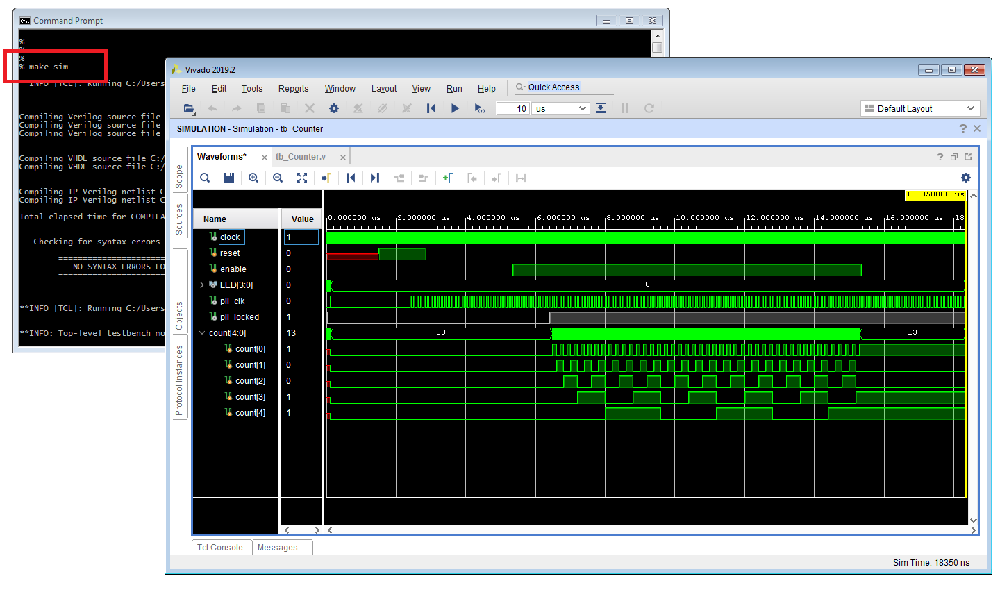

<br />

Explore simulation results in the XSim graphical interface. Once happy, close the window.

<br />

List the content of the directory that has been used to run the simulation:

```
% ls -l work/sim
```

<br />

You can also try to re-run the simulation in pure **batch mode** by specifying the `mode`
variable when invoking `make`:

```
% make sim mode=batch
```

<br />

Explore the content of provided simulation files using basic Linux commands, e.g. `cat`, `less` or `more`:

```
% cat  Makefile
% cat  rtl/Counter.v
% more rtl/ClockBuffer.vhd
% less scripts/sim/compile.tcl
```

<br />
<!--------------------------------------------------------------------->


## Implement the design on a target FPGA
[**[Contents]**](#contents)

Synthesize and map the example RTL code targeting a
[**Digilent Arty A7 development board**](https://store.digilentinc.com/arty-a7-artix-7-fpga-development-board-for-makers-and-hobbyists/) with:

```
% make build   (by default same as make build mode=gui)
```

<br />

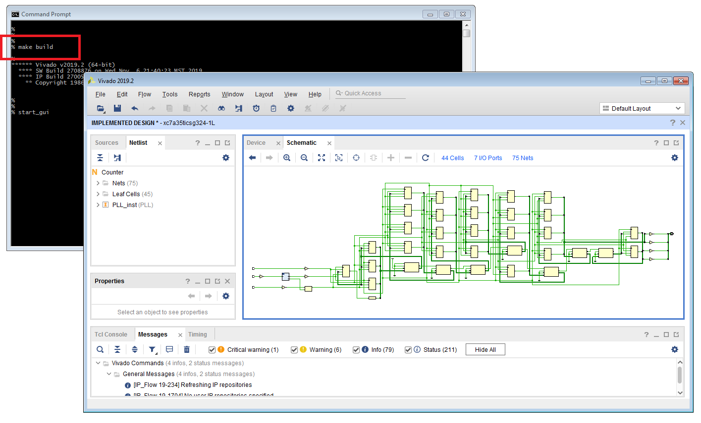

<br />

Explore implementation results in the Vivado graphical interface. Once happy, close the window.

<br />

As for simulations, by default also the implementation flow runs in **graphic mode**.
You can try to re-run the flow in **interactive (Tcl)** or **batch modes** by specifying the
`mode` variable when invoking `make`:

```
% make build [mode=gui|tcl|batch]
```

<br />

List the contents of the directory that has been used to run the implementation flow:

```
% ls -l work/build
% ls -l work/build/reports
% ls -l work/build/outputs
```

<br />

Explore the content of the main **Xilinx Design Constraint (XDC)** file used to map the code to real FPGA hardware:

```
% cat xdc/Counter.xdc
```

<br />

Have also a first look to some **text reports** generated by the flow:

```
% ls -l work/builds/reports
% cat work/builds/reports/post_syn_utilization.rpt
```

<br />

Finally, try lo individuate **firmware configuration files** (_"bitstream"_ according to FPGA jargon) used to
program the FPGA or to write the firmware into the external 128-MB Quad SPI Flash memory:

```
% ls -l work/build/outputs
```

<br />
<!--------------------------------------------------------------------->


## <a name="install-and-debug-the-firmware"></a> Install and debug the firmware (optional)
[**[Contents]**](#contents)

<br />

>
> **IMPORTANT**
>
> The following instructions are provided **only for reference**, you can test firmware installation flows
> only if you have a Digilent Arty A7 board attached to your personal computer!
>

<br />

At the end of the physical implementation flow you can test the design on real FPGA hardware.
Assuming that a board is connected to the host computer, upload the firmware from the command line using:

```
% make install [mode=batch]
```

<br />

The firmware loaded into the FPGA is stored into a volatile RAM inside the chip. By default the FPGA configuration is therefore **non-persistent**
across power cycles and you have to **re-program the FPGA** whenever you **disconnect the power** from the board.

In order to get the FPGA automatically programmed at power up you have to write the FPGA configuration into a dedicated
**external flash memory** as follows:

```
% make install_flash [mode=batch]
```

<br />

Please note that the firmware installation is a typical example of a very **automated and repetitive flow**, thus
working in **batch mode** with a **command-line approach** becomes more efficient than opening a graphical interface.

