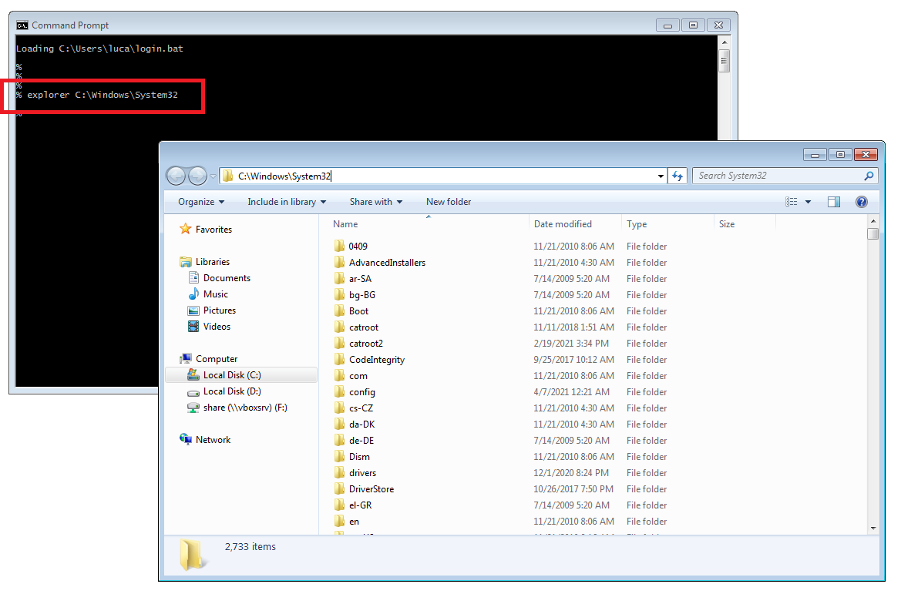
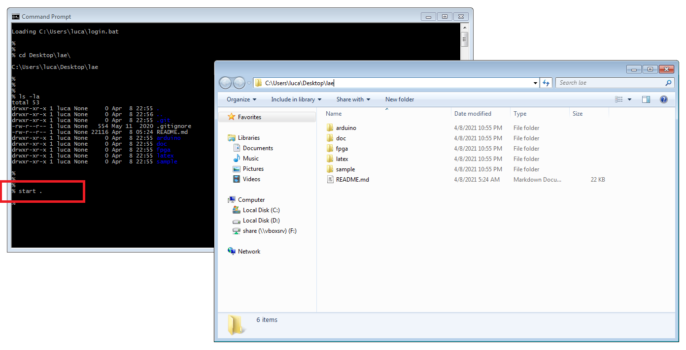

A small collection of useful "tricks" when you work at the command line.


# Open the file browser from the command line

When you explore files and directories in the graphical interface you are actually
using a **file browser** program invoked for you by the operating system.

Thus if you know the name of the executable of this program you can launch it
from the command line at any time.

<br />

## Linux

On Linux distributions using the GNOME environment the file browser is called **Nautilus**
and you can launch it with the `nautilus` command:


```
% nautilus /path/to/directory &
```

To open the browser in the current working directory:

```
% nautilus . &
```

<br />

## Windows

On Windows the file browser is called **Explorer** and you can launch it by invoking
the `explorer.exe` executable:


```
% explorer \path\to\directory
```

To open the browser in the current working directory:


```
% explorer .
```


Example:


```
% explorer C:\Windows\System32
```




<br />

Additionally you can also use the `start` command:


```
% start \path\to\directory
```

To open the browser in the current working directory using `start` simply type:


```
% start .
```


Example:

```
% cd Desktop\lae
% start .
```




