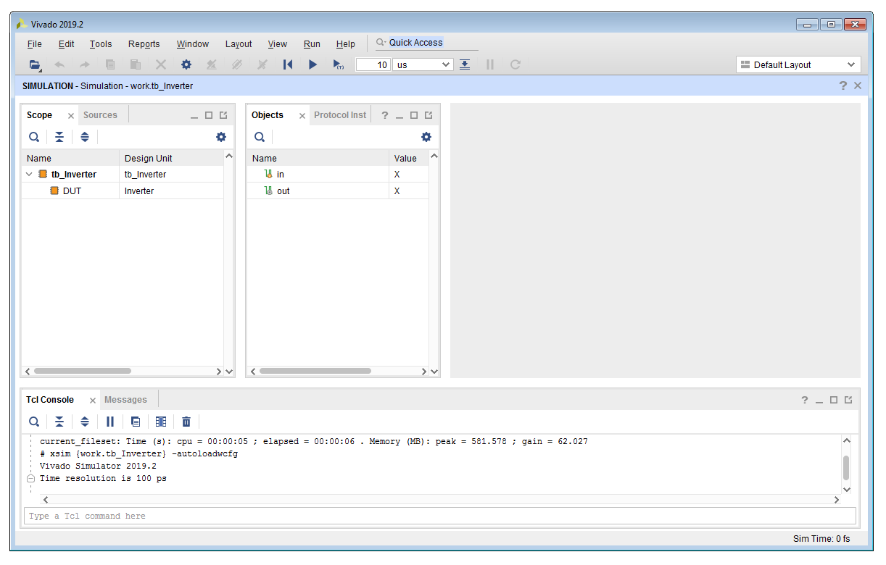
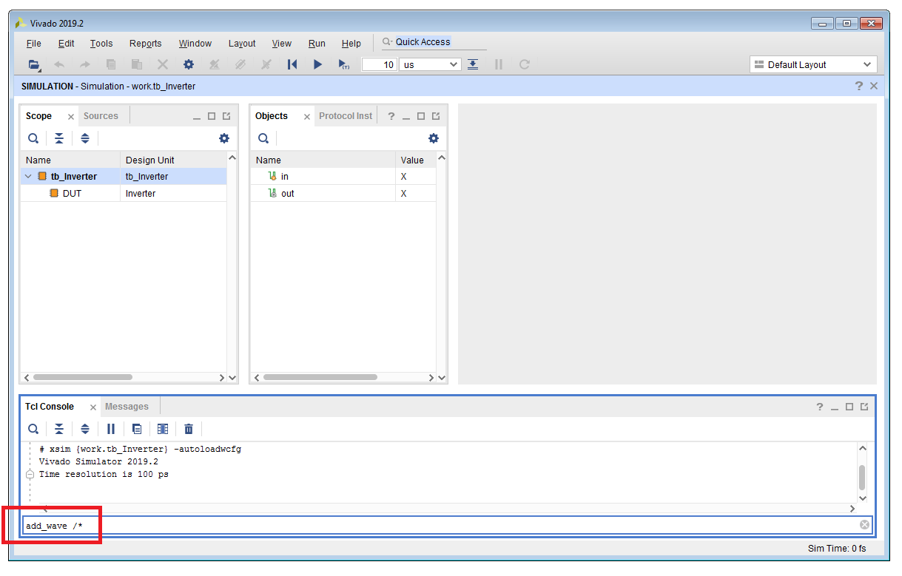
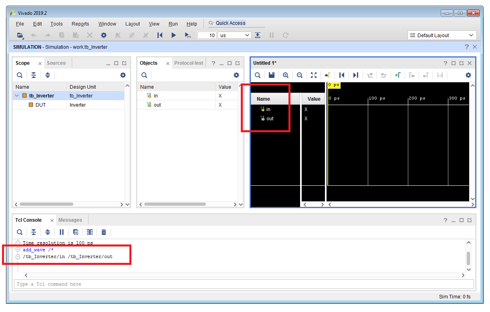
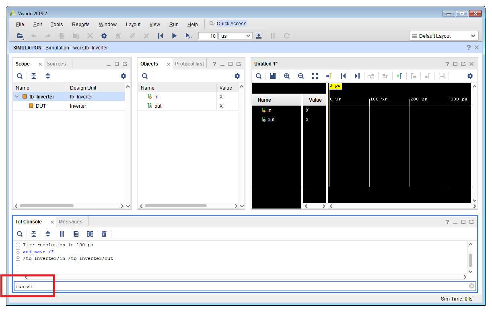
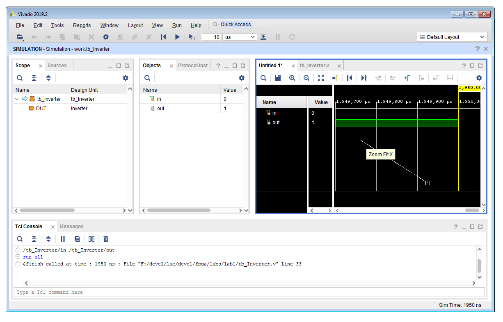
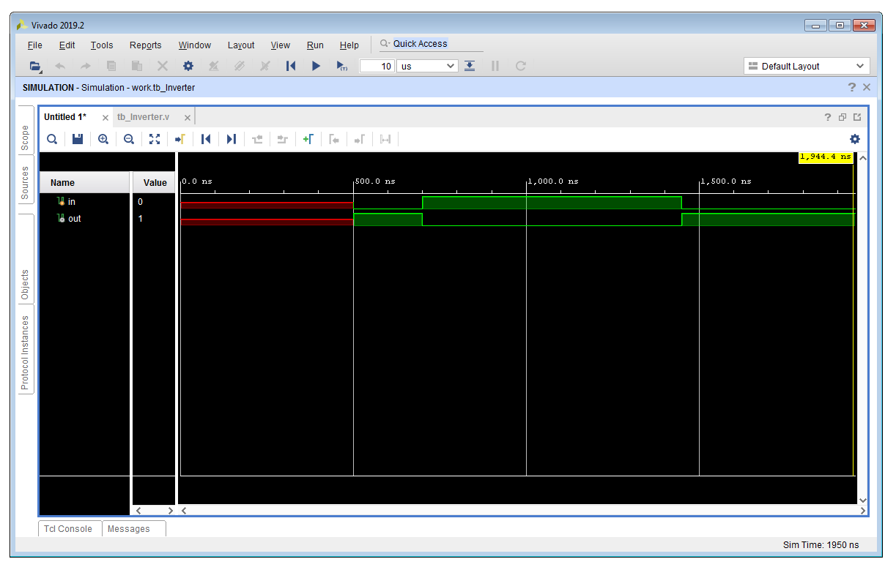
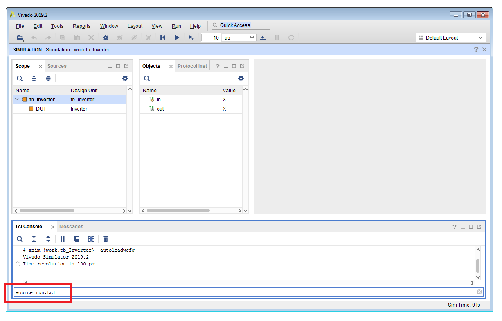

# Lab 1 Instructions

## Contents

* [**Introduction**](#introduction)
* [**Lab aims**](#lab-aims)
* [**Navigate to the lab directory**](#navigate-to-the-lab-directory)
* [**Write and compile HDL sources**](#write-and-compile-hdl-sources)
* [**Elaborate the design**](#elaborate-the-design)
* [**Run the simulation executable**](#run-the-simulation-executable)
* [**Run Tcl simulation commands interactively**](#run-tcl-simulation-commands-interactively)
* [**Clean up the working area**](#clean-up-the-working-area)
* [**Use a Tcl script to automate the simulation**](#use-a-tcl-script-to-automate-the-simulation)
* [**Create a Makefile to automate the flow**](#Create-a-makefile-to-automate-the-flow)
* [**Exercises**](#exercises)
* [**Extra: comparison with VHDL code**](#extra-comparison-with-vhdl-code)
* [**Further reading**](#further-readings)


<br />
<!--------------------------------------------------------------------->

## Introduction
[**[Contents]**](#contents)

In the first lab we will implement and simulate a simple **NOT-gate (inverter)** using the **Verilog Hardware Description Language (HDL)** <br />
and the **XSim simulator** that comes with the **Xilinx Vivado design suite**.<br/>

We will also learn how to write a [**GNU Makefile**](https://www.gnu.org/software/make/manual/make.html)
to **automate the simulation flow** at the command line.


<br />
<!--------------------------------------------------------------------->


## Lab aims
[**[Contents]**](#contents)

This introductory lab should exercise the following concepts:

* create and edit HDL sources and scripts with a text editor from the command line
* introduce Verilog language syntax fundamentals
* understand the Xilinx XSim simulation flow (HDL sources compilation, design elaboration and snapshot execution)
* add and trace signals in the XSim simulator Graphical User Interface (GUI)
* use basic XSim Tcl simulation commands to run a simulation interactively
* explore and debug simulation results
* use a Tcl script to automate the simulation
* write a `Makefile` to automate the flow at the command line

<br />
<!--------------------------------------------------------------------->


## Navigate to the lab directory
[**[Contents]**](#contents)

As a first step, **open a terminal window** and change to the `lab1/` directory:

```
% cd Desktop/lae/fpga/labs/lab1
```

<br />

List the content of the directory:

```
% ls -l
% ls -la
```

<br />

>
> **QUESTION**
>
> Why the outputs of the above commands are not the same ? <br /><br />
>
>   \____________________________________________________________________________________________________
>

<br />
<!--------------------------------------------------------------------->


## Write and compile HDL sources 
[**[Contents]**](#contents)

In order to implement and simulate our simple inverter we are going to write **two different Verilog modules**:

* one module containing the actual implementation of the inverter using **synthesizable code**
* a second **testbech module** that **instantiates** the previous module as **Device Under Test (DUT)** <br />
  and generates a suitable **test pattern** to verify the expected functionality of a NOT-gate


<br />

**DEVICE UNDER TEST (DUT) MODULE**

With a **text editor** program create a new file named `Inverter.v`.

Linux users can use the default **Gedit** text editor:

```
% gedit Inverter.v &
```

<br />

Windows users will use **Notepad++** instead:

```
% n++ Inverter.v
```

<br />

>
> **IMPORTANT !**
>
> In order to use the `n++` alias in place of `notepad++` you must create a `doskey` for the `notepad++.exe` executable
> in the `login.bat` script as described [here](../lab0/README.md#add-notepad-executable-to-search-path):
>
> ```
> doskey n++=notepad++.exe $*
> ```
>

<br />


Write the following **Verilog code** in the newly created file:

```Verilog
//
// A simple NOT-gate (inverter) in Verilog.
//


`timescale 1ns / 1ps   // specify time-unit and time-precision, this is only for simulation purposes

module Inverter (

   input  wire X,
   output wire ZN ) ;   // using 'wire' in the port declaration is redundant, by default I/O ports are already considered WIRES unless otherwise specified 


   // continuous assignment
   assign ZN = !X ;                // **NOTE: you can also use ~X

endmodule
```

<br />

Once finished, **save the file** and try to **parse and compile** the code using the `xvlog` Verilog compiler as follows:

```
% xvlog Inverter.v
```

<br />

In case of **syntax errors**, fix the errors issued in the terminal and re-compile the source file
after saving your changes.

By default the compiler creates a **log file** named `xvlog.log` in the directory where you invoke the `xvlog` executable.
Use `cat` to display the content of `xvlog.log` in the terminal:

```
% cat xvlog.log
```

<br />

Explore all **command-line switches and options** available for the `xvlog` compiler:

```
% xvlog -help
```

<details>
<summary>Show output</summary>

```
Usage: xvlog [options] file...
(Switches with double dash '--' can also be used with a single dash '-')

Vivado Simulator xvlog options:
  -f [ --file ] arg          Read additional options from the specified file
  -h [ --help ]              Print this help message
  --version                  Print the compiler version
  --initfile arg             Use user defined simulator init file to add to or 
                             override the settings provided by the default 
                             xsim.ini file
  -L [ --lib ] arg           Specify search libraries for the instantiated 
                             design units in a Verilog or Mixed language 
                             design. Use -L|--lib for each search library. The 
                             format of the argument is <name>[=<dir>] where 
                             <name> is the logical name of the library and 
                             <dir> is an optional physical directory of the 
                             library
  --nolog                    Suppress log file generation
  --log arg                  Specify the log file name. Default is <application
                             name>.log
  --prj arg                  Specify Vivado Simulator  project file containing 
                             one or more entries of 'vhdl|verilog <work lib> 
                             <HDL file name>'
  --relax                    Relax strict HDL language checking rules
  -v [ --verbose ] arg       Specify verbosity level for printing messages. 
                             Allowed values are: 0, 1, 2 (Default:0)
  --incr                     Enable incremental parsing and compilation check 
                             point
  --nosignalhandlers         Run with no XSim specific signal handlers. 
                             Necessary when 3rd party software such as 
                             antivirus, firewall is generating signals as part 
                             of its normal usage, causing XSim Compiler and 
                             Kernel executables to trap these signals and 
                             report a crash.
  -i [ --include ] arg       Specify directories to be searched for files 
                             included using Verilog `include. Use -i|--include 
                             for each specified search directory
  -d [ --define ] arg        Define Verilog macros. Use -d|--define for each 
                             Verilog macro. The format of the macro is 
                             <name>[=<val>] where <name> is name of the macro 
                             and <value> is an optional value of the macro
  --sourcelibdir arg         Directory for Verilog source files of uncompiled 
                             modules. Use -sourcelibdir|--sourcelibdir 
                             <dirname> for each source directory.
  --sourcelibext arg         File extension for Verilog source files of 
                             uncompiled modules. Use -sourcelibext|--sourcelibe
                             xt <file extension> for source file extension.
  --sourcelibfile arg        Filename of a Verilog source file which has 
                             uncompiled modules. Use -sourcelibfile|--sourcelib
                             file <filename>.
  --noname_unnamed_generate  Generate name for an unnamed generate block
  --uvm_version arg          Specify the uvm version(default: 1.2)
  --work arg                 Specify the work library. The format of the
                             argument is <name>[=<dir>] where <name> is the
                             logical name of the library and <dir> is an
                             optional physical directory of the library
  --encryptdumps             Encrypt parse dump of design units
  --sv                       Compile input files in System Verilog mode

Examples:
  xvlog file1.v file2.v
  xvlog -work worklib file1.v file2.v
  xvlog -prj files.prj
```

</details>

<br />

Recompile the Verilog file by specifying a **custom name for the log file** generated by `xvlog` using the `-log` option:

```
% xvlog Inverter.v -log Inverter.log
```


<br />

>
> **QUESTION**
>
> Execute the following `git` command in the terminal:
>
> ```
> % git status
> ```
>
> Why new files created in the working directory such as `Inverter.v` or `xvlog.log` are not recognized by Git as new files for tracking ? <br /><br />
>
>   \____________________________________________________________________________________________________
>

<br />


**TESTBENCH MODULE**

In order to **simulate** the block we also need a **testbench module** to create a
**test pattern** for our inverter.

Create a second Verilog file named `tb_Inverter.v` from the command line as follows:

```
% gedit tb_Inverter.v &   (for Linux users)
% n++ tb_Inverter.v       (for Windows users)
```

<br />

Write the following **non-synthesizable Verilog code** is the testbench file:

```verilog
//
// Simple testbench for the Inverter module.
//


`timescale 1ns / 1ps

module tb_Inverter ;

   reg in ;      // note that this is declared as 'reg' net type
   wire out ;

   // instantiate the device under test (DUT)
   Inverter DUT ( .X(in), .ZN(out) ) ;

   // main stimulus
   initial begin
   
      #500 in = 1'b0 ;
      #200 in = 1'b1 ;
      #750 in = 1'b0 ;

      #500 $finish ;     // stop the simulation (this is a Verilog "task")
   end

endmodule
```

<br />

Parse and compile with `xvlog` also the testbench:

```
% xvlog tb_Inverter.v
```

<br />


In case of **syntax errors**, fix the errors issued in the terminal and re-compile the source file
after saving your changes.


<br />

>
> **QUESTION**
>
> Why we declared the `in` signal as `reg` instead of `wire` ? <br /><br />
>
>   \____________________________________________________________________________________________________
>

<br />
<!--------------------------------------------------------------------->


## Elaborate the design
[**[Contents]**](#contents)


The **compilation** process generates a **binary representation** of the HDL sources that only Xilinx tools
are now able to understand. This is basically the same thing that happens when you compile C/C++ sources at the
command line using `gcc/g++` compilers.

This binary representation goes into a so called **work library** placed in the `xsim.dir` directory
created by `xvlog`:

```
% ls -l xsim.dir/
% ls -l xsim.dir/work
```

<br />

In order to **simulate the testbench** we have at first to **merge together** the
compiled code of our module under test (the `Inverter` module) with the compiled code of the testbench module (the `tb_Inverter` module)
into a single **binary simulation executable**.
This process is called **design elaboration** and in the Xilinx XSim simulation flow this is performed
by the `xelab` executable. More in general, HDL sources can also instantiate other pre-compiled digital blocks, FPGA device primitives etc.
with a complex design hierarchy. Thus the elaboration process is also responsible to **resolve all external dependencies** found in the design.
Back to our comparison with C/C++ programming, design elaboration is what is called **linking** when compiling C/C++ sources.

The main argument for `xelab` is the **NAME of the top-level module** that you want to elaborate.
Apart from a few special cases that we will discuss later in the course, this is usually the **NAME of the testbench module**:

```
% xelab -debug all tb_Inverter
```

<br />

Be aware that the `-debug all` option is **REQUIRED** to make all signals in the design hierarchy **accessible** from the simulator
graphical interface in form of **digital waveforms**. That is, if you want to be able to **probe and display ALL signals as waveforms in the GUI**
you must elaborate the design with the `-debug all` flag. This is a feature common to all professional digital
simulators in order to **save disk space** when you deal with very large digital HDL projects (e.g. an entire CPU) where you don't need
to probe any single net in the design hierarchy.
If you elaborate compiled sources without this option **you will NOT BE ABLE to probe signals** in the XSim graphical interface!

<br />

>
> **IMPORTANT !**
>
> The value to be passed as main argument to the `xelab` executable is the **NAME** of the top-level module that has to be elaborated,
> **NOT the corresponding Verilog source file**! The following command-line syntax is therefore **WRONG** and generates errors:
>
> ```
> % xelab -debug all tb_Inverter.v
> ```
>
> Do not call `xelab` targeting a `.v` file and **always pay attention to TAB completion on files**!
>

<br />

Explore all command-line switches and options for the `xelab` elaborator:


```
% xelab -help
```

<details>
<summary>Show output</summary>

```
Usage: xelab [options] [libname.]unitname...
(Switches with double dash '--' can also be used with a single dash '-')

Vivado Simulator xelab options:
******************************:
  -a [ --standalone ]              Generates a standalone non-interactive
                                   simulation executable that performs run-all.
  -d [ --define ] arg              Define Verilog macros. Use -d|--define for
                                   each Verilog macro. The format of the macro
                                   is <name>[=<val>] where <name> is name of
                                   the macro and <value> is an optional value
                                   of the macro
  --debug arg                      Compile with specified HDL debugging ability
                                   turned on. Choices are:
                                     line: HDL breakpoint
                                     wave: waveform generation, conditional
                                           execution, force value
                                     drivers: signal driver value probing
                                     readers: signal reader (load) probing
                                     xlibs: visibility into libraries
                                            precompiled by xilinx
                                     all: all the above
                                     typical: line, wave and drivers
                                     subprogram: subprogram variable value
                                                 probing
                                     off: turn off all debugging abilities
                                   (Default: off)
  -f [ --file ] arg                Read additional options from the specified
                                   file
  -h [ --help ]                    Print this help message
  --incr                           Enable incremental parsing and compilation
                                   check point
  -i [ --include ] arg             Specify directories to be searched for files
                                   included using Verilog `include. Use
                                   -i|--include for each specified search
                                   directory
  --initfile arg                   Use user defined simulator init file to add
                                   to or override the settings provided by the
                                   default xsim.ini file
  --log arg                        Specify the log file name. Default is
                                   <application name>.log
  -L [ --lib ] arg                 Specify search libraries for the
                                   instantiated design units in a Verilog or
                                   Mixed language design. Use -L|--lib for each
                                   search library. The format of the argument
                                   is <name>[=<dir>] where <name> is the
                                   logical name of the library and <dir> is an
                                   optional physical directory of the library
  --nolog                          Suppress log file generation
  --override_timeunit              Override timeunit for all Verilog modules,
                                   with the specified time unit in -timescale
                                   option
  --prj arg                        Specify Vivado Simulator  project file
                                   containing one or more entries of
                                   'vhdl|verilog <work lib> <HDL file name>'
  -r [ --run ]                     Run the generated executable
  --relax                          Relax strict HDL language checking rules
  -R [ --runall ]                  Run the generated executable till end of
                                   simulation (xsim -runall)
  -s [ --snapshot ] arg            Specify the name of design snapshot
  --timescale arg                  Specify default timescale for Verilog
                                   modules( Default: 1ns/1ps )
  --version                        Print the compiler version
  -v [ --verbose ] arg             Specify verbosity level for printing
                                   messages. Allowed values are: 0, 1, 2
                                   (Default:0)
  --uvm_version arg                Specify the uvm version(default: 1.2)

 Advance options:
 ***************:
  --93_mode                        Force usage of VHDL-93 mode for STD and IEEE
                                   libraries. Default is mixed 93 and 2008. If
                                   used, should be used for all VHDL files for
                                   the specific project
  --driver_display_limit arg       Set the maximum number of elements a signal
                                   may contain for driver information to be
                                   recorded for the signal (Default: arg =
                                   65536 elements)
  --generic_top arg                Override generic or parameter of a top level
                                   design unit with specified value( Example:
                                   -generic_top "P1=10"
  --ignore_assertions              Ignore System Verilog Concurrent Assertions
  --report_assertion_pass          Report System Verilog Concurrent Assertions
                                   Pass, even if there is no pass action block
  --ignore_coverage                Ignore System Verilog Functional Coverage
  --maxarraysize arg               Set the maximum VHDL array size, beyond
                                   which an array declaration will generate an
                                   error, to be 2**arg elements (Default: arg =
                                   28, which is 2**28 elements)
  --mt arg (=auto)                 Specifies the number of sub-compilation jobs
                                   which can be run in parallel. Choices are:
                                     auto: automatic
                                     n: where n is an integer greater than 1
                                     off: turn off multi-threading
                                   (Default:auto)
  --maxdesigndepth arg             Override maximum design hierarchy depth
                                   allowed by the elaborator (Default: 5000)
  --noname_unnamed_generate        Generate name for an unnamed generate block
  --nosignalhandlers               Run with no XSim specific signal handlers.
                                   Necessary when 3rd party software such as
                                   antivirus, firewall is generating signals as
                                   part of its normal usage, causing XSim
                                   Compiler and Kernel executables to trap
                                   these signals and report a crash.
  --override_timeprecision         Override time precision for all Verilog
                                   modules, with the specified time precision
                                   in -timescale option
  --rangecheck                     Enable runtime value range check for VHDL
  --sourcelibdir arg               Directory for Verilog source files of
                                   uncompiled modules. Use
                                   -sourcelibdir|--sourcelibdir <dirname> for
                                   each source directory.
  --sourcelibext arg               File extension for Verilog source files of
                                   uncompiled modules. Use
                                   -sourcelibext|--sourcelibext <file
                                   extension> for source file extension.
  --sourcelibfile arg              Filename of a Verilog source file which has
                                   uncompiled modules. Use
                                   -sourcelibfile|--sourcelibfile <filename>.
  --stats                          Print tool CPU and memory usages, and design
                                   statistics
  --timeprecision_vhdl arg (=1ps)  Specify time precision for vhdl designs(
                                   Default: 1ps)
  --transform_timing_checkers      Transform timing checkers to Verilog
                                   processes

 timing simulation:
 *****************:
  --maxdelay                       Compile Verilog design units with maximum
                                   delays
  --mindelay                       Compile Verilog design units with minimum
                                   delays
  --nosdfinterconnectdelays        Ignore SDF port and interconnect delay
                                   constructs in SDF
  --nospecify                      Ignore Verilog path delays and timing checks
  --notimingchecks                 Ignore timing check constructs in Verilog
                                   specify block(s)
  --pulse_int_e arg                Interconnect pulse error limit as percentage
                                   of  delay. Allowed values are 0 to 100
                                   (Default: 100)
  --pulse_int_r arg                Interconnect pulse reject limit as
                                   percentage of  delay. Allowed values are 0
                                   to 100 (Default: 100)
  --pulse_e arg                    Path pulse error limit as percentage of path
                                   delay. Allowed values are 0 to 100 (Default:
                                   100)
  --pulse_r arg                    Path pulse reject limit as percentage of
                                   path delay. Allowed values are 0 to 100
                                   (Default: 100)
  --pulse_e_style arg (=onevent)   Specify when error about pulse being shorter
                                   than module path delay should be handled.
                                   Choices are:
                                     ondetect: report error right when
                                               violation is detected
                                     onevent:  report error after the module
                                               path delay
                                   (Default: onevent)
  --sdfmax arg                     <root=file> Sdf annotate <file> at <root>
                                   with maximum delay
  --sdfmin arg                     <root=file> Sdf annotate <file> at <root>
                                   with minimum delay
  --sdfnoerror                     Treat errors found in sdf file as warning
  --sdfnowarn                      Do not emit sdf warnings
  --sdfroot arg                    <root_path> Default design hierarchy at
                                   which sdf annotation is applied
  --sdftyp arg                     <root=file> Sdf annotate <file> at <root>
                                   with typical delay
  --transport_int_delays           Use transport model for interconnect delays
  --typdelay                       Compile Verilog design units with typical
                                   delays (Default)

 Optimization:
 ************:
  --O0                             Disable all optimizations
  --O1                             Enable basic optimizations
  --O2                             Enable most commonly desired optimizations
                                   (Default)
  --O3                             Enable advance optimizations

 Mixed Language:
 ************:
  --dup_entity_as_module           Enable support for hierarchical references
                                   inside the Verilog hierarchy in mixed
                                   language designs. Warning: this may cause
                                   significant slow down of compilation

 SystemC/DPI options:
 *******************:
  --dpi_absolute                   Use absolute paths instead of
                                   LD_LIBRARY_PATH on Linux for DPI libraries
                                   that are formatted as lib<libname>.so
  --dpiheader arg                  Header filename for the exported and
                                   imported functions.
  --dpi_stacksize arg              User-defined stack size for DPI tasks
  --sc_lib arg                     Shared library name for SystemC functions;
                                   (.dll/.so) without the file extension
  --sv_lib arg                     Shared library name for DPI imported
                                   functions; (.dll/.so) without the file
                                   extension
  --sv_liblist arg                 Bootstrap file pointing to DPI shared
                                   libraries.
  --sc_root arg                    Root directory off which SystemC libraries
                                   are to be found. Default:
                                   <current_directory>/xsim.dir/work/xsc
  --sv_root arg                    Root directory off which DPI libraries are
                                   to be found. Default: <current_directory>/xs
                                   im.dir/work/xsc


 Coverage options:
 *******************:
  --cov_db_dir arg                 Functional Coverage database dump directory.
                                   The coverage data will be present under
                                   <arg>/xsim.covdb/<cov_db_name> directory.
                                   Default is ./
  --cov_db_name arg                Functional Coverage database name. The
                                   coverage data will be present under
                                   <cov_db_dir>/xsim.covdb/<arg> directory.
                                   Default is snapshot name.

Examples:
  xelab top1 top2
  xelab lib1.top1 lib2.top2
  xelab top1 top2 -prj files.prj
  xelab lib1.top1 lib2.top2 -prj files.prj
```

</details>

<br />
<!--------------------------------------------------------------------->


## Run the simulation executable
[**[Contents]**](#contents)

At the end of the elaboration process `xelab` creates a **binary simulation executable** (also referred to as _**"simulation snapshot"**_
according to Xilinx terminology). This executable can be finally parsed by the XSim simulator using the `xsim` command.

Explore all command-line switches and options for the `xsim` executable:

```
% xsim -help
```


<details>
<summary>Show output</summary>

```
XSim simulation executable
Usage: /path/to/xsim [options]
(Switches with double dash '--' can also be used with a single dash '-')
    --R                  : Run simulation till end i.e. do 'run all;quit'
    --f                  : Take command line options from a file
    --file               : Take command line options from a file
    --g                  : Run with interactive GUI
    --gui                : Run with interactive GUI
    --h                  : Print help message and exit
    --help               : Print help message and exit
    --ieeewarnings       : Enable warnings from VHDL IEEE functions
    --log                : Specify the log file name
    --maxdeltaid         : Specify the maximum delta number. Will report error if it exceeds maximum simulation loops at the same time
    --maxlogsize         : Set the maximum size a log file can reach in MB. The default setting is unlimited
    --nolog              : Suppress log file generation
    --nosignalhandlers   : Run with no signal handlers to avoid conflict with security software.
    --onerror            : Specify behavior upon simulation run-time error: quit|stop
    --onfinish           : Specify behavior at end of simulation: quit|stop
    --protoinst          : Specify a .protoinst file for protocol analysis
    --runall             : Run simulation till end i.e. do 'run all;quit'
    --scNoLogFile        : Keep the SystemC output separate from XSim output
    --stats              : Display memory and cpu stats upon exiting
    --sv_seed            : seed for sv constraint random
    --t                  : Specify the TCL file for batch mode execution
    --tclbatch           : Specify the TCL file for batch mode execution
    --testplusarg        : Specify plus args to be used by $test$plusargs and $value$plusargs system functions
    --tl                 : Enable printing of file name and line number of statements being executed.
    --tp                 : Enable printing of hierarchical names of process being executed.
    --version            : Print the simulator version and quit.
    --view               : Open a wave configuration file. This switch should be used together with -gui switch
    --wdb                : Specify the waveform database output file.
```

</details>

<br/>


By default `xelab` creates a simulation snapshot with the same name of the top-level module specified for elaboration. <br />

To start XSim type:

```
% xsim -gui tb_Inverter
```

<br />

>
> **IMPORTANT !**
>
> The value to be passed as main argument when invoking `xsim` is the **NAME of the simulation executable** (snapshot). In this course
> we **always assume** that the name of the simulation executable is **the name of the testbench module** as specified
> when executing `xelab` during elaboration. The target for the `xsim` command is **NOT a Verilog source file**! The following
> command-line syntax is therefore **WRONG** and generates errors:
>
> ```
> % xsim -gui tb_Inverter.v
> ```
>
> Do not call `xsim` targeting a `.v` file and **always pay attention to TAB completion on files**!
>
> Just for reference, if you want to change the name of the simulation executable you can use the `-s` (same as `-snapshot`) switch
> when you elaborate the design with `xelab`. As an example:
>
> ```
> % xelab -debug all tb_Inverter -s tb_Inverter.exe 
> % xsim -gui tb_Inverter.exe
>

<br />

The `-gui` option launches the XSim simulator **graphical user interface (GUI)** in order to be able to **probe and display waveforms**.

<br />




<br />

>
> **IMPORTANT !**
>
> The command `xsim -gui` suffers from a very important drawback. That is, once `xsim` is invoked we **cannot type shell commands in the terminal anymore**.
> Linux users can launch `xsim` in **background** by adding the `&` character,
>
> ```
> % xsim -gui tb_Inverter &
> ```
>
> but there is no `&` equivalent on Windows. Later in this lab we will learn how to fix this by forwarding the execution of the command to `tclsh`.
>

<br />

<!--------------------------------------------------------------------->


## Run Tcl simulation commands interactively
[**[Contents]**](#contents)

Once the simulation executable has been loaded into the XSim virtual memory we can finally **run the HDL simulation** in order to verify
the expected functionality for our inverter.

Before running the simulation we need to **probe all signals of interest** that we want to **trace as waveforms** in the XSim graphical interface,
otherwise the simulation will run but you will not see anything interesting. This can be easily done using the
`add_wave` simulation command in the **Tcl console**.

As an example, **probe all top-level signals** (testbench signals) using `add_wave` as follows:

```
add_wave /*
```

<br />




<br />


This automatically creates a new **Waveform Configuration (WCFG) window** (by default named as "Untitled 1") that will
be used as a "virtual oscilloscope" to trace and debug digital signals in the graphical interface.

<br />



<br />


<br />

>
> **NOTE**
>
> It's always **up to the user** to select signals of interest to be traced before starting a digital simulation. <br />
> This is true also for other professional digital simulators.
>

<br />


After signals probing we can finally **run the digital simulation** either typing

```
run all
```

<br />

in the Tcl console or selecting **Run > Run All** in the graphical interface.


<br />



<br />

As you can notice the simulator informs you that the simulation runs until the `$finish` Verilog task is found in the testbench code.


<br />

Display the full simulation time scale with **View > Zoom Fit**. Alternatively you can also left-clik anywhere in the Wave window
and **drag upper-left the mouse pointer**, then once you release the left button all waveforms automatically fit into the Wave window.

<br />




<br />


Explore the graphical interface of the XSim simulator and debug simulation results.

<br />

>
> **QUESTION**
>
> Which is the logic value of the `in` signal before 500 ns ? Why ? <br /><br />
>
>   \____________________________________________________________________________________________________
>

<br />


Reset the simulation executable **back to time 0** using the `restart` command

```
restart
```

<br />

or through **Run > Restart**.

Now let's try to run the simulation only for the first 800 ns with:

```
run 800 ns
```

<br />

Query **logic values** of all testbench signals at current simulation time:

```
report_values /*
```

<br />

Print the current simulation time in the XSim Tcl console:

```
puts [current_time]
```

<br />


These commands provide a simple example of how you can run a simulation **interactively** using XSim **Tcl simulation commands**.

Close the simulator graphical interface once you are happy:

```
exit
```

<br />
<!--------------------------------------------------------------------->


## Clean up the working area
[**[Contents]**](#contents)

The overall simulation flow (HDL sources compilation, design elaboration, snapshot execution)
created a lot of **log files** and other **temporary files and directories** in the `lab1/` directory:

```
% ls -la
```

<br />

It is always a **good practice** to have some **shell script** to easily **clean up the working area**
by deleting all those "garbage" files and scratch directories.
Later in the course  we will also introduce a **better working area organization** in order to keep
input design sources separated from flows output results.

Sample **cleanup scripts** `cleanup.sh` for Linux users and `cleanup.bat` for Windows users have been already prepared for you and
can be **copied** from the `.solutions/` directory using the `cp` shell command. To remove all log and temporary
files just `source` (Linux) or `call` (Windows) the proper script at the command line.


For Linux users:

```
% cp .solutions/cleanup.sh .
% source cleanup.sh
```

<br />

For Windows users:

```
% cp .solutions\cleanup.bat .
% call cleanup.bat
```

<br />

Explore the content of the script using the `cat` command:

```
% cat cleanup.sh      (for Linux users)
% cat cleanup.bat     (for Windows users)
```


<br />

>
> **NOTE**
>
> Just for reference. Since the `bash` executable is available also under Windows as part or the _GNU Win_
> package, Windows users can invoke the `cleanup.sh` script too as follows: 
>
> ```
> % bash cleanup.sh
> ```
>
> The recommended script to be used is the `.bat` indeed.
>

<br />

Later in this lab we will use a dedicated `Makefile` target to collect all "clean up" shell commands.

<br />
<!--------------------------------------------------------------------->


## Use a Tcl script to automate the simulation
[**[Contents]**](#contents)


All **simulation commands** used to **probe signals to be traced** in the simulator
graphical interface and to **run the simulation** can be collected into a **Tcl script** that can be used
to **automate the simulation flow**.

With your **text editor** program create a new file named `run.tcl` :

```
% gedit run.tcl &   (for Linux users)
% n++ run.tcl       (for Windows users)
```

<br />

As a first example, write the following **Tcl code** in the new file:

```
##
## A first example Tcl simulation script for the Xilinx XSim simulator.
##


## profiling
set tclStart [clock seconds]

## add all top-level signals to the Wave window
add_wave /*

## run the simulation until a $stop or $finish statement is found in the code
run all

## print the overall simulation time on XSim console
puts "\nSimulation finished at [current_time]\n"

## report CPU time
set tclStop [clock seconds]
set seconds [expr ${tclStop} - ${tclStart} ]

puts "\nTotal elapsed-time for [info script]: [format "%.2f" [expr ${seconds}/60.]] minutes\n"
```

<br />


The proposed code contains **Xilinx-specific Tcl simulation commands** (`add_wave`, `current_time`, `run`) but also **native Tcl statements**
(`set`, `puts`, `clock`, `expr` etc.) to demonstrate how we can use the Tcl scripting language to automate and customize/extend
the simulation flow (in the example, track and report the script execution time for debug purposes).

Save the file once done and **relaunch the simulation** flow:

```
% xvlog Inverter.v tb_Inverter.v
% xelab -debug all tb_Inverter
% xsim -gui tb_Inverter
```

<br />

We can now `source` the `run.tcl` **script** from the XSim **Tcl console** in order to automatically select
top-level signals to be plotted and run the simulation:


```
source run.tcl
```

<br />



<br />

By default `source` also prints in the Tcl console all Tcl statements that are executed as comments (a commend always starts with the `#` character in Tcl).
You can **suppress the command echoing** by adding the `-notrace` option as follows:

```
source -notrace run.tcl
```

<br />

To further save time, the `run.tcl` script can be also automatically executed by XSim at startup
using the `-tclbatch` option when invoking the `xsim` executable at the command line:

```
% xsim -gui -tclbatch run.tcl tb_Inverter
```


<br />
<!--------------------------------------------------------------------->

## Create a Makefile to automate the flow
[**[Contents]**](#contents)

Up to now we learned how to compile HDL sources, elaborate the design and run a simulation snapshot
by invoking `xvlog`, `xelab` and `xsim` **standalone executables** at the command line each time.

A more efficient solution would be to **automate the simulation flow** by collecting these commands inside
a [**GNU Makefile**](https://www.gnu.org/software/make/manual/make.html) parsed by the `make` utility.

For this purpose, create a new text file named `Makefile` (without extension):

```
% gedit Makefile &   (for Linux users)
% n++ Makefile       (for Windows users)
```

<br />

Then enter the following source code:

```make
##
## A first Makefile example to automate the Xilinx XSim simulation flow. 
##

## list of Verilog sources to be compiled
SOURCES := Inverter.v tb_Inverter.v


## top-level module (testbench)
TOP := tb_Inverter


## some useful aliases
RM := rm -f -v
RMDIR := rm -rf -v


## compile Verilog sources (xvlog)
compile :
        @xvlog $(SOURCES)


## elaborate the design (xelab)
elaborate :
	@xelab -debug all $(TOP)


## run the simulation (xsim)
simulate :
	@xsim -gui -tclbatch run.tcl $(TOP)


## one-step compilation/elaboration/simulation
sim : compile elaborate simulate


## delete all log files and simulation outputs
clean :
        @$(RM) *.log *.jou *.pb *.wdb *.wcfg
        @$(RMDIR) xsim.dir .Xil
```

<br />

>
> **IMPORTANT !**
>
> According to `Makefile` syntax, instructions inside each target **MUST BE IDENTED USING A TAB CHARACTER !**
>
> ```
> target :
>
> <TAB> @write here some cool stuff to be executed
> ```
>
> **DO NOT USE SPACES TO IDENT TARGET DIRECTIVES !**
>

<br />

Save and exit. Try to run the flow with :

```
% make clean sim
```

<br />

As already noted once `xsim -gui` is invoked the shell hangs and we are not able to type commands in the terminal anymore.
In order to allow to **launch the command in background also under Windows** we can forward to `tclsh`
the execution of the command as follows:


```make
simulate:
	@echo "exec xsim -gui -tclbatch run.tcl $(TOP) &" | tclsh -norc
```

<br />

Update the `simulate` target in the `Makefile` and try to relaunch the simulation flow:

```
% make clean sim
```

<br />
<!--------------------------------------------------------------------->


## Exercises
[**[Contents]**](#contents)

<br />

**EXERCISE 1**

Open the `Inverter.v` file with your text editor application and modify the **continuous assignment** in order
to **add 3 ns propagation delay** between input and output:

```verilog
assign #3 ZN = !X ;
```

<br />

Save the file once done. Re-compile and re-simulate the code. Look at waveforms to verify if the delay has been properly
included in the simulation.

<br />

**EXERCISE 2**

Comment-out the original implementation of the inverter and replace it with a **MUX-style conditional assignment** as follows:

```verilog
//assign #3 ZN = !X ;
assign ZN = (X == 1'b1) ? 1'b0 : 1'b1 ;
```

<br />

Save the file once done. Re-compile and re-simulate the code.
Verify if the functionality of the NOT gate has changed.

<br />
<!--------------------------------------------------------------------->


## Extra: comparison with VHDL code
[**[Contents]**](#contents)

Compare the Verilog implementation of our inverter with its VHDL equivalent:

```vhdl

--
-- A simple inverter in VHDL
-- 


-- include extended logic values (by default VHDL only provides 0/1 with the 'bit' data type)
library ieee ;
use ieee.std_logic_1164.all ;


entity Inverter is

   port (
      X  : in  std_logic ;
      ZN : out std_logic
   ) ;

end entity Inverter ;


architecture rtl of Inverter is

begin

   ZN <= not X ; 

end architecture rtl ;
```

<br />

Interested students can also try to simulate a **mixed-languge** design by compiling the inverter as VHDL using the `xvhdl` compiler, while
parsing the Verilog testbench with `xvlog` as before.
For this purpose, create a new `Inverter.vhd` VHDL file and write the above code.

Save and exit once done. To run the flow use:

```
% rm -rf *.log *.jou *pb *.wdb xsim.dir .Xil
% xvhdl Inverter.vhd
% xvlog tb_Inverter.v
% xelab -debug all tb_Inverter
% xsim -gui -tclbatch run.tcl tb_Inverter
``` 

<br />
<!--------------------------------------------------------------------->


## Further readings
[**[Contents]**](#contents)

If you are interested in more in-depth details about the overall simulation flow in Xilinx XSim, please
refer to:

* [*Vivado Design Suite User Guide: Logic Simulation*](https://www.xilinx.com/support/documentation/sw_manuals/xilinx2019_2/ug900-vivado-logic-simulation.pdf)
* [*Vivado Design Suite Tutorial: Logic Simulation*](https://www.xilinx.com/support/documentation/sw_manuals/xilinx2019_2/ug937-vivado-design-suite-simulation-tutorial.pdf)


