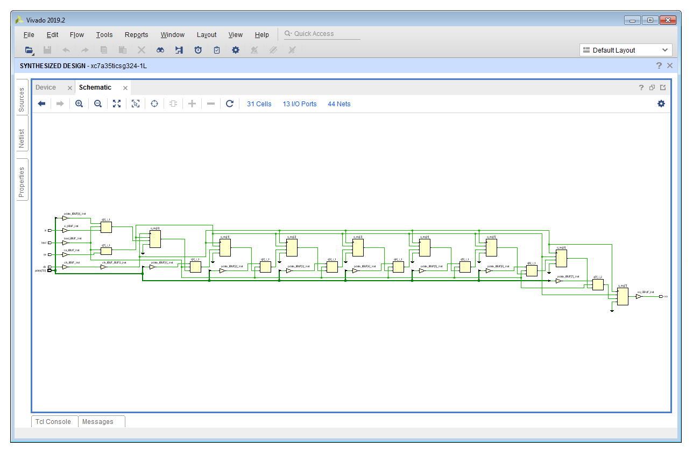

# Lab 10 Instructions
[[**Home**](https://github.com/lpacher/lae)] [[**Back**](https://github.com/lpacher/lae/tree/master/fpga/labs)]


## Contents

* [**Introduction**](#introduction)
* [**Lab aims**](#lab-aims)
* [**Navigate to the lab directory**](#navigate-to-the-lab-directory)
* [**Setting up the work area**](#setting-up-the-work-area)
* [**RTL coding**](#rtl-coding)
* [**Simulate the design**](#simulate-the-design)
* [**Synthesize the design**](#synthesize-the-design)
* [**Simulate a UART transmitter**](#simulate-a-uart-transmitter)

<br />
<!--------------------------------------------------------------------->


## Introduction
[**[Contents]**](#contents)

In this lab we implement and simulate a parameterizable **N-bit Parallel-In Parallel-Out (PISO) shift register** using Verilog HDL. <br />
We also introduce the **Universal Asynchronous Receiver/Transmitter (UART)** serial protocol.

<br />
<!--------------------------------------------------------------------->


## Lab aims
[**[Contents]**](#contents)

This lab should exercise the following concepts:

* learn how to implement a shift-register in Verilog
* understand the serial protocol  


<br />
<!--------------------------------------------------------------------->


## Navigate to the lab directory
[**[Contents]**](#contents)

Open a **terminal** window and change to the `lab10/` directory:

```
% cd Desktop/lae/fpga/labs/lab10
```

<br />

List the content of the directory:

```
% ls -l
% ls -la
```

<br />
<!--------------------------------------------------------------------->


## Setting up the work area
[**[Contents]**](#contents)

Copy from the `.solutions/` directory the main `Makefile` already prepared for you:

```
% cp .solutions/Makefile .
```

<br />

Create a new fresh working area:

```
% make area
```

<br />

Additionally, recursively copy from the `.solutions/` directory all **simulation and implementation scripts** as follows:

```
% cp -r .solutions/scripts/  .
```
<br />

>
> **NOTE**
>
> In this case we want to perform a **recursive copy**, do not forget to add the `-r` option. <br />
> The above `cp` command works fine under Windows also if you use back-slashes in the path.
>

<br />
<!--------------------------------------------------------------------->


## RTL coding
[**[Contents]**](#contents)

With your text editor application create a new Verilog file `rtl/PISO.v` and write the following RTL code:

```verilog
//
// Example parameterizable N-bit Parallel-In Serial-Out (PISO) shift register with
// positive-edge clock, asynchronous parallel load, serial-in, and serial-out.
//


`timescale 1ns / 100ps

module PISO #(parameter integer WIDTH = 8, parameter [WIDTH-1:0] INIT = {WIDTH{1'b0}} ) (

   input  wire clk, ce,                // clock and clock-enable
   input  wire si,                     // serial-in
   input  wire [WIDTH-1:0] pdata,      // N-bit parallel-data
   input  wire load,                   // load 1, shift 0
   output wire so                      // serial-out

   ) ;


   ///////////////////////////////
   //   N-bits shift register   //
   ///////////////////////////////

   (* srl_style = "register" *)
   reg [WIDTH-1:0] q = INIT ;          // this works on FPGA thanks to the Global Set/Reset (GSR) when firmware is downloaded !


   always @(posedge clk) begin

      // load mode
      if(load) begin
         q <= pdata ;
      end

      // shift-mode otherwise
      else if (ce) begin

         q[WIDTH-1:0] <= { q[WIDTH-2:0] , si } ;     // shift-left using concatenation

         // **NOTE: this is equivalent to :
         // q[0] <= SI ;
         // q[1] <= q[0] ;
         // q[2] <= q[1] ;
         // ...
         // ...
         // q[WIDTH-1] <= q[WIDTH-2] ;

      end   // if
   end   // always


/*

   // alternatively, you can also use a for-loop statement

   integer i ;

   always @(posedge clk) begin

      // load mode
      if(load) begin
         q <= pdata ;
      end

      // shift-mode otherwise
      else if (ce) begin

         q[0] <= si ;

         for(i = 0; i < WIDTH-1; i = i+1  ) begin

            q[i+1] <= q[i] ;

         end   // for
      end   // if
   end   // always

*/

   // assign the MSB to serial-out
   assign so = q[WIDTH-1] ;

endmodule
```

<br />

Save the source code once done. Compile the file to check for syntax errors:

```
% make compile hdl=rtl/PISO.v
```

<br />
<!--------------------------------------------------------------------->


## Simulate the design
[**[Contents]**](#contents)

Simulation sources have been already prepared for you, copy from the `.solutions/` directory the following **testbench sources**:

```
% cp .solutions/bench/glbl.v       bench/
% cp .solutions/bench/ClockGen.v   bench/
% cp .solutions/bench/tb_PISO.v    bench/
```

<br />

For less typing:

```
% cp .solutions/bench/*.v   bench/
```

<br />


Open with your text editor the `bench/tb_PISO.v` file and inspect the simulation code. Then compile, elaborate and simulate the design with:

```
% make compile
% make elaborate
% make simulate
```

<br />

For less typing this is equivalent to:

```
% make sim
```

<br />


Simulate with Xilinx XSim simulator the functionality of the shift-register with :

```
% make sim
```

<br />

>
> **QUESTION**
>
> In which order payload bits are sent out from the shift register ?  
>
>   \____________________________________________________________________________________________________
>

<br />
<!--------------------------------------------------------------------->


## Synthesize the design
[**[Contents]**](#contents)


Run the FPGA implementation flow up to synthesis in order to understand the inferred hardware. Simple **timing constraints** have
been already prepared for you and can be copied from the `.solutions/` directory as follows:

```
% cp .solutions/xdc/PISO_timing_only.xdc  xdc/
```

<br />

Import design sources and synthesize the design in _Non Project Mode_ with:

```
% make build/syn
```

<br />

Open the gate-level schematic and debug your synthesis results.

<br />



<br />

Inspect the **post-synthesis utilization report** at the command line:

```
% cat work/build/reports/post_syn_utilization.rpt
```

<br>

>
> **QUESTION**
>
> How many FlipFlops have been used to implement the shift register ? <br /><br />
>
>   \____________________________________________________________________________________________________
>

<br />
<!--------------------------------------------------------------------->


## Simulate a UART transmitter
[**[Contents]**](#contents)

`TODO`

