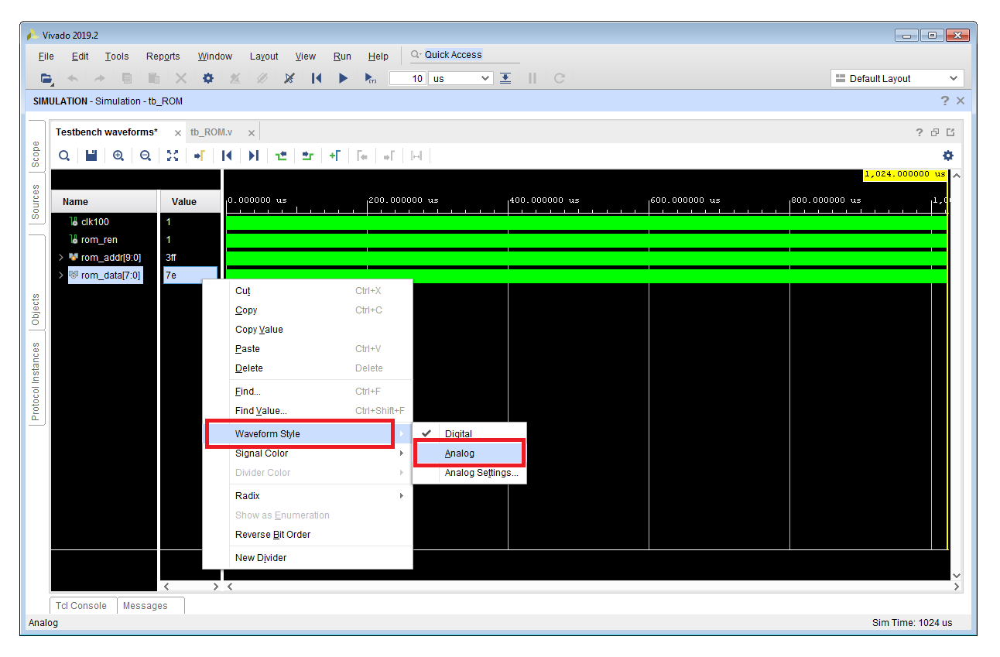

# Lab 11 Instructions
[[**Home**](https://github.com/lpacher/lae)] [[**Back**](https://github.com/lpacher/lae/tree/master/fpga/labs)]

## Contents

* [**Introduction**](#introduction)
* [**Lab aims**](#lab-aims)
* [**Navigate to the lab directory**](#navigate-to-the-lab-directory)
* [**Setting up the work area**](#setting-up-the-work-area)
* [**RTL coding**](#rtl-coding)
* [**Simulate the design**](#simulate-the-design)
* [**Synthesize the design**](#synthesize-the-design)
* [**Exercises**](#exercises)

<br />
<!--------------------------------------------------------------------->


## Introduction
[**[Contents]**](#contents)

In this lab we start discussing **dedicated FPGA memory circuits** and we implement a parameterizable **Read-Only Memory (ROM)**.

As an example, you can use this ROM to store a finite number (e.g. 1024) of **sampled sine values** in form of a Look-Up Table (LUT).
Each memory slot of the ROM contains a sine value with a certain precision (e.g. 8-bit, 12-bit, 16-bit etc.) and with some representation
(usually unsigned integer, but can be also interpreted as fixed-point real numbers). <br />
ROM sine values can be then used as input threshold values for a PWM counter such that the resulting variable duty-cycle PWM signal encodes
sine values variations. This PWM signal can be finally used as input signal for a low-pass filter (LPF) for analog waveform reconstruction
(can be also as simple as a low-pass RC filter followed by a voltage buffer).
This is the "digital" equivalent of feeding to an analog comparator (e.g. an OPAMP working in open-loop configuration) a lower-frequency
"reference" sine wave and a higher-frequency "carrier" sawtooth wave.

<br />
<!--------------------------------------------------------------------->


## Lab aims
[**[Contents]**](#contents)

This lab should exercise the following concepts:

* learn how to implement a ROM in Verilog HDL
* understand the difference between _packed_ and _unpacked_ arrays in Verilog
* identify FPGA resources available to infer dedicated memory
* introduce the usage of _synthesis pragmas_ directives
* compile a ROM using the Xilinx Vivado IP flow

<br />
<!--------------------------------------------------------------------->


## Navigate to the lab directory
[**[Contents]**](#contents)

Open a **terminal** window and change to the `lab11/` directory:

```
% cd Desktop/lae/fpga/labs/lab11
```

<br />

List the content of the directory:

```
% ls -l
% ls -la
```

<br />
<!--------------------------------------------------------------------->


## Setting up the work area
[**[Contents]**](#contents)

Copy from the `.solutions/` directory the main `Makefile` already prepared for you:

```
% cp .solutions/Makefile .
```

<br />

Create a new fresh working area:

```
% make area
```

<br />


Additionally, recursively copy from the `.solutions/` directory all **simulation and implementation scripts** as follows:

```
% cp -r .solutions/scripts/  .
```
<br />

>
> **NOTE**
>
> In this case we want to perform a **recursive copy**, do not forget add the `-r` option. <br />
> The above `cp` command works fine under Windows also if you use back-slashes in the path.
>

<br />
<!--------------------------------------------------------------------->


## RTL coding
[**[Contents]**](#contents)

Create the main ROM module `rtl/ROM.v` with the following content:

```verilog
//
// Example parameterized Read-Only Memory (ROM) in Verilog.
//


`timescale 1ns / 100ps

module ROM #(parameter integer WIDTH = 8, parameter integer DEPTH = 1024) (

   input  wire clk,
   input  wire ren,                        // read-enable
   input  wire [$clog2(DEPTH)-1:0] addr,   // address 0 to DEPTH-1 memory locations (10-bits for 1024 samples)
   output reg  [WIDTH-1:0] dout

   ) ;


   /////////////////////////
   //   ROM declaration   //
   /////////////////////////

   (* rom_style = "distributed" *)              // this is a first example of a SYNTHESIS PRAGMA, instruct the tool how to infer the ROM memory with LUTs or BRAMs
   reg [WIDTH-1:0] mem [0:DEPTH-1] ;


   ////////////////////
   //   read logic   //
   ////////////////////

   initial
      dout <= 'b0 ;   // initialize all FlipFlop outputs to zero at FPGA startup


   always @(posedge clk) begin
      if(ren)
         dout <= mem[addr] ;   // simply read the ROM word from address i-th

   end   // always


   ////////////////////////////
   //   ROM initialization   //
   ////////////////////////////

   initial begin

      // initialize the ROM using an external file...
      $readmemh("/path/to/Desktop/lae/fpga/labs/lab11/rtl/ROM_8x1024.hex", mem) ;

   end

endmodule
```

<br />

>
> **IMPORTANT !**
>
> Customize the path string specified in `$readmemh()` to locate the `ROM_8x1024.hex` file according to your machine!          <br />
> Moreover you **MUST** use the **forward slash** `/` as path separator, otherwise since the Verilog HDL is C-like a **back**  <br />
> **slash** character `\` in the path is interpreted as **_escape_** character.
>

<br />

Save the source code once done. Compile the file to check for syntax errors:

```
% make compile hdl=rtl/ROM.v
```

<br />

Copy from the `.solutions/` directory the following **ROM hex initialization file** already prepared for you
and containing 1024 **sine values** sampled with 8-bit resolution:

```
% cp .solutions/rtl/ROM_8x1024.hex  rtl/
```

<br />

>
> **NOTE**
>
> Sample sine values to be stored in the ROM can be generated using any kind of programming or scripting language (C/C++, Python, Perl etc.).
> Several on-line sine wave LUT generators exists indeed. Proposed 8-bit sampled values contained in `rtl/ROM_8x1024.hex` have been generated
> using [**this online sine-generator calculator**](https://daycounter.com/Calculators/Sine-Generator-Calculator.phtml).
>

<br />
<!--------------------------------------------------------------------->


## Simulate the design
[**[Contents]**](#contents)

Simulation sources have been already prepared for you, copy from the `.solutions/` directory the following **testbench sources**:

```
% cp .solutions/bench/glbl.v       bench/
% cp .solutions/bench/ClockGen.v   bench/
% cp .solutions/bench/tb_ROM.v     bench/
```

<br />

Additionally, copy also the `TickCounter.v` module used in the testbench code to generate the read-enable control for the memory:

```
% cp .solutions/rtl/TickCounter.v  rtl/
```

<br />

Inspect with a text-editor application the simple testbench code `bench/tb_ROM.v`, then compile, elaborate and simulate the design with

```
% make compile
% make elaborate
% make simulate
```

<br />

or simply type

```
% make sim
```

<br />

Right-click on the `rom_data[7:0]` signal and select **Waveform Style > Analog** to display ROM output words as a single integer
numbers instead of a digital bus:

<br />




<br />

Inspect and debug simulation results. Close the simulator graphical interface once happy.

<br />
<!--------------------------------------------------------------------->


## Synthesize the design
[**[Contents]**](#contents)

You might have noticed the usage of the following **non-Verilog syntax** in the RTL code before the ROM declaration:

```
(* rom_style = "distributed" *)
```

<br />
 
This is a first example of a so called **synthesis pragma**, also referred to as **sythesis attribute**.
Synthesis pragmas are tool-specific extra HDL statements (ignored
by the compiler when you run the simulation flow) to "guide" the synthesis tool in generating the desired hardware.
In this case the memory of the ROM can be implemented on real FPGA hardware either using **Look-Up Tables** available in
**Configurable Logic Blocks (CLBs)** or using dedicated **blocks of RAM (BRAMs)**.

Without additional information the synthesizer would choose to map the ROM into LUTs or BRAMs FPGA resources according to some heuristic
algorithm. However we can **force the synthesis tool** to implement the ROM using LUTs or BRAMs by adding the `rom_style` attribute
in the RTL code.

In order to demonstrate the effectiveness of this "pragma" we can run the FPGA implementation flow up to synthesis
and inspect synthesis results for both cases. Since the synthesis flow requires at least some bare minimum timing constraint
copy from the `.solutions/` directory the following XDC file already prepared for you:

```
% cp .solutions/xdc/ROM_timing_only.xdc  xdc/
% cat xdc/ROM_timing_only.xdc
```

<br />

Import design sources and synthesize the design in _Non Project Mode_ with:

```
% make build/syn
```

<br />


<br />

Open the gate-level schematic and debug your synthesis results. Close the Vivado graphical interface once done:

```
exit
```

<br />

Then update `rtl/ROM.v` and change the value of `rom_style` from `distributed` to `block` as follows:

```
(* rom_style = "block" *)
```

<br />

Save the source code once done and re-run the synthesis flow at the command line:

```
% make build/syn
```

<br />


<br />

Open the new gate-level schematic and debug your synthesis results. Close the Vivado graphical interface once done.


<br />
<!--------------------------------------------------------------------->


## Exercises
[**[Contents]**](#contents)

<br />

**EXERCISE 1**

Of course by increasing the resolution used in sampling sine values you improve the accuracy in generating a sine waveform starting from discrete
digital values. In the `.solutions/rtl/` directory you can find **three different ROM initialization files** corresponding to different resolutions
in sampling sine values, in particular **8-bit**, **12-bit**, **16-bit** resolutions:

```
% ls -l .solutions/rtl/  | grep hex
```

<br />

Copy from the `.solutions/` directory additional initialization files `ROM_12x1024.hex` and `ROM_16x1024.hex` into `rtl/` with:

```
% cp .solutions/rtl/ROM_12x1024.hex  rtl/
% cp .solutions/rtl/ROM_16x1024.hex  rtl/
```

<br />

Modify the default value of the `WIDTH` parameter in `rtl/ROM.v` and update the name of the `*.hex` file passed to the `$readmemh` Verilog task
and try to simulate additional 12-bit and 16-bit resolutions. Update also the value of the `ROM_WIDTH` macro in the testbench code `bench/tb_ROM.v`
accordingly.

<br />


**EXERCISE 2**

Xilinx Vivado offers the possibility to **compile ROMs as IP cores**. We can therefore replace our 8x1024
ROM with a compiled version from the **Vivado IP Catalog**.

<br/>

As its RTL counterpart, also the ROM compiled as IP core requires an initialization file, referred to as **coefficient file**.
This file has been already prepared for you and can be copied from the `.solutions/` directory as follows:

```
% cp .solutions/rtl/ROM_8x1024.coe rtl/
```

<br />

Inspect the Xilinx-specific syntax used to specify sampled sine values in the `.coe` file:

```
% cat rtl/ROM_8x1024.coe
```

<br />

Launch the **Vivado IP flow** in graphic mode with:

```
% make ip
```
<br/>

Select in the **IP Catalog** the **Distributed Memory Generator**
under _Memories & Storage Elements > RAMs & ROMs > Distributed Memory Generator_,
then right-click on **Distributed Memory Generator**  and select **Customize IP...**

<br/>

Create new ROM IP with the following configuration:


* Component Name: ROM_WIDTH16_DEPTH1024
* Depth: 1024
* Width: 8
* Memory Type: ROM
* Output Options: Registered + Single Port Output CE
* Coefficients file: `/path/to/lae/fpga/labs/lab11/rtl/ROM_8x1024.coe`

<br />


<br />

>
> **IMPORTANT !**
>
> Customize the path string to locate the `*.hex` file according to your machine!  <br />
>

<br />

Once done, left-click _OK_ and **generate all output products** (choose Out-of Context).
<br/>
<br/>

At the end of the flow verify that all IP sources are in place:

```
% ls -l cores/ROM_WIDTH8_DEPTH1024/
```

<br />

Inspect the **Verilog instantiation template** automatically generated for you by Vivado
in order to understand the port list of the IP that we are going to use in the HDL code:

```
% cat cores/ROM_WIDTH8_DEPTH1024/ROM_WIDTH8_DEPTH1024.veo
```

<br/>


<br />

Update the testbench code `bench/tb_ROM.v` in order to **instantiate the new ROM** as device under test
according to the Verilog instantiation template:


```verilog
//ROM   DUT (.clk(clk100), .ren(rom_ren), .addr(rom_addr), .dout(rom_data)) ;
ROM_WIDTH8_DEPTH1024  DUT  (.clk(clk100), .qspo_ce(rom_ren), .a(rom_addr), .qspo(rom_data) ) ;
```

<br/>

Save your changes and try to recompile and re-simulate the design from scratch:

```
% make clean
% make sim
```

<br />

**EXERCISE 3**

Write with your preferred programming language your own software routine to generate and record sampled sine values on a text file
and initialize the ROM.

