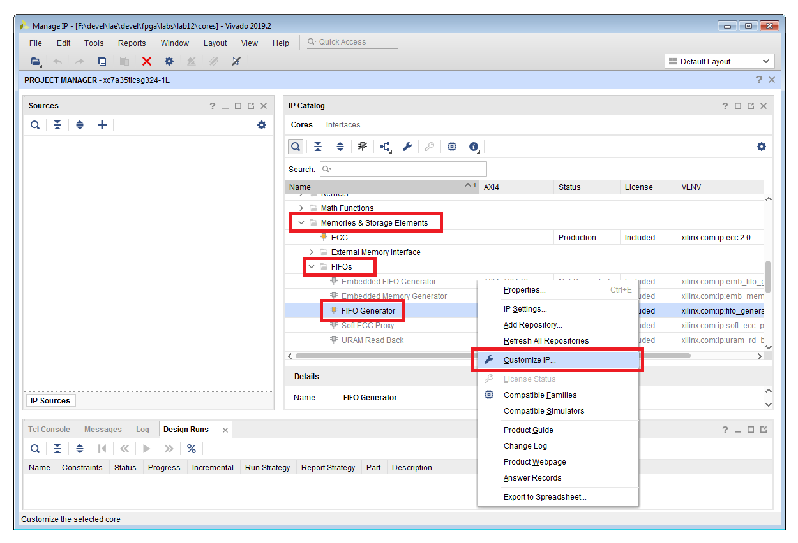
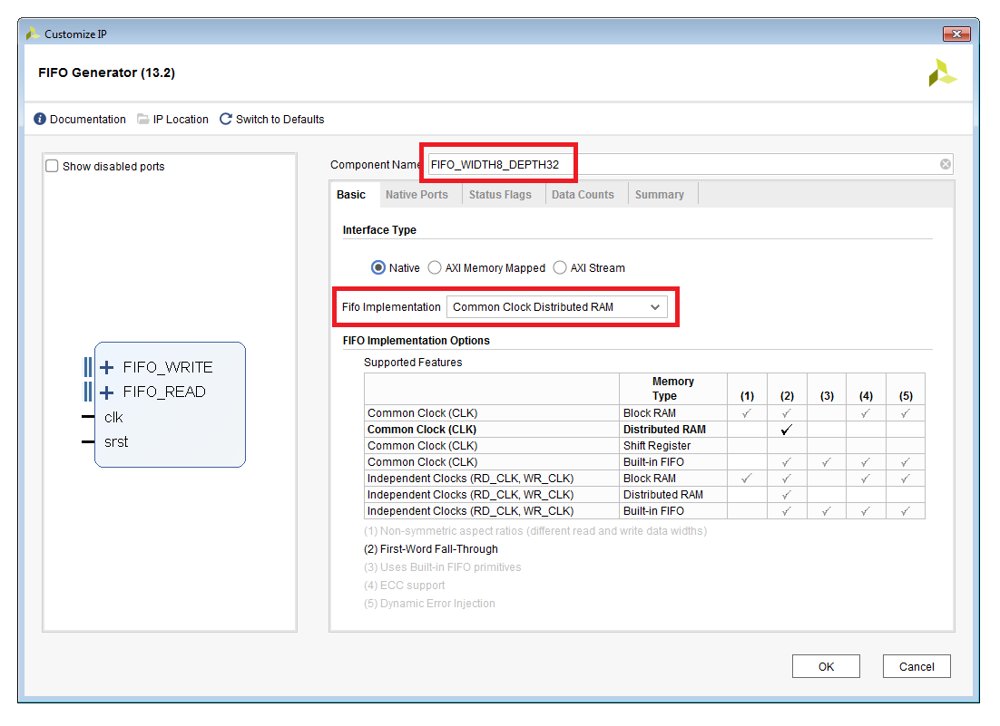
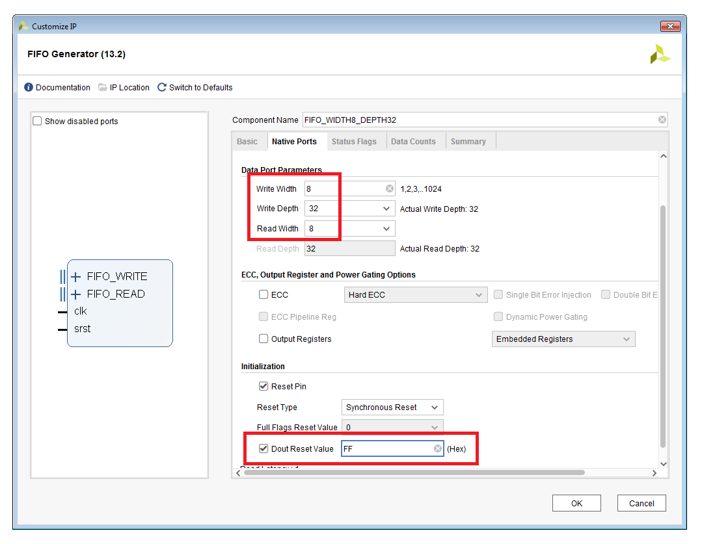
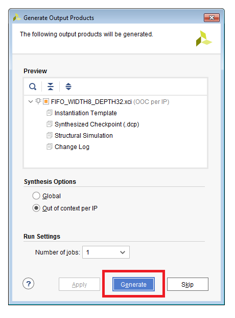
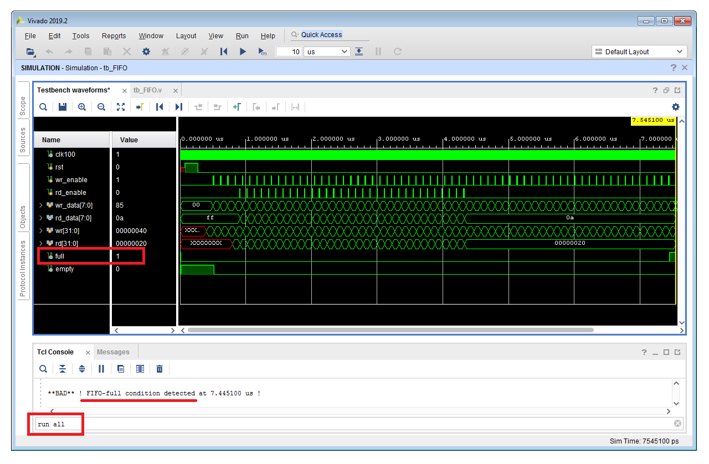
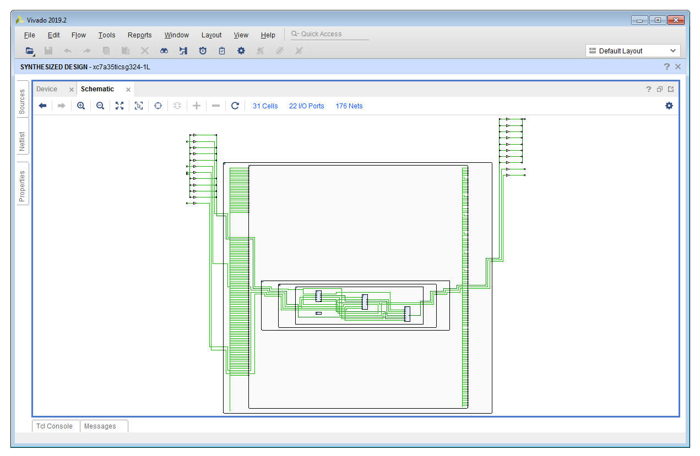

# Lab 12 Instructions
[[**Home**](https://github.com/lpacher/lae)] [[**Back**](https://github.com/lpacher/lae/tree/master/fpga/labs)]


## Contents

* [**Introduction**](#introduction)
* [**Lab aims**](#lab-aims)
* [**Navigate to the lab directory**](#navigate-to-the-lab-directory)
* [**Setting up the work area**](#setting-up-the-work-area)
* [**Compile the FIFO as IP core**](#compile-the-fifo-as-ip-core)
* [**Copy RTL and simulation sources**](#copy-rtl-and-simulation-sources)
* [**Simulate the design**](#simulate-the-design)
* [**Synthesize the design**](#synthesize-the-design)
* [**Further readings**](#further-readings)

<br />
<!--------------------------------------------------------------------->


## Introduction
[**[Contents]**](#contents)

In this lab we compile and simulate an **8-bit wide, 32-bit deep First-In First-Out (FIFO) memory** using the Xilinx Vivado IP flow.
Since the complexity of this digital block is a little bit higher than all previous blocks encountered through the course
we only implement the FIFO as IP core. The implementation of a parameterizable FIFO in RTL is left as an option for your final-project.

<br />
<!--------------------------------------------------------------------->


## Lab aims
[**[Contents]**](#contents)

This lab should exercise the following concepts:

* understand the working principle of a FIFO
* compile a FIFO using the Xilinx Vivado IP flow
* understand the difference between `$stop` and `$finish` Verilog simulation tasks

<br />
<!--------------------------------------------------------------------->


## Navigate to the lab directory
[**[Contents]**](#contents)

Open a **terminal** window and change to the `lab12/` directory:

```
% cd Desktop/lae/fpga/labs/lab12
```

<br />

List the content of the directory:

```
% ls -l
% ls -la
```

<br />
<!--------------------------------------------------------------------->


## Setting up the work area
[**[Contents]**](#contents)

Copy from the `.solutions/` directory the main `Makefile` already prepared for you:

```
% cp .solutions/Makefile .
```

<br />

Create a new fresh working area:

```
% make area
```

<br />


Additionally, recursively copy from the `.solutions/` directory all **simulation and implementation scripts** as follows:

```
% cp -r .solutions/scripts/  .
```
<br />

>
> **NOTE**
>
> In this case we want to perform a **recursive copy**, do not forget to add the `-r` option. <br />
> The above `cp` command works fine under Windows also if you use back-slashes in the path.
>

<br />
<!--------------------------------------------------------------------->


## Compile the FIFO as IP core
[**[Contents]**](#contents)

In order to **compile the FIFO** launch the **Vivado IP flow** at the command line with:

```
% make ip
```

<br />

Select in the **IP Catalog** the **FIFO Generator** available under *Memories & Storage Elements > FIFOs > FIFO Generator*.
Right click on **FIFO Generator** and select **Customize IP...**.

<br />



<br />

Create a new FIFO IP core with the following configuration:

* Component name: FIFO_WIDTH8_DEPTH32
* FIFO implementation: Common Clock Distributed RAM
* Write width: 8
* Write depth: 32
* Read width: 8
* Dout Reset Value: FF

<br />




<br />

Once done, left-click OK and generate all output products (choose Out-of Context).

<br />



<br />

Inspect source files automatically generated for you in the `cores/FIFO_WIDTH8_DEPTH32/` directory:

```
% ls -l cores/FIFO_WIDTH8_DEPTH32/
```

<br />

Inspect the **Verilog instantiation template** automatically generated for you by Vivado in order to
understand the port list of the IP that we are going to use in the HDL code:


```
% cat cores/FIFO_WIDTH8_DEPTH32/FIFO_WIDTH8_DEPTH32.veo
```

<br />

Close the Vivado graphical interface:

```
exit
```

<br />
<!--------------------------------------------------------------------->


## Copy RTL and simulation sources
[**[Contents]**](#contents)


Simulation sources and a simple Verilog **wrapper** for the newly generated FIFO have been already prepared for you.
Copy from the `.solutions/` directory the following HDL sources:

```
% cp .solutions/rtl/FIFO.v        rtl/
% cp .solutions/bench/glbl.v      bench/
% cp .solutions/bench/ClockGen.v  bench/
% cp .solutions/bench/tb_FIFO.v   bench/
```

<br />

Before running the simulation open with a text-editor application the Verilog testbench `bench/tb_FIFO.v` and inspect the
simulation code.

<br />
<!--------------------------------------------------------------------->


## Simulate the design
[**[Contents]**](#contents)


Compile, elaborate and simulate the design at the command line with:

```
% make compile
% make elaborate
% make simulate
```

<br />

For less typing, this is equivalent to:

```
% make sim
```

<br />

Inspect and debug the waveforms and verify the expected functionality for a FIFO memory.

<br />

>
> **NOTE**
>
>
> At a certain point **the FIFO goes full** and the simulation **pauses** due to the `$stop` Verilog task placed in the testbench code.<br />
> To continue the simulation until the end type
>
> ```
> run all
> ```
>
> in the XSim simulator Tcl console.
>
> 
>

<br />
<!--------------------------------------------------------------------->


## Synthesize the design
[**[Contents]**](#contents)

Run the FPGA implementation flow up to synthesis in order to understand the inferred hardware. Simple **timing constraints** have
been already prepared for you and can be copied from the `.solutions/` directory as follows:

```
% cp .solutions/xdc/FIFO_timing_only.xdc  xdc/
```

<br />

Import design sources and synthesize the design in _Non Project Mode_ with:

```
% make build/syn
```

<br />

Open the gate-level schematic and debug your synthesis results. In particular, **descend into IP design hierachy** and try to identify
the three major components of a FIFO: **write logic**, **read logic** and **central memory**.

<br />



<br />
<!--------------------------------------------------------------------->


## Further readings
[**[Contents]**](#contents)

If you are interested in more in-depth details about the Xilinx Vivado **FIFO Generator** you can refer to:

* [_FIFO Generator v13.2 LogiCORE IP Product Guide_](https://www.xilinx.com/support/documentation/ip_documentation/fifo_generator/v13_2/pg057-fifo-generator.pdf)

