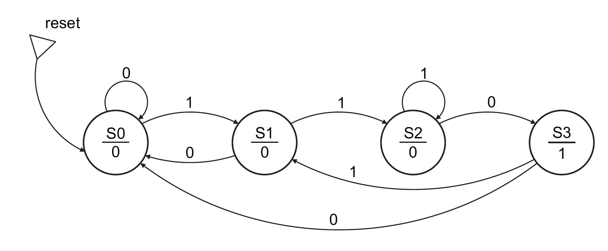

# Lab 13 Instructions
[[**Home**](https://github.com/lpacher/lae)] [[**Back**](https://github.com/lpacher/lae/tree/master/fpga/labs)]

## Contents

* [**Introduction**](#introduction)
* [**Lab aims**](#lab-aims)
* [**Navigate to the lab directory**](#navigate-to-the-lab-directory)
* [**Setting up the work area**](#setting-up-the-work-area)
* [**RTL coding**](#rtl-coding)
* [**Simulate the design**](#simulate-the-design)
* [**Alternative coding style for the Moore sequence detector**](#alternative-coding-style-for-the-moore-sequence-detector)
* [**Implement and simulate a UART transmitter using a FSM**](#implement-and-simulate-a-uart-transmitter-using-a-fsm)
* [**Synthesize the UART transmitter**](#synthesize-the-uart-transmitter)
* [**Exercises**](#exercises)

<br />
<!--------------------------------------------------------------------->


## Introduction
[**[Contents]**](#contents)

In this lab we implement a simple **sequence detector** using a **Moore Finite State Machine (FSM)** algorithm.
We also discuss **different Verilog coding styles** for this kind of digital blocks.

As a further example we implement a **UART transmitter** for **serial communication** using a state machine.
You will then reuse this module in the electronics lab in order to **send data from the FPGA board to a computer**.

<br />
<!--------------------------------------------------------------------->


## Lab aims
[**[Contents]**](#contents)

This lab should exercise the following concepts:

* review the concepts of Finite State Machine (FSM) and states transition diagram
* review the difference between Moore and Mealy state machines
* learn how to implement state machines in Verilog using different coding styles and states encoding
* implement and simulate a simple 110 sequence detector
* implement and simulate with a state machine a UART transmitter for serial communication between FPGA and a computer

<br />
<!--------------------------------------------------------------------->


## Navigate to the lab directory
[**[Contents]**](#contents)

Open a **terminal** window and change to the `lab13/` directory:

```
% cd Desktop/lae/fpga/labs/lab13
```

<br />

List the content of the directory:

```
% ls -l
% ls -la
```

<br />
<!--------------------------------------------------------------------->


## Setting up the work area
[**[Contents]**](#contents)

Copy from the `.solutions/` directory the main `Makefile` already prepared for you:

```
% cp .solutions/Makefile .
```

<br />

Create a new fresh working area:

```
% make area
```

<br />

Additionally, recursively copy from the `.solutions/` directory all **simulation and implementation scripts** as follows:

```
% cp -r .solutions/scripts/  .
```
<br />

>
> **NOTE**
>
> In this case we want to perform a **recursive copy**, do not forget to add the `-r` option. <br />
> The above `cp` command works fine under Windows also if you use back-slashes in the path.
>

<br />
<!--------------------------------------------------------------------->


## RTL coding
[**[Contents]**](#contents)

The proposed state machine is a `110` **sequence detector** coded as a **Moore machine**. The **states diagram** for this sequence <br />
detector is the following:

<br />



<br />

With your text editor application create a new Verilog `rtl/SequenceDetector.v` file with the following content:

```verilog
//
// Example Moore Finite State Machine (FSM) for 110 sequence detector.
//


`timescale 1ns / 100ps

module SequenceDetector (

   input  wire clk,
   input  wire reset,            // synchronous reset, active-high
   input  wire si,               // serial-in
   output wire detected          // single clock-pulse output asserted when 110 is detected

   ) ;


   ///////////////////////////
   //   states definition   //
   ///////////////////////////

   // here we choose to use a straight-binary states numbering, but you can choose other codes (e.g. Gray, one-hot, etc.)
   parameter [1:0] S0 = 2'b00 ;
   parameter [1:0] S1 = 2'b01 ;
   parameter [1:0] S2 = 2'b10 ;
   parameter [1:0] S3 = 2'b11 ;

   reg [1:0] STATE, STATE_NEXT ;


   /////////////////////////////////////////////////
   //   next-state logic (pure sequential part)   //
   /////////////////////////////////////////////////

   reg detected_comb ;

   always @(posedge clk) begin

      if(reset)
         STATE <= S0 ;

      else
         STATE <= STATE_NEXT ;

   end   // always


   ////////////////////////////
   //   combinational part   //
   ////////////////////////////

   always @(*) begin

      detected_comb = 1'b0 ;

      case ( STATE )

         default : S0 ;   // catch-all

         S0 : begin

            detected = 1'b0 ;

            if(si == 1'b1)
               STATE_NEXT = S1 ;
            else 
               STATE_NEXT = S0 ;

         end

         //_____________________________
         //

         S1 : begin

            detected_comb = 1'b0 ;

            if(si == 1'b1)
               STATE_NEXT = S2 ;
             else
               STATE_NEXT = S0 ;
         end

         //_____________________________
         //

         S2 : begin

            detected_comb = 1'b0 ;

            if(si == 1'b0)
               STATE_NEXT = S3 ;
            else
               STATE_NEXT = S2 ;
         end

         //_____________________________
         //

         S3 : begin

            detected_comb = 1'b1 ;   // sequence detected !

            if(si == 1'b1)
               STATE_NEXT = S1 ;
            else
               STATE_NEXT = S0 ;
         end

      endcase

   end   // always


   // just for reference, pre-place an OBUF primitive on output signal already in RTL
   OBUF  OBUF_inst (.I(detected_comb), .O(detected)) ;

endmodule
```

<br />

Save the source code once done. Compile the file to check for syntax errors:

```
% make compile hdl=rtl/SequenceDetector.v
```

<br />
<!--------------------------------------------------------------------->


## Simulate the design
[**[Contents]**](#contents)

Copy remaining RTL and simulation sources from the `.solutions/` directory as follows :

```
% cp .solutions/bench/glbl.v                  bench/
% cp .solutions/bench/ClockGen.v              bench/
% cp .solutions/bench/tb_SequenceDetector.v   bench/
```

<br />

Compile, elaborate and simulate the design with:

```
% make compile
% make elaborate
% make simulate
```

<br />

For less typing this is equivalent to:

```
% make sim
```

<br />

Inspect and debug the waveforms and verify if the FSM properly detects all `110` sequences in the serial input.

<br />
<!--------------------------------------------------------------------->


## Alternative FSM coding style for the Moore sequence detector
[**[Contents]**](#contents)


In the first example we split the sequential part of the FSM and the combinational part into two independent
`always` blocks.

Alternatively we can also implement the same functionality using a single `always` block as follows:

```verilog
always @(posedge clk) begin

   if(reset)
      STATE <= S0 ;

   else

      case ( STATE )

         default : S0 ;

         S0 : if(si) STATE <= S1 ; else STATE <= S0 ;
         S1 : if(si) STATE <= S2 ; else STATE <= S0 ;
         S2 : if(si) STATE <= S2 ; else STATE <= S3 ;
         S3 : if(si) STATE <= S1 ; else STATE <= S0 ;

      endcase

end   // always

assign detected = (STATE == S3) ? 1'b1 : 1'b0 ;
```

<br />
<!--------------------------------------------------------------------->


## Implement and simulate a UART transmitter using a FSM
[**[Contents]**](#contents)

In `lab10` we introduced the **serial protocol** and we started simulating a first example
of **UART transmitter** using a simple 8-bit Parallel-In Serial-Out (PISO) shift-register.

A more realistic implementation of this block would use a **circular state machine** to
serialize parallel data according to serial protocol specifications.
In this lab we provide a simplified and "naive" example of how you achieve this functionality in Verilog.

The proposed UART transmitter is a circular state machine with **13 states** defined as follows:

```verilog
parameter [3:0] IDLE  = 4'h0 ;
parameter [3:0] LOAD  = 4'h1 ;
parameter [3:0] START = 4'h2 ;
parameter [3:0] BIT0  = 4'h3 ;
parameter [3:0] BIT1  = 4'h4 ;
parameter [3:0] BIT2  = 4'h5 ;
parameter [3:0] BIT3  = 4'h6 ;
parameter [3:0] BIT4  = 4'h7 ;
parameter [3:0] BIT5  = 4'h8 ;
parameter [3:0] BIT6  = 4'h9 ;
parameter [3:0] BIT7  = 4'hA ;
parameter [3:0] STOP  = 4'hB ;
parameter [3:0] PAUSE = 4'hC ;   // optionally wait for another baud period before moving to IDLE

```

<br />

By default the state machine is in `IDLE` state and according to serial protocol the serial output `TxD` is high.

Whenever a `tx_start` is detected we move from `IDLE` into an intermediate "service" state `LOAD` that **latches**
8-bit transmission data `tx_data[7:0]` and waits for a first baud-rate "tick" while keeping the serial output `TxD` high. <br />

Once a baud-rate "tick" `tx_en` is detected we start the transaction according to serial protocol:

* at first we move from `LOAD` into the `START` state and we put the **start bit** to `1'b0`
* we then move through states `BIT0`, `BIT1`, ... , `BIT7` to send **payload data** 
* finally we move from state `BIT7` to `STOP` and we assert the **stop bit** to `1'b1`

<br />

Optionally we can include another "service" state `PAUSE` used to move from `STOP` back to `IDLE`. 

Apart from `IDLE` to `LOAD` all other states transitions occurs when a baud-rate "tick" `tx_en` is detected
in order to send out the bits according to serial protocol baud rate.

All RTL and simulation sources have been already prepared for you and can be copied from the `.solutions/` directory
as follows:

```
% cp .solutions/rtl/uart_tx_FSM.v       rtl/
% cp .solutions/rtl/TickCounter.v       rtl/
% cp .solutions/rtl/BaudGen.v           rtl/
% cp .solutions/bench/tb_uart_tx_FSM.v  bench/
```

<br />

Inspect with a text editor all sources. In order to simulate the design modify the `Makefile` and update
`RTL_TOP_MODULE`, `SIM_TOP_MODULE`, `RTL_VLOG_SOURCES` and `SIM_VLOG_SOURCES` variables as follows:

```
#RTL_TOP_MODULE := SequenceDetector
RTL_TOP_MODULE := uart_tx_FSM

#SIM_TOP_MODULE := tb_SequenceDetector
SIM_TOP_MODULE := tb_uart_tx_FSM

#RTL_VLOG_SOURCES := $(RTL_DIR)/SequenceDetector.v
RTL_VLOG_SOURCES := $(RTL_DIR)/uart_tx_FSM.v $(RTL_DIR)/TickCounter.v $(RTL_DIR)/BaudGen.v

#SIM_VLOG_SOURCES += $(SIM_DIR)/tb_SequenceDetector.v
SIM_VLOG_SOURCES += $(SIM_DIR)/tb_uart_tx_FSM.v
```

<br />

Save your changes once done and try to simulate the new design with:

```
% make sim
```

<br />

Debug your simulation results and try to recognize the serial protocol.

<br />
<!--------------------------------------------------------------------->


## Synthesize the UART transmitter
[**[Contents]**](#contents)

Run the FPGA implementation flow up to synthesis in order to understand the inferred hardware. Simple **timing constraints** have
been already prepared for you and can be copied from the `.solutions/` directory as follows:

```
% cp .solutions/xdc/uart_tx_FSM_timing_only.xdc  xdc/
```

<br />

Import design sources and synthesize the design in _Non Project Mode_ with:

```
% make build/syn
```

<br />

Open the gate-level schematic and debug your synthesis results.

<br />
<!--------------------------------------------------------------------->


## Exercises
[**[Contents]**](#contents)

<br />

**EXERCISES 1**

Choose a different encoding for FSM states. As an example you can decide to identify the four states by using a **4-bit one-hot code** <br />
as follows:

```verilog
parameter [3:0] S0 = 2'b0001 ;
parameter [3:0] S1 = 2'b0010 ;
parameter [3:0] S2 = 2'b0100 ;
parameter [3:0] S3 = 2'b1000 ;
```

<br />

Change the states definition in `rtl/SequenceDetector.v` and re-simulate the design from scratch
and verify that simulation results does not change.

<br />

**EXERCISE 2**

Modify the RTL code of the `110` sequence detector and transform it into a **Mealy machine** with the same functionality.

<br />

**EXERCISE 3**

In the proposed testbench the pseudo-random bit sequence is generated via software using the `$random` Verilog task.<br />
Modify the `bench/tb_SequenceDetector.v` in order to generate the pseudo-random bit sequence using a **Linear Feedback <br />
Shift Register (LFSR)** as already discussed in `lab9`.


