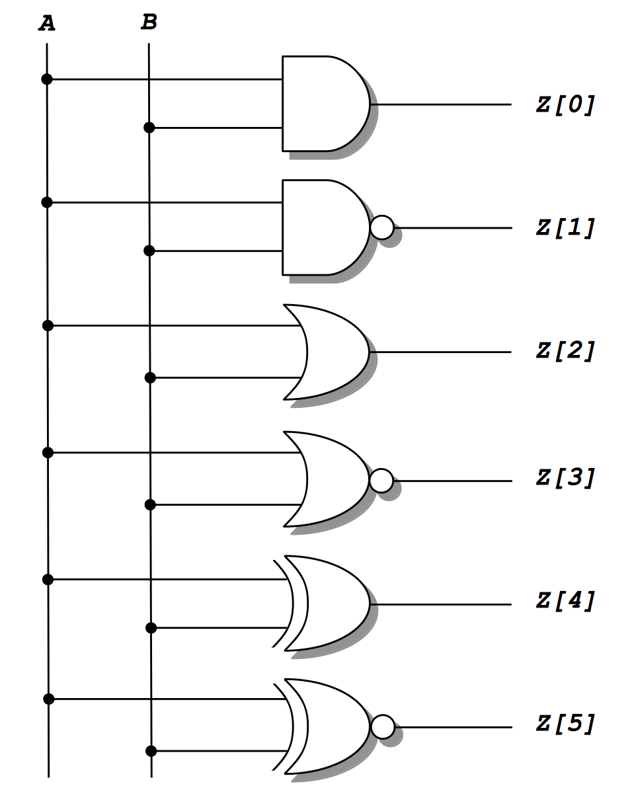

# Lab 2 Instructions
[[**Home**](https://github.com/lpacher/lae)] [[**Back**](https://github.com/lpacher/lae/tree/master/fpga/labs)]

## Contents

* [**Introduction**](#introduction)
* [**Lab aims**](#lab-aims)
* [**Navigate to the lab directory**](#navigate-to-the-lab-directory)
* [**Copy sources already prepared for you**](#copy-sources-already-prepared-for-you)
* [**Write and compile the DUT code**](#write-and-compile-the-dut-code)
* [**Simulate the design**](#simulate-the-design)
* [**Save and restore waveforms customizations**](#save-and-restore-waveforms-customizations)
* [**Exercises**](#exercises)

<br />
<!--------------------------------------------------------------------->


## Introduction
[**[Contents]**](#contents)

In this second lab we introduce basic **Verilog bitwise logic operators** to implement fundamental **logic gates**
such as AND, NAND, OR, NOR, XOR and XNOR. 

The digital circuit that we are going to describe and simulate in Verilog in is the following:

<br />



<br />

Later in the course we will also **implement and debug** the above circuit on **real FPGA hardware** mapping gates outputs to some
general-purpose LEDs available
on the [**Digilent Arty A7 development board**](https://store.digilentinc.com/arty-a7-artix-7-fpga-development-board-for-makers-and-hobbyists)
to verify the expected functionality of boolean operators.

<br />
<!--------------------------------------------------------------------->


## Lab aims
[**[Contents]**](#contents)

This lab should exercise the following concepts:

* introduce Verilog bitwise logic operators
* generate a clock waveform and a synchronous counter in Verilog
* customize the waveforms appearance in the Xilinx XSim simulator graphical user interface 
* save and restore simulation results and waveforms customizations
* force/release logic values on signals for debug purposes

<br />
<!--------------------------------------------------------------------->


## Navigate to the lab directory
[**[Contents]**](#contents) 

Open a **terminal** window and change to the `lab2/` directory:

```
% cd Desktop/lae/fpga/labs/lab2
```

<br />
<!--------------------------------------------------------------------->


## Copy sources already prepared for you
[**[Contents]**](#contents) 

For this lab **simulation scripts** and the main **testbench Verilog module** have been already prepared for you and can
can be copied using `cp` from the `.solutions/` directory:


```
% cp .solutions/Makefile .
% cp .solutions/run.tcl .
% cp .solutions/tb_Gates.v .
```

<br />

>
> **REMINDER**
>
> Do not forget the dot `.` to indicate that the **target destination directory** for the `cp` command
> is the current working directory.
>

<br />
<!--------------------------------------------------------------------->


## Write and compile the DUT code
[**[Contents]**](#contents) 

With a **text editor** application create a new file named `Gates.v`, for example:

```
% gedit Gates.v &   (for Linux users)
% n++ Gates.v       (for Windows users)
```

<br />

Try to **complete** the following **code-skeleton** and implement all 
basic logic operations using Verilog **continuous assignments**:


```verilog
//
// Implement basic logic gates in Verilog using continuous assignments.
//


`timescale 1ns / 100ps

module Gates (

   input  wire A,
   input  wire B,
   output wire [5:0] Z     // note that Z is declared as 6-bits width output BUS

   ) ;


   //
   // Available Verilog bit-wise logic operators are :
   // 
   // NOT  ~
   // AND  &
   // OR   |
   // XOR  ^
   //

   // AND
   assign Z[0] = A & B ;

   // NAND
   assign Z[1] = ... ;


   // OR
   ...


   // NOR
   ...


   // XOR
   ...


   // XNOR
   ...

endmodule
```

<br />


Once ready, try to **parse and compile** the code with the `xvlog` Verilog compiler:

```
% xvlog Gates.v
```

<br />

In case of **syntax errors**, fix the errors issued in the terminal and re-compile the source file
after saving your changes.

<br />
<!--------------------------------------------------------------------->


## Simulate the design
[**[Contents]**](#contents) 

In order to **simulate** the block we also need a **testbench module** to create a suitable **test pattern** for all gates.

In this case a simple **2-bits synchronous counter** can be used to easily generate **all possible input combinations**
`2'b00`, `2'b01`, `2'b10` and `2'b11` for `A` and `B` input ports.
Thus we will also learn how to generate a **clock waveform** and to implement a **counter** in Verilog.

The simulation code has been already prepared for you. Open the testbench module `tb_Gates.v` that you initially copied
from the `.solutions/` directory with you text editor:

```
% gedit tb_Gates.v &   (for Linux users)
% n++ tb_Gates.v       (for Windos users)
```

<br />

Inspect the provided testbench code:

```verilog
//
// Simple testbench to simulate basic logic gates with different implementations. 
//


`timescale 1ns / 100ps

module tb_Gates ;

   // 100 MHz clock generator
   reg clk = 1'b0 ;                 // note that we can also initialize a 'reg' to some initial value when declared

   always #5.0 clk = ~ clk ;        // simply "toggle" the clk value every 1/2 period

   // 2-bits counter
   reg [1:0] count = 2'b00 ;

   always @(posedge clk)
      count <= count + 1'b1 ;       // **WARN: be aware of the SIZE CASTING ! This is count[2:0] <= count[2:0] + 1'b1 !

   // device under test (DUT)
   wire [5:0] Z ;

   Gates DUT (.A(count[0]), .B(count[1]), .Z(Z)) ;

   // main stimulus
   initial
      #(4*25) $finish ;   // here we only need to choose the simulation time, e.g. 4x clock cycles

endmodule
```

<br />

Parse and compile also the testbench code:

```
% xvlog tb_Gates.v
```

<br />

Finally, **elaborate** the top-level module and **launch the simulation** with:

```
% xelab -debug all tb_Gates
% xsim -gui tb_Gates
```

<br />

>
> **REMINDER**
>
> The value to be passed as main argument to `xelab` and `xsim` executables is the **NAME** of the top-level module,
> **NOT the corresponding Verilog source file** ! The following command-line syntax is therefore **WRONG** and generates errors:
>
> ```
> % xelab -debug all tb_Gates.v
> % xsim -gui tb_Gates.v
> ```
> Do not call `xelab` or `xsim` targeting a `.v` file and **always pay attention to TAB completion on files !**
>

<br />

Add all testbench waveforms in the XSim **Wave Window** type in the **Tcl console** :

```
add_wave /*
```

Finally, run the simulation with :

```
run all
```

Debug your simulation results.


<br />

## Save and restore waveforms customizations
[**[Contents]**](#contents) 

You can **customize waveform names**, **colors**, the **radix of buses** etc. in the Wave window at any time.
As an example, **rename top-level signals** `count[0]`, `count[1]`, `Z[0]`, `Z[1]` etc. with more meaningful
names such as `A`, `B`, `AND`, `OR` etc. and **change the default radix** for the `count[1:0]` bus to **binary**.

After signals renaming you can **save your display customizations** into a **Waveform Configuration (WCFG)** XML file (`.wcfg`).
To save your customization either use the `save_wave_config` Tcl command:

```
save_wave_config ./tb_Gates.wcfg
```

or navigate through **File > Simulation Waveform > Save Configuration As**.

<br />

You can later **restore your custom display** settings with the Tcl command:

```
open_wave_config ./tb_Gates.wcfg
```

<br />

Close the simulator graphical interface when done.

<br />

You can also restore a waveform configuration using the `-view` command line switch when invoking the `xsim` executable at the command line:

```
% xsim -gui -tclbatch run.tcl -view tb_Gates.wcfg tb_Gates
```

<br />
<!--------------------------------------------------------------------->


## Restore a waveform database

```
xsim -gui -view tb_Gates.wcfg xsim/dir/tb_Gates.wdb
```

...


## Exercises
[**[Contents]**](#contents)

<br />

**EXERCISE 1**


Reset the simulation executable back to _t=0 ns_ and try to re-simulate the design by adding a **force/release** of an unknown logic
value `X` on the `A` input signal as follows:

```
restart
run 500 ns
add_force {/tb_Gates/A} X ;    ## this is short for add_force {/tb_Gates/A} -radix bin {1 0ns}
run 500 ns
remove_forces -all
run all
```
<br/>

Observe the output logic values generated by logic gates AND, NAND etc.

<br />

>
> **QUESTION**
>
> Is the result the expected one ? 
>
>   \____________________________________________________________________________________________________
>

<br />

The force/release of a logic constant is a useful **debug technique** for **troubleshooting waveforms** when
something is not properly working as expected in simulations. You can also write testbench stimuli
in Tcl with such a technique, but this choice is less popular than using a testbench written in Verilog or VHDL.

<br/>

Explore the command line help of the commands :

```
add_force -help
remove_force -help
```

<br />

**EXERCISE 2**

Instead of using logic operators we can also implement the functionality of each basic gate in terms of a **truth table**.<br/>
A Verilog `case` statement can be used for this purpose.

Create a new file e.g. `GatesCase.v` and try to **complete** the following **code skeleton**:

```Verilog
//
// Implement basic logic gates in terms of truth tables using 'case' statements.
//

`timescale 1ns / 100ps

module GatesCase (

   input  wire A
   input  wire B,
   output reg [5:0] Z     // **QUESTION: why Z is now declared as 'reg' instead of 'wire' ?

   ) ;

   // AND
   always @(*) begin

      case( {A,B} )        //  concatenation operator { , }, that's why Verilog uses begin/end instead of standard C/C++ brackets {}

         2'b00 :  Z[0] = 1'b0 ;
         2'b01 :  Z[0] = 1'b0 ;
         2'b10 :  Z[0] = 1'b0 ;
         2'b11 :  Z[0] = 1'b1 ;

      endcase
   end  // always


   // NAND
   ...

   // OR
   ...

   // NOR
   ...

   // XOR
   ....

   // XNOR
   ...

endmodule
```

<br />

We can simulate this new implementation using the same previous testbench code, just **replace the name of the module you want to test**
in the `tb_Gates.v` file:

```verilog
// device under test (DUT)

//Gates DUT (.A(count[0]), .B(count[1]), .Z(Z)) ;       **COMMENT** the previous DUT !
GatesCase DUT (.A(count[0]), .B(count[1]), .Z(Z)) ;

```

<br />

To speed up the simulation you can use the `Makefile` already prepared for you.
With a **text editor** update your `Makefile` to parse and compile `GatesCase.v` instead of `Gates.v` as follows:


```make
#SOURCES := Gates.v tb_Gates,v
SOURCES := GatesCase.v tb_Gates.v
```

<br />

Save your changes and re-run the simulation with:


```
% make clean
% make sim
```

<br />


**EXERCISE 3**

Create a new file e.g. `GatesPrimitives.v` and try implement all logic operators by instantiating
in the code Verilog **gates primitives** `and`, `nand`, `or`, `nor`, `xor` and `xnor`.


```Verilog
//
// Implement basic logic operators using Verilog gates primitives.
//


`timescale 1ns / 100ps

module GatesPrimitives (

   input  wire A
   input  wire B,
   output wire [5:0] Z     // **QUESTION: why Z is now declared back to 'wire' instead of 'reg' ?

   ) ;

   // AND
   and u0 (Z[0], A, B) ;

   // NAND
   nand u1 ( ... ) ;

   // OR
   ...

   // NOR
   ...

   // XOR
   ....

   // XNOR
   ...

endmodule
```

<br />


The above code is a first example of **structural HDL code**, resembling more a **gate-level schematic**.

Update the testbench code in order to instantiate the new `GatesPrimitives` module as device under test: 

```verilog
// device under test (DUT)

//Gates DUT (.A(count[0]), .B(count[1]), .Z(Z)) ;
//GatesCase DUT (.A(count[0]), .B(count[1]), .Z(Z)) ;
GatesPrimitives DUT (.A(count[0]), .B(count[1]), .Z(Z)) ;

```

<br />


Update also the `SOURCES` variable in your `Makefile` to parse and compile `GatesPrimitives.v` :


```make
SOURCES := GatesPrimitives.v tb_Gates.v
```

<br />

Save your changes and re-run the simulation with:


```
% make clean
% make sim
```

