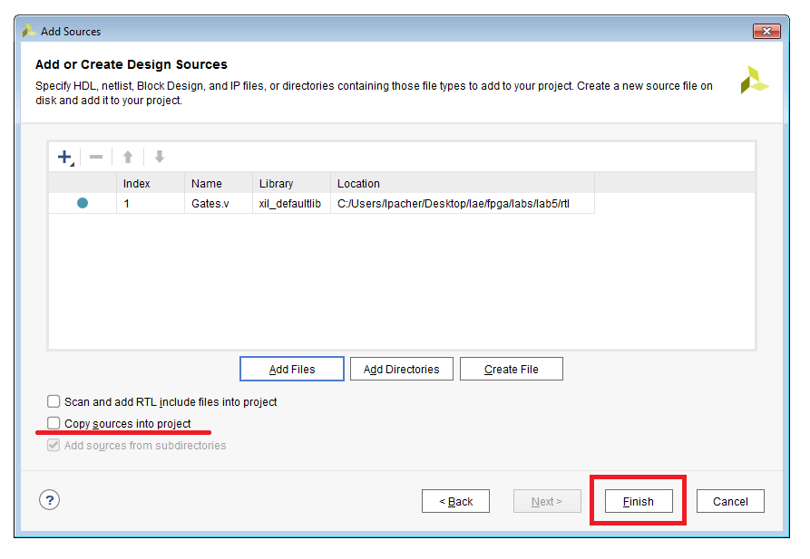

# Lab 5 Instructions
[[**Home**](https://github.com/lpacher/lae)] [[**Back**](https://github.com/lpacher/lae/tree/master/fpga/labs)]

## Contents

* [**Introduction**](#introduction)
* [**Lab aims**](#lab-aims)
* [**Navigate to the lab directory**](#navigate-to-the-lab-directory)
* [**Setting up the work area**](#setting-up-the-work-area)
* [**Prepare design sources**](#prepare-design-sources)
* [**Launch Vivado from the command line**](#launch-vivado-from-the-command-line)
* [**Create a new on-disk project in Vivado**](#create-a-new-on-disk-project-in-vivado)
* [**Simulate the design from Vivado**](#simulate-the-design-from-vivado)
* [**Run the physical implementation flow on target FPGA**](#run-the-physical-implemntation-flow-on-target-fpga)
   * [RTL elaboration](#rtl-analysis)
   * [Synthesis (mapping)](#synthesis-mapping)
   * [Placement](#placement)
   * [Routing](#routing)
   * [Bitstream generation](#bitsream-generation)
* [**Explore the Vivado journal file**](#explore-the-vivado-journal-file)
* [**Restore a design checkpoint**](#restore-a-design-checkpoint)
* [**Create a Vivado project from Tcl**](#create-a-vivado-project-from-tcl)
* [**Run the flow in Non Project mode**](#run-the-flow-in-non-project-mode)
* [**Further readings**](#further-readings)

<br />
<!--------------------------------------------------------------------->


## Introduction
[**[Contents]**](#contents)

In this lab we start discussing the **FPGA implementation flow** using Xilinx Vivado. For this purpose we create a simple **Vivado project**
in **graphical mode** to explore **GUI functionalities** and **FPGA implementation details**. We will then automate all flows at the command
line using Tcl scripts.

Our **target FPGA device** will be an **Artix-7** as the one mounted
on the [**Digilent Arty A7 development board**](https://store.digilentinc.com/arty-a7-artix-7-fpga-development-board-for-makers-and-hobbyists/)
used in practicum labs.


<br />
<!--------------------------------------------------------------------->


## Lab aims
[**[Contents]**](#contents)

This lab should exercise the following concepts:

* launch Xilinx Vivado from the command line
* understand the difference between Project Mode and Non Project Mode in Vivado
* create a new Vivado project in graphical mode attached to target FPGA device
* simulate a design from Vivado project
* introduce Xilinx Design Constraints (XDC)
* explore the physical layout of the FPGA chip
* understand all steps of the FPGA implementation flow (synthesis, placement, routing)
* generate the bitstream for firmware installation
* run a post-layout gate-level simulation with back-annotated net delays using SDF
* save and restore design checkpoints (DCP)
* generate a gate-level netlist of the implemented design
* automate the flow using Tcl scripts in Non Project Mode

<br />
<!--------------------------------------------------------------------->


## Navigate to the lab directory
[**[Contents]**](#contents)

Open a **terminal** window and change to the `lab5/` directory:

```
% cd Desktop/lae/fpga/labs/lab5
```

<br />
<!--------------------------------------------------------------------->


## Setting up the work area
[**[Contents]**](#contents)

Copy from the `.solutions/` directory the main `Makefile` already prepared for you:

```
% cp .solutions/Makefile .
```

<br />

Invoke the `help` target to list all available targets:

```
% make help
```

<br />

>
> **QUESTION**
>
> Which are new targets implemented in the `Makefile` ? <br /><br />
>
>   \____________________________________________________________________________________________________
>

<br />

Explore the content of the `Makefile` using `cat`, `more` or `less` at the command line or with a text editor as preferred:

```
% cat Makefile
```

<br />

To create a new fresh working area, type:

```
% make area
% ls -l
```

<br />
<!--------------------------------------------------------------------->


## Prepare design sources
[**[Contents]**](#contents)

For this lab we reuse the code already developed in `lab2` to implement and simulate **basic logic gates** in Verilog:

```
% cp .solutions/rtl/Gates.v       rtl/
% cp .solutions/bench/tb_Gates.v  bench/
```

<br />

In order to **"synthesize" the RTL code targeting real FPGA hardware** we also need to specify
the **mapping between top-level I/O ports and physical FPGA pins**, along with other **timing and electrical constraints**.
These information are specified in the so called **Xilinx Design Constraints (XDC)** script.

Copy from the `.solutions/` directory the following additional design sources already prepared for you:

```
% cp .solutions/xdc/arty_all.xdc   xdc/
% cp .solutions/xdc/Gates.xdc      xdc/
```

<br />
<!--------------------------------------------------------------------->


## Launch Vivado from the command line
[**[Contents]**](#contents)

As a first step verify that the `vivado` executable is properly found in the search path:

```
% which vivado
```

<br />

Explore all command-line switches and options for the `vivado` executable:

```
% vivado -help
```

<details>
<summary>Show output</summary>

```
Description:
Vivado v2019.2 (64-bit)
SW Build 2708876 on Wed Nov  6 21:40:23 MST 2019
IP Build 2700528 on Thu Nov  7 00:09:20 MST 2019
Copyright 1986-2019 Xilinx, Inc. All Rights Reserved.

Syntax:
vivado  [-mode <arg>] [-init] [-source <arg>] [-nojournal] [-appjournal]
        [-journal <arg>] [-nolog] [-applog] [-log <arg>] [-version]
        [-tclargs <arg>] [-tempDir <arg>] [-robot <arg>] [-verbose] [<project>]

Usage:
  Name           Description
  --------------------------
  [-mode]        Invocation mode, allowed values are 'gui', 'tcl', and
                 'batch'
                 Default: gui
  [-init]        Source vivado.tcl file
  [-source]      Source the specified Tcl file
  [-nojournal]   Do not create a journal file
  [-appjournal]  Open journal file in append mode
  [-journal]     Journal file name
                 Default: vivado.jou
  [-nolog]       Do not create a log file
  [-applog]      Open log file in append mode
  [-log]         Log file name
                 Default: vivado.log
  [-version]     Output version information and exit
  [-tclargs]     Arguments passed on to tcl argc argv
  [-tempDir]     Temporary directory name
  [-robot]       Robot JAR file name
  [-verbose]     Suspend message limits during command execution
  [<project>]    Load the specified project (.xpr) or design checkpoint
                 (.dcp) file

```

</details>

<br />

Launch Vivado in **graphical mode**. For Linux users:

```
% vivado -mode gui &
```

<br />

For Windows users:

```
% echo "exec vivado -mode gui &" | tclsh -norc 
```

<br/>

>
> **REMINDER**
>
> There is no Windows equivalent for the Linux `&` operator to **fork in background** the execution
> of a program invoked at the command line. Most of Windows programs launched from the _Command Prompt_
> by default already start in background leaving the shell alive (e.g. `notepad.exe` or `notepad++.exe`).
> Unfortunately this is not the case for `xsim` and `vivado` executables.
>
> In principle one can use the `start` command to launch Vivado in GUI mode from the _Command Prompt_ as follows:
>
> ```
> % start /b vivado -mode gui
> ```
>
> which is the closest solution to the `&` on Linux operating systems.
> However, in order to have a **portable flow between Linux and Windows** the proposed solution in the `Makefile`
> is to **forward** the execution of `vivado -mode gui` to `tclsh` using the Tcl command `exec` which accepts the usage of the `&` instead.
>

<br/>
<!--------------------------------------------------------------------->


## Create a new on-disk project in Vivado
[**[Contents]**](#contents)

Xilinx Vivado supports two different usage modes, namely **Project Mode** and **Non Project Mode**.
The difference is related to the overall **design management strategy** in terms of input design sources,
design runs and generation of output results. Both modes can be used through either the graphical interface
or using Tcl commands and batch scripts.

<br />

>
> **NOTE**
>
> The difference between _Project Mode_ and _Non Project Mode_ is **NOT related** to working **with or without the graphical user interface**!<br />
> You can always access GUI functionalities in both cases, what changes is the overall design management strategy.
>

<br />


When working in **_Project Mode_**, Vivado creates its own **working directory structure on disk**
in order to load design source files for the first time (either locally or remotely) and then to manage
**changes and updates** in case of modifications to source files.
Beside this, in _Project Mode_ Vivado automatically generates "under the hood" all necessary scripts to run
simulations and FPGA physical implementation flows (synthesis, placement, routing, bitstream generation). 
That is, in _Project Mode_ it's Vivado that manages all design flows and design data for you.
Each "task" performed in _Project Mode_ in the GUI has a **Tcl equivalent command** indeed. Thus a _Project Mode_ design
can be also **fully scripted** using specific _Project Mode_ Tcl commands.

On the contrary, when working in **_Non Project Mode_** all aspects of the design flow are **up to the user**.
That is, it's up to you to manage input design files, trace modifications, run the flows and explicitly generate all output results.
With this alternative approach **everything is done through Tcl commands** and all flows runs **in-memory** without
creating a directory structure on the disk. You can save design checkpoints and create reports at any stage of the design process.
Each implementation step can be tailored to meet specific design challenges, and you can
analyze results after each design step. In addition, you can open the Vivado GUI at any point
for design analysis and constraints assignment.

As a matter of fact the _Non Project Mode_ is more similar to **ASIC digital implementation flows**
using industry-standard CAD tools from the biggest EDA software houses _Cadence_, _Mentor_ and _Synopsys_.

<br />

|      **Flow Element**       |        **Project Mode**        |       **Non Project Mode**       |
|:---------------------------:|:------------------------------:|:--------------------------------:|
|        management           |       automatic                |              manual              |
| flow navigation             |        guided                  |              manual              |
| flow customizations         | limited (through Tcl commands) | unlimited (through Tcl commands) |
| reporting                   |           automatic            |              manual              |
| analysis stages             | automatic design checkpoints generation  |  manual design checkpoints generation  |

<br />

>
> **IMPORTANT !**
>
> Both _Project Mode_ and _Non Project Mode_ use flow-specific **Tcl commands**, however _Project Mode_ Tcl commands are different from
> _Non Project Mode_ Tcl commands. In particular _Project Mode_ Tcl commands are "super commands" which at the end call low-level
> _Non Project Mode_ Tcl commands, but **you CANNOT MIX Tcl commands** between _Project Mode_ and _Non Project Mode_ indeed!
>

<br />

In the following we start exploring how to use Vivado in _Project Mode_, then we will automate the FPGA implementation
flow through Tcl scripts working in _Non Project Mode_.


<br />
<br />

**NEW PROJECT WIZARD**

To create a new project in Vivado, left click on **Create Project** in the _Quick Start_ section or through **File > Project > New ..**.


<br />

This will launch the **New Project** wizard. Left click on **Next** to enter into project setup.


<br />

As a first step we have to specify a **name for the project** (e.g. `Gates`) along with a **target directory**.
Since in _Project Mode_ Vivado generates its own directory tree we use the `work` directory for this, putting
everything into a `work/Gates` subdirectory.

Left click on **Next** when done.


<br />

Next we have to specify the project type. Apart from special cases usually you deal with **RTL projects**.
You can also decide to import HDL sources already during the project creation, however we will add sources
to the project later. Left click on **Next** when done.


<br />

Finally we have to specify the **target FPGA device**. In order to map the RTL code on the
[**Digilent Arty A7 development board**](https://store.digilentinc.com/arty-a7-artix-7-fpga-development-board-for-makers-and-hobbyists/)
select the device named **xc7a35ticsg324-1L** as follows:

* _Family_: **Artix 7**
* _Package_: **csg324**
* _Speed_: **-1L**

Left click on **Next** when done.

<br />


<br />

The _New Project_ wizard ends with a short summary of the project setup. Left click on **Finish** to **initialize the project**. 


<br />


<br />

After project initialization the main **Vivado IDE** should appear. Explore yourself most important components of the
graphical interface.

<br />


<br />

You can also notice that Vivado **automatically traces for you all Tcl commands** in the **Tcl console**.
As an example, all "clicks and selections" performed in the _New Project_ wizard reduce to a single `create_project`
Tcl command as follows:

```
create_project Gates /path/to/lae/fpga/labs/lab5/work/Gates -part xc7a35ticsg3241L
```

<br />

For each Tcl command you can invoke the **command help** with `-help`:

```
create_project -help
```

<br />

Query the name of the project in the Tcl console with the following command:

```
puts [current_project]
```

<br />

Switch back to the terminal window and explore the new directory tree that Vivado automatically created
for you to manage all flow steps in _Project Mode_:

```
% ls -l work/Gates
```

<br />

Explore the content of the main Vivado **project file** (.xpr):

```
% cat work/Gates/Gates.xpr
```

<br /><br />


**ADD DESIGN SOURCES**

Left clock on **AddSources** in the **Flow Navigator** to specify RTL sources for the project. <br />
Add the `rtl/Gates.v` Verilog file to the project.

<br />




<br />

>
> **NOTE**
>
> Apart from creating new sources from scratch within Vivado, when working in _Project Mode_ you can decide to **copy existing sources**
> into the project (`import_files` command) or simply to "point" to external files from another location (`add_files` command).
> When you choose to copy sources into the project Vivado puts them in the `*.srcs` directory of the project.
>

<br />


<br />

Inspect in the Tcl console the Tcl commands that Vivado used to perform this operation:

```
add_files -norecurse /path/to/lae/fpga/labs/lab5/rtl/Gates.v
update_compile_order fileset sources_1
```


<br />

>
> **QUESTION**
>
> Execute the following command in the Tcl console:
>
> ```
> get_filesets
>```
>
> Which are default file-sets already created by Vivado for you? <br /><br />
>
>   \____________________________________________________________________________________________________
>

<br />

<br />

**ADD SIMULATION SOURCES**

Left click on **Add Sources** in the **Flow Navigator** and repeat yourself the flow in order
to add the Verilog testbench `bench/tb_Gates.v` to simulation sources.


<br />

Inspect in the Tcl console the Tcl commands that Vivado used to perform this operation:

```
add_files -fileset sim_1 -norecurse /path/to/lae/fpga/labs/lab5/bench/tb_Gates.v
update_compile_order -fileset sim_1
```


<br />
<!--------------------------------------------------------------------->


## Simulate the design from Vivado
[**[Contents]**](#contents)

Left click on **Run Simulation > Run Behavioral Simulation** in the **Flow navigator** to simulate the RTL design using XSim from Vivado.


<br />

Explore the command help for the `launch_simulation` Tcl "super command" as follows:

```
launch_simulation -help
```

<br />

By invoking a single-click compilation/elaboration/simulation in the GUI Vivado automatically creates `compile.sh (.bat)`, `elaborate.sh (.bat)`
and `simulate.sh (.bat)` scripts for you into the `*.sim` directory of the project:

```
% ls -l work/Gates.sim/sim_1/behav/xsim
```

<br />

Explore the content of these automatically-generated scripts. For Linux users:

```
% cat work/Gates.sim/sim_1/behav/xsim/compile.sh
% cat work/Gates.sim/sim_1/behav/xsim/elaborate.sh
% cat work/Gates.sim/sim_1/behav/xsim/simulate.sh
```

<br />

For Windows users:

```
% cat work/Gates.sim/sim_1/behav/xsim/compile.bat
% cat work/Gates.sim/sim_1/behav/xsim/elaborate.bat
% cat work/Gates.sim/sim_1/behav/xsim/simulate.bat
```

<br />

The proposed custom simulation flow that you started using since `lab3` is just a port in Tcl (with extensions and customizations)
of scripts automatically generated by Vivado when running HDL simulations is _Project Mode_.

<br />
<!--------------------------------------------------------------------->


## Run the physical implementation flow on target FPGA
[**[Contents]**](#contents)

Try to run yourself **all steps of the FPGA implementation flow** through the **Flow Navigator** on the left side of the Vivado IDE:

* generic synthesis (RTL elaboration)
* mapped synthesis
* place-and-route (implementation)
* bitstream generation

For each step of the flow inspect output results and Tcl commands automatically tracked for you in the Tcl console.

<br />
<!--------------------------------------------------------------------->


## Explore the Vivado journal file
[**[Contents]**](#contents)

For each "click" performed in the Vivado graphical interface there is an **equivalent Tcl command**.
By default Vivado already keeps track of all these commands for you in the so called **journal file** (`.jou`).

If no additional `-journal` option is used to specify the name of the journal file when invoking `vivado`,
the default `vivado.jou` is created in the directory where `vivado` is executed.

Explore the syntax of Tcl command collected in the journal file :

```
% cat vivado.jou
```
<br/>

You can also easily **reproduce the entire flow** at any time by executing the journal file with the `-source` option when invoking `vivado`<br/>
at the command line (save the original journal file as `vivado.tcl` before, otherwise the file will be overwritten) :

```
% mv vivado.jou vivado.tcl
% vivado [-mode gui|tcl|batch] -source vivado.tcl
```
<br/>

This is a good starting point to understand how to **automate the FPGA implementation flow** in Xilinx Vivado
using either a **project mode** or a **non-project mode** Tcl script.

<br/>
<!--------------------------------------------------------------------->


## Create a Vivado project from Tcl
[**[Contents]**](#contents)


All selections done in the **New Project wizard** graphical interface to create a new project
targeting a certain project directory and attached to a specific FPGA device have the following
single **Tcl equivalent command** :

```
create_project -part <target device> <project name> <project directory>
```
<br/>

Since creating a project as well as loading sources and design constraints into the project are repetitive tasks
we can **collect Tcl statements into a script** and automatically execute the script at Vivado startup from `Makefile`
as follows :


```
% make project [mode=gui]
```
<br/>

You can also **initialize the project in Tcl mode** (faster) and **later open the Vivado graphical interface**
with the `start_gui` command :

```
% make project mode=tcl

****** Vivado v2019.2 (64-bit)
  **** SW Build 2708876 on Wed Nov  6 21:40:23 MST 2019
  **** IP Build 2700528 on Thu Nov  7 00:09:20 MST 2019
    ** Copyright 1986-2019 Xilinx, Inc. All Rights Reserved.

 ...
 ...

Vivado% start_gui
```
<br/>

Explore the content of the `scripts/common/project.tcl` script already prepared for you :

```
% more scripts/common/project.tcl
```

<br/>
<!--------------------------------------------------------------------->


## Run the flow in Non Project mode
[**[Contents]**](#contents)

Try to run the FPGA implementation flow using a **Non Project mode Tcl flow** as follows:

```
% make clean
% make build mode=tcl  (by default mode=gui)
```

<br />

Explore the content of the `scripts/impl/build.tcl` script already prepared for you:

```
% more scripts/build/build.tcl
```

<br />
<!--------------------------------------------------------------------->


## Further readings
[**[Contents]**](#contents)

Fore more details about Vivado usage modes and flows refer to Xilinx official documentation:

* [_Vivado Design Suite User Guide: Getting Started (UG910)_](
https://www.xilinx.com/support/documentation/sw_manuals/xilinx2019_2/ug910-vivado-getting-started.pdf)
* [_Vivado Design Suite User Guide: Design Flows Overview (UG892)_](
https://www.xilinx.com/support/documentation/sw_manuals/xilinx2019_2/ug892-vivado-design-flows-overview.pdf)

<br />

