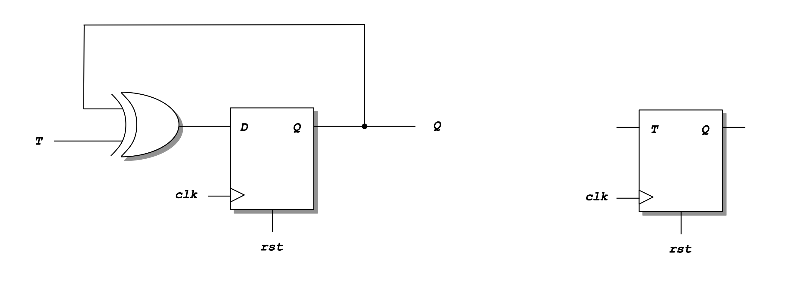
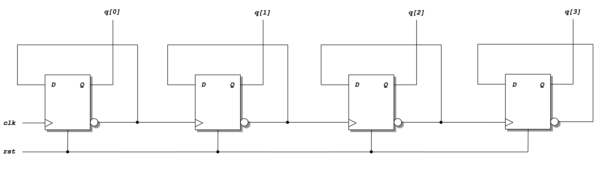
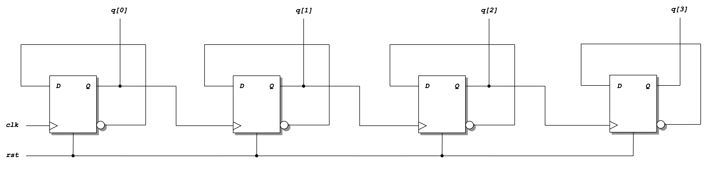
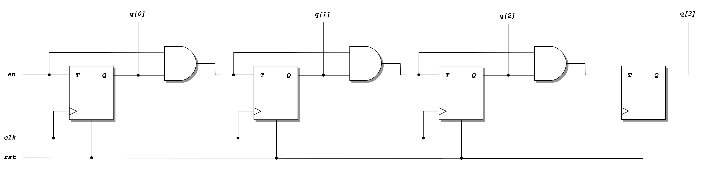
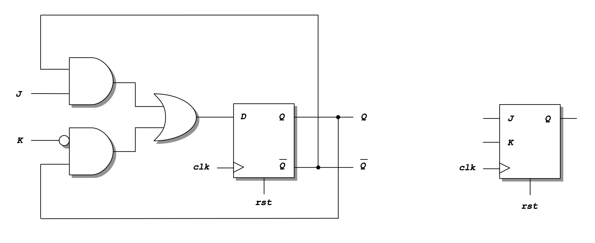

# Lab 6 Instructions
[[**Home**](https://github.com/lpacher/lae)] [[**Back**](https://github.com/lpacher/lae/tree/master/fpga/labs)]


## Contents

* [**Introduction**](#introduction)
* [**Lab aims**](#lab-aims)
* [**Navigate to the lab directory**](#navigate-to-the-lab-directory)
* [**Setting up the work area**](#setting-up-the-work-area)
* [**Copy simulation scripts**](#copy-simulation-scripts)
* [**RTL coding**](#rtl-coding)
* [**Simulate the design**](#simulate-the-design)
* [**Exercise**](#exercise)

<br />
<!--------------------------------------------------------------------->


## Introduction
[**[Contents]**](#contents)

In this lab we start to implement and simulate **basic sequential circuits** such as **latches** and **FlipFlops** in Verilog.

<br />
<!--------------------------------------------------------------------->


## Lab aims
[**[Contents]**](#contents)

This lab should exercise the following concepts:

* describe and simulate basic sequential elements such as latches and FlipFlops in Verilog
* understand the difference between synchronous and asynchronous reset
* instantiate and simulate Xilinx FPGA device primitives in the HDL code

<br />
<!--------------------------------------------------------------------->


## Navigate to the lab directory
[**[Contents]**](#contents)

Open a **terminal** window and change to the `lab6/` directory:

```
% cd Desktop/lae/fpga/labs/lab6
```

<br />
<!--------------------------------------------------------------------->


## Setting up the work area
[**[Contents]**](#contents)

Copy from the `.solutions/` directory the main `Makefile` already prepared for you:

```
% cp .solutions/Makefile .
```

<br />

Explore available targets:

```
% make help
```

<br />

To create a new fresh working area, type:

```
% make area
```


<br />
<!--------------------------------------------------------------------->


## Copy simulation scripts
[**[Contents]**](#contents)

Copy from the `.solutions/` directory all **Tcl simulation scripts** already prepared for you:

```
% cp .solutions/scripts/sim/compile.tcl    scripts/sim/
% cp .solutions/scripts/sim/elaborate.tcl  scripts/sim/
% cp .solutions/scripts/sim/simulate.tcl   scripts/sim/
% cp .solutions/scripts/sim/probe.tcl      scripts/sim/
% cp .solutions/scripts/sim/run.tcl        scripts/sim/
% cp .solutions/scripts/sim/relaunch.tcl   scripts/sim/
```

<br />

For less typing, you can also use the **wildcard character** `*` as follows:

```
% cp .solutions/scripts/sim/*.tcl   scripts/sim/
```

<br />

> **REMINDER**
>
> If you want to use the asterisk `*` as **wildcard** for `cp` on Windows, please be aware that the `cp.exe` executable
> that comes with the _GNU Win_ package works properly **only using forward slashes** `/` **in the path!**
>
> ```
> % cp .solutions/scripts/sim/*.tcl   scripts/sim/
> ```
>
> If you use the **TAB completion** on Windows the path is completed using **back slashes** `\` but the resulting command **DOESN'T WORK and generates an error**
> because back-slashes `\` are interpreted as **escape characters** by `cp.exe`:
>
> ```
> % cp .solutions\scripts\sim\*.tcl   scripts\sim\
>
> cp: cannot stat '.solutionsscriptssim*.tcl' : No such file or directory
> ```
>
> You can use the native `copy` **DOS command** instead:
>
> ```
> % copy .solutions\scripts\sim\*.tcl   scripts\sim\
> ```
>

<br />

Verify that all required scripts are in place:

```
% ls -l scripts/sim/
```

<br/>


## RTL coding
[**[Contents]**](#contents)


With your **text editor** application create a first new Verilog file `rtl/DLATCH.v` and write the RTL code for a **D-latch** as follows:


```verilog
//
// Verilog code for a simple D-latch.
//


`timescale 1ns / 100ps

module DLATCH (

   input  wire D, EN,
   output reg Q

   ) ;


   always @(D,EN) begin

      if (EN) begin
         Q <= D ;
      end
      //else begin        // **IMPORTANT: if you don't specify the 'else' condition the tool automatically INFERS **MEMORY** for you!
      //   Q <= Q ;
      //end

   end  // always

endmodule
```

<br />

Create also a second Verilog file `rtl/DFF.v` and write the RTL code for a **D-FlipFlop**:

```verilog
//
// Verilog code for a simple D-FlipFlop
//

`timescale 1ns / 100ps

module DFF (

   input  wire clk,        // clock
   input  wire rst,        // reset, active-high (then can be synchronous or asynchronous)
   input  wire D,
   output reg Q

   ) ;


   always @(posedge clk) begin                          // synchronous reset
   //always @(posedge clk or posedge rst) begin      // asynchronous reset

      if (rst) begin      // same as if (rst == 1'b1)
         Q <= 1'b0 ;
      end
      else begin
         Q <= D ;
      end
   end  // always

endmodule
```

<br />
<!--------------------------------------------------------------------->


## Simulate the design
[**[Contents]**](#contents)

We can easily simulate the proper functionality of a D-FlipFlop by generating a **random bit sequence** fed to the `D` input
of the FlipFlop. Copy from the `.solutions/` directory the following **simulation sources** already prepared for you:

```
% cp .solutions/bench/glbl.v      ./bench/
% cp .solutions/bench/ClockGen.v  ./bench/
% cp .solutions/bench/tb_DFF.v    ./bench/
```

<br />

Open the main testbench file `bench/tb_DFF.v` with your text editor and inspect the following code:

```verilog
//
// Example testbench module for a simple D-FlipFlop.
//


`timescale 1ns / 100ps

module tb_DFF ;

   /////////////////////////
   //   clock generator   //
   /////////////////////////

   wire clk, clk_buf ;

   ClockGen  #(.PERIOD(100.0)) ClockGen_inst (.clk(clk) ) ;   // override default period as module parameter (default is 50.0 ns)


   ////////////////////////////////////////////////
   //   example Xilinx primitive instantiation   //
   ////////////////////////////////////////////////

   IBUF IBUF_inst ( .I(clk), .O(clk_buf) ) ;


   ///////////////////////////
   //   device under test   //
   ///////////////////////////

   reg D = 1'b1 ;
   reg rst = 1'b1 ;

   wire Q ;

   DFF DUT (.clk(clk_buf), .rst(rst), .D(D), .Q(Q) ) ;


   //////////////////
   //   stimulus   //
   //////////////////

   // use the $random Verilog task to generate a random input pattern
   always #(20.0) D = $random ;             // **WARN: $random returns a 32-bit integer ! Here there is an implicit TYPE CASTING

   initial begin

      #100  rst = 1'b0 ;   // release the reset signal
      #1500 rst = 1'b1 ;

      #300 $finish ;   // stop the simulation
   end

endmodule
```

<br />

In particular, observe in the code the usage of a `IBUF` FPGA device primitive. This is a first example of how you can
include and simulate Xilinx device primitives in your HDL code.

Simulate with Xilinx XSim simulator the functionality of the D-FlipFlop from the command line with:

```
% make compile
% make elaborate
% make simulate
```

<br />

For less typing, this is equivalent to:

```
% make sim
```

<br />

Verify the difference between **synchronous** and **asynchronous reset** by changing these lines of code

```verilog
always @(posedge clk) begin                         // synchronous reset
//always @(posedge clk or posedge reset) begin      // asynchronous reset
```

into

```verilog
//always @(posedge clk) begin                     // synchronous reset
always @(posedge clk or posedge reset) begin      // asynchronous reset
```
<br />

In order to **relaunch the simulation** after changes **without closing the XSim graphical interface** simply type

```
relaunch
```

<br />

in the XSim **Tcl console**. Debug simulation results in the XSim graphical interface. Close the simulator once happy.

<br />
<!--------------------------------------------------------------------->


## Exercise
[**[Contents]**](#contents)

Create a suitable testbench `bench/tb_DLATCH.v` to **simulate and verify also the functionality of the D-latch**.
Update also the values of `RTL_TOP_MODULE`, `SIM_TOP_MODULE`, `RTL_VLOG_SOURCES` and `SIM_VLOG_SOURCES` variables
in the `Makefile` in order to simulate the second sequential block:

```
RTL_TOP_MODULE := DLATCH
SIM_TOP_MODULE := tb_DLATCH

...
...

RTL_VLOG_SOURCES := $(RTL_DIR)/DLATCH.v
SIM_VLOG_SOURCES := $(SIM_DIR)/glbl.v $(SIM_DIR)/ClockGen.v $(SIM_DIR)/tb_DLATCH.v
```

<br />

Re-compile and re-simulate the design:

```
% make clean
% make sim
```


TODO









## Exercise

[**[Contents]**](#contents)



