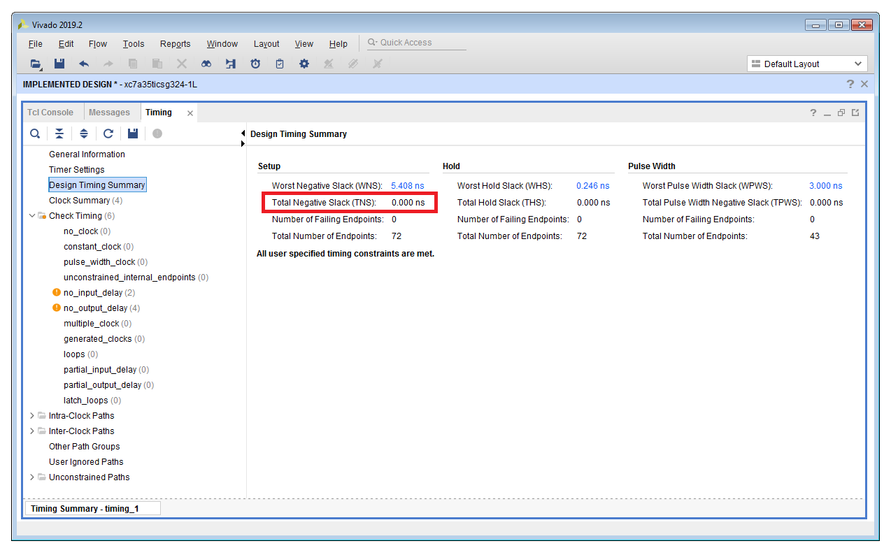

<div align="justify">

# Lab 7 Instructions
[[**Home**](https://github.com/lpacher/lae)] [[**Back**](https://github.com/lpacher/lae/tree/master/fpga/labs)]

## Contents

* [**Introduction**](#introduction)
* [**Lab aims**](#lab-aims)
* [**Navigate to the lab directory**](#navigate-to-the-lab-directory)
* [**Setting up the work area**](#setting-up-the-work-area)
* [**Copy scripts**](#copy-scripts)
* [**RTL coding**](#rtl-coding)
* [**Simulate the design**](#simulate-the-design)
* [**Clock management issues**](#clock-management-issues)
* [**Compile a Phase-Locked Loop (PLL) IP core**](#compile-a-phase-locked-loop-pll-ip-core)
* [**Run the FPGA implementation flow in non-project mode interactively**](#run-the-FPGA-implementation-flow-in-non-project-mode-interactively)
* [**Extra: example Real-Number Model (RNM) simulation <br /> of a Voltage-Controlled Oscillator (VCO) using SystemVerilog**](#vco-simulation)
* [**Exercises**](#exercises)
* [**Further readings**](#further-readings)

<br />
<!--------------------------------------------------------------------->


## Introduction
[**[Contents]**](#contents)

In this lab we implement and simulate a **parameterizable N-digit Binary-Coded Decimal (BCD) counter** using Verilog.
For this purpose we introduce the new `generate` for-loop construct to **replicate a certain module or primitive**
an arbitrary number of times to automatically generate structural code.
We also use this simple example synchronous digital circuit to discuss some **good and bad FPGA RTL coding techniques**
related to **clock management** and **timing issues** in pure **synchronous digital designs**. Finally we will add to the design a **Phase-Locked Loop (PLL) IP core**.

<br />
<!--------------------------------------------------------------------->


## Lab aims
[**[Contents]**](#contents)

This lab should exercise the following concepts:

* learn how to implement counters in Verilog
* introduce the `generate` for-loop statement to replicate instances
* understand good and bad RTL coding practices for timing closure in synchronous digital designs
* launch the Vivado IP flow
* compile a Phase-Locked Loop (PLL) IP for clock management
* understand the usage of timing constraints to implement a synchronous design

<br />
<!--------------------------------------------------------------------->


## Navigate to the lab directory
[**[Contents]**](#contents)

Open a **terminal** window and change to the `lab7/` directory:

```
% cd Desktop/lae/fpga/labs/lab7
```

<br />

List the content of the directory:

```
% ls -l
% ls -la
```

<br />
<!--------------------------------------------------------------------->


## Setting up the work area
[**[Contents]**](#contents)

Copy from the `.solutions/` directory the main `Makefile` already prepared for you:

```
% cp .solutions/Makefile .
```

<br />

Explore available targets:

```
% make help
```

<br />

>
> **QUESTION**
>
> Do you recognize new targets implemented in the `Makefile` ? <br /><br />
>
>   \____________________________________________________________________________________________________
>

<br />

Create a new fresh working area:

```
% make area
```

<br />
<!--------------------------------------------------------------------->


## Copy scripts
[**[Contents]**](#contents)

Copy from the `.solutions/` directory all **Tcl simulation scripts** already prepared for you:

```
% cp .solutions/scripts/sim/compile.tcl    scripts/sim/
% cp .solutions/scripts/sim/elaborate.tcl  scripts/sim/
% cp .solutions/scripts/sim/simulate.tcl   scripts/sim/
% cp .solutions/scripts/sim/probe.tcl      scripts/sim/
% cp .solutions/scripts/sim/run.tcl        scripts/sim/
% cp .solutions/scripts/sim/relaunch.tcl   scripts/sim/
```

<br />

For less typing, you can also use the **wildcard character** `*` as follows:

```
% cp .solutions/scripts/sim/*.tcl   scripts/sim/
```

<br />

> **REMINDER**
>
> If you want to use the asterisk `*` as **wildcard** for `cp` on Windows, please be aware that the `cp.exe` executable
> that comes with the _GNU Win_ package works properly **only using forward slashes** `/` **in the path!**
>
> ```
> % cp .solutions/scripts/sim/*.tcl   scripts/sim/
> ```
>
> If you use the **TAB completion** on Windows the path is completed using **back slashes** `\` but the resulting command **DOESN'T WORK and generates an error**
> because back-slashes `\` are interpreted as **escape characters** by `cp.exe`:
>
> ```
> % cp .solutions\scripts\sim\*.tcl   scripts\sim\
>
> cp: cannot stat '.solutionsscriptssim*.tcl' : No such file or directory
> ```
>
> You can use the native `copy` **DOS command** instead:
>
> ```
> % copy .solutions\scripts\sim\*.tcl   scripts\sim\
> ```
>

<br />


Additionally, copy from the `.solutions/` directory the following **Tcl common scripts** used for both simulation and implementation flows:


```
% cp .solutions/scripts/common/variables.tcl   scripts/common
% cp .solutions/scripts/common/part.tcl        scripts/common
% cp .solutions/scripts/common/init.tcl        scripts/common
% cp .solutions/scripts/common/ip.tcl          scripts/common
```

<br />


For less typing use:

```
% cp .solutions/scripts/common/*.tcl   scripts/common/
```

<br />

Verify that all required scripts are in place:

```
% ls -l scripts/common/
% ls -l scripts/sim/
```

<br/>
<!--------------------------------------------------------------------->


## RTL coding
[**[Contents]**](#contents)

With your **text editor** application create a first new Verilog file `rtl/CounterBCD.v` with the following content:


```verilog
//
// Binary-Coded Decimal (BCD) counter with count-enable and carry flag.
//


`timescale 1ns / 100ps

module CounterBCD (

   input  wire clk,
   input  wire rst,
   input  wire  en,
   output reg [3:0] BCD,
   output wire carryout 

   ) ;
   

   always @(posedge clk) begin

      if( rst == 1'b1 )              // synchronous reset, active-high (same as 'if(rst)' for less typing)
         BCD <= 4'b0000 ;            // here you can also use 4'd0 or 'd0

      else begin

         if( en == 1'b1 ) begin      // let the counter to increment only if enabled (same as 'if(en)' for less typing)

            if( BCD == 4'b1001 )     // force the count roll-over at 9 (you can also use 4'd9)
               BCD <= 4'b0000 ;
            else
               BCD <= BCD + 4'b1 ;
         end
         //else ? keep memory otherwise
      end
   end // always


   assign carryout = ( (BCD == 4'b1001) && (en == 1'b1) ) ? 1'b1 : 1'b0 ;

endmodule
```

<br />

>
> **IMPORTANT !**
>
> You can always choose the **reset strategy** according to your needs. Indeed, for FPGA design the recommendation from Xilinx <br />
> is to always use:
>
> * **synchronous reset**
> * **active-high reset**
>
> Thus from now on we will assume to always exclude the reset from sensitivity lists unless very special requirements.
>

<br />

Create also a second Verilog source `rtl/CounterBCD_Ndigit.v` with the following content:

```verilog
//
// Verilog code for a parameterizable N-digit BCD counter
//


`timescale 1ns / 100ps

module CounterBCD_Ndigit #(parameter integer Ndigit = 1) (

   input   wire clk,
   input   wire rst,
   input   wire en,
   output  wire [Ndigit*4-1:0] BCD

   ) ;


   wire [Ndigit:0] w ;   // Ndigit+1 wires to interconnect BCD counters each other

   assign w[0] = en ;

   generate

      genvar k ;

      for(k = 0; k < Ndigit; k = k+1) begin : digit  

         CounterBCD   digit (

            .clk      (             clk ),
            .rst      (             rst ),
            .en       (            w[k] ),
            .BCD      (  BCD[4*k+3:4*k] ),
            .carryout (          w[k+1] )

         ) ;

      end // for

   endgenerate

endmodule
```
<br />

In this case the RTL only contains **structural code** in form of a **schematic block diagram**. With the `generate` for-loop
we can replicate an arbitrary number of instances, making the code parameterizable.

<br />
<!--------------------------------------------------------------------->


## Simulate the design
[**[Contents]**](#contents)

Simulation sources have been already prepared for you, copy from the `.solutions/` directory the following **testbench sources**:


```
% cp .solutions/bench/ClockGen.v               bench/
% cp .solutions/bench/glbl.v                   bench/
% cp .solutions/bench/tb_CounterBCD_Ndigit.v   bench/
```

<br />

For less typing:

```
% cp .solutions/bench/*.v   bench/
```

<br />

Inspect the testbench code `bench/tb_CounterBCD_Ndigit.v` already prepared for you. Compile, elaborate and simulate the design with

```
% make compile
% make elaborate
% make simulate
```

or simply type

```
% make sim
```

<br />

Debug your simulation results. Close the simulator graphical interface once happy.

<br />
<!--------------------------------------------------------------------->


## Clock management issues
[**[Contents]**](#contents)

Let now suppose that we want to **slow-down** the frequency of the clock fed to the BCD counter.
As a first guess, we can use an auxiliary **free-running counter** to divide the input clock and then use this **generated clock**
as clock for the BCD counter.

Modify the `rtl/CounterBCD_Ndigit.v` code as follows:

```verilog
`timescale 1ns / 100ps

module CounterBCD_Ndigit #(parameter integer Ndigit = 3) (

   input  wire clk,
   input  wire rst,
   input  wire en,
   output wire [Ndigit*4-1:0] BCD

   ) ;


   /////////////////////////////////////////////////////////////////
   //   auxiliary 6-bit free-running counter for clock division   //
   /////////////////////////////////////////////////////////////////

   reg [5:0] count_free = 6'b000_000 ;   // **IMPORTANT: this initialization is feasible in FPGA thanks to Global Set/Reset (GSR) !

   always @(posedge clk)
      count_free = count_free + 5'b1 ;

   wire clk_div ;   // divided clock, e.g. 100 MHz => 50 MHz

   // choose below the desired divided clock fed to the BCD counter
   //assign clk_div = clk ;                             // clk      e.g. 100 MHz
   //assign clk_div = count_free[0] ;                   // clk/2    e.g. 100 MHz/2 = 50   MHz
   //assign clk_div = count_free[1] ;                   // clk/4    e.g. 100 MHz/4 = 25   MHz
   //assign clk_div = count_free[2] ;                   // clk/8    e.g. 100 MHz/8 = 12.5 MHz
   //assign clk_div = count_free[3] ;                   // clk/16   etc.
   //assign clk_div = count_free[4] ;                   // clk/32
   assign clk_div = count_free[5] ;                     // clk/64


   /////////////////////////////
   //   N-digit BCD counter   //
   /////////////////////////////


   wire [Ndigit:0] w ;   // Ndigit + 1 wires to inteconnect BCD counters each other

   assign w[0] = en ;

   generate

      genvar k ;

      for(k = 0; k < Ndigit; k = k+1) begin : digit

         CounterBCD  digit (

            //.clk      (             clk ),
            .clk      (         clk_div ),   // now the counter runs with 'clk_div'
            .rst      (             rst ),
            .en       (            w[k] ),
            .BCD      (  BCD[4*k+3:4*k] ),
            .carryout (          w[k+1] )

         ) ;

      end // for

   endgenerate

endmodule
```

<br />

Save RTL changes and try to re-simulate the design from scratch:

```
% make clean
% make sim
```

<br />

Debug your simulation results. Play with different clock frequencies. Since this change is trivial in the code
simply comment/uncomment the `assign` statement to select the clock fed to the counter and then relaunch
the simulation from the XSim graphical interface with:

```
relaunch
```

<br />

Close the simulator graphical interface once happy.

<br />

>
> This is an example of a **BAD RTL coding approach** for pure synchronous designs. The **BAD approach** here is to generate
> a dedicated lower-frequency clock using an auxiliary counter or a simple clock divider. <br />
> On the contrary a **GOOD synchronous digital design** always uses **THE SAME CLOCK everywhere** in the logic in order to easier
> digital implementation tools to achieve **timing closure** when performing **timing optimizations and Static Timing Analysis (STA)**
> in order to guarantee **setup and hold timing constraints** in your design.
>

<br />

The **RECOMMENDED approach** whenever you need to "slow down" the speed of the data processing in your design is to use a **tick counter** instead.
That is, we can use a "ticker" module implemented using an additional **modulus-N free-running counter** to generate a single clock-pulse "tick"
(e.g. every 1 us) to be used as count-enable for the main BCD counter.


Copy from the `.solutions/` directory the code for this additional module already prepared for you as follows:

```
% cp .solutions/rtl/TickCounter.v   rtl/
```

<br />

Open the new source file with your text editor and inspect the RTL code:

```verilog

`timescale 1ns / 100ps

module TickCounter #(parameter integer MAX = 10414) (      // default is ~9.6 kHz as for UART baud-rate

   input  wire clk,      // assume 100 MHz input clock
   output reg  tick      // single clock-pulse output

   ) ;


   //////////////////////////////////////////
   //   modulus-MAX free-running counter   //
   //////////////////////////////////////////

   //
   // **NOTE
   //
   // Assuming 100 MHz input clock we can generate up to 2^32 -1 different tick periods, e.g.
   //
   // MAX =    10 => one "tick" asserted every    10 x 10 ns = 100 ns  => logic "running" at  10 MHz
   // MAX =   100 => one "tick" asserted every   100 x 10 ns =   1 us  => logic "running" at   1 MHz
   // MAX =   200 => one "tick" asserted every   200 x 10 ns =   2 us  => logic "running" at 500 MHz
   // MAX =   500 => one "tick" asserted every   500 x 10 ns =   5 us  => logic "running" at 200 kHz
   // MAX =  1000 => one "tick" asserted every  1000 x 10 ns =  10 us  => logic "running" at 100 kHz
   // MAX = 10000 => one "tick" asserted every 10000 x 10 ns = 100 us  => logic "running" at  10 kHz etc.
   //

   reg [$clog2(MAX)-1:0] count = 'b0 ;   // **IMPORTANT: use the ceil-function on log2(MAX) to determine how many FlipFlops are required to count from 0 to MAX

   always @(posedge clk) begin

      if( count == MAX-1 ) begin

         count <= 'b0 ;             // force the roll-over
         tick  <= 1'b1 ;            // assert a single-clock pulse each time the counter resets

      end
      else begin

         count <= count + 'b1 ;
         tick  <= 1'b0 ;

      end    // if
   end   // always

endmodule
```

<br />

Comment-out in the `rtl/CounterBCD_Ndigit.v` source file the portion of code that we used to divide the clock and instantiate the "ticker"
in order to generate a single clock-pulse "tick" as additional enable for the BCD counter:

```verilog
`timescale 1ns / 100ps

module CounterBCD_Ndigit #(parameter integer Ndigit = 1) (

   input  wire clk,
   input  wire rst,
   input  wire en,
   output wire [Ndigit*4-1:0] BCD

   ) ;

/*

   /////////////////////////////////////////////////////////////////
   //   auxiliary 6-bit free-running counter for clock division   //
   /////////////////////////////////////////////////////////////////

   reg [5:0] count_free = 6'b000_000 ;   // **IMPORTANT: this initialization is feasible in FPGA thanks to Global Set/Reset (GSR) !

   always @(posedge clk)
      count_free = count_free + 5'b1 ;

   wire clk_div ;   // divided clock, e.g. 100 MHz => 50 MHz

   // choose below the desired divided clock fed to the BCD counter
   //assign clk_div = clk ;                             // clk      e.g. 100 MHz
   //assign clk_div = count_free[0] ;                   // clk/2    e.g. 100 MHz/2 = 50   MHz
   //assign clk_div = count_free[1] ;                   // clk/4    e.g. 100 MHz/4 = 25   MHz
   //assign clk_div = count_free[2] ;                   // clk/8    e.g. 100 MHz/8 = 12.5 MHz
   //assign clk_div = count_free[3] ;                   // clk/16   etc.
   //assign clk_div = count_free[4] ;                   // clk/32
   assign clk_div = count_free[5] ;                     // clk/64

*/


   ///////////////////////
   //    tick counter   //
   ///////////////////////

   // assert a single clock-pulse "tick" every 1 us i.e. 100 x 10 ns clock period at 100 MHz
   wire tick ;

   TickCounter  #(.MAX(100)) TickCounter_inst ( .clk(clk), .tick(tick)) ;


   /////////////////////////////
   //   N-digit BCD counter   //
   /////////////////////////////


   wire [Ndigit:0] w ;   // Ndigit + 1 wires to interconnect BCD counters each other

   //assign w[0] = en ;
   assign w[0] = en & tick ;   // **IMPORTANT: now the logic proceeds only if a "tick" pulse is also present !

   generate

      genvar k ;

      for(k = 0; k < Ndigit; k = k+1) begin : digit

         CounterBCD  digit (

            .clk      (             clk ),   // **GOOD design practice, all FFs receive the same clock again
            .rst      (             rst ),
            .en       (            w[k] ),
            .BCD      (  BCD[4*k+3:4*k] ),
            .carryout (          w[k+1] )

         ) ;

      end // for

   endgenerate

endmodule
```

<br />

In order to simulate the design extend the value of the `RTL_VLOG_SOURCES` variable
in the `Makefile` in order to parse and compile also the `rtl/TickCounter.v` source code:

```
#RTL_VLOG_SOURCES := $(RTL_DIR)/CounterBCD.v $(RTL_DIR)/CounterBCD_Ndigit.v                         
RTL_VLOG_SOURCES := $(RTL_DIR)/CounterBCD.v $(RTL_DIR)/CounterBCD_Ndigit.v $(RTL_DIR)/TickCounter.v
```

<br />

Save all modifications to HDL sources and `Makefile`. Re-simulate the design from scratch:

```
% make clean sim
```

<br />

Debug your simulation results. Play with different "tick" frequencies by changing the `MAX` parameter when
instantiating the `TickCounter` module. Since this change is trivial in the code you can relaunch
the simulation from the XSim graphical interface after RTL changes with:

```
relaunch
```

<br />

Close the simulator graphical interface once happy.

<br />
<!--------------------------------------------------------------------->


## Compile a Phase-Locked Loop (PLL) IP core
[**[Contents]**](#contents)

The usage of a "tick" counter is a popular "clean" solution in order to "slow down" the logic without the need of additional
dedicated clocks in the design. However what happens if we need to run the logic at **higher frequencies** instead? As an example
we have 100 MHz clock from on-board XTAL oscillator but we might want to send data out from the FPGA at 400 MHz transmission rate.
Or let suppose that we need to **divide the clock frequency by a non-trivial factor**, e.g. 100 MHz/2.5, how we can achieve this
in FPGA?

In electronics engineering **clock multiplication and clock division** are tasks performed by a dedicated mixed-signal
circuit called **Phase-Locked Loop (PLL)**. This is one of the most widespread circuit in consumer electronics.
Given the importance of this block Xilinx FPGAs already includes **configurable clock-management blocks** in the chip to deal with clock signals.
In order to use this circuit we only need to "_customize_" and then "_compile_" the block that already comes in form of
**Intellectual Property (IP) core** as part of the **Vivado IP flow**.

<br />

>
> **IMPORTANT !**
>
> This is the **RECOMMENDED approach for any FPGA project**, even better if you compile the **Mixed-Mode Clock Management (MMCM)**
> version of the IP core which is a **super-set of the PLL** indeed. The main reason to do this is that by using a dedicated
> **clock-management block** you can **fine-tune the clock fed to FPGA internal logic** and perform additional operations such as
> **jitter filtering**, **clock-phase adjustment**, **fine-delay adjustment** etc.
>

<br />

In the following we are going to compile a new PLL core using the Vivado IP flow in order to **fine-tune** the clock fed to internal logic
starting from the available **on-board 100 MHz clock**. Additionally, we use the PLL to **double the clock frequency** up to 200 MHz as an
example of **frequency-synthesis capabilities** of the PLL. A simple multiplexer can be then used to switch between 100 MHz and 200 MHz fed
to the core logic.

As a first step launch the **Vivado IP flow** with:

```
% make ip
```

<br />


<br />

Select in the **IP Catalog** the **Clocking Wizard** available under **FPGA Features and Design > Clocking > Clocking Wizard**.
Right-click on **Clocking Wizard** and select **Customize IP...**

<br />


<br />

Create a new IP core named PLL with the following features :

* 100 MHz input clock
* primary 100 MHz output clock
* additional 200 MHz output clock
* minimize output jitter
* no reset signal

Change default port names in order to have `CLK_IN`, `CLK_OUT_100`, `CLK_OUT_200` and `LOCKED`.

<br />


<br />

Left-click on OK in the Summary TAB and then left-click on **Generate** to compile the IP and generate all output products:


<br />

Additionally, **export all simulation scripts** by executing in the Tcl console the following custom Tcl procedure:

```
export_xsim_scripts
```

<br />

Inspect source files automatically generated for you in the `cores/PLL` and `cores/export_scripts` directories:

```
% ls -l cores/PLL
% ls -l cores/export_scripts
```

<br />

Most important files for our purposes are:

* the main **Xilinx Core Instance (XCI)** XML file *.xci containing the IP configuration
* the Verilog instantiation template `*.veo` (if the target language is VHDL a `.vho` would have been created instead) 
* the XDC constraints file for the IP core `*.xdc`
* self-contained gate-level Verilog and VHDL netlists `*sim_netlist.v/*sim_netlist.vhd` for functional simulations

<br />

>
> **IMPORTANT !**
>
> The **Xilinx Core Instance (XCI)** XML file containing the configuration of the IP allows to easily re-compile from scratch the IP core.
>

<br />

Modify the `rtl/CounterBCD_Ndigit.v` source code in order to **instantiate** the newly created PLL core as follows:

```verilog
`timescale 1ns / 100ps

module CounterBCD_Ndigit #(parameter integer Ndigit = 1) (

   input  wire clk,
   input  wire rst,
   input  wire en,
   output wire [Ndigit*4-1:0] BCD

   ) ;


   ///////////////////////////////////////
   //   PLL IP core (Clocking Wizard)   //
   ///////////////////////////////////////

   // PLL signals
   wire pll_clk, pll_locked, UNCONNECTED ;

   PLL  PLL_inst ( .CLK_IN(clk), .CLK_OUT_100(pll_clk), .CLK_OUT_200(UNCONNECTED), .LOCKED(pll_locked) ) ;      // 100 MHz output clock
   //PLL  PLL_inst ( .CLK_IN(clk), .CLK_OUT_100(UNCONNECTED), .CLK_OUT_200(pll_clk), .LOCKED(pll_locked) ) ;    // 200 MHz output clock


/*

   /////////////////////////////////////////////////////////////////
   //   auxiliary 6-bit free-running counter for clock division   //
   /////////////////////////////////////////////////////////////////

   reg [5:0] count_free = 6'b000_000 ;   // **IMPORTANT: this initialization is feasible in FPGA thanks to Global Set/Reset (GSR) !

   always @(posedge clk)
      count_free = count_free + 5'b1 ;

   wire clk_div ;   // divided clock, e.g. 100 MHz => 50 MHz

   // choose below the desired divided clock fed to the BCD counter
   //assign clk_div = clk ;                             // clk      e.g. 100 MHz
   //assign clk_div = count_free[0] ;                   // clk/2    e.g. 100 MHz/2 = 50   MHz
   //assign clk_div = count_free[1] ;                   // clk/4    e.g. 100 MHz/4 = 25   MHz
   //assign clk_div = count_free[2] ;                   // clk/8    e.g. 100 MHz/8 = 12.5 MHz
   //assign clk_div = count_free[3] ;                   // clk/16   etc.
   //assign clk_div = count_free[4] ;                   // clk/32
   assign clk_div = count_free[5] ;                     // clk/64

*/


   ///////////////////////
   //    tick counter   //
   ///////////////////////

   // assert a single clock-pulse "tick" every 1 us i.e. 100 x 10 ns clock period at 100 MHz
   wire tick ;

   TickCounter  #(.MAX(100)) TickCounter_inst ( .clk(pll_clk), .tick(tick)) ;   // use the PLL clock!


   /////////////////////////////
   //   N-digit BCD counter   //
   /////////////////////////////


   wire [Ndigit:0] w ;   // Ndigit + 1 wires to interconnect BCD counters each other

   //assign w[0] = en ;
   assign w[0] = en & tick ;   // **IMPORTANT: now the logic proceeds only if a "tick" pulse is also present !

   generate

      genvar k ;

      for(k = 0; k < Ndigit; k = k+1) begin : digit

         CounterBCD  digit (

            //.clk      (             clk_div ),     // **BAD design practice, do not use "custom" clocks
            .clk      (                 clk ),       // **GOOD design practice, all FFs receive the same clock
            //.rst      (                 rst ),
            .rst      ( rst | (~pll_locked) ),       // **IMPORTANT: we also use the "locked" signal from the PLL as reset!
            .en       (                w[k] ),
            .BCD      (      BCD[4*k+3:4*k] ),
            .carryout (              w[k+1] )

         ) ;

      end // for

   endgenerate

endmodule
```

<br />

Save modifications to HDL sources and try to re-simulate the design from scratch:

```
% make clean sim
```

<br />

Debug your simulation results. Add PLL signals to the Waveform window. Comment/uncomment the PLL instantiation code
in order to switch between 100 MHz and 200 MHz output clock:

```verilog
PLL  PLL_inst ( .CLK_IN(clk), .CLK_OUT_100(pll_clk), .CLK_OUT_200(UNCONNECTED), .LOCKED(pll_locked) ) ;      // 100 MHz output clock
//PLL  PLL_inst ( .CLK_IN(clk), .CLK_OUT_100(UNCONNECTED), .CLK_OUT_200(pll_clk), .LOCKED(pll_locked) ) ;    // 200 MHz output clock
```

<br />

Remind that you can always relaunch the simulation from the XSim Tcl console with:

```
relaunch
```

<br />

Close the simulator graphical interface once happy.

<br />

>
> **QUESTION**
>
> Inspect the `Makefile` code. Which HDL sources have been used to simulate the PLL IP core ? 
>
>   \____________________________________________________________________________________________________
>

<br />
<!--------------------------------------------------------------------->


## Run the FPGA implementation flow in non-project mode interactively
[**[Contents]**](#contents)

Try to run the FPGA implementation flow using a **Non Project mode** Tcl flow and inspect physical implementation results.
For this purpose we assume to implement a single 4-bit BCD counter, therefore be sure that `Ndigit` defaults to one in the
top-level module declaration:

```verilog
module CounterBCD_Ndigit #(parameter integer Ndigit = 1) (
```

<br />

**COPY IMPLEMENTATION SCRIPTS**

Copy from the `.solutions/` directory all implementation Tcl scripts already prepared for you:

```
% cp .solutions/scripts/build/*.tcl  scripts/build/
```

<br />

Explore the content of the `scripts/build/` directory:

```
% ls -l scripts/build/
```

<br />


**INSPECT DESIGN CONSTRAINTS**

Copy from the `.solutions/` directory the main Xilinx Design Constraints (XDC) file used to implement the design
on real FPGA hardware:


```
% cp .solutions/xdc/*.xdc   xdc/
```

<br />

Open with your text-editor application the file and inspect the syntax:

```
###############
##   units   ##
###############

## just for reference, these are already default units
#set_units -time          ns
#set_units -voltage       V
#set_units -power         mW
#set_units -capacitance   pF


#############################################
##   physical constraints (port mapping)   ##
#############################################

## on-board 100 MHz clock
set_property -dict [list PACKAGE_PIN E3 IOSTANDARD LVCMOS33] [get_ports clk]

## reset on BTN0
set_property -dict [list PACKAGE_PIN D9 IOSTANDARD LVCMOS33] [get_ports rst]

## count-enable on slide switch SW0
set_property -dict [list PACKAGE_PIN A8  IOSTANDARD LVCMOS33]  [get_ports en]

## BCD[3:0] on standard LEDs
set_property -dict [list PACKAGE_PIN H5  IOSTANDARD LVCMOS33] [get_ports { BCD[0] }] ;   ## LD4
set_property -dict [list PACKAGE_PIN J5  IOSTANDARD LVCMOS33] [get_ports { BCD[1] }] ;   ## LD5
set_property -dict [list PACKAGE_PIN T9  IOSTANDARD LVCMOS33] [get_ports { BCD[2] }] ;   ## LD6
set_property -dict [list PACKAGE_PIN T10 IOSTANDARD LVCMOS33] [get_ports { BCD[3] }] ;   ## LD7


################################
##   electrical constraints   ##
################################

## voltage configurations
set_property CFGBVS VCCO        [current_design]
set_property CONFIG_VOLTAGE 3.3 [current_design]


##
## **WARNING
##
## The load capacitance is used during power analysis when running the report_power
## command, but it's not used during timing analysis
##
#set_load 10 [all_outputs] -verbose


############################
##   timing constraints   ##
############################

## create a 100 MHz clock signal with 50% duty cycle for reg2reg Static Timing Analysis (STA) 
create_clock -period 10.000 -name clk100 -waveform {0.000 5.000} -add [get_ports clk]

## constrain the in2reg timing paths (assume approx. 1/2 clock period)
set_input_delay -clock clk100 2.000 [get_ports en]

## constrain the reg2out timing paths (assume approx. 1/2 clock period)
set_output_delay -clock clk100 2.000 [get_ports BCD*]


################################
##   additional constraints   ##
################################

##
## additional XDC statements to optimize the memory configuration file (.bin)
## to program the external 128 Mb Quad Serial Peripheral Interface (SPI) flash
## memory in order to automatically load the FPGA configuration at power-up
##

set_property BITSTREAM.CONFIG.SPI_BUSWIDTH 4  [current_design]
set_property CONFIG_MODE SPIx4  [current_design]
```


<br />

**RUN THE FLOW INTERACTIVELY**

Run the flow Vivado FPGA implementation flow in _Non-Project_ mode interactively. As a first step, create
an in-memory project and load all RTL and IP design sources as follows: 

```
% make build/import
```

<br />


<br />

Inspect the elaborated RTL schematic of the block. Once happy, run the **synthesis flow** from the Tcl console with:

```
source -notrace ./scripts/build/syn.tcl
```

<br />


<br />

>
> **QUESTION**
>
> The `all_ffs` Tcl command returns all FlipFlops inferred by the synthesizer from RTL. <br />
> How many FlipFlops are there in your design ? Is this number expected ? Compare the result with the post-synthesis utilization report.<br /><br />
>
>   \____________________________________________________________________________________________________
>

<br />

Run the **placement flow** with:

```
source -notrace ./scripts/build/place.tcl
```

<br />


Run the **routing flow** with:

```
source -notrace ./scripts/build/route.tcl
```

<br />

Finally, **ganerate the bitstream** and **export implementation results** (gate-level Verilog netlist, SDF etc.) with:

```
source -notrace ./scripts/build/export.tcl
```

<br />

List the content of the `work/build/outputs` directory:

```
% ls -l work/build/outputs
```

<br />

Generate a **summary timing report** from the graphical interface and verify that timing is met in your design:

<br />




<br />

>
> **IMPORTANT !**
>
> A **timing-clean** synchronous digital design has **no setup/hold timing violations** if both **Total Negative Slack (TNS)**
> and **Total Hold Slack (THS)** reported by the STA engine are **zero**.
>

<br />


Explore the command-line help for the following Tcl commands:

```
create_clock -help
set_input_delay -help
set_output_delay -help
```

<br />

Exit from Vivado graphical interface once happy:

```
exit
```

<br />
<!--------------------------------------------------------------------->


## <a name="vco-simulation"></a> Extra: example Real-Number Model (RNM) simulation <br /> of a Voltage-Controlled Oscillator (VCO) using SystemVerilog
[**[Contents]**](#contents)

The core component of a Phase-Locked Loop (PLL) circuit is a **Voltage-Controlled Oscillator (VCO)**. Despite up to now
we only simulated pure-digital systems, hardware description languages allows to also simulate **mixed-signal systems**
at different levels of accuracy.

In this section we provide a small example to demonstrate how you can "model" a complex mixed-signal circuit such as a VCO
with **real numbers** and **SystemVerilog real ports**. The resulting simulation is a **pure-digital simulation**.

As a first step, create a dedidcated directory e.g. `extra/` to contain additional HDL sources you are going to write:

```
% mkdir extra
```

<br />

With your text editor application create a first new **SystemVerilog** simulation source `extra/VCO.sv` with the following content:

```SystemVerilog
//
// Example Real-Number Model (RNM) using SystemVerilog real ports for a simple
// Voltage-Controlled Oscillator (VCO).
//


`timescale 1ns / 100ps

module VCO (

   input  real  Vctrl,     // analog control voltage using a 'real' input port, only supported by SystemVerilog
   output logic clk        // SystemVerilog 'logic' net type, same as 'reg'

   ) ;

   // VCO parameters
   parameter real INTRINSIC_FREQ = 2.5 ;  // MHz
   parameter real VCO_GAIN = 10 ;         // MHz/V

   real clk_delay ;
   real freq ;

   initial begin
      clk = 1'b0 ;
      freq = INTRINSIC_FREQ ;             // initial frequency
      clk_delay = 1.0/(2*freq)*1e3 ;      // initial semi-period
    end


   // change the clock frequency whenever the control voltage changes
   always @(Vctrl) begin
      freq = INTRINSIC_FREQ + VCO_GAIN*Vctrl ;
      clk_delay = 1.0/(2*freq)*1e3 ;

      $display("VCO clock frequency for Vctrl = %.2f V is %2.2f MHz", Vctrl, freq) ;
   end

   // clock generator
   always #clk_delay clk = ~clk ;

endmodule : VCO
```

<br />


This is of course **NON-SYNTHESIZABLE CODE**, but **real-number models (RNM)** are very useful to model **mixed signal blocks**
connected to FPGA devices such as A/D and D/A converters, temperature sensors etc.

<br />

Create also a Verilog testbench `extra/tb_VCO.v` to test the functionality of the VCO:

```verilog
//
// Verilog testbench for VCO mixed-signal real model.
//

`timescale 1ns / 100ps

module tb_VCO ;

   ///////////////////////////
   //   device under test   //
   ///////////////////////////

   real Vctrl ;   // analog control voltage
   wire clk ;     // VCO output clock

   VCO   DUT (.Vctrl(Vctrl), .clk(clk)) ;


   /////////////////////////
   //   analog stimulus   //
   /////////////////////////

   initial begin
        #0    Vctrl = 1.25 ;
        #3000 Vctrl = 2.00 ;
        #3000 Vctrl = 0.50 ;
        #3000 Vctrl = 0.78 ;
        #3000 Vctrl = 1.25 ;

        #3000 $finish ;      // check also that clock frequency is 2.5 MHz as expected for Vctrl = 0 V
   end

endmodule
```

<br />

>
> **NOTE**
>
> You can also copy HDL sources already prepared for you from the `.solutions/` directory:
>
> ```
> % cp .solutions/extra/VCO.sv     extra/
> % cp .solutions/extra/tb_VCO.v   extra/
> ```
>

<br />

Before simulating this small example change into the `work/sim` directory in order to keep the working directory clean:

```
% cd work/sim
```

<br />

Compile the design from the command line by invoking the `xvlog` executable as follows:


```
% xvlog -sv ../../extra/VCO.sv
% xvlog ../../extra/tb_VCO.sv
```

<br />

Note the usage of the `-sv` option required to enable SystemVerilog extensions. Elaborate the design with the `xelab` executable:

```
% xelab -debug all tb_VCO
```

<br />

Finally, load the simulation snapshot invoking `xsim` in graphic mode. For Linux users:

```
% xsim -gui tb_VCO &
```

<br />

For Windows users:

```
% echo "exec xsim -gui tb_VCO &" | tclsh -norc
```

<br />

Add all testbench module signals to a new Wave window with the `add_wave` command and run the simulation:


```
add_wave /*
run all
```

<br />


<br />

This small example can be used as a reference code to describe and simulate other mixed-signal blocks
such as A/D and D/A converters using only real numbers.

<br />
<!--------------------------------------------------------------------->


## Exercises
[**[Contents]**](#contents)


**EXCERCISE 1**

Modify timing constraints in the XDC file and **increase the input clock frequency to 1 GHz** as follows:

```
#create_clock -period 10.000 -name clk100 -waveform {0.000 5.000} -add [get_ports clk]
create_clock -period 1.000 -name clk100 -waveform {0.000 5.000} -add [get_ports clk]
```

<br />

Re-run the flow in _Non-Project_ mode with:

```
% make clean
% make build
```

<br />

Generate a new summary timing report.

<br />

>
> **QUESTION**
>
> Are there timing violations in the design ?
>
>   \____________________________________________________________________________________________________
>

<br />


**EXERCISE 2**

Modify the code of the parameterized N-digit BCD counter in order to introduce an additional **"end of scale" flag** `eos` asserted
when 999...9 is reached. As an example you can use the Verilog **replication operator** with the following syntax:

```verilog
// generate end-of-scale flag when 9999 ... 9 is reached
assign eos = ( BCD == {Ndigit{4'b1001}} ) ? 1'b1 : 1'b0 ;      // use Verilog replication operator to replicate 4'1001 N times
```

Alternatively you can generate a true **"overflow" flag** `overflow` by registering in a FlipFlop the true carry-out flag of the most-significant
BCD counter:

```verilog
// generate overflow flag
always @(posedge clk) begin

   if(rst == 1'b1) begin
      overflow <= 1'b0 ;
   end
   else begin
      overflow <= ( w[Ndigit] == 1'b1 ) ;
   end
end   // always
```

In required, this flag can be than used to **stop and freeze the counter** when an overflow is detected.

<br />
<!--------------------------------------------------------------------->


## Further readings
[**[Contents]**](#contents)

If you are interested in more in-depth details about the Xilinx Vivado IP flow and the Clocking Wizard, please ref. to the following
Xilinx official documentation:

* [_Vivado Design Suite User Guide: Designing with IP (UG896)_](https://www.xilinx.com/support/documentation/sw_manuals/xilinx2019_2/ug896-vivado-ip.pdf)
* [_Clocking Wizard v6.0 LogiCORE IP Product Guide_](https://www.xilinx.com/support/documentation/ip_documentation/clk_wiz/v6_0/pg065-clk-wiz.pdf)

</div>
