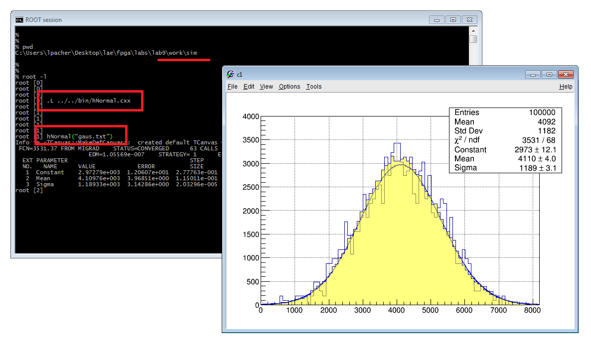

<div align="justify">

# Lab 9 Instructions
[[**Home**](https://github.com/lpacher/lae)] [[**Back**](https://github.com/lpacher/lae/tree/master/fpga/labs)]


## Contents

* [**Introduction**](#introduction)
* [**Lab aims**](#lab-aims)
* [**Navigate to the lab directory**](#navigate-to-the-lab-directory)
* [**Setting up the work area**](#setting-up-the-work-area)
* [**Compile a PLL IP core for clock-jitter filtering**](#compile-a-pll-ip-core-for-clock-jitter-filtering)
* [**RTL coding**](#rtl-coding)
* [**Simulate the design**](#simulate-the-design)
* [**Plot the pseudo-random sequence using ROOT**](#plot-the-pseudo-random-sequence-using-root)
* [**Implement the design on target FPGA**](#implement-the-design-on-target-fpga)
* [**Simulate normally-distributed random numbers**](#simulate-normally-distributed-random-numbers)
* [**Exercises**](#exercises)

<br />
<!--------------------------------------------------------------------->


## Introduction
[**[Contents]**](#contents)

In this lab we implement a **pseudo-random bit sequence (PRBS) generator** using a **Linear-Feedback Shift-Register (LFSR)**.
This is an example of "special" counter that generates a count sequence that seems "random".

You will then visualize the PRBS at the oscilloscope in the electronics lab and you will use it
to display a so called [**eye-diagram**](https://en.wikipedia.org/wiki/Eye_pattern).

<br />
<!--------------------------------------------------------------------->


## Lab aims
[**[Contents]**](#contents)

This lab should exercise the following concepts:

* compile a Xilinx IP core in batch mode from a pre-existing XCI configuration file
* learn how to implement a pseudo-random bit generator in Verilog with a LFSR
* generate random numbers with uniform (flat) distribution
* apply the Central Limit Theorem (CLT) to generate normally-distributed random numbers

<br />
<!--------------------------------------------------------------------->


## Navigate to the lab directory
[**[Contents]**](#contents)

Open a **terminal** window and change to the `lab9/` directory:

```
% cd Desktop/lae/fpga/labs/lab9
```

<br />

List the content of the directory:

```
% ls -l
% ls -la
```

<br />
<!--------------------------------------------------------------------->


## Setting up the work area
[**[Contents]**](#contents)

Copy from the `.solutions/` directory the main `Makefile` already prepared for you:

```
% cp .solutions/Makefile .
```

<br />

Create a new fresh working area:

```
% make area
```

<br />


Additionally, recursively copy from the `.solutions/` directory all **simulation and implementation scripts** as follows:

```
% cp -r .solutions/scripts/  .
```
<br />

>
> **NOTE**
>
> In this case we want to perform a **recursive copy**, do not forget to add the `-r` option. <br />
> The above `cp` command works fine under Windows also if you use back-slashes in the path.
>

<br />
<!--------------------------------------------------------------------->


## Compile a PLL IP core for clock-jitter filtering
[**[Contents]**](#contents)

We want to use a Phase-Locked Loop (PLL)  IP core from the _Clocking Wizard_ in order to **filter the jitter on the external input clock**
fed to the core logic. In this case we don't need to multiply or divide the clock, thus the PLL output clock is 100 MHz assuming 100 MHz
input clock from on-board XTAL oscillator.

The main **Xilinx Core Instance (XCI)** XML file containing the configuration of the IP has been
already prepared for you.

Create a new `cores/PLL/` directory to contain IP sources that will be generated by the Vivado IP flow:

```
% mkdir cores/PLL
```

<br />

Copy from the `.solutions/cores/PLL` directory the main XCI configuration file:

```
% cp .solutions/cores/PLL/PLL.xci  cores/PLL/
```

<br />

Finally, **compile the IP** using `make` as follows:

```
% make ip mode=batch xci=cores/PLL/PLL.xci
``` 

<br />

At the end of the flow verify that all IP sources are in place:

```
% ls -l cores/PLL/
```

<br />

Once all outputs have been generated inspect the **Verilog instantiation template** generated for you by Vivado in order to understand the
port list of the IP that we are going to use in the RTL code:

```
% cat cores/PLL/PLL.veo
```

<br />
<!--------------------------------------------------------------------->


## RTL coding
[**[Contents]**](#contents)

The circuit that we want to describe and simulate using Verilog HDL is the following:

<br />


<br />


With your **text editor** application create the main PRBS generator Verilog module `rtl/PRBS.v` and write the below source RTL code:

```verilog
//
// Example 8-bit Pseudo-Random Bit Sequence (PRBS) generator using a Linear Feedback
// Shift Register (LFSR).
//


`timescale 1ns / 100ps

module LFSR #(parameter [7:0] SEED = 8'hFF) (   // seed of the pseudo-random bit sequence

   input  wire clk,      // assume 100 MHz input clock fed to PLL
   output wire PRBS      // output pseudo-random bit sequence

   ) ;


   ///////////////////////////////////////
   //   PLL IP core (Clocking Wizard)   //
   ///////////////////////////////////////

   // PLL signals
   wire pll_clk, pll_locked ;

   PLL  PLL_inst ( .CLK_IN(clk), .CLK_OUT(pll_clk), .LOCKED(pll_locked) ) ;   // generates 100 MHz output clock with maximum input-jitter filtering


   /////////////////////////////////
   //   tick counter (optional)   //
   /////////////////////////////////

   wire enable ;

   TickCounterRst #(.MAX(10)) TickCounter_inst (.clk(pll_clk), .rst(~pll_locked), .tick(enable)) ;      // 10 MHz "tick"
   //TickCounterRst #(.MAX(1)) TickCounter_inst ( .clk(pll_clk), .rst(~pll_locked), .tick(enable) ) ;   // with MAX = 1 the "tick" is always high, same as running at 100 MHz


   ////////////////////////////////////////
   //   linear feedback shift register   //
   ////////////////////////////////////////

   // 8-bit shift register
   reg [7:0] q = SEED ;


   wire feedback = q[7] ;

   always @(posedge pll_clk) begin

      if(~pll_locked) begin

         q <= SEED ;

      end
      else if (enable) begin

         q[0] <= feedback ;
         q[1] <= q[0] ;
         q[2] <= q[1] ^ feedback ;
         q[3] <= q[2] ^ feedback ;
         q[4] <= q[3] ^ feedback ;
         q[5] <= q[4] ;
         q[6] <= q[5] ;
         q[7] <= q[6] ;

      end   // if
   end // always

   assign PRBS = q[7] ;

endmodule
```

<br />

<br />

Observe the usage of the PLL `LOCKED` flag as a reset condition for all internal modules.
Save the source code once done. Compile the file to check for syntax errors:

```
% make compile hdl=rtl/LFSR.v
```

<br />

Copy from the `.solutions/` directory the `TickCounterRst.v` module used in the previous code to optionally slow-down the LFSR:

```
% cp .solutions/rtl/TickCounterRst.v  rtl/
```

<br />
<!--------------------------------------------------------------------->


## Simulate the design
[**[Contents]**](#contents)

Simulation sources have been already prepared for you, copy from the `.solutions/` directory the following **testbench sources**:


```
% cp .solutions/bench/glbl.v       bench/
% cp .solutions/bench/ClockGen.v   bench/
% cp .solutions/bench/tb_LFSR.v    bench/
```

<br />

For less typing:

```
% cp .solutions/bench/*.v   bench/
```

<br />

Inspect the simple testbench code `bench/tb_LFSR.v`, then compile, elaborate and simulate the design with

```
% make compile
% make elaborate
% make simulate
```

<br />

or simply type

```
% make sim
```

<br />

Observe the **pseudo-random bit sequence** generated by the circuit. Debug your simulation results and try to understand
the **repetition period** of the pseudo-random pattern. In this case it might be useful to change the 

Right-click on the `random[7:0]` signal and select **Waveform Style > Analog** to display the 8-bit word as a single integer
number instead of a digital bus:


<br />


<br />

Close the simulator graphical interface once happy.

<br />
<!--------------------------------------------------------------------->


## Plot the pseudo-random sequence using ROOT
[**[Contents]**](#contents)

<br />

>
> **WARNING**
>
> A proper **ROOT installation** is required to proceed with the lab! Verify that ROOT is installed on your machine
> and accessible from the command line with:
>
> ```
> % which root
> ```
>

<br />

The parallel-output of the shift register is an **8-bit binary word** (byte) that "seems" to be random.
The Verilog testbench writes into a text file `work/sim/LFSR.txt` the integer equivalent of the 8-bit code.

Determine the number of values registered in the file with the following command:

```
% cat worl/sim/LFSR.txt | wc -l
```

<br />

Inspect the content of the `work/sim/LFSR.txt` file with your text editor.

A simple **ROOT macro** is also available to plot the "trend" and the distribution of bytes
generated by the LFSR for easier debug. Copy from the `.solutions/` directory the following ROOT macro:

```
% cp .solutions/bin/hBytes.cxx  bin/
```

<br />

Inspect the source code with:

```
% cat bin/hBytes.cxx
```

<br />

Finally, run the macro as follows:

```
% root bin/hBytes.cxx
``` 

<br />


<br />

Explore the trend of pseudo-random values. For easier debug you can also display a semi-log plot with:

```
root[] gPad->SetLogy()
```

<br />


<br />

>
> **QUESTION**
>
> Which is the **repetition period** of the pseudo-random bit sequence ? <br />
> Are **all possible integer values** between 0 and $(2^8 -1)$ generated by the circuit ? 
>
>   \____________________________________________________________________________________________________
>

<br />
<!--------------------------------------------------------------------->


## Implement the design on target FPGA
[**[Contents]**](#contents)


Try to run the FPGA implementation flow using a **Non Project mode** Tcl flow targeting the Digilent Arty A7 development board.

As a first step, verify that all required scripts are in place:

```
% ls -l scripts/common/
% ls -l scripts/build/
```

<br />

Copy from the `.solutions/` directory the main **Xilinx Design Constraints (XDC)** file used to implement the design
on real FPGA hardware:

```
% cp .solutions/xdc/LFSR.xdc   xdc/
```

<br />

Inspect the content of the file at the command line:

```
% cat xdc/LFSR.xdc
```

<br />

Finally, run the implementation flow in _Non Project_ mode using `make` as follows:

```
% make build
```

<br />

Explore implementation results in the Vivado graphical interface. Exit from Vivado once happy:

```
exit
```

<br />
<!--------------------------------------------------------------------->


## Simulate normally-distributed random numbers
[**[Contents]**](#contents)

A single LFSR generates pseudo-random numbers with a **uniform (flat) distribution**.
We can also easily generate **normally-distributed** pseudo-random values by using the
[**Central Limit Theorem (CLT)**](https://en.wikipedia.org/wiki/Central_limit_theorem) which
states that if large enough samples of independent random variables from arbitrary distribution are added together, then
the sum tends toward a normal distribution.
We can therefore think to use **multiple independent LFSRs** initialized with **different seeds** to generate several pseudo-random
numbers with uniform distribution and then use an adder to sum them together. <br />
For this purpose we also need a larger LFSR in order to increase the repetition period of
the sequence, e.g. 11-bit or higher.

The simulation code to demonstrate the effectiveness of the CLT has been already prepared for you
and can be copied from the `.solutions/` directory as follows:

```
% cp .solutions/bench/tb_NormalDistribution.v  bench/
```

<br />

Open the `bench/tb_NormalDistribution.v` file with a text editor and inspect the Verilog code. In this case
we implement a parameterized **11-bit LFSR** and then we instantiate in the simulation code four independent LFSRs initialized
at FPGA startup with different seeds in order to generate four independent 11-bit random binary codes. Then we add together these
words to form a single random number. <br />
For the sake of simplicity we don't care about carry issues in the binary addition and we simply sum up the four
11-bit binary words into a 32-bit integer value.

Before simulating this small example issue a `make clean_sim` and then change into the `work/sim` directory in order to keep the working
directory clean:

```
% make clean_sim
% cd work/sim
```

<br />

Compile the new design from the command line by invoking the `xvlog` executable as follows:

```
% xvlog ../../bench/tb_NormalDistribution.v -include ../../bench
```

<br />

>
> **NOTE**
>
> For teaching purposes, the proposed code uses the Verilog `` `include `` directive to load the clock-generator code.<br />
> Add one ore more `-include` flags to `xvlog` in order to specify search directories for `` `include `` statements.
>

<br />

Elaborate the design with the `xelab` executable:

```
% xelab -dedug all tb_NormalDistribution
```

<br />

Finally, load the simulation snapshot invoking `xsim` in graphic mode. For Linux users:

```
% xsim -gui tb_NormalDistribution &
```

<br />

For Windows users:

```
% echo "exec xsim -gui tb_NormalDistribution &" | tclsh -norc
```

<br />

Add all testbench signals to a new Wave window with the `add_wave` command and run the simulation:

```
add_wave /*
run all
```

<br />

If you want you can also display `random[31:0]` in "analog" form to show the trend of generated random values:

<br />


<br />


The Verilog testbench writes into a text file `work/sim/gaus.txt` the integer value of the sum of pseudo-random
values generated by the four independent shift registers.

Verify that the ASCII file is in place:

```
% ls -lh gaus.txt
```

<br />

>
> **NOTE**
>
> Since in this case we are only interested in histogramming random numbers we can also run the simulation in **batch mode**
> without the need of looking at waveforms:
>
> ```
> % xsim -R tb_NormalDistribution
> ```
>

<br />

We can use again a simple **ROOT macro** to histogram the distribution of the pseudo-random sum. To do this, copy
the following ROOT macro:

```
% cp ../../.solutions/bin/hNormal.cxx ../../bin/
```

<br />

Inspect the source code of the ROOT macro:

```
% cat ../../bin/hNormal.cxx
```

<br />

Assuming that you are still working into `work/sim`, start a new interactive ROOT session with:

```
% root -l
```


<br />

Load the `hNormal.cxx` macro into the ROOT interactive environment:

```
root[] .L ../../bin/hNormal.cxx
```

<br />

Finally, run the macro as follows:

```
root[] hNormal("gaus.txt")
```

<br />




<br />

Debug your results.

<br />

>
> **QUESTION**
>
> As a matter of fact the distribution "seems" to follow a gaussian distribution, but it's only an approximation. <br />
> Nevertheless, are the mean and RMS values of the distribution as expected from CLT ? 
>
>   \____________________________________________________________________________________________________
>

<br />
<!--------------------------------------------------------------------->


## Exercises
[**[Contents]**](#contents)

<br />

**EXERCISE 1**

Change the `SEED` value to `8'h00` in the `tb_LFSR.v` testbench code when the LFSR is instantiated as device under test:

```verilog
//LFSR  DUT (.clk(clk100), .PRBS(PRBS) ) ;
LFSR #(.SEED(8'h00))  DUT (.clk(clk100), .PRBS(PRBS) ) ;
```

<br />

Recompile and re-simulate the design from scratch.

<br />

>
> **QUESTION**
>
> What happens to the `PRBS` output if the seed is of the shift register is `8'h00` ? 
>
>   \____________________________________________________________________________________________________
>

<br />

**EXERCISE 2**

Modify the feedback in the `LFSR.v` module in order to explore all possible values between 0 and 255:

```verilog
wire feedback = q[7] ^ (q[6:0] == 7'b0000000) ;  // this modified feedback allows reaching 256 states instead of 255
```

Recompile and re-simulate the design from scratch. Plot the new trend of random values in ROOT and
verify that this new feedback implementation has fixed the range issue.

</div>
