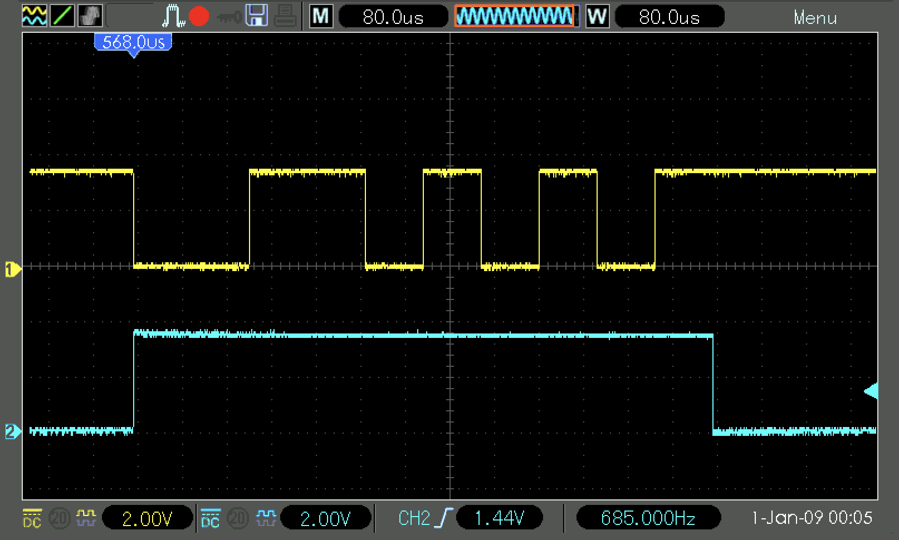

<div align="justify">

# Practicum 10
[[**Home**](https://github.com/lpacher/lae)] [[**Back**](https://github.com/lpacher/lae/tree/master/fpga/practicum)]

In this practicum you will experiment with the
[**Universal Asynchronous Receiver/Transmitter (UART)**](https://www.rohde-schwarz.com/cz/products/test-and-measurement/essentials-test-equipment/digital-oscilloscopes/understanding-uart_254524.html) protocol on real FPGA hardware.

For this purpose **two sample RTL designs** have been already prepared for you, both implementing a UART transmitter written
in Verilog HDL to **send data from the FPGA to the host computer** through the **on-board USB/UART bridge** available on the
Digilent Arty-A7 board.

The proposed two designs implement the following functionalities:

* send printable **ASCII characters** stored into a ROM through UART
* read the **on-chip temperature** by compiling a **Xilinx A/D Converter (XADC)** IP core and send temperature values through UART

<br />

Top-level RTL modules are `uart_ascii.v` and `uart_xadc.v` respectively.
All HDL and IP sources, scripts and constrains are available in the `.solutions/` directory as usual.

For this practicum, **try yourself** to:

* copy the `Makefile` from the `.solutions/` directory
* setup the work area
* copy all required sources and scripts from the `.solutions/` directory
* inspect RTL sources and the design hierarchy
* compile required IP cores from XCI files
* implement the designs on target FPGA
* install and debug both firmwares

<br />
<!--------------------------------------------------------------------->


## UART ASCII

Start to implement the `uart_ascii.v` design first. Ispect RTL sources and try to reconstruct the design hierarchy.
Cross-check your results with the RTL schematic generated by Vivado.

<br />

>
> **QUESTION**
>
> Which IP cores are used into the design ?
>
>   \___________________________________________________________________________________
>

<br />


Once the firmware has been properly installed use the [**PuTTY terminal emulator**](https://www.putty.org/) to open a serial connection
and read data from the FPGA. You already installed this additional software as part of the [**lab zero**](../../labs/lab0/README.md).

<br />

>
> **IMPORTANT NOTE FOR LINUX USERS**
>
> On Linux systems both FTDI USB/JTAG and USB/UART serial interfaces appear in the file system
> as _device files_ usually named `/dev/ttyUSB0` and `/dev/ttyUSB1`. By default these device files
> are owned by the system administrator `root` and readable/writable from users part of the `dialout`
> group:
>
> ```
> % ls -l /dev/ttyUSB*
>
> crw-rw---- 1 root dialout 188 ... /dev/ttyUSB0
> crw-rw---- 1 root dialout 188 ... /dev/ttyUSB1
> ```
>
> <br />
>
> In order to ensure that a PuTTY instance launched as a **standard user** is able to read/write
> from/to `/dev/ttyUSBx` the user has to be part of this `dialout` Linux group.
>
> For this purpose add your user to the `dialout` group so you have appropriate permissions
> to interact with the device: 
>
> ```
> % sudo usermod -a -G dialout $USER
> ```
>
> <br />
>
> In order to **refresh and update your user group membership** without rebooting the system
> run the following command:
>
> ```
> % newgrp dialout
> ```
>
> <br />
>
> Once done verify that your user is now part of the `dialout` group with:
>
> ```
> % groups
> % cat /etc/group | grep dialout
> ```
>

<br />

As a first step verify that the PuTTY program is installed on the system and available from the command line:

```
% which putty
```

<br />

If the executable is found on the system start the application from the terminal as follows:

```
% putty &   (for Linux users)

% putty     (for Windows users)
```

<br />

Setup a new serial connection with the following configuration:

* Serial line: `/dev/ttyUSBx` (Linux) or `COMx` (Windows)
* Conection type: Serial
* Speed: 9600

<br />

Please **customize the name of the port** according to the system (e.g. `COM10`). In order to find the actual name
of the port Linux users can use the `dmesg` command:

```
% sudo dmesg
```

<br />

Windows users can use the `mode` command instead:

```
% mode
```

<br />

Alternatively launch the _Device Manager_ from the Windows _Command Prompt_

```
% devmgmt.msc
```

<br />

and expand the **Ports (COM & LPT)** section.

Once done left-click on the **Open** button to establish the connection between the FPGA
and the host computer. Alternatively you can bypass the PuTTY graphical configuration and
**start the communication from the command line** as follows:

```
% putty -serial /dev/ttyUSBx -sercfg 9600   (for Linux users)

% putty -serial COMx -sercfg 9600           (for Windows users)
```

<br />

Display at the oscilloscope both the serial output stream **TxD** and the **busy** signals at the same
time using two probes. For easier debug, it is recommended to trigger on the auxiliary **busy** signal
generated by the UART transmitter. A complete list of ASCII characters is available under `doc/ascii_table.pdf`.
Compare oscilloscope results with the expected UART-protocol timing specification.

Ask to the teacher if you need help.

<br />

<br />

<br />

<br />

>
> **QUESTION**
>
> Which is the endianness of the UART transmitted data ?
>
>   \___________________________________________________________________________________
>

<br />
<!--------------------------------------------------------------------->


## UART XADC

Move to the `uart_xadc.v` design once happy. The `uart_xadc.v` design uses the embedded 12-bit XADC to monitor
the on-chip temperature and to send temperature values to the local computer through the FTDI UART/USB bridge.

In order to make a **real-time histogram** of the incoming XADC data a simple **PyROOT data-acquisition system (DAQ)**
that use the **Serial** Python library in place of PuTTY.


For Linux users:

```
% sudo apt-get install python-pip

% sudo yum install python-pip
% python -m pip install pyserial
```

<br />

A fully-working pre-compiled Python 2.7 installation including this extra Python library has been already prepared
for Windows users and it is available at the following link:

_<http://personalpages.to.infn.it/~pacher/teaching/FPGA/software/windows/Python.zip>_

<br />

Assuming that you have a proper PyROOT installation you can run the code with:

```
% cp .solutions/bin/hCode.py ./bin/
% python ./bin/hCode.py
```

<br />

Ask to the teacher if you need help.

<br />
<!--------------------------------------------------------------------->


## Exercises

<br />

**EXERCISE 1**

Try yourself to modify the UART transmitter in order to include also the **parity-bit** into UART frames.

<br />
<!--------------------------------------------------------------------->


**EXERCISE 2**

Modify the `uart_ascii.v` design in order to replace the ROM written in Verilog with a Xilinx IP core.

</div>
