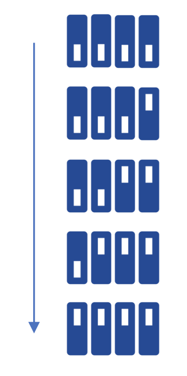
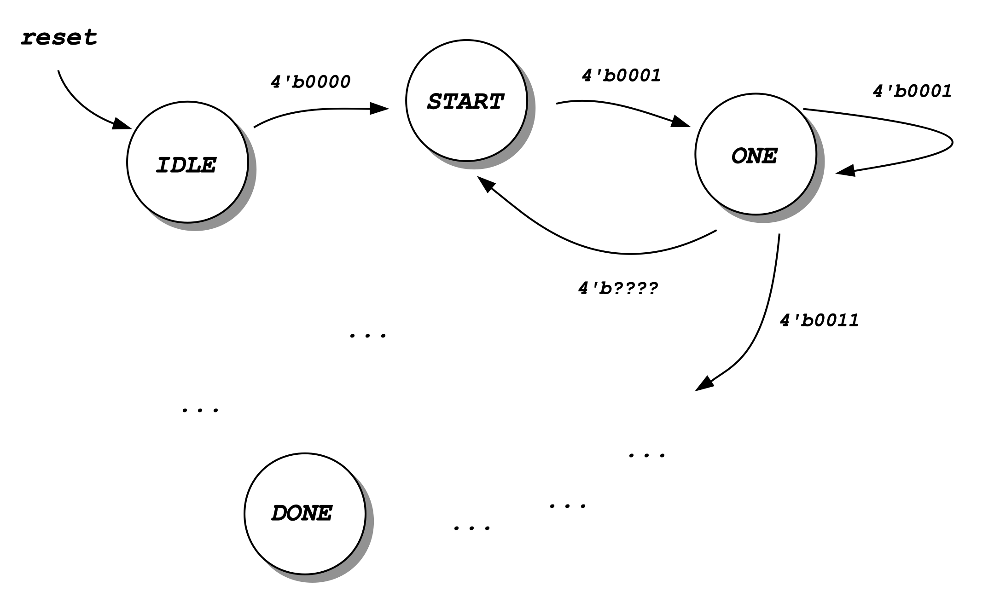

<div align="justify">


# Practicum 11
[[**Home**](https://github.com/lpacher/lae)] [[**Back**](https://github.com/lpacher/lae/tree/master/fpga/practicum)]

## Contents

* [**Introduction**](#introduction)
* [**Practicum aims**](#practicum-aims)
* [**Navigate to the practicum directory**](#navigate-to-the-practicum-directory)
* [**Setting up the work area**](#setting-up-the-work-area)
* [**RTL coding**](#rtl-coding)
* [**Design constraints**](#design-constraints)
* [**Implement the design on target FPGA**](#implement-the-design-on-target-fpga)
* [**Install and debug the firmware**](#install-and-debug-the-firmware)


<br />
<!--------------------------------------------------------------------->


## Introduction
[**[Contents]**](#contents)

In this practicum you are requested to implement a simple **sequence detector** using
a **Finite State Machine (FSM)** algorithm.
As an example, try yourself to design a FSM able to detect the
switching-sequence of the four slide-switches **SW0** , **SW1** , **SW2** and **SW3**
available on the Digilent _Arty_ board from right to left as depicted in figure.

<br />




<br />
<!--------------------------------------------------------------------->


## Practicum aims
[**[Contents]**](#contents)

This practicum should exercise the following concepts:

* review the concept of sequence detector
* implement a simple Finite State machine (FSM) in Verilog

<br />
<!--------------------------------------------------------------------->


## Navigate to the practicum directory
[**[Contents]**](#contents)

As a first step, open a **terminal** window and change to the practicum directory:

```
% cd Desktop/lae/fpga/practicum/11_sequence_detector_FSM
```

<br />

List the content of the directory:

```
% ls -l
% ls -la
```

<br />
<!--------------------------------------------------------------------->


## Setting up the work area
[**[Contents]**](#contents)


Copy from the `.solutions/` directory the main `Makefile` already prepared for you:

```
% cp .solutions/Makefile .
```

<br />

Create a new fresh working area:

```
% make area
```

<br />

Additionally, recursively copy from the `.solutions/` directory all scripts
already prepared for you:

```
% cp -r .solutions/scripts/  .
```

<br />
<!--------------------------------------------------------------------->


## RTL coding
[**[Contents]**](#contents)

Create with your **text-editor** application a new Verilog source file named `rtl/sequence_detector_FSM.v`
as follows:

```
% gedit rtl/sequence_detector_FSM.v &   (for Linux users)

% n++ rtl\sequence_detector_FSM.v       (for Windows users)
``` 

<br />


The `sequence_detector_FSM` Verilog module that you are going to implement runs with the
nominal 100 MHz external clock, has 4-inputs corresponding to slide-switches available on the
_Arty_ board, one reset and a LED on which display that the right sequence has been detected.

```verilog
module sequence_detector_FSM (

   input  wire clk,         // external 100 MHz clock from XTAL oscillator
   input  wire reset,       // external reset (map this to teh RESET red push-button)
   input  wire [3:0] SW,    // slide-switches
   output wire LED          // turn on the LED when the sequence has been detected

   ) ;

   ...
   ...

   reg [...] STATE ;

   ...
   ...

   always @(posedge clk) begin

      ...
      ...

   end   //always 

endmodule
```

<br />

A partial **state diagram** is depicted below:

<br />



<br />

Please remind that you can check for syntax errors at any time by compiling
your source code with:

```
% make compile hdl=rtl/sequence_detector_FSM.v
```

<br />
<!--------------------------------------------------------------------->


## Design constraints
[**[Contents]**](#contents)

In order to map the Verilog code on real FPGA hardware you also need to write a **constraints file**
using a **Xilinx Design Constraints (XDC) script**.

Create with your **text-editor** application a second source file named `xdc/sequence_detector_FSM.xdc`
as follows:

```
% gedit xdc/sequence_detector_FSM.xdc &   (for Linux users)

% n++ xdc\sequence_detector_FSM.xdc       (for Windows users)
```

<br />

Try yourself to write proper design constraints for the sequence-detector with following specifications:

* map the reset signal to the **RESET** red push-button
* map sequence parallel-inputs to slide switches
* turn on/off the "blue" LED of the **LD3** RGB LED with "detected" flag
* debug the value of the current-state by mapping `STATE` to standard LEDs

<br />
<!--------------------------------------------------------------------->


## Implement the design on target FPGA
[**[Contents]**](#contents)

Run the FPGA implementation flow in _**Non Project mode**_ from the command line:

```
% make build
```

<br />

Once done, verify that the **bitstream file** has been properly generated:

```
% ls -l work/build/outputs/  | grep .bit
```

<br />
<!--------------------------------------------------------------------->


## Install and debug the firmware
[**[Contents]**](#contents)

Connect the board to the USB port of your personal computer using a **USB A to micro USB cable**.
Verify that the **POWER** status LED turns on. Once the board has been recognized by the operating
system **upload the firmware** from the command line using:

```
% make install
```

<br />

Once the firmware has been successfully installed press the **RESET** button, then play with
slide-switches and check if your state-machine properly detects the requested sequence.
Debug the value of the current-state by looking at standard LEDs.

<br />
<!--------------------------------------------------------------------->

</div>
