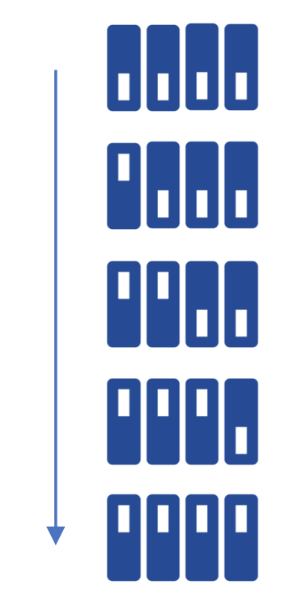

<div align="justify">


# Practicum 11
[[**Home**](https://github.com/lpacher/lae)] [[**Back**](https://github.com/lpacher/lae/tree/master/fpga/practicum)]

## Contents

* [**Introduction**](#introduction)
* [**Practicum aims**](#practicum-aims)
* [**Navigate to the practicum directory**](#navigate-to-the-practicum-directory)
* [**Setting up the work area**](#setting-up-the-work-area)
* [**RTL coding**](#rtl-coding)
* [**Simulate the design**](#simulate-the-design)
* [**Design constraints**](#design-constraints)
* [**Implement the design on target FPGA**](#implement-the-design-on-target-fpga)
* [**Install and debug the firmware**](#install-and-debug-the-firmware)
* [**Exercises**](#exercises)


<br />
<!--------------------------------------------------------------------->


## Introduction
[**[Contents]**](#contents)

In this practicum you are requested to implement a simple **sequence detector** using
a **Finite State Machine (FSM)** algorithm.
As an example, try yourself to design a FSM able to detect the
switching-sequence of the four slide-switches **SW0** , **SW1** , **SW2** and **SW3**
available on the Digilent _Arty_ board from right to left as depicted in figure.

<br />


<br /><br />

In practice the circuit has to be able to detect a **thermometer-code** sequence

```
4'b0000
4'b0001
4'b0011
4'b0111
4'b1111
```

<br>

generated using slide-switches as inputs for the state-machine.

<br />
<!--------------------------------------------------------------------->


## Practicum aims
[**[Contents]**](#contents)

This practicum should exercise the following concepts:

* review the concept of sequence detector
* implement a simple Finite State machine (FSM) in Verilog

<br />
<!--------------------------------------------------------------------->


## Navigate to the practicum directory
[**[Contents]**](#contents)

As a first step, open a **terminal** window and change to the practicum directory:

```
% cd Desktop/lae/fpga/practicum/11_sequence_detector_FSM
```

<br />

List the content of the directory:

```
% ls -l
% ls -la
```

<br />
<!--------------------------------------------------------------------->


## Setting up the work area
[**[Contents]**](#contents)


Copy from the `.solutions/` directory the main `Makefile` already prepared for you:

```
% cp .solutions/Makefile .
```

<br />

Create a new fresh working area:

```
% make area
```

<br />

Additionally, recursively copy from the `.solutions/` directory simulation sources
and scripts already prepared for you:

```
% cp -r .solutions/bench/    .
% cp -r .solutions/scripts/  .
```

<br />
<!--------------------------------------------------------------------->


## RTL coding
[**[Contents]**](#contents)

Create with your **text-editor** application a new Verilog source file named `rtl/sequence_detector_FSM.v`
as follows:

```
% gedit rtl/sequence_detector_FSM.v &   (for Linux users)

% n++ rtl\sequence_detector_FSM.v       (for Windows users)
``` 

<br />

The `sequence_detector_FSM` Verilog module that you are going to implement runs with the
nominal 100 MHz external clock, has 4-inputs corresponding to slide-switches available on the
_Arty_ board, one reset and a LED on which display that the right sequence has been detected.

<br />

A partial **state diagram** is depicted below:

<br />


<br /><br />

Try yourself to complete the following code skeleton:

```verilog
module sequence_detector_FSM (

   input  wire clk,         // external 100 MHz clock from XTAL oscillator
   input  wire reset,       // external reset (map this to the RESET red push-button)
   input  wire [3:0] SW,    // slide-switches
   output wire detected     // turn on a LED with this output when the sequence has been detected

   ) ;


   /////////////////////////////////
   //   states-definition table   //
   /////////////////////////////////

   parameter [...] IDLE  = .... ;
   parameter [...] START = .... ;
   ...
   ...
   parameter [...] DONE  = .... ;


   reg [...] STATE, STATE_NEXT ;


   //////////////////////////
   //   next-state logic   //
   //////////////////////////

   always @(posedge clk) begin

      ...
      ...

   end   //always 


   /////////////////////////////
   //   combinational logic   //
   /////////////////////////////

   always @(*) begin

      ...
      ...

   end   //always 

   assign detected = ( STATE == DONE ) ? 1'b1 : 1'b0 ;

endmodule
```

<br />


Please remind that you can check for syntax errors at any time by compiling
your source code with:

```
% make compile hdl=rtl/sequence_detector_FSM.v
```

<br />
<!--------------------------------------------------------------------->


## Simulate the design
[**[contents]**](#contents)

An example testbench code has been already prepared for you to help you to verify that all connections are OK
and that your FSM implementation works properly. Open with your preferred text-editor application the testbench
and inspect the proposed simulation code:

```
% gedit bench/sequence_detector_FSM.v &   (for Linux users)

% n++ bench\sequence_detector_FSM.v       (for Windows users)
```

<br />

Beside standard verification features (clock-generation, DUT instantiation etc.) the testbench uses
a **Read-Only Memory (ROM)** to store an arbitrary **sequence of switch positions** as inputs for the
sequence detector.

```verilog

reg [4:0] mem [0:15] ;

// ROM initialization
initial begin

   mem[ 0] = 4'b0000 ;
   mem[ 1] = 4'b0010 ;
   mem[ 2] = 4'b1010 ;
   mem[ 3] = 4'b0000 ;  //OK
   mem[ 4] = 4'b0001 ;  //OK
   mem[ 5] = 4'b0011 ;  //OK
   mem[ 6] = 4'b1011 ;
   mem[ 7] = 4'b0000 ;  //OK
   mem[ 8] = 4'b0001 ;  //OK
   mem[ 9] = 4'b0011 ;  //OK
   mem[10] = 4'b0011 ;  //OK
   mem[11] = 4'b0111 ;  //OK
   mem[12] = 4'b1111 ;  //OK  => detected!
   mem[13] = 4'b1110 ;
   mem[14] = 4'b0000 ;  //OK
   mem[15] = 4'b0001 ;  //OK

end
```

<br />

Before mapping the RTL code into real FPGA hardware **run a behavioral simulation** of the complete RTL code
at the command line and verify the requested functionality for the sequence detector:

```
% make sim mode=gui
```

<br />
<!--------------------------------------------------------------------->


## Design constraints
[**[Contents]**](#contents)

In order to map the Verilog code on real FPGA hardware you also need to write a **constraints file**
using a **Xilinx Design Constraints (XDC) script**.

Create with your **text-editor** application a second source file named `xdc/sequence_detector_FSM.xdc`
as follows:

```
% gedit xdc/sequence_detector_FSM.xdc &   (for Linux users)

% n++ xdc\sequence_detector_FSM.xdc       (for Windows users)
```

<br />

Try yourself to write proper design constraints for the sequence-detector with following specifications:

* map the reset signal to the **RESET** red push-button
* map sequence parallel-inputs to slide switches
* turn on/off the "blue" LED of the **LD3** RGB LED with "detected" flag
* debug the value of the current-state by mapping `STATE` to standard LEDs

<br />
<!--------------------------------------------------------------------->


## Implement the design on target FPGA
[**[Contents]**](#contents)

Run the FPGA implementation flow in _**Non Project mode**_ from the command line:

```
% make build
```

<br />

Once done, verify that the **bitstream file** has been properly generated:

```
% ls -l work/build/outputs/  | grep .bit
```

<br />
<!--------------------------------------------------------------------->


## Install and debug the firmware
[**[Contents]**](#contents)

Connect the board to the USB port of your personal computer using a **USB A to micro USB cable**.
Verify that the **POWER** status LED turns on. Once the board has been recognized by the operating
system **upload the firmware** from the command line using:

```
% make install
```

<br />

Once the firmware has been successfully installed press the **RESET** button, then play with
slide-switches and check if your state-machine properly detects the requested sequence.
Debug the value of the current-state by looking at standard LEDs.

<br />
<!--------------------------------------------------------------------->


## Exercises
[**[Contents]**](#contents)

<br />

**EXERCISE 1**

Add to your RTL design a **Phase-Locked Loop (PLL)** IP core to **filter the jitter on the external input clock**
fed to the core logic. The main **Xilinx Core Instance (XCI)** XML file containing the configuration of the IP
has been already prepared for you.

Create a new `cores/PLL/` directory to contain IP sources that will be generated by the Vivado IP flow:

```
% mkdir cores/PLL
```

<br />

Copy from the `.solutions/cores/PLL/` directory the main XCI configuration file:

```
% cp .solutions/cores/PLL/PLL.xci  cores/PLL/
```

<br />


Finally, **compile the IP** using `make` as follows:

```
% make ip xci=cores/PLL/PLL.xci
```

<br />

At the end of the flow verify that all IP sources are in place:

```
% ls -l cores/PLL/
```

<br />

Inspect the Verilog instantiation template:

```
% cat cores/PLL/PLL.veo
```

<br />

Once all IP sources are in place **try yourself** to include the new PLL core into your RTL design.
For this purpose drive the entire logic with the PLL output clock `pll_clk` and include the `pll_locked`
flag in the reset scheme.

<br />
<!--------------------------------------------------------------------->

**EXERCISE 2**

Modify the FSM in order to detect the opposite sequence, from left to right as depicted in figure.

<br />



<br />
<!--------------------------------------------------------------------->

</div>
