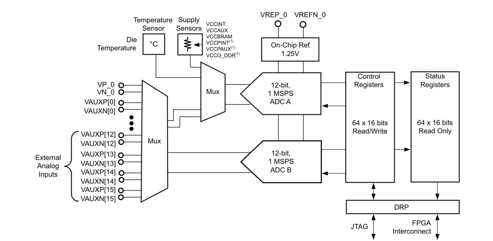

<br />



<br /><br />

--------------------------------------------------------------------------------------------

Summary:

Porting del progetto Arduino classico "too hot" che usa analogRead() e accende i LEDs a seconda della temperatura.

1) compile XADC to monitor A0 with VAUX4P/VAUX4N

2) connettere potenziometro tra 3.3V e GND

3) mappare i 3-bits piu` significativi del conteggio ADC sui LEDs come da Demo digilent

PASSO SUCCESSIVO:

4) mandare i 12-bits in ingresso ad un double-dabber per convertili in BCD

5) integrare nel disegno il display a 4 cifre gia` realizzato per visualizzare
il codice ADC in integer sul display 7-segmenti

--------------------------------------------------------------------------------------------


Proporre un progettino MOLTO SEMPLICE stile Digilent/Arduino per dimostrare
l'uso dell' XADC e far apprezzare poi analogRead() in Arduino.

Ad esempio con un TMP36 attaccato per leggere la temperatura.

https://digilent.com/reference/programmable-logic/arty-a7/demos/xadc

In pratica la Demo digilent crea

1. un voltage divider di resistenze discrete tra VCC (3.3V) e ground
(posso usare anche un sempice trimmer)

2. compila XADC in modo da convertire V_in,Dc presa dai nodi del partitore

3. con i 3 MSB del codice dell'ADC accende i LEDs sulla board

In tutto questo ... ** RISOLTO FINALMENTE IL MISTERO !!! **

Perche' nella demo in ingresso all'ADC vado a dare 0 -> 3.3V che e` un range PROIBITO per XADC !!!

Infatti XADC e` scritto ovunque lavora con:

0V -> 1V MAX. in single-ended mode oppure

-0.5V -> + 0.5V in differential mode


Come e` possibile allora che la Demo permetta di dare fino a 3.3 V in input ?

RISPOSTA: alcuni pins dell'header "analogico" hanno gia` sul PCB un **VOLTAGE DIVIDER** 
per scalare 3.3V a 1.0V !!! Ecco il "miracolo" !!!

Bastava leggere bene la user guide :-(  => c'e` anche lo schematico

In particolare i pins A0 ... A5 del ChipKit header (ma SOLO QUESTI !!!) hanno sulla PCB un partitore
di tensione di valore

R1 = 2.32 k
R2 = 1k

quindi

Vin,ADC = [R2/(R1 + R2)] x 3.3V = 1/(2.32 + 1) x 3.3V = 0.994V che sono OK per il range di XADC !!!

Che poi era il motivo per cui il pull-up sul Cin del FullAdder non funzionava (mail a Paolo e Zugravel)

Da notare inoltre nello schematico la presenza di un filtro RC passa-basso in uscita dal partitore
verso l'ADC interno. I valori sono

R = 140 ohm
C = 1 nF

quindi una cut-frequency simulata in LTspice di 94.6 kHz (tutto insieme, voltage divider + RC serie)


https://forum.digilent.com/topic/32348-arty-a-7-xadc-input-signal-voltage-swing-issue/

Una volta che uno sa questo usare XADC per convertire un singolo input-voltage e` facilissimo perche`

1) al pin A0 sulla Arty corrispondono 2 nets analogiche CK_AN0_P e CK_AN0_N hard-wired ai pins
C6 e C5 della FPGA. A loro volta questi sono gli ingressi .vauxp4() e .vauxn4() dell' IP core

2) come da schematico vedo subito che vauxn4 e` in realta` connesso al GND, mentre vauxp4 al voltage divider!

set_property -dict { PACKAGE_PIN C6  IOSTANDARD LVCMOS33 } [get_ports { vauxp4 }]  => voltage-divider ouput from A0
set_property -dict { PACKAGE_PIN C5  IOSTANDARD LVCMOS33 } [get_ports { vauxn4 }]  => poi GND sulla board


3) l'indirizzo del MUX analogico per mandare Vin all'ADC e` poi 7'h14 (da confermare ma sulla Demo e` cosi`)


Quindi alla fine del tipo:

xadc_wiz_0  xadc (

   .convst_in  (       AdcSoc ),   // start-of-conversion (SOC) flag to ADC
   .daddr_in   (        7'h14 ),   // address for the Dynamic Reconfiguration Port (DRP), set 7'h14 to read A0
   .dclk_in    (       AdcClk ),   // on-board 100 MHz system clock fed to DRP
   .den_in     (       AdcEoc ),   // read-enable for the DRP, connected to ADC EOC
   .di_in      (     16'h0000 ),   // optional 16-bit input-data to the DRP, not required 
   .dwe_in     (         1'b0 ),   // write-enable for the DRP, keep low (no need to write any register)
   .busy_out   (              ),   // busy signal, the ADC is converting something
   .do_out     ( do_out[15:0] ),   // ADC output data, but useful bits are only 12-bits do_out[15:4]
   .drdy_out   (              ),   // do_out[15:0] bits are ready
   .eoc_out    (       AdcEoc ),   // end-of-conversion (EOC) flag, use it as read-enable for DRP
   .eos_out    (              ),   // end-of-sequence (EOS) flag, keep unconnected
   .alarm_out  (              ),   // OR between all alarms, not used
   .vp_in      (         1'b0 ),   // on-board V+ analog input, can't stay unconnected (DRC)
   .vn_in      (         1'b0 ),   // on-board V- analog input, can't stay unconnected (DRC)
   .vauxp4     (       vauxp4 ),   // connected to A0 input through voltage-divider + low-pass filter on the board
   .vauxn4     (       vauxn4 )    // connected to GND through series resistor on the board

) ;


Poi questi wires vauxp4/vauxn4 me li porto al top e li connetto con XDC


Infine gestisco io con un ticker quando far partire l'ADC, mentre poi con i 12 bits del codice ci faccio
cosa voglio.

Esempio: usare un dable-dabber per rimappare 12-bit binari in 4-digit BCD e visualizzare il codice
su display 7-segmenti.


## Extra: comparison with Arduino code

```cpp
// Arduino ADC Example Usage

#define ANALOG_PIN 11

void setup() {

   pinMode(ANALOG_PIN, INPUT);
}


void loop() {

   analogRead(PIN);
}
```

<br />
<!--------------------------------------------------------------------->

