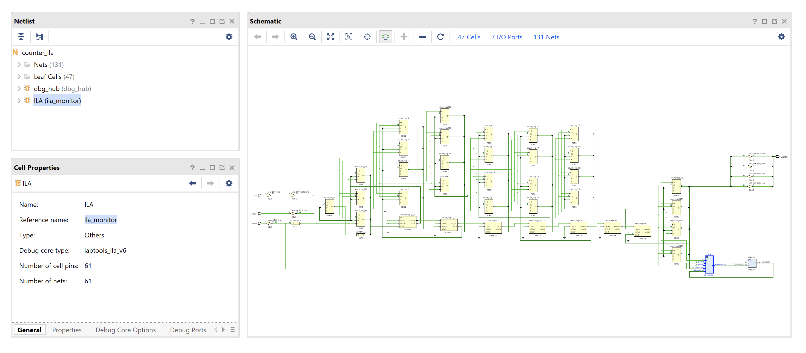
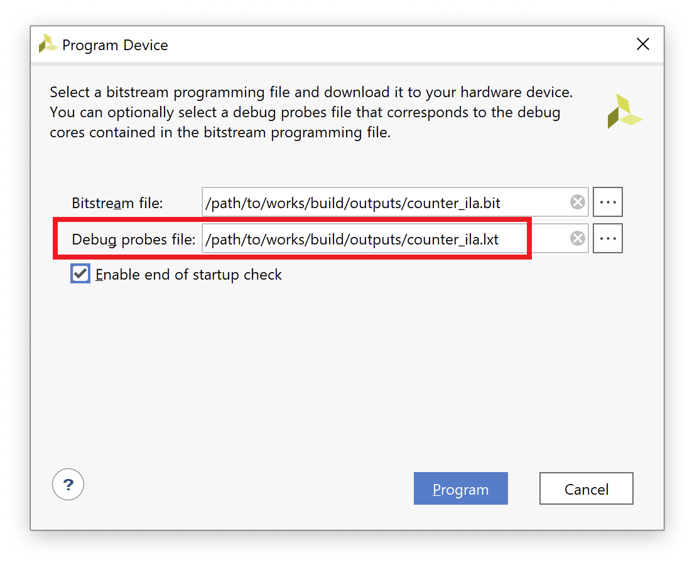
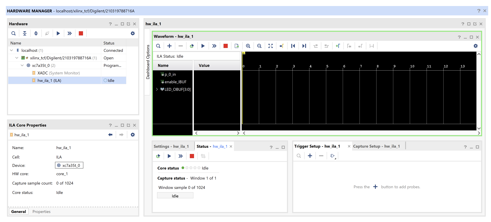
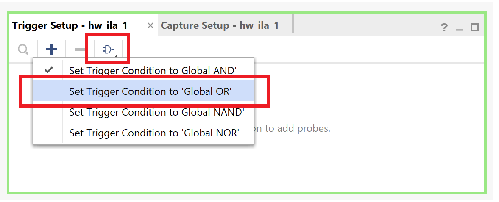
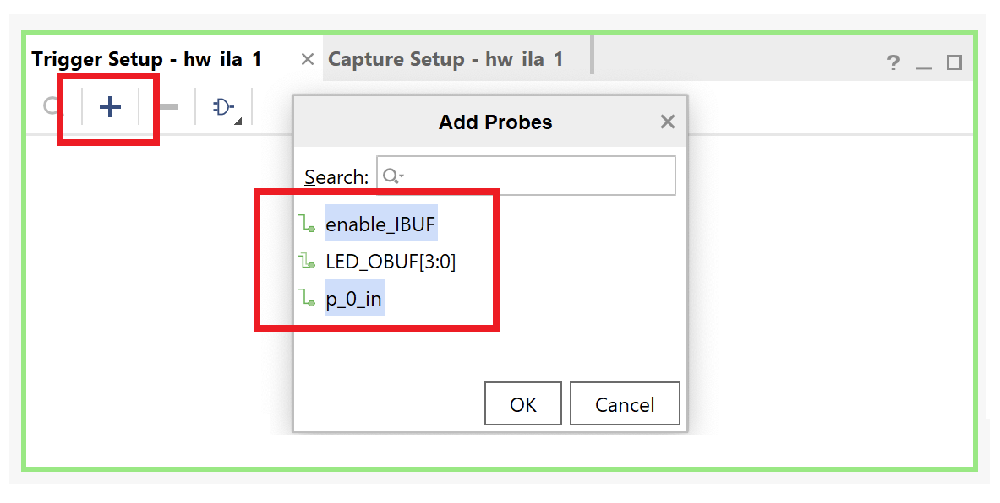
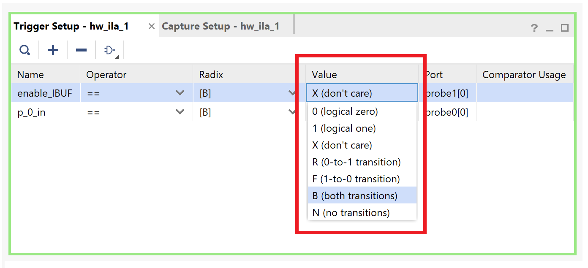
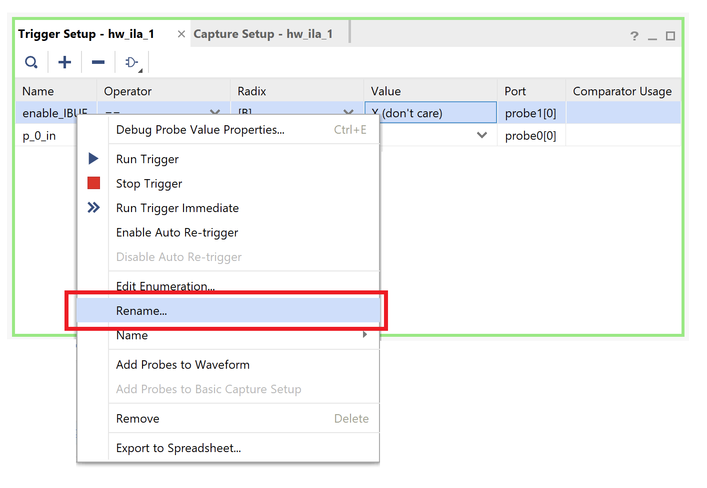
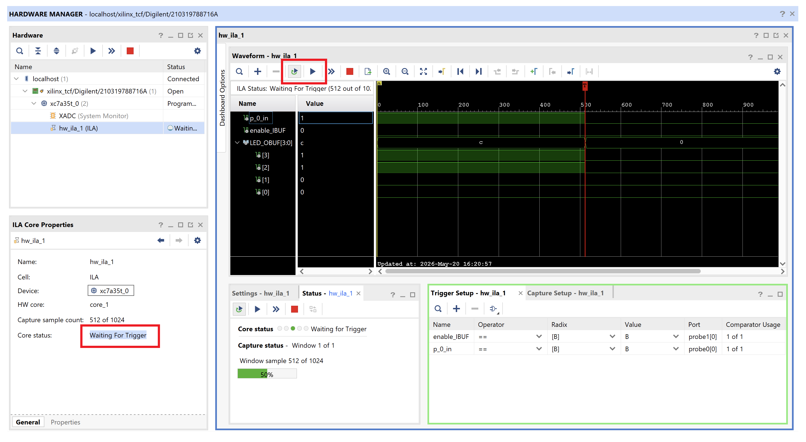

<div align="justify">

# Practicum 13
[[**Home**](https://github.com/lpacher/lae)] [[**Back**](https://github.com/lpacher/lae/tree/master/fpga/practicum)]

## Contents

* [**Introduction**](#introduction)
* [**Practicum aims**](#practicum-aims)
* [**Navigate to the practicum directory**](#navigate-to-the-practicum-directory)
* [**Setting up the work area**](#setting-up-the-work-area)
* [**Review RTL sources**](#review-rtl-sources)
* [**Implement the design on target FPGA**](#implement-the-design-on-target-fpga)
* [**Install and debug the firmware**](#install-and-debug-the-firmware)
* [**Insert an Integrated Logic Analyzer (ILA) debug core**](#insert-an-integrated-logic-analyzer-ila-debug-core)
* [**Export the ILA debug probes file**](#export-the-ila-debug-probes-file)
* [**Install the new firmware with ILA probes**](#install-the-new-firmware-with-ila-probes)
* [**Setup triggers and debug signals into the ILA dashboard**](#setup-triggers-and-debug-signals-into-the-ila-dashboard)
* [**Further readings**](#further-readings)

<br />
<!--------------------------------------------------------------------->

## Introduction
[**[Contents]**](#contents)

The goal of this practicum is to to introduce and demonstrate the usage
of the **Integrated Logic Analyzer (ILA)** debug feature available in Vivado.

<br />
<!--------------------------------------------------------------------->


## Practicum aims
[**[Contents]**](#contents)

This practicum should exercise the following concepts:

* introduce the usage of the Integrated Logic Analyzer (ILA) IP core in Vivado
* insert a ILA debug core on a simple RTL design
* capture and debug logic signals in the Vivado Hardware Manager

<br />
<!--------------------------------------------------------------------->


## Navigate to the practicum directory
[**[Contents]**](#contents)

As a first step, open a **terminal** window and change to the practicum directory:

```
% cd Desktop/lae/fpga/practicum/13_ila
```

<br />
<!--------------------------------------------------------------------->


## Setting up the work area
[**[Contents]**](#contents)


Copy from the `.solutions/` directory the main `Makefile` already prepared for you:

```
% cp .solutions/Makefile .
```

<br />

Create a new fresh working area:

```
% make area
```

<br />

Additionally, recursively copy from the `.solutions/` directory the following design sources and scripts already prepared for you:

```
% cp -r .solutions/rtl/      .
% cp -r .solutions/scripts/  .
% cp -r .solutions/xdc/      .
```

<br />
<!--------------------------------------------------------------------->


## Review RTL sources
[**[Contents]**](#contents)

The proposed block is a simple 28-bit binary counter running at 100 MHz clock with external reset and count-enable control signals.
Additionally the four most-significant bits (MSB) of this counter simply drives four general-purpose LEDs on the _Arty_ board.

Review yourself in your text-editor application the main RTL module `rtl/counter_ila.v` before continuing:

```
% gedit rtl/counter_ila.v &   (for Linux users)

% n++ rtl\counter_ila.v       (for Windows users)
```

<br />
<!--------------------------------------------------------------------->


## Implement the design on target FPGA
[**[Contents]**](#contents)

Inspect the content of the main **Xilinx Design Constraints (XDC)** file used to implement the design on real FPGA hardware already
prepared for you:

```
% cat xdc/counter_ila.xdc
```

<br />

If not already in place, copy the file from the `.solutions/` directory as follows:

```
% cp .solutions/xdc/counter_ila.xdc  xdc/
```

<br />

Identify all pins that have been used to map top-level RTL ports.
Run the FPGA implementation flow in _**Non Project mode**_ from the command line:

```
% make build
```

<br />

Once done, verify that the **bitstream file** has been properly generated:

```
% ls -l work/build/outputs/  | grep .bit
```

<br />
<!--------------------------------------------------------------------->


## Install and debug the firmware
[**[Contents]**](#contents)

Connect the board to the USB port of your personal computer using a **USB A to micro USB cable**. Verify that the **POWER** status LED turns on.
Once the board has been recognized by the operating system **upload the firmware** from the command line using:

```
% make install
```

<br />

Play with reset and count-enable input controls to check that the firmware works as expected.

<br />
<!--------------------------------------------------------------------->


## Insert an Integrated Logic Analyzer (ILA) debug core
[**[Contents]**](#contents)

Let now suppose that for unknown reasons the firmware installed on the board does not work as expected.
The **Integrated Logic Analyzer (ILA)** core allows you to "spy" real FPGA **internal signals** running in hardware
and to display them in a **simulation-like debug environment** integrated within the Vivado _Hardware Manager_.

As an example let suppose that we want to monitor what happens to LED values when controlling the counter
with either the reset or the count-enable. So we want to add an ILA **IP core** to "spy" all these signals
into real FPGA hardware.

For this purpose simply start the Vivado IP flow from `Makefile` as follows:

```
% make ip mode=gui
```

<br />

Once the IP repository has benn successfully initialized in the Vivado **IP Catalog**
go through **Vivado Repository > Debug & Verification > Debug > ILA (Integrated Logic Analyzer)** or simply
search for "ila" in the Search bar. Right-click on the IP and select *Customize IP*.

<br />

In the **General Options** TAB configure the IP with the following specifications:

* Component Name: `ila_monitor`
* Number of Probes: 3
* Sample Data Depth: 1024


Additionally in the **Probe_Ports** TAB specify for the `probe2` port a width of 4-bits to later connect the four LEDs.
Left-clock OK once done. In the **Generate Output Products** window be sure that the **Out of Context** option is checked.
Finally left-click on **Generate** to compile the IP core.

<br />

Once the IP compilation process successfully completed exit from Vivado and verify that all IP deliverables are in place:

```
% ls -l ./cores/ila_monitor/*
```

<br />

Review the **Verilog instantiation template** (`.veo` )part of deliverables:

```
% cat ./cores/ila_monitor/ila_monitor.veo
```

<br />

At this point edit the original RTL code and try yourself to **instantiate** the ILA core to probe both reset and enable
input control signals for the counter and the four output LEDs.

<br />

Additionally place `mark_debug` and `keep` **synthesis pragmas** for all signals that you want to debug as follows:

```verilog
module counter_ila (

   input  wire clk,
   (* mark_debug = "true", keep = "true" *)
   input  wire reset,
   (* mark_debug = "true", keep = "true" *)
   input  wire enable,
   (* mark_debug = "true", keep = "true" *)
   output wire [3:0] LED

   ) ;


   ...
   ...

endmodule
```

<br />

Once done with RTL changes re-build the firmware from scratch:

```
% make clean build
```

<br />
<!--------------------------------------------------------------------->


## Export the ILA debug probes file
[**[Contents]**](#contents)

In order to be able to probe and display FPGA internal signals into the Vivado _Harware Manager_
with a **simulation-like appearance** the so-called ILA debug **probes file** has to be provided
along with the bitfile. This file is automatically generated for you when running **Project mode**
scripts, while it's up to the user to export this file when working with **Non Project mode** scripts
with the `write_debug_probes` Tcl command.

As a first step **restore the final routed design checkpoint (DCP)** in the Vivado graphical interface.

For Linux users:

```
% vivado -mode gui ./work/build/outputs/routed.dcp
```

<br />

For Windows users:

```
% echo "exec vivado -mode gui ./work/build/outputs/routed.dcp &" | tclsh -norc
```

<br />

Inspect in the GUI the final **gate-level schematic** and verify that the ILA IP core is found in your
design.

<br />



<br /><br />

In order to **export the probes file** run the following command in the Vivado Tcl console:

```
write_debug_probes ./work/build/outputs/counter_ila.ltx
```

<br />

Close Vivado once done and verify that the new file is in place:

```
% ls -l ./work/build/outputs/ | grep ltx
```

<br />

You can open this `.ltx` file with any text-editor, in fact the ILA probes file is a plain-text
**JSON (JavaScript Object Notation) file** used by the Vivado _Harware Manager_ to give proper signal
names to "waveforms" that will be traced in the graphical interface during your debug.

Explore the contents of the file using `less`, `more` or `cat` utilities at the command line:

```
% cat ./work/build/outputs/counter_ila.ltx
```

<br />
<!--------------------------------------------------------------------->


## Install the new firmware with ILA probes
[**[Contents]**](#contents)

Start a new session of the Vivado _Hardware manager_ from the command line. For less typing you can use
the following `Makefile` target in place of running `vivado -mode gui` standalone as usual:

```
% make hw_manager mode=gui
```

<br />

Establish a new connection between the _Hardware Manager_ and the _Arty_ board.
To do this, simply left-click on **Open target > Auto Connect**.

Once the FPGA has been properly recognized right-click on the `xc7a35t` device, select **Program Device...**
and specify **both** the **bitstream file** (`.bit`) and the **ILA probes file** (`.ltx`) as in figure:

<br />



<br /><br />

Finally left-click on **Program** to upload the firmware. As you can find traced into the Vivado Tcl console
the following command is used to specify the probes file:

```
set_property PROBES.FILE { /path/to/work/build/outputs/counter_ila.ltx } [get_hw_devices xc7a35t_0]
```

<br />
<!--------------------------------------------------------------------->


## Setup triggers and debug signals into the ILA dashboard
[**[Contents]**](#contents)

Once the FPGA has been successfully programmed the _Hardware Manager_ displays the **ILA Default Dashboard**.
This graphical interface resembles the XSim simulation environment used to trace waveforms, but also includes
**triggers** and **play buttons** as depicted in figure.

<br />



<br /><br />

Since we want to "spy" what happens to LED values when pressing either the reset or the count-enable of our counter
we have to **specify trigger signals** and **trigger conditions** to activate the ILA core.
For this purpose you have to use the **Trigger Setup** window.

As a first step specify as **global trigger condition** the OR-operator:

<br />



<br /><br />

Then add both the reset and the count-enable probes as trigger signals:

<br />



<br /><br />

As an example activate the trigger for these signals whenever a low-to-high or a high-to-low transition occurs:

<br />



<br /><br />

With this setup the ILA will be triggered whenever either the reset OR the enable change.
You can also rename signal names for easier debug in the wave window:

<br />



<br /><br />

Once you have completed with the trigger setup **arm the trigger** and start debugging internal FPGA signals
driven by the external reset button and the count-enable slide-switch.

<br />



<br />

<br />
<!--------------------------------------------------------------------->

## Further readings
[**[Contents]**](#contents)


* _<https://www.realdigital.org/doc/0d71e045cc8d7193b585e8f39eaa9bf3>_
* _<https://opentitan.org/book/doc/contributing/fpga/debugging_with_ila.html>_

<br />
<!--------------------------------------------------------------------->

</div>

