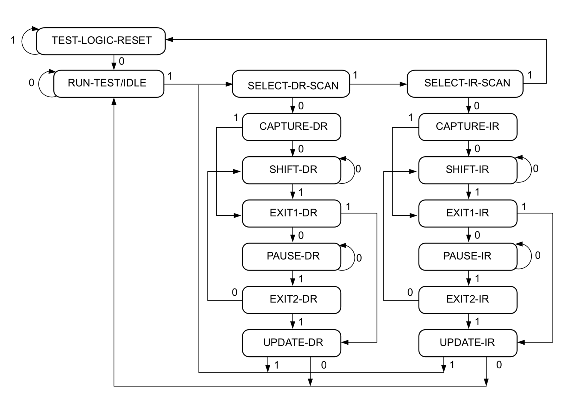
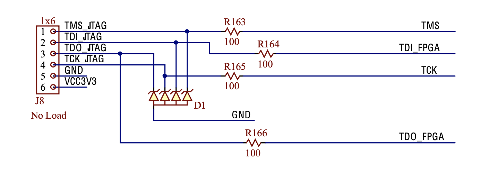
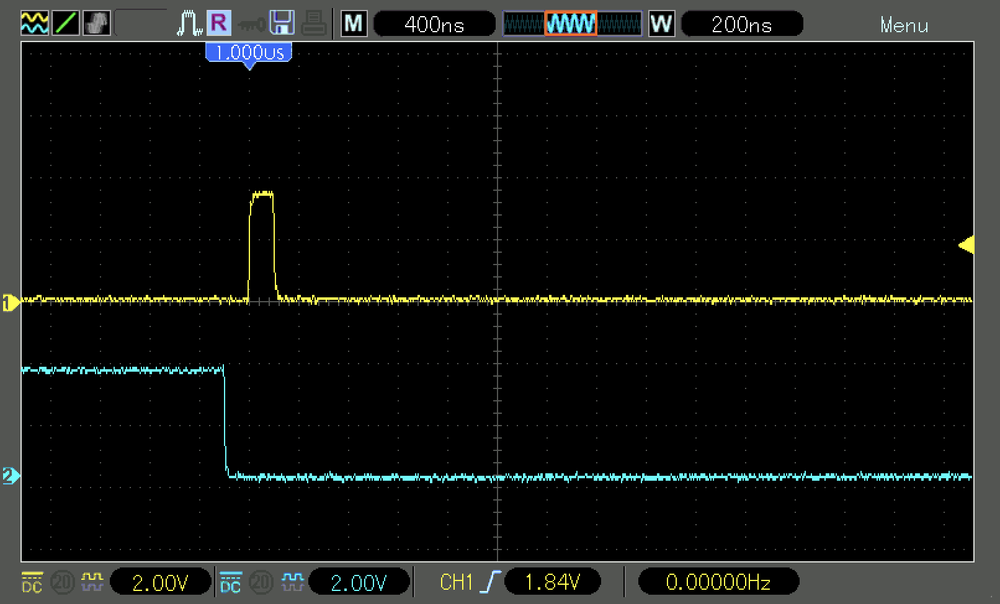
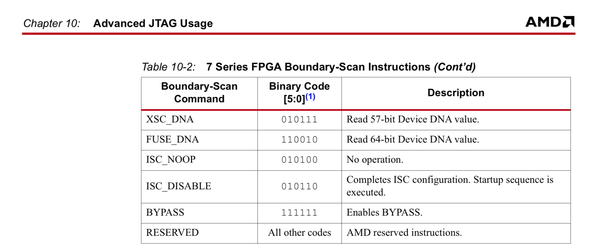
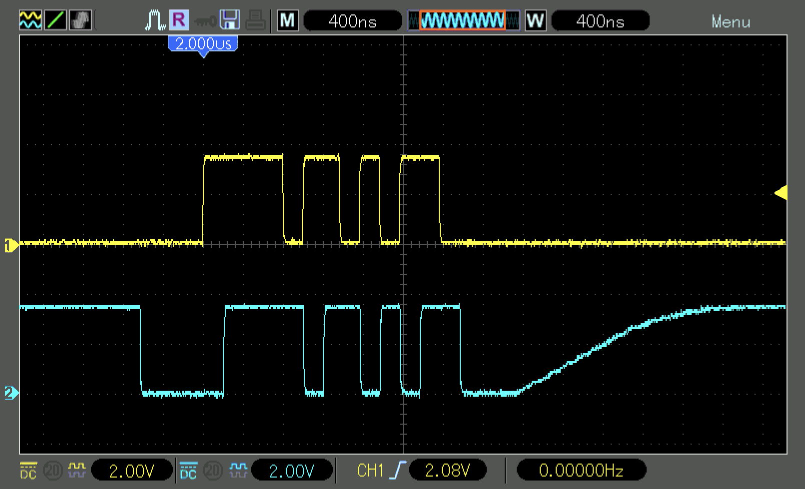

<div align="justify">

# Practicum 15
[[**Home**](https://github.com/lpacher/lae)] [[**Back**](https://github.com/lpacher/lae/tree/master/fpga/practicum)]

<br />

In this practicum experiment yourself with the **JTAG protocol Finite State-Machine (FSM)** using
**low-level** JTAG Tcl commands available in the Vivado _Hardware Manager_:

* `run_state_hw_jtag`
* `scan_ir_hw_jtag`
* `scan_dr_hw_jtag`
* `runtest_hw_jtag`

<br />



<br /><br />

Since you are going to mainly issue **Tcl commands interactively**  in the _Hardware Manager_, 
for your trials you can simply run Vivado in Tcl mode as follows:

```
% cp .solutions/hw_manager.tcl .
% vivado -mode tcl -source hw_manager.tcl
```

<br />

Then start the _Hardware Manager_ from the Vivado Tcl console:

```
open_hw_manager
```

<br />

In order to be able to directly interact with the JTAG **Test Access Port (TAP)**
from the Vivado _Hardware Manager_ you have to establish a connection between the computer
and the board in **JTAG mode** as follows:

```
connect_hw_server -url localhost:3121 -verbose
open_hw_target -jtag_mode on
```

<br />

Connect also **oscilloscope probes** on the dedicated **JTAG header** available on the Digilent _Arty_ board
to debug JTAG **TCK**, **TMS**, **TDI** and **TDO** signals.

<br />



<br /><br />

For easier debug on JTAG signals it is recommended to probe **TCK** on CH1 and always use this signal for the trigger, then properly
set **trigger options** and setup a _single-trigger_ or _single shot_ trigger mode to "capture" JTAG sequences.
Therefore open the **Trigger Menu** and switch the trigger-mode from **Auto** (default) to **Normal**. Ensure that a positive-edge
transition is used as trigger condition.

<br />

If needed you can also **reduce the JTAG clock frequency** from the _Hardware Manager_ Tcl console to avoid signals distortion
due to oscilloscope **bandwidth limitations**. As an example:

```
set_property PARAM.FREQUENCY 5000000 [current_hw_target] ;   #reduce TCK frequency to 5 MHz
```

<br />

Once the target is running in JTAG mode main the **Instruction Register (IR)** and all **Data Registers (DR)**
are accessible through the `scan_ir_hw_jtag` and `scan_dr_hw_jtag` Tcl commands respectively.
Additionally the devices on the target can also be put into various states using the `run_state_hw_jtag` command.

<br />

As an example, run the following commands and check what happens to JTAG waveforms at the oscilloscope:

```
run_state_hw_jtag RESET
run_state_hw_jtag IDLE
```

<br />



<br /><br />

Explore all **command-line switches and options** available for Vivado JTAG Tcl commands.


<br />
<!--------------------------------------------------------------------->

```
run_state_hw_jtag -help
```

<details>
<summary>Show output</summary>

```
Description: 
change to a stable state of a specified transition

Syntax: 
run_state_hw_jtag  [-state <args>] [-quiet] [-verbose] <stable_state>

Returns: 
hardware JTAG

Usage: 
  Name            Description
  ---------------------------
  [-state]        valid state path sequence to stable_state
  [-quiet]        Ignore command errors
  [-verbose]      Suspend message limits during command execution
  <stable_state>  valid stable_state - valid stable states IDLE, RESET, 
                  IRPAUSE, and DRPAUSE

Categories: 
Hardware, Object

Description:

  Transition the hw_jtag object of the current hardware target to the
  specified TAP stable state.

  A hw_jtag object is created by the Hardware Manager feature of the Vivado
  Design Suite when a hardware target is opened in JTAG mode using the
  open_hw_target -jtag_mode command.

  The run_state_hw_jtag command specifies:

   *  An ending or target TAP stable state to transition to.

   *  An optional state path list to transition through to get from the
      current state to the target state.

  If an optional -state path list is defined, then the state list must
  contain all states needed to reach the stable state, or the command will
  return an error. If no state path list is defined, then the command will
  transition from the current state to the target state according to the
  state transition paths defined in the following table:

   Current     Target      State Transition Path  
    State       State  
    DRPAUSE     RESET       DRPAUSE -> DREXIT2 -> DRUPDATE -> DRSELECT ->   
                                IRSELECT-> RESET  
    DRPAUSE     IDLE        DRPAUSE -> DREXIT2 -> DRUPDATE -> IDLE  
    DRPAUSE     DRPAUSE     DRPAUSE -> DREXIT2 -> DRUPDATE -> DRSELECT -> 
                                DRCAPTURE -> DREXIT1 -> DRPAUSE  
    DRPAUSE     IRPAUSE     DRPAUSE -> DREXIT2 -> DRUPDATE -> DRSELECT ->   
                                IRSELECT -> IRCAPTURE -> IREXIT12 -> IRPAUSE  
    IDLE        RESET       IDLE -> DRSELECT -> IRSELECT -> RESET  
    IDLE        IDLE        IDLE  
    IDLE        DRPAUSE     IDLE -> DRSELECT -> DRCAPTURE -> DREXIT1 -> DRPAUSE  
    IDLE        IRPAUSE     IDLE -> DRPAUSE -> IRSELECT ->IRCAPTURE ->   
                                IREXIT1 -> IRPAUSE  
    IRPAUSE     RESET       IRPAUSE -> IREXIT2 -> IRUPDATE -> DRSELECT ->   
                                IRSELECT -> RESET  
    IRPAUSE     IDLE        IRPAUSE -> IREXIT2 -> IRUPDATE -> IDLE  
    IRPAUSE     DRPAUSE     IRPAUSE -> IREXIT2 -> IRUPDATE -> DRSELECT ->   
                                DRCAPTURE -> DREXIT1 -> DRPAUSE  
    IRPAUSE     IRPAUSE     IRPAUSE -> IREXIT2 -> IRUPDATE -> DRSELECT ->   
                                IRSELECT -> IRCAPTURE -> IREXIT1 -> IRPAUSE  
    RESET       RESET       RESET  
    RESET       IDLE        RESET -> IDLE  
    RESET       DRPAUSE     RESET -> IDLE -> DRSELECT -> DRCAPTURE ->   
                                DREXIT1 -> DRPAUSE  
    RESET       IRPAUSE     RESET -> IDLE -> DRSELECT -> IRSELECT ->   
                                IRCAPTURE -> IREXIT1 -> IRPAUSE 
    

  This command returns the target stable state when successful, or returns an
  error if it fails.

Arguments:

  -state <args> - (Optional) A valid path sequence of states to transition
  the hw_jtag object from the current state to the target <stable_state>.
  Valid states include:

   *  IDLE

   *  RESET

   *  DRSELECT, DRCAPTURE, DRSHIFT, DRPAUSE, DREXIT1, DREXIT2, DRUPDATE

   *  IRSELECT, IRCAPTURE, IRSHIFT, IRPAUSE, IREXIT1, IREXIT2, IRUPDATE

  -quiet - (Optional) Execute the command quietly, returning no messages from
  the command. The command also returns TCL_OK regardless of any errors
  encountered during execution.

  Note: Any errors encountered on the command-line, while launching the
  command, will be returned. Only errors occurring inside the command will be
  trapped.

  -verbose - (Optional) Temporarily override any message limits and return
  all messages from this command.

  Note: Message limits can be defined with the set_msg_config command.

  <stable_state> - (Required) Valid stable target state, or end state. Valid
  target states include:

   *  IDLE

   *  RESET

   *  DRPAUSE

   *  IRPAUSE

Example:

  The following example transitions through various TAP stable states:

    // Go to state RESET  
    run_state_hw_jtag RESET   
     
    // From current state RESET, go to DRPAUSE  
    run_state_hw_jtag DRPAUSE   
     
    // From DRPAUSE, go to IDLE state transitioning through   
    // the specified states  
    run_state_hw_jtag -state {DREXIT2 DRUPDATE IDLE} IDLE   
     
    // From IDLE, go to RESET, through the specified states   
    // note that specified path starts with an extra TCK   
    // clock cycle in the IDLE state  
    run_state_hw_jtag RESET -state {IDLE DRSELECT IRSELECT RESET}  
```

</details>

<br />
<!--------------------------------------------------------------------->


```
scan_ir_hw_jtag -help
```

<details>
<summary>Show output</summary>

```
Description: 
Perform shift IR on 'hw_jtag'.

Syntax: 
scan_ir_hw_jtag  [-tdi <arg>] [-tdo <arg>] [-mask <arg>] [-smask <arg>]
                 [-quiet] [-verbose] <length>

Returns: 
hardware TDO

Usage: 
  Name        Description
  -----------------------
  [-tdi]      Hex value to be scanned into the target
  [-tdo]      Hex value to be compared against the scanned value
  [-mask]     Hex value mask applied when comparing TDO values
  [-smask]    Hex value mask applied to TDI value
  [-quiet]    Ignore command errors
  [-verbose]  Suspend message limits during command execution
  <length>    Number of bits to be scanned.

Categories: 
Hardware, Object

Description:

  The scan_ir_hw_jtag command specifies a scan pattern to be scanned into the
  JTAG interface target instruction register.

  The command targets a hw_jtag object which is created when the hw_target is
  opened in JTAG mode through the use of the open_hw_target -jtag_mode
  command.

  When targeting the hw_jtag object prior to shifting the scan pattern
  specified in the scan_ir_hw_jtag command, the last defined header property
  (HIR) will be pre-pended to the beginning of the specified data pattern,
  and the last defined trailer property (TIR) will be appended to the end of
  the data pattern.

  The options can be specified in any order, but can only be specified once.
  The number of bits represented by the hex strings specified for -tdi, -tdo,
  -mask, or -smask cannot be greater than the maximum specified by <length>.
  Leading zeros are assumed for a hex string if the number of bits
  represented by the hex strings specified is less than the <length>.

  When shifting the bits into the target instruction register, the
  scan_ir_hw_jtag command moves the JTAG TAP from the current stable state to
  the IRSHIFT state according to the state transition table below:

    Current     Transitions to get to   
    State       IRSHIFT state  
    RESET       IDLE > DRSELECT > IRSELECT > IRCAPTURE > IRSHIFT  
    IDLE        IRSELECT > IRCAPTURE > IRSHIFT  
    DRPAUSE     DREXIT2 > DRUPDATE > DRSELECT > IRSELECT > IRCAPTURE > IRSHIFT  
    IRPAUSE     IREXIT2 > IRSHIFT  
    IRPAUSE*    IREXIT2 > IRUPDATE > DRSELECT > IRSELECT > IRCAPTURE > IRSHIFT  
    

  Note: * With -force_update option set.

  After the last data bit is shifted into the target data register, the
  scan_ir_hw_jtag command moves the JTAG TAP to the IDLE state, or to the
  stable state defined by the run_state_hw_jtag command.

  The scan_ir_hw_jtag command returns a hex array containing captured TDO
  data from the hw_jtag, or returns an error if it fails.

  The command raises an error that can be trapped by the Tcl catch command if
  TDO data from the hw_jtag does not match specified -tdo argument.

  Note: If -tdo and -mask arguments are specified, then the mask is applied
  to the -tdo option and the hw_jtag TDO data returned before comparing the
  two.

Arguments:

  -tdi <arg> - (Optional) The value to be scanned into the target, expressed
  as a hex value. If this option is not specified, the -tdi value from the
  last scan_ir_hw_jtag command will be used. The -tdi option must be
  explicitly specified for the first scan_ir_hw_jtag command, and when the
  <length> changes.

  -tdo <arg> - (Optional) Specifies the data value, expressed as a hex
  string, to be compared against the actual TDO value scanned out of the
  hw_jtag instruction register. If this option is not specified no comparison
  will be performed. If the -tdo option is not specified, the -mask option
  will be ignored.

  -mask <arg> - (Optional) The mask to use when comparing -tdo value against
  the actual TDO value scanned out of the hw_jtag. A '1' in a specific bit
  position indicates the bit value should be compared. A '0' indicates the
  value should not be used for comparison. If -mask is not specified, the
  -mask value from the last scan_ir_hw_jtag command will be used.

  Note: If the <length> changes and the -mask option is not specified, the
  -mask pattern used is all `1`s.

  -smask <arg> - (Optional) The mask to use with -tdi data. A '1' in a
  specific bit position indicates the TDI data in that bit position is
  significant; a '0' indicates it is not. The -smask option will be applied
  even if the -tdi option is not specified. If -smask is not specified, the
  -smask value from the last scan_ir_hw_jtag command will be used.

  Note: If the <length> changes and the -smask option is not specified, the
  -smask pattern used is all `1`s.

  -quiet - (Optional) Execute the command quietly, returning no messages from
  the command. The command also returns TCL_OK regardless of any errors
  encountered during execution.

  Note: Any errors encountered on the command-line, while launching the
  command, will be returned. Only errors occurring inside the command will be
  trapped.

  -verbose - (Optional) Temporarily override any message limits and return
  all messages from this command.

  Note: Message limits can be defined with the set_msg_config command.

  <length> - (Required) A 32-bit unsigned decimal integer greater than 0,
  specifying the number of bits to be scanned from the instruction register.

Example:

  The following example scans the JTAG instruction register for a 24 bit value:

    
    scan_ir_hw_jtag  24 
    

  The following example sends a 24 bit value 0x00_0010 (LSB first) to TDI,
  then captures the TDO output, applies a mask with 0xF3_FFFF, and compares
  the returned TDO value against the specified value -tdo 0x81_8181:

    
    scan_ir_hw_jtag  24 -tdi 000010 -tdo 818181 -mask F3FFFF -smask 0 
    

  This example pads the specified TDI value 0x3f with leading 0x:

    scan_ir_hw_jtag 24 -tdi 3f 
    

  To break up a long instruction register shift into multiple shifts, specify
  an end_state of IRPAUSE. This will cause the first scan_ir_hw_jtag command
  to end in the IRPAUSE stable state, and then the subsequent scan_ir_hw_jtag
  commands will go to IREXIT2 state before going back to IRSHIFT.

    
    run_state_hw_jtag IRPAUSE    
    scan_ir_hw_jtag 8 -tdi aa    
    scan_ir_hw_jtag 8 -tdi bb    
    scan_ir_hw_jtag 8 -tdi cc    
    scan_dr_hw_jtag 128 -tdi 0 
```

</details>

<br />
<!--------------------------------------------------------------------->


```
scan_dr_hw_jtag -help
```

<details>
<summary>Show output</summary>

```
Description: 
Perform shift DR on 'hw_jtag'.

Syntax: 
scan_dr_hw_jtag  [-tdi <arg>] [-tdo <arg>] [-mask <arg>] [-smask <arg>]
                 [-quiet] [-verbose] <length>

Returns: 
hardware TDO

Usage: 
  Name        Description
  -----------------------
  [-tdi]      Hex value to be scanned into the target
  [-tdo]      Hex value to be compared against the scanned value
  [-mask]     Hex value mask applied when comparing TDO values
  [-smask]    Hex value mask applied to TDI value
  [-quiet]    Ignore command errors
  [-verbose]  Suspend message limits during command execution
  <length>    Number of bits to be scanned.

Categories: 
Hardware, Object

Description:

  The scan_dr_hw_jtag command specifies a scan pattern to be scanned into the
  JTAG interface target data register.

  The command targets a hw_jtag object which is created when the hw_target is
  opened in JTAG mode through the use of the open_hw_target -jtag_mode
  command.

  When targeting the hw_jtag object prior to shifting the scan pattern
  specified in the scan_dr_hw_jtag command, the last defined header property
  (HDR) will be pre-pended to the beginning of the specified data pattern,
  and the last defined trailer property (TDR) will be appended to the end of
  the data pattern.

  The options can be specified in any order, but can only be specified once.
  The number of bits represented by the hex strings specified for -tdi, -tdo,
  -mask, or -smask cannot be greater than the maximum specified by <length>.
  Leading zeros are assumed for a hex string if the number of bits
  represented by the hex strings specified is less than the <length>.

  When shifting the data bits to the target data register, the
  scan_dr_hw_jtag command moves the JTAG TAP from the current stable state to
  the DRSHIFT state according to the state transition table below:

    Current State     Transitions to get to DRSHIFT state                    
    RESET             IDLE -> DRSELECT -> DRCAPTURE -> DRSHIFT                 
    IDLE              DRSELECT -> DRCAPTURE -> DRSHIFT                              
    IRPAUSE           IREXIT2 -> IRUPDATE -> DRSELECT -> DRCAPTURE -> DRSHIFT    
    DRPAUSE           DREXIT2 -> DRSHIFT                                           
    DRPAUSE*          DREXIT2 -> DRUPDATE -> DRSELECT -> DRCAPTURE -> DRSHIFT   
    

  Note: * With -force_update option set.

  After the last data bit is shifted into the target data register, the
  scan_dr_hw_jtag command moves the JTAG TAP to the IDLE state, or to the
  stable state defined by the run_state_hw_jtag command.

  The scan_dr_hw_jtag command returns a hex array containing captured TDO
  data from the hw_jtag, or returns an error if it fails.

  The command raises an error that can be trapped by the Tcl catch command if
  TDO data from the hw_jtag does not match specified -tdo argument.

  Note: If -tdo and -mask arguments are specified, then the mask is applied
  to the -tdo option and the hw_jtag TDO data returned before comparing the
  two.

Arguments:

  -tdi <arg> - (Optional) The value to be scanned into the target, expressed
  as a hex value. If this option is not specified, the -tdi value from the
  last scan_dr_hw_jtag command will be used. The -tdi option must be
  explicitly specified for the first scan_dr_hw_jtag command, and when the
  <length> changes.

  -tdo <arg> - (Optional) Specifies the data value, expressed as a hex
  string, to be compared against the actual TDO value scanned out of the
  hw_jtag data register. If this option is not specified no comparison will
  be performed. If the -tdo option is not specified, the -mask option will be
  ignored.

  -mask <arg> - (Optional) The mask to use when comparing -tdo value against
  the actual TDO value scanned out of the hw_jtag. A '1' in a specific bit
  position indicates the bit value should be compared. A '0' indicates the
  value should not be used for comparison. If -mask is not specified, the
  -mask value from the last scan_dr_hw_jtag command will be used.

  Note: If the <length> changes and the -mask option is not specified, the
  -mask pattern used is all `1`s.

  -smask <arg> - (Optional) The mask to use with -tdi data. A '1' in a
  specific bit position indicates the TDI data in that bit position is
  significant; a '0' indicates it is not. The -smask option will be applied
  even if the -tdi option is not specified. If -smask is not specified, the
  -smask value from the last scan_dr_hw_jtag command will be used.

  Note: If the <length> changes and the -smask option is not specified, the
  -smask pattern used is all `1`s.

  -quiet - (Optional) Execute the command quietly, returning no messages from
  the command. The command also returns TCL_OK regardless of any errors
  encountered during execution.

  Note: Any errors encountered on the command-line, while launching the
  command, will be returned. Only errors occurring inside the command will be
  trapped.

  -verbose - (Optional) Temporarily override any message limits and return
  all messages from this command.

  Note: Message limits can be defined with the set_msg_config command.

  <length> - (Required) A 32-bit unsigned decimal integer greater than 0,
  specifying the number of bits to be scanned from the data register.

Example:

  The following example scans the JTAG data register for a 24 bit value:

    scan_dr_hw_jtag  24 
    

  The following example sends a 24 bit value 0x00_0010 (LSB first) to TDI,
  then captures the data output, TDO, applies a mask with 0xF3_FFFF, and
  compares the returned TDO value against the specified value -tdo 0x81_8181:

    scan_dr_hw_jtag  24 -tdi 000010 -tdo 818181 -mask F3FFFF -smask 0 
    

  This example pads the specified TDI value 0x3f with leading 0x:

    scan_dr_hw_jtag 24 -tdi 3f 
    

  To break up a long data register shift into multiple SDR shifts, specify an
  end_state of DRPAUSE. This will cause the first scan_dr_hw_jtag command to
  end in the DRPAUSE stable state, and then the subsequent scan_dr_hw_jtag
  commands will go to DREXIT2 state before going back to DRSHIFT.

    run_state_hw_jtag DRPAUSE    
    scan_dr_hw_jtag 16 -tdi aabb    
    scan_dr_hw_jtag 16 -tdi ccdd    
    scan_dr_hw_jtag 16 -tdi ceff    
    scan_ir_hw_jtag 6 -tdi 05 
```

</details>

<br />
<!--------------------------------------------------------------------->


```
runtest_hw_jtag -help
```

<details>
<summary>Show output</summary>

```
Description: 
Forces IEEE 1149.1 TAP state machine to a stable state for a specified wait period

Syntax: 
runtest_hw_jtag  [-wait_state <arg>] [-end_state <arg>] [-sec <arg>]
                 [-max_wait <arg>] [-tck <arg>] [-quiet] [-verbose]

Usage: 
  Name           Description
  --------------------------
  [-wait_state]  valid stable_state - valid stable states IDLE, RESET, 
                 IRPAUSE, and DRPAUSE
  [-end_state]   valid stable_state - valid stable states IDLE, RESET, 
                 IRPAUSE, and DRPAUSE
  [-sec]         Number of seconds to wait in wait_state
  [-max_wait]    Maximum Number of seconds to wait in wait_state - max 
                 timeout
  [-tck]         Number of TCK cycles to wait in wait_state
                 Default: Number of TCK cycles to wait in wait_state
  [-quiet]       Ignore command errors
  [-verbose]     Suspend message limits during command execution

Categories: 
Hardware, Object

Description:

  Specify a wait operation for the hw_jtag object state machine which defines:

   *  Which TAP stable state to go to perform the wait operation.

   *  A wait time expressed as:

       -  `n` TCK cycles, where `n` is a 32-bit unsigned decimal number.

       -  A minimum and optionally maximum time in seconds to stay in the
          wait state, with min/max times specified as unsigned integers or
          real numbers.

   *  The TAP stable state to go after the wait operation has completed.

  The default values for -wait_state and -end_state are IDLE. If a non-IDLE
  wait_state or end_state are defined, then the hw_jtag object will first
  transition to the specified wait_state before starting the wait operation.
  Once the wait time has elapsed, the hw_jtag object transitions to the
  specified end_state. When the wait_state and/or end_state are specified by
  the runtest_hw_jtag command, subsequent commands will use the same
  wait_state/end_state unless they are changed.

  This command returns the end stable state, or returns an error if it fails.

  Note: If the command cannot meet the wait time specification, then it will
  raise an exception that can be trapped by the Tcl catch command.

Arguments:

  -wait_state <arg> - (optional) Specify the state to to go to while in the
  wait state. Can be specified as one of the following TAP stable states:
  IDLE, RESET, IRPAUSE, or DRPAUSE. The default is IDLE.

  -end_state <arg> - (optional) Specify the state to transition into after
  the wait operation has completed. Can be specified as one of the following
  TAP stable states: IDLE, RESET, IRPAUSE, or DRPAUSE. The default is IDLE.

  -sec <arg> - (Optional) 32-bit decimal integer specifying the minimum
  number of seconds to wait.

  -max_wait <arg> - (Optional) Maximum number of seconds to wait in wait_state.

  -tck <arg> - (Optional) 32-bit decimal integer specifying the number of
  JTAG clock cycles to wait.

  -quiet - (Optional) Execute the command quietly, returning no messages from
  the command. The command also returns TCL_OK regardless of any errors
  encountered during execution.

  Note: Any errors encountered on the command-line, while launching the
  command, will be returned. Only errors occurring inside the command will be
  trapped.

  -verbose - (Optional) Temporarily override any message limits and return
  all messages from this command.

  Note: Message limits can be defined with the set_msg_config command.

Example:

  The following example walks through a series of runtest_hw_jtag commands
  with various wait_states and end_states specified:

    // Wait in default IDLE state for 1000 TCKs,   
    // then go to end_state DRPAUSE  
    runtest_hw_jtag -tck 1000 -end_state DRPAUSE   
     
    // Go from DRPAUSE (end_state defined in previous   
    // runtest_hw_jtag command) to IDLE and wait for  
    // 500 TCK clock cycles before going to DRPAUSE again  
    runtest_hw_jtag -tck 500   
     
    // Go from DRPAUSE to IDLE and wait for   
     //1,000,000 TCKs or at least  
    // 5 seconds before transitioning to DRPAUSE  
    runtest_hw_jtag -tck 1000000 -sec 5   
     
    // Go from DRPAUSE to IDLE and wait for   
    // at least 1 millisecond and at most 50 milliseconds  
    // before remaining in IDLE state  
    runtest_hw_jtag -sec 1.0E-3 -max_wait 50.0E-3 -end_state IDLE   
     
    // Go from IDLE to DRPAUSE and wait for at least  
    // 85 milliseconds before returning to IDLE state  
    runtest_hw_jtag -wait_state DRPAUSE -sec 85E-3   
     
    // Go from IDLE to DRPAUSE state and wait for  
    // at least 1 second before returning to IDLE state  
    runtest_hw_jtag -sec 1   
     
    // Go to wait_state IDLE (note: current end_state is IDLE),  
    // wait for at least 10 milliseconds, then stay in IDLE state.  
    runtest_hw_jtag -wait_state IDLE -sec 1E-2  
    

  Note: The wait_state or end_state from the first runtest_hw_jtag command
  will be used in subsequent commands unless specifically changed.
```

</details>

<br />
<!--------------------------------------------------------------------->


<br />

For this practicum you have to carefully read and understand the <b><i>Advanced JTAG Usage</i></b> chapter
of the official [**7-Series FPGAs Configuration User Guide**](https://docs.amd.com/v/u/en-US/ug470_7Series_Config).

<br />

An example Tcl script from an external GitHub project can be found at the following link:

_<https://github.com/qermit/AfcJtag/blob/master/scansta_afc.tcl>_

<br />

In the following two different example low-level JTAG programming sequences are proposed.

<br />

**READ THE DEVICE DNA THROUGH JTAG**

As a first example, try yourself to write a Tcl script from scratch `get_dna_jtag.tcl` to read-back the reserved
**64-bits Device DNA** using the `FUSE_DNA` JTAG command corresponding to the op-code `6'b110010` as depicted below.

<br />



<br /><br />

Display the **TDO** signal at the oscilloscope and verify that the DNA code obtained from Tcl matches
serial data transmitted through JTAG.

<br />

Compare your result with the high-level `REGISTER.EFUSE.FUSE_DNA` property directly available in the _Harware Manager_
as discussed in the first practicum:

```
get_property REGISTER.EFUSE.FUSE_DNA [current_hw_device]
```

<br />
<!--------------------------------------------------------------------->


**ENTER TO BYPASS MODE**

As a second example, try yourself to put the JTAG state machine in `BYPASS` mode, then feed using Tcl some random serial stream
on **TDI** and verify at the oscilloscope that **TDO** is properly echoed.

<br />



<br /><br />


## Further readings

Some useful references:

* _<https://www.xjtag.com/about-jtag/jtag-a-technical-overview/>_
* _<https://docs.amd.com/v/u/en-US/ug470_7Series_Config>_

