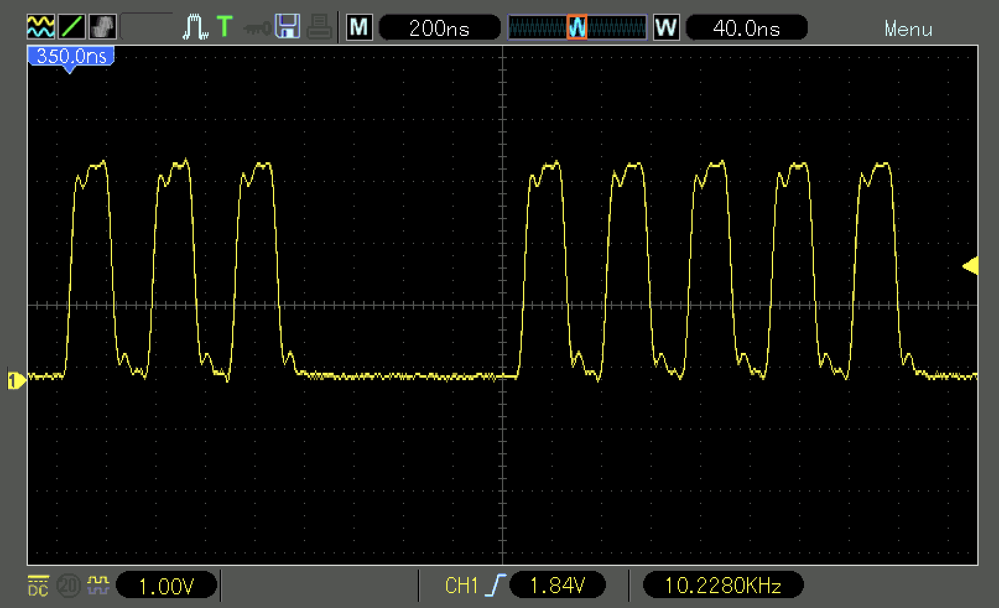

<div align="justify">

# Practicum 1
[[**Home**](https://github.com/lpacher/lae)] [[**Back**](https://github.com/lpacher/lae/tree/master/fpga/practicum)]


## Contents

* [**Introduction**](#introduction)
* [**Practicum aims**](#practicum-aims)
* [**Reference documentation**](#reference-documentation)
* [**Navigate to the practicum directory**](#navigate-to-the-practicum-directory)
* [**Explore board schematics and master XDCs**](#explore-board-schematics-and-master-xdcs)
* [**Power supplies**](#power-supplies)
* [**JTAG interface**](#jtag-interface)
* [**Check jumper settings**](#check-jumper-settings)
* [**Connect the board to your personal computer**](#connect-the-board-to-your-personal-computer)
* [**Probe JTAG signals at the oscilloscope**](#probe-jtag-signals-at-the-oscilloscope)
* [**Check cable drivers installation**](#check-cable-drivers-installation)
* [**Launch the Vivado Hardware Manager**](#launch-the-vivado-hardware-manager)
* [**Interact with the board from the Hardware Manager**](#interact-with-the-board-from-the-hardware-manager)
* [**Read the device DNA**](#read-the-device-dna)
* [**Monitor the on-chip temperature through XADC**](#monitor-the-on-chip-temperature-through-xadc)
* [**Implement a simple RTL design targeting the Arty board**](#implement-a-simple-rtl-design-targeting-the-arty-board)
* [**Locate and review text reports**](#locate-and-review-text-reports)
* [**Program the FPGA**](#program-the-fpga)
* [**Program the external Quad SPI Flash memory**](#program-the-external-quad-spi-flash-memory)
* [**Create a Makefile to automate FPGA implementation and programming flows**](#create-a-makefile-to-automate-FPGA-implementation-and-programming-flows)
* [**Extra: run the official Digilent Arty General I/O Demo**](#extra-run-the-official-digilent-arty-general-io-demo)
* [**Further readings**](#further-readings)

<br />
<!--------------------------------------------------------------------->


## Introduction
[**[Contents]**](#contents)

In this first practicum in the electronics lab you are going to explore the
[**Digilent Arty A7 development board**](https://store.digilentinc.com/arty-a7-artix-7-fpga-development-board-for-makers-and-hobbyists)
and to learn how to program its Xilinx Artix-7 FPGA with a simple Verilog RTL design using Xilinx Vivado.

<br />

>
> **IMPORTANT**
>
> All boards available in the lab mount a **Xilinx Artix-7 A35T** FPGA device. The original board by Digilent was referred to as _Arty_ while
> the new revision of the same board is now referred to as _Arty A7_, still using an Artix-7 A35T device.
> There are a few small differences in board schematics between the original version and the second version in terms of power management, but
> apart from this all other schematic functionalities are the same.
>

<br />
<!--------------------------------------------------------------------->


## Practicum aims
[**[Contents]**](#contents)

This introductory practicum should exercise the following concepts:

* locate Digilent Arty A7 development board reference documentation
* explore and understand board schematics
* locate main circuit components on the board
* power the board from host computer using a simple USB cable
* review the usage of fundamental lab instrumentation for measurements (DMM, digital oscilloscope)
* check cable drivers installation and jumper settings
* probe JTAG signals at the oscilloscope
* use the Vivado _Hardware Manager_ to interact with the FPGA
* get familiar with basic Xilinx Design Constraints (XDC) statements
* run the Xilinx Vivado FPGA implementation flow on a simple RTL design
* write a simple _Project Mode_ Tcl script to run Vivado synthesis and implementation flows in batch mode
* locate and review post-synthesis and post-implementation reports
* program the FPGA and the external Quad SPI Flash memory
* write a simple Tcl script to automate the FPGA programming flow in batch mode
* write a `Makefile` to automate FPGA implementation and programming flows at the command line
* download and install the official Digilent Arty A7 _GPIO Demo Design_

<br />
<!--------------------------------------------------------------------->


## Reference documentation
[**[Contents]**](#contents)

All reference documents are open and freely available on Digilent website:


* _Arty Reference Manual_ <br />
  <https://reference.digilentinc.com/reference/programmable-logic/arty/reference-manual> <br />
  <https://reference.digilentinc.com/reference/programmable-logic/arty-a7/reference-manual>

* _Arty Programming Guide_ <br />
   <https://reference.digilentinc.com/learn/programmable-logic/tutorials/arty-programming-guide/start>

* _Board Schematics_ <br />
  <https://reference.digilentinc.com/_media/reference/programmable-logic/arty/arty_sch.pdf> <br />
  <https://reference.digilentinc.com/_media/reference/programmable-logic/arty-a7/arty_a7_sch.pdf>

<br />

PDF copies of all above documents are also part of this practicum and are available in the `doc/arty/` directory.
For faster access to PDF documents from the command line it would be recommended to include in the search path
of your operating system also the executable of your preferred PDF viewer application.

Very likely Windows users have **Adobe Acrobat Reader** program already installed on their machines and
can update the `PATH` environment variable in the `login.bat` script in order to include the `Acrobat.exe`
(or `Acrord32.exe`) executable in the search path as follows:

```
:: add Adobe Acrobat Reader executable to search path
set PATH="C:\Program Files\Adobe\Acrobat DC\Acrobat";%PATH%       :: check the proper installation directory
```

<br />

Do not forget to save and re-load the script once done:

```
% call login.bat
```

<br />

Once the executable is in the search path you can easily open a PDF document from the Windows _Command Prompt_ with:


```
% acrobat doc/arty/arty_board_reference_manual.pdf
```

<br />

Linux users should already have the **Evince** PDF viewer installed instead, which usually already comes with its main
`evince` executable available in the search path:

```
% which evince
/usr/bin/evince

% evince doc/arty/arty_board_reference_manual.pdf &
```

<br />

The Evince PDF viewer is also available for Windows systems and can be installed from the [official website](https://evince.en.uptodown.com/windows).
If you prefer a non-administrator installation a `.zip` of the software is also available at:

_<https://www.to.infn.it/~pacher/teaching/FPGA/software/windows/Evince.zip>_

<br />

>
> **NOTE**
>
> You can quickly download and extract the provided zip file from the Command Prompt using `wget` and `unzip` utilities as follows:
>
> ```
> % cd C:\Users\<username>
> % mkdir -p local
> % cd local
> % wget https://www.to.infn.it/~pacher/teaching/FPGA/software/windows/Evince.zip
> % unzip Evince.zip
> % rm Evince.zip
> ```
>
> <br />
>
> After this, update your `login.bat` setup script in order to add the `evince.exe` executable to the search path:
>
> ```
> :: add Evince executable to search path
> set PATH=C:\Users\<username>\local\Evince\bin;%PATH%
>
> :: redirect garbage 'No display font' errors to NUL (but DosKey ignores the usual > redirection character, needs the $G special character for this)
> doskey evince=evince.exe $* $G nul
> ```
>
> <br />
>
> Do not forget to save and re-load the script once done:
>
> ```
> % call login.bat
> ```

<br />
<!--------------------------------------------------------------------->


## Navigate to the practicum directory
[**[Contents]**](#contents)

As a first step, open a **terminal** window and change to the practicum directory:

```
% cd Desktop/lae/fpga/practicum/1_arty
```

<br />

List the content of the directory:

```
% ls -l
% ls -l .solutions
```


<br />
<!--------------------------------------------------------------------->


## Explore board schematics and master XDCs
[**[Contents]**](#contents)

Before connecting the board to your personal computer explore and study **board schematics**. Try to recognize on the PCB
all schematic components. Open the proper PDF file according to the board you are working with:

* `doc/arty/arty_board_schematics.pdf` for the original _Arty_ board
* `doc/arty/arty_a7_board_schematics.pdf` for the new revision of the board referred to as _Arty A7_ 

<br />

As an example:

```
% acrobat doc/arty/arty_board_schematics.pdf       # for Windows users

% evince doc/arty/arty_board_schematics.pdf &      # for Linux users
```

<br />

With you preferred text editor application open also the main sample **Xilinx Design Constraints (XDC) file**
provided by Digilent and available in the `.solutions/` directory:

```
% cp .solutions/arty_all.xdc .
```

```
% gedit arty_all.xdc &   (for Linux users)

% n++ arty_all.xdc       (for Windows users)
```

<br />

Get familiar with most important programmable I/O in the sample XDC file and locate the corresponding physical
resources on the board:

* general-purpose standard LEDs
* general-purpose RGB LEDs
* slide switches
* push-buttons
* PMOD (Peripheral MODules) pin headers
* Arduino/chipKIT pin headers


<br />

>
> **QUESTIONS**
>
> Q.1 Which is the value of the supply voltage used to power general-purpose standard LEDs ? Is the same for RGB LEDs ?
>
>   \___________________________________________________________________________________
>
>
> Q.2 Which is the most important difference between JA/JC and JB/JD PMOD pin headers ?
>
>   \___________________________________________________________________________________
>
>
> Q.3 The push-buttons available on the board are normally-open (NO) or normally-closed (NC) buttons ?
>
>   \___________________________________________________________________________________
>
>
> Q.4 A component on the PCB generates a 100 MHz clock signal. Which is the name of this component ? Where is placed on the PCB ?
>
>   \___________________________________________________________________________________
>

<br />
<!--------------------------------------------------------------------->


## Power supplies
[**[Contents]**](#contents)

Try to understand all possible **powering schemes** foreseen for the board.
For this purpose read carefully the **Power Supplies** section of the official
_Arty Reference Manual_ by Digilent. Cross-check all information with **board schematics**.

Locate the following power-related pins:

* **VCC**
* **VIN**
* **5V0**
* **3V3**

With a **digital multimeter (DMM)** perform  some basic **continuity tests** (the "beep" test) to verify
that different same-potential test-points on the board are effectively shorted together, e.g. **GND** or **VCC**.

<br />

>
> **QUESTION**
>
> Which is the difference between **VIN** and **5V0** supply-voltages ?
>
>   \___________________________________________________________________________________
>

<br />
<!--------------------------------------------------------------------->


## JTAG interface
[**[Contents]**](#contents)

Xilinx FPGAs are programmed using the [**JTAG protocol**](https://en.wikipedia.org/wiki/JTAG).
JTAG (Join Test Action Group) is an industry-standard **serial-interface** protocol for integrated
circuits configuration and debug as well as more complex PCB testing after manufacture.

A JTAG connector uses the following signals:

* **TCK** (Test Clock)
* **TMS** (Test Mode Select)
* **TDI** (Test Data Input)
* **TDO** (Test Data Output)
* **TRST** (Test Reset, optional)


In the past a dedicated (and expensive) **programming cable**, namely _Xilinx USB Platform Cable_,
was required to program FPGA boards from a host computer. This dedicated cable (still in use for particular applications)
**connects to a host computer USB port** (in the past to the "old style" serial port instead)
and converts USB data into JTAG data.<br />

For easier programming, the majority of new modern FPGA boards equipped with a Xilinx device provides
an **on-board dedicated circuitry** that **converts USB to JTAG without the need
of a dedicated cable**. That is, you can easily program your board by using a simple **USB Type A/Type B** or **USB Type A/micro USB**
cable connected between the host computer and the board without the need of a dedicated programming cable.

On Digilent Arty/ Arty A7 boards this conversion is performed by an integrated circuit by **FTDI (Future Technology Devices International)**.
You can easily recognize the FTDI chip on the board close to the micro-USB connector.

<br />

>
> **IMPORTANT**
>
> Please, be aware that the on-board **USB-to-JTAG circuitry** has been left **UNDOCUMENTED** by Digilent!
> You can easily recognize the main **FTDI chip** near the micro-USB connector indeed, but circuit details
> are not available in PDF board schematics.
>

<br />

Additionally the **J8 connector** on the board provides **test-points** to probe JTAG signals
using a 6-pins **through-hole (TH)** header.
Later in this practicum we will use these test-points to **observe JTAG signals at the oscilloscope**.

<br />


<br />

>
> **QUESTION**
>
> Where is placed the **J8 connector** on the board ? Where are **TDI**, **TMS**, **TCK** and **TDO** signals ?
>
>   \___________________________________________________________________________________
>

<br />

Try to understand all possible programming options supported for the board. For this purpose
read carefully the **FPGA Configuration** section of the official _Arty Reference Manual_ by Digilent.


<br />
<!--------------------------------------------------------------------->


## Check jumper settings
[**[Contents]**](#contents)

A few **jumpers** are available on the board and are used to **hard-program** some main functionalities of the board:

* external vs. USB power mode on J13 (legacy _Arty_ board)
* **MODE** on JP1
* **CK_RESET** on JP2

<br />

Verify that all jumpers are properly inserted.

<br />

>
> **QUESTION**
>
> Which is the purpose of the **MODE** jumper ? What changes if this jumper is left unplaced ?
>
>   \___________________________________________________________________________________
>

<br />
<!--------------------------------------------------------------------->


## Connect the board to your personal computer
[**[Contents]**](#contents)

Despite the board can be powered from an external bench power supply or any 7-15V AC adapter, for this course we will simply power the board
using **5V from USB cable**. Connect the board to the USB port of your personal computer using a **USB A to micro USB cable**.
Verify that the **POWER** status LED turns on.

Use the DMM to perform basic power measurements on the following pins:

* **VCC**
* **VIN**
* **5V0**
* **3V3**

<br />

>
> **QUESTION**
>
> Which is the voltage measured on pin **VIN** ? Is this value the expected one ? Motivate your answer.
>
>   \___________________________________________________________________________________
>

<br />

Repeat all your power measurements using the **oscilloscope**.

<br />

>
> **IMPORTANT**
>
> Before using an "unknown" oscilloscope **always** verify that **BNC probes** are properly **compensated** by connecting the probes to the
> built-in oscilloscope square-wave generator. In case probes are over-compensated or under-compensated use a small screwdriver and operate
> on the probe trimmer.
>
> If you fill completely lost at this point ask to the teacher or ref. to:
>
> _<https://www.electronics-notes.com/articles/test-methods/oscilloscope/scope-probe-compensation.php>_
>

<br />
<!--------------------------------------------------------------------->


## Probe JTAG signals at the oscilloscope
[**[Contents]**](#contents)

After connecting the board to the personal computer the USB only provides power/ground to the board.
Apart from this there is no additional "data exchange" between the host PC and the FPGA.
We can therefore expect that all JTAG signals should be at some default "idle" logic level.

Connect a couple of BNC probes to the oscilloscope. With the board connected to the host PC and powered
observe all JTAG signals **TCK**, **TMS**, **TDI** and **TDO** at the oscilloscope through **J8 test-points**.

<br />

>
> **QUESTION**
>
> Which is the logic level of JTAG signals with the board still "unconnected" to a Vivado session ?
>
>   \___________________________________________________________________________________
>

<br />
<!--------------------------------------------------------------------->


## Check cable drivers installation
[**[Contents]**](#contents)

<br />

>
> **IMPORTANT**
>
> If you are running Vivado from a **virtual machine** be sure that USB devices are properly forwarded
> to the virtual machine! As an example, if you use VirtualBox go through **Devices > USB** to make
> the Digilent board "visible" to the virtualized operating system.

<br />

In order to make the board visible to the host computer the operating system has to **properly recognize the on-board FTDI USB/JTAG hardware**
requiring a specific **driver**. The **Xilinx USB/Digilent driver** is responsible for this.

By default the _Install Cable Drivers_ option is already selected in the Xilinx Vivado installation wizard, thus
at the end of the Vivado installation process cable drivers **should be automatically installed for you** on the system
(this is the reason for which admin privileges are required to install the software).

Follow below instructions to check proper cable drivers installation. In case cable drivers are **NOT installed** on your machine
you can **manually install cable drivers** without the need of a new scratch installation of the Vivado Design Suite
as already described into [**fpga/labs/lab0/README.md**](../../labs/lab0/README.md) instructions.


<br />

**LINUX**

On Linux systems devices that are connected through USB can be listed using the `lsusb` command:

```
% lsusb
...
...
... Future Technology Devices International, Ltd FT2232C/D/H Dual UART/FIFO IC
```

<br />

Verify that a device from FTDI has been properly recognized by the system. In case `lsusb` is not installed, either use

```
% sudo apt-get install usbutils
```

<br />

or

```
% sudo yum install usbutils
```

<br />

according to the Linux distribution you are working with.

<br />

Beside `lsusb` you can use `dmesg` to query **kernel messages** (whatever happens on your PC can be traced using `dmesg`):

```
% dmesg
...
...
usb 1-1.3: FTDI USB Serial Device converter now attached to ttyUSB1
usbcore: registered new interface driver ftdi_sio
ftdi_sio: v1.5.0:USB FTDI Serial Converters Driver
```


<br />

**WINDOWS**

By default on Windows systems there are no command-line utilities to query hardware devices, therefore you have to open
the _Device Manager_  graphical interface. You can do this from the _Control Panel_ or typing `devmgmt.msc` in the
_Command Prompt_ as follows:

```
% devmgmt.msc
```

<br />

If cable drivers are properly installed you should see in the list of USB devices two new devices named by Windows as _USB Serial Converter A/B_.
Right-click on one of these devices to access the _Properties_. Verify in the _General_ TAB of the device properties that the FTDI chip
has been properly recognized. You can also inspect which **driver** is used by the operating system.

<br />


<br />
<!--------------------------------------------------------------------->


## Launch the Vivado Hardware Manager
[**[Contents]**](#contents)

As part of the Xilinx Vivado design suite comes the so called **Hardware Manager**. The _Hardware Manager_ is the
tool used to **program** Xilinx FPGA devices after bitstream generation. Beside programming, the _Hardware Manager_
can be also used to **debug** a design after firmware installation.

To launch the _Hardware Manager_ you have to first start Vivado from the command line.

For Linux users:

```
% vivado -mode gui &
```

<br />

For Windows users:

```
% echo "exec vivado -mode gui &" | tclsh -norc
```

<br />

You can then launch the _Hardware Manager_ from the main Vivado GUI using **Flow > Open Hardware Manager**.
Alternatively you can type `open_hw_manager` in the Tcl console.

<br />


<br />


<br />
<!--------------------------------------------------------------------->


## Interact with the board from the Hardware Manager
[**[Contents]**](#contents)

Try to establish a connection between the _Hardware Manager_ and the Artix-7 FPGA device. To do this, simply left-click
on **Open target > Auto Connect**.

<br />


<br />

If cable drivers are properly installed the _Hardware Manager_ automatically recognizes the Artix-7 A35T on the board as `xc7a35t_0`.
Observe the sequence of Tcl commands traced for you in the **Tcl Console** tab:


```
open_hw_manager
connect_hw_server -allow_non_jtag
open_hw_target
current_hw_device [get_hw_devices xc7a35t_0]
refresh_hw_device -update_hw_probes false [lindex [get_hw_devices xc7a35t_0] 0]
```

<br />

You can start saving these commands into a Tcl script that can be later used to **automate the FPGA programming flow** in batch mode
without the need of invoking the graphical interface. For this purpose create with your preferred **text-editor** application
a new `install.tcl` script and copy-and-paste all above statements into the file:


```
% gedit install.tcl &   (for Linux users)

% n++ install.tcl       (for Windows users)
```

<br />

Save and exit once done. We will later complete the script with additional Tcl programming statements needed to load the
firmware into the FPGA in batch mode.

Once a connection is established between the _Hardware Manager_ and the FPGA the **JTAG chain** has been
initialized and some digital activity can be now observed on JTAG signals.

Verify this by probing **TCK**, **TMS**, **TDI** and **TDO** at the oscilloscope through **J8 test-points**
after the connection has been established.


<br />

>
> **HINT**
>
> Probe **TCK** on CH1 and always use this signal for the trigger. Press the _AUTO SET_ button if you are not able
> to properly trigger and display a clock-like signal on a suitable time-scale. Adjust with the
> time-base knob as needed.
> Once **TCK** is clearly visible connect a second probe to trace **TMS**, **TDI** and **TDO**.
> Try to observe all below waveforms.
>

<br />


<br />

<br />
<br />

As you can notice the JTAG **TCK** "clock" signal is **NOT a standard free-running clock waveform**.

On the contrary **TCK** is a sequence of **clock-pulses** with a certain pattern as generated by the JTAG
state-machine implemented in the FTDI USB-to-JTAG converter and this "clock" is running only when the JTAG
machinery has something to do. Indeed, this is the expected behaviour and it is a feature that can be found also in other
common **synchronous serial interfaces** such as **SPI (Serial Peripheral Interface)** and **I2C (Inter Integrated Circuit)**
in which the "clock" signal of the protocol is generated by a state-machine placed in some "primary" (master) device
and distributed to one or more "secondary" (slaves) devices.

<br />

>
> **QUESTION**
>
> Which is the default frequency of the JTAG clock **TCK** ?
>
>   \___________________________________________________________________________________
>

<br />

Compare your measurement at the oscilloscope with the output of the following Tcl command:

```
get_property PARAM.FREQUENCY [current_hw_target]
```

<br />

Reduce the JTAG clock frequency to 5 MHz by executing the following command in the _Hardware Manager_ Tcl console:

```
set_property PARAM.FREQUENCY 5000000 [current_hw_target]
```

<br />

Verify the result at the oscilloscope. Once done, restore the JTAG clock frequency back to its original
default value and debug also **TMS**, **TDI** and **TDO** signals while keeping the trigger on **TCK**.

<br />

<br />


<br />

<br />


<br />

<br />


<br />
<br />

>
> **QUESTIONS**
>
> Q.1 On which edge of **TCK** the serial stream **TDO** is sent from the FPGA to the FTDI USB-to-JTAG converter ?
>
>   \___________________________________________________________________________________
>
>
> Q.2 Which can be the cause for the _RC-like_ charge behaviour that you observe on **TDO** at the end of the serial data transfer ?
>
>   \___________________________________________________________________________________
>

<br />

Try to **close the communication** between the FPGA and the computer by executing the following command in the _Hardware Manager_
Tcl console:

```
disconnect_hw_server
```

<br />

>
> **QUESTION**
>
> What happens to JTAG signals at the oscilloscope after the connection has been closed ?
>
>   \___________________________________________________________________________________
>

<br />

Left-click on **Open target > Auto Connect** to establish a new connection between the  _Hardware Manager_ and the
board. Then left-click on `xc7a35t_0` to select the FPGA device and left-click on _Properties_ to display
the _Hardware Device Properties_ form:

<br />


<br />

You can immediately detect if the FPGA is programmed by looking at the **DONE** status LED on the board close to **PROG**
push-button placed on the left-side of the JA PMOD connector.

Alternatively you can query the `DONE` status bit in the JTAG instruction register. Verify if the FPGA is already
programmed using:

```
puts [get_property REGISTER.IR.BIT5_DONE [current_hw_device]]
```

<br />

Try to understand the meaning of the following Tcl commands:

```
puts [current_hw_server]
puts [current_hw_target]
puts [current_hw_device]
```

<br />
<!--------------------------------------------------------------------->


## Read the device DNA
[**[Contents]**](#contents)

Each Xilinx FPGA has a unique **hard-coded device identifier**, also referred to as **device DNA**.
This device DNA is a unique binary word "fused" by Xilinx after manufacturing.
The identifier is nonvolatile, permanently programmed by Xilinx into the FPGA, and is unchangeable. 

You can easily get the device DNA from the value of the `FUSE_DNA` register, either from the _Hardware Device Properties_ form
or using Tcl to query the property. 


Type the following command in the Tcl console and observe the output:

```
get_property REGISTER.EFUSE.FUSE_DNA [current_hw_device]
```

<br />

>
> **QUESTION**
>
> Which is the value of the device DNA of the FPGA connected to your computer ? How many bits are used for the device DNA ? <br /><br /> 
>
>   \___________________________________________________________________________________
>

<br />
<!--------------------------------------------------------------------->


## Monitor the on-chip temperature through XADC
[**[Contents]**](#contents)

All 7-Series and SoC Xilinx FPGAs have an embedded 1-MS/s 12-bit Analog to Digital Converter (ADC), referred to as **XADC**.
The XADC can be compiled and used in the RTL code as an IP core, but is also available from the _Hardware Manager_
for monitoring purposes.

Right-click on XADC and select **Dashboard > New Dashboard**. In the _New Dashboard_ window you can specify a name for the
new plotter, or leave the default value. Left click on **OK** to create the new dashboard.  

<br />


<br />

By default the XADC monitors the on-chip temperature, but you can also add other measurements, just right-click
somewhere below **Temp** and select **Add Sensor(s)**.

The data exchange between the FPGA and the computer uses the same JTAG protocol used for device programming.
Observe at the oscilloscope JTAG signals **TCK**, **TMS**, **TDI** and **TDO** using through-hole test points on **J8**.

Close the _Hardware Manager_ and exit from Vivado once happy:

```
close_hw_manager
exit
``` 

<br />
<!--------------------------------------------------------------------->


## Implement a simple RTL design targeting the Arty board
[**[Contents]**](#contents)

Map on the board the simple NOT-gate (inverter) already discussed in the `lab1`.
To save time, copy from the `.solutions/` directory the `Inverter.v` source file:

```
% cp .solutions/Inverter.v .
```

<br />

In order to map the Verilog code on real FPGA hardware you also need to write a **constraints file**
using a **Xilinx Design Constraints (XDC) script**. Create therefore with your **text-editor** application
a new source file named `Inverter.xdc` as follows:

```
% gedit Inverter.xdc &   (for Linux users)

% n++ Inverter.xdc       (for Windows users)
```

<br />

Copy from the `.solutions/` directory the reference XDC file for the Arty board:

```
% cp .solutions/arty_all.xdc .
```

<br />

Try to **write yourself design constraints** required to implement the design on real hardware.
In the following you can find additional information to help you in writing the XDC code and to
run the Xilinx Vivado flows both in the graphical user interface and from Tcl scripts.

<br />

**PHYSICAL CONSTRAINTS (PORT MAPPING)**

As a first step you have to write **pin constraints**. These constraints are required to:

* define the mapping between **top-level Verilog I/O ports** and **FPGA physical pins**
* specify the **I/O voltage** for each assigned pin.

<br />

These two information are referred to as `PACKAGE_PIN` and `IOSTANDARD` respectively.
The Tcl statement to be used in the XDC file to perform this mapping is the following:

```
set_property -dict { PACKAGE_PIN <FPGA pin> IOSTANDARD LVCMOS33 } [get_ports <HDL port name> ]
```

<br />

All configurable I/O pins available on the _Arty_ board are **CMOS 3.3V**
identified as `LVCMOS33`. Other FPGA boards mounting different Xilinx devices
might have other I/O voltage levels.

The above syntax uses one single `set_property` statement to assign both 
`PACKAGE_PIN` and `IOSTANDARD` in form of a "dictionary", that is a list
of _(key,value)_ pairs enclosed within curly brackets `{}` or double quotes `""`.

A second possibility is to set `PACKAGE_PIN` and `IOSTANDARD` properties
using two independent statements targeting the same top-level port as follows:

```
set_property PACKAGE_PIN <FPGA pin> [get_ports <HDL port name> ]
set_property IOSTANDARD LVCMOS33 [get_ports <HDL port name> ]
```

<br />

>
> **IMPORTANT**
>
> Remind that **both information** are requested to run the FPGA implementation
> flow in Xilinx Vivado!
>
> Moreover **ALL** top-level I/O ports must be assigned to a physical FPGA pin!
> If you miss to specify both `PACKAGE_PIN` and `IOSTANDARD` properties for each
> top-level port in your design the implementation flow will fail
> rising a **Design Rule Check (DRC) error**. In case you have unused/unmapped
> ports in the top-level module simply remove or comment-out them.
>
> **REMIND THAT YOU CAN'T LEAVE UNMAPPED I/O PORTS IN YOUR TOP-LEVEL MODULE !**
>
>

<br />

As an example, map the inverter input `X` to the slide-switch **SW0**, while assign the
inverter output `ZN` to the general-purpose LED `LD4` available on the Digilent board
as shown below. Use the main `arty_all.xdc` as a reference for the syntax.

<br />


<br />

```
set_property -dict { PACKAGE_PIN A8  IOSTANDARD LVCMOS33 } [get_ports X ] ;  # SW0
set_property -dict { PACKAGE_PIN H5  IOSTANDARD LVCMOS33 } [get_ports ZN] ;  # LD4
```

<br />

>
> **IMPORTANT**
>
> Be sure that a **current-limiting series resistor** is always placed on the current path of a LED!
> Feel free to drive with the NOT gate an external LED mounted on the breadboard and to map the
> `ZN` output port to any other programmable I/O available on the board.<br />
> However it will be **UP TO YOU** to place an approx. 100-300 $\Omega$ limiting resistor to protect the LED!
>
> **WITHOUT A LIMITING RESISTOR YOU WILL DESTROY ANY EXTERNAL LED CONNECTED TO PROGRAMMABLE I/O PINS !**
>

<br />

**TIMING CONSTRAINTS**

Any digital circuit can be affected by **timing issues**. In fact when you physically translate your HDL code
into **real FPGA hardware** (such as LUTs, registers, I/O buffers etc.) the **non-zero propagation delays**
through the cells and due to the metal interconnections between the cells can produce **unexpected output logic values**
in your circuit under certain input conditions.

The design methodology to **verify the timing** in modern digital circuits is called **Static Timing Analysis (STA)**.
Special STA "engines" are in charge of computing all propagation delays into the circuit and check the correctness of the
timing to ensure **before fabrication** that no timing issues are present in the design.
However in order to check the timing the STA tool needs some additional information in form of **timing constraints**.

Our simple inverter is a pure combinational circuit. We can therefore assume that after a certain **propagation delay**
the output `ZN` settles to a **static logic value** by changing the corresponding inverter input `X`.
As a result we can safely assume that timing constraints are **relaxed**. This is further confirmed by the fact that
we are going to drive a simple LED with the inverter output.

For pure combinational **input-to-output (in2out) timing paths** you can define a **maximum delay constraint** between
an input and an output using the `set_max_delay` constraint.

As an example, you can constrain a max. 10 ns delay between input and output
with the following syntax:

```
set_max_delay 10 -from [all_inputs] -to [all_outputs]
```

<br />

You can also play with the delay value and verify the effect in Vivado **timing reports**.

Alternatively you can also **disable all timing checks** with `set_false_path` as follows:

```
set_false_path -from [all_inputs] -to [all_outputs]
```

<br />

**ELECTRICAL CONSTRAINTS**

Incorrect voltage supply for the configuration interfaces on board can result in configuration failure or device damage.
Vivado has a **Design Rules Check (DRC)** tool that verifies if the configuration interfaces of the device have correct voltage
support based on the **Configuration Bank Voltage Select** `CFGBVS`, `CONFIG_VOLTAGE`, and the `CONFIG_MODE` properties settings.

Add these electrical constraints in order to instruct Vivado how the device configuration interfaces are used and connected on board.

```
set_property CFGBVS VCCO        [current_design]
set_property CONFIG_VOLTAGE 3.3 [current_design]
```

<br />

Ref. also to:

* _<https://www.xilinx.com/support/answers/55660.html>_
* _<https://forums.xilinx.com/t5/Other-FPGA-Architecture/set-property-CFGBVS-set-property-CONFIG-VOLTAGE/td-p/782750>_

<br />

Optionally you can include the following additional XDC statements to **optimize the memory configuration file (.bin)**
to program the external **128 Mb (16 MB) Quad Serial Peripheral Interface (SPI) Flash memory** in order to automatically load
the FPGA configuration at power-up:

```
set_property BITSTREAM.CONFIG.SPI_BUSWIDTH 4  [current_design]
set_property CONFIG_MODE SPIx4                [current_design]
```

<br />

**FPGA IMPLEMENTATION AND TCL SCRIPTS**

Once ready open Vivado in graphical mode

```
% vivado -mode gui &                               (for Linux users)

% echo "exec vivado -mode gui &" | tclsh -norc     (for Windows users)
```

<br />

and try to run the FPGA implementation flow in _Project Mode_ up to bitstream generation:

* create into the current directory a new project named `Inverter` targeting the `xc7a35ticsg324-1L` FPGA device
* add the `Inverter.v` Verilog file to the project
* add `Inverter.xdc` design constraints to the project
* run elaboration and inspect the RTL schematic
* run synthesis and inspect the post-synthesis schematic
* run implementation and inspect place-and-route results into the _Device_ view
* generate the bitstream

<br />

>
> **IMPORTANT**
>
> In order to be able to program also the external Quad SPI Flash memory you must generate
> the **raw binary version** (`.bin`) of the bitstream file (`.bit`). To do this when working in _Project Mode_
> right-click on **Generate Bitstream** in the **Flow Navigator** and select **Bitstream settings**, then
> check the `-bin_file` in the table:
>
> 
>
> Alternatively use the following Tcl command:
>
> ```
> set_property STEPS.WRITE_BITSTREAM.ARGS.BIN_FILE true [get_runs impl_1]
> ```
>
> before running the bitstream generation flow.
>

<br />

After the implementation flow has successfully completed **locate the bitstream file**
to be used for firmware installation.

By default both **bitstream (.bit)** and **raw-binary (.bin)** programming files are written by Vivado
into the `*.runs/impl_1/` directory automatically created by the tool as part of the project tree setup.

Verify at the end of the flow that both files have been properly generated:

```
% ls -lh ./Inverter.runs/impl_1 | grep .bit
% ls -lh ./Inverter.runs/impl_1 | grep .bin
```

<br />

>
> **QUESTION**
>
> Which is the on-disk size of bitstream (.bit) and raw-binary (.bin) files ? Motivate the difference if any.
>
>   \___________________________________________________________________________________
>

<br />

You might also have noticed that each step of the flow executed in the GUI has a corresponding
"super-command" in Tcl. Review the sequence of commands traced for you by Vivado into the **Tcl Console** tab:

```
create_project -verbose -force -part xc7a35ticsg324-1L Inverter
add_files -norecurse -fileset sources_1 Inverter.v
update_compile_order -fileset sources_1
add_files -norecurse -fileset constrs_1 Inverter.xdc
launch_runs synth_1
wait_on_run synth_1
set_property STEPS.WRITE_BITSTREAM.ARGS.BIN_FILE true [get_runs impl_1]
launch_runs impl_1 -to_step write_bitstream
wait_on_run impl_1
```

<br />

You can use these commands as a starting point to write a first simple _Project Mode_ Tcl script
that can be later used to **automate the FPGA implementation flow** and run Vivado in **batch mode**
without the need of invoking the graphical interface. For this purpose create with your preferred
**text-editor** application a new `build.tcl` script and copy-and-paste all above statements
into the file:


```
% gedit build.tcl &   (for Linux users)

% n++ build.tcl       (for Windows users)
```

<br />

Feel free of course to **add comments** to document your script. Save and close the text editor
once done. Exit also from the Vivado application.

Copy and run from the `.solutions/` directory the `cleanup.sh` (Linux) or the `cleanup.bat` (Windows) script
to cleanup the practicum directory and start with a scratch working area containing only Verilog, XDC and Tcl sources.

For Linux users:

```
% cp .solutions/cleanup.sh .
% chmod +x cleanup.sh
% ./cleanup.sh          (or simply 'source cleanup.sh' without x-permissions)
```

<br />

For Windows users:

```
% cp .solutions/cleanup.bat .
% call cleanup.bat
```

<br />

You can then easily re-run the Vivado implementation flow from the command line in batch mode by executing the following
command in the console:

```
% vivado -mode batch -source build.tcl -notrace -log build.log -nojournal
```

<br />

Please use:

```
% vivado -help
```

<br />

to understand all command options. In case of troubles or syntax errors review the complete script already
prepared for you and available in the `.solutions/` directory:

```
% cat .solutions/build.tcl
```

<br />
<!--------------------------------------------------------------------->


## Locate and review text reports
[**[Contents]**](#contents)

Several **text reports** are automatically generated for you at each flow step
when running Vivado in _Project Mode_ (either in GUI mode or in batch mode using a Tcl script).

Most important reports are:

* utilization reports
* timing reports
* power reports

<br />

As an example, review in the console the content of the **post-placement utilization report**:

```
% less Inverter.runs/impl_1/Inverter_utilization_placed.rpt
```

<br />

>
> **QUESTION**
>
> Which FPGA device primitives have been used to map the design on real hardware ?
>
>   \___________________________________________________________________________________
>

<br />
<!--------------------------------------------------------------------->


## Program the FPGA
[**[Contents]**](#contents)

Open the _Hardware Manager_ and establish a new connection through USB/JTAG ad discussed before.

To program the FPGA simply right-click on the `xc7a35t_0` device and select **Program Device**, then specify the
**bitstream file** `Inverter.bit` generated by Vivado and placed in the `Inverter.runs/impl_1/` directory.
Finally, left-click on **Program**.

<br />


<br />

Observe the **DONE** status LED turning-off and then turning-on once the programming sequence has completed.
Debug your firmware on the board.

You can also **observe the bitstream** at the oscilloscope through JTAG. To do this, probe the **TDI** signal
at the oscilloscope on **J8** and then re-program the FPGA.

Review the sequence of Tcl programming commands traced for you in the _Hardware Manager_ Tcl console:

```
set_property PROBES.FILE {} [get_hw_devices xc7a35t_0]
set_property FULL_PROBES.FILE {} [get_hw_devices xc7a35t_0]
set_property PROGRAM.FILE {Inverter.runs/impl_1/Inverter.bit} [get_hw_devices xc7a35t_0]
program_hw_devices [get_hw_devices xc7a35t_0]
refresh_hw_device [lindex [get_hw_devices xc7a35t_0] 0]
```

<br />

With this additional information you can now complete the `install.tcl` script and fully
automate the FPGA programming flow in batch mode without the need of running the Vivado
graphical user interface. For this purpose re-open `install.tcl` with you preferred text editor
and **update the script** by adding all above programming commands after the initial code
used to connect to the board. As usual feel free of course to **add comments** to document your script.

The final Tcl script should be something like this:

```
## open the Hardware Manager
open_hw_manager

## "auto-connect"
connect_hw_server -allow_non_jtag
open_hw_target
current_hw_device [get_hw_devices xc7a35t_0]
refresh_hw_device -update_hw_probes false [lindex [get_hw_devices xc7a35t_0] 0]

## specify the bitstream file
set_property PROGRAM.FILE {Inverter.runs/impl_1/Inverter.bit} [get_hw_devices xc7a35t_0]

## empty entries
set_property PROBES.FILE {} [get_hw_devices xc7a35t_0]
set_property FULL_PROBES.FILE {} [get_hw_devices xc7a35t_0]

## program the FPGA
program_hw_devices [get_hw_devices xc7a35t_0]
refresh_hw_device [lindex [get_hw_devices xc7a35t_0] 0]
```

<br />

Save and exit once done.

You can now try to re-install the "Inverter" firmware in batch mode. Close the _Hardware Manager_
and **physically disconnect the USB cable** from your computer, then **reconnect it**.

The firmware loaded into the FPGA is stored into a volatile RAM inside the chip. By default the FPGA configuration
is therefore **non-persistent** across power cycles and you have to **re-program the FPGA** whenever
you **disconnect the power** from the board.

Since you disconnected the power from the board the previously installed "Inverter" firmware
has been lost and the FPGA needs to be re-programmed. Try to run the following command in the console:

```
% vivado -mode batch -source install.tcl -notrace -log install.log -nojournal
```

<br />

In case of troubles or syntax errors review the complete script already prepared for
you and available in the `.solutions/` directory:

```
% cat .solutions/install.tcl
```

<br />
<!--------------------------------------------------------------------->


## Program the external Quad SPI Flash memory
[**[Contents]**](#contents)

In order to get the FPGA automatically programmed at power up you have to write the FPGA configuration into some dedicated
**external flash memory**. The Digilent Arty board provides a **128 Mb (16 MB) Quad SPI Flash memory** by Microsemi for this purpose.

As a first step restart Vivado in graphic mode, then open a new _Hardware Manager_ session and finally "auto-connect"
with the board to initialize the JTAG chain. You can also do this using the `install.tcl` Tcl script, simply
execute `vivado -mode gui` instead of `vivado -mode batch` in the console.

For Linux users:

```
% vivado -mode gui -source install.tcl -notrace -log install.log -nojournal &
```

<br />

For Windows users:

```
% echo "exec vivado -mode gui -source install.tcl -notrace -log install.log -nojournal &" | tclsh -norc
```

<br />

To program the external memory we have to first add the memory to the JTAG chain from the _Hardware Manager_. To do this,
right click on the  `xc7a35t_0` device and select **Add Configuration Memory Device**.

<br />


<br />

For the legacy _Arty_ board the device name to be selected is **mt25ql128-spi-x1_x2_x4** as follows:

* _Manufacturer_: **Micron**
* _Density (Mb)_: **128**
* _Type_: **spi**
* _Width_: **x1_x2_x4**

<br />


<br />

For the new _Arty A7_ board the device name to be selected is **s25fl128sxxxxxx0-spi-x1-_x2_x4** as follows:

* _Manufacturer_: **Spansion**
* _Density (Mb)_: **128**
* _Type_: **spi**
* _Width_: **x1_x2_x4**

<br />

Left click on **OK** once selected. Finally, specify the **memory configuration file** to be flashed in the memory.
In this case the file to be specified is the **raw binary** `Inverter.bin` created by Vivado in the `Inverter.runs/impl_1/` directory.
Left-click on **OK** to start the memory programming.

<br />


<br />

Once the firmware has been written to the external memory the **DONE** status LED turns on again.

Review all Tcl programming commands traced in the Tcl console.

Close the USB/JTAG chain from the _Hardware Manager_ using:

```
disconnect_hw_server
```

<br />

Finally, disconnect and then riconnect the USB cable from the computer to verify the **firmware persistence across power cycles**.

<br />

>
> **QUESTION**
>
> Disconnect the USB cable from the computer and then remove the **MODE** jumper on **JP1**. What happens when you reconnect the USB cable ?
>
>   \___________________________________________________________________________________
>

<br />
<!--------------------------------------------------------------------->


## Create a Makefile to automate FPGA implementation and programming flows
[**[Contents]**](#contents)

Up to now you learned how to run Vivado flows in batch mode by executing

```
vivado -mode batch -source <script.tcl>
```

<br />

at the command line targeting either `build.tcl` or `install.tcl` Tcl scripts. In order to better
automate the execution of these commands you can use a simple shell script.

Sample `runVivado.sh` (Linux) and `runVivado.bat` (Windows) shell scripts have been already
prepared for you and can be found in the `.solutions/` directory for both the Linux Bash shell
and the Windows _Command Prompt_.

Indeed, a more efficient and portable solution is to automate the execution of these Tcl scripts 
by running `vivado -mode batch`
from a [**GNU Makefile**](https://www.gnu.org/software/make/manual/make.html) parsed by the `make` utility
as already extensively used during lectures to automate simulation flows.

For this purpose, create with your preferred text editor a new source
file named `Makefile` (without extension):

```
% gedit Makefile &   (for Linux users)

% n++ Makefile       (for Windows users)
```

<br />

Then enter the following source code:

```make
#############################################################################
##
## A first Makefile example to automate FPGA implementation and programming
## flows using Xilinx Vivado Tcl scripts.
##
#############################################################################


## some useful aliases
RM := rm -f -v
RMDIR := rm -rf -v


## run RTL to bitstream generation flows using a Project Mode Tcl script
.PHONY : build
build : build.tcl

	@vivado -mode batch -source build.tcl -notrace -log build.log -nojournal


## install bitstream to Arty board (Hardware Manager)
.PHONY : install
install : install.tcl

	@vivado -mode batch -source install.tcl -notrace -log install.log -nojournal


## delete all log files and project files generated by Vivado flows
.PHONY : clean
clean :

	@$(RM) *.log *.jou *.str *.xpr *.xml *.bit *.bin
	@$(RMDIR) *.cache *.hbs *.hw *.ip_user_files *.runs *.sim *.srcs .Xil
```

<br />

>
> **IMPORTANT**
>
> As already discussed during lectures the `Makefile` syntax foresees that all instructions placed
> inside each target implementation **MUST BE INDENTED USING A TAB CHARACTER !**
>
> ```
> target : [optional dependencies to run the target]
>
> <TAB> @write here some cool stuff to be executed by typing 'make target' in the console
> ```
>
> **DO NOT USE SPACES TO INDENT TARGET DIRECTIVES !**
>

<br />

Save and exit once done. Try to run the flows from scratch with:

```
% make clean
% make build
% make install
```

<br />

For less typing, this is equivalent to run:

```
% make clean build install
```

<br />
<!--------------------------------------------------------------------->


## Extra: run the official Digilent Arty General I/O Demo
[**[Contents]**](#contents)

When you buy a new "development board" (also referred to as "evaluation board") either
from a **main FPGA vendor** such as _AMD Xilinx_, _Intel Altera_, _Lattice_ etc.
or from a **third-party vendor** such as _Digilent_ the board is always accompanied by
one or more **demo reference designs**.

These "demo" designs are **ready-to-use HDL designs and bitstream files** to help the customer to:

* start programming and using the board
* identify most important **general-purpose I/O (GPIO) resources** available on the board<br /> (LEDs, push-buttons, slide-switches, UART RX/TX etc.)
* understand other specific **FPGA-related features** (e.g. embedded XADC, MicroBlaze etc.)

<br />

The sample design used to demonstrate the usage of general-purpose I/O resources available on a board is usually
referred in jargon to as **GPIO demo design**. This is also the case for the _Arty A7_ (legacy _Arty_) board used in this course.

All sources for this demo are open and freely available on the official _Digilent_ website at the following link:

_<https://digilent.com/reference/programmable-logic/arty-a7/demos/gpio>_

<br />

>
> **WARNING**
>
> Pay attention to the **FPGA version** of the demo design! All boards available in the lab mount an Artix-7 **A35T** device!
> However _Digilent_ also sells an _Arty A7_ board equipped with a more powerful **A100T** device!
>
> If you download the demo design compiled for the A100T device you will be not able to program the board!
>

<br />

You can easily download and extract all demo sources at the command-line with `wget` and `unzip` utilities
as follows:

```
% mkdir gpio_demo
% cd gpio_demo
% wget https://github.com/Digilent/Arty-A7-35-GPIO/releases/download/v2018.2-1/Arty-A7-35-GPIO-2018.2-1.zip
% unzip Arty-A7-35-GPIO-2018.2-1.zip
% ls -l
```

<br />

The `.zip` file provides a **self-contained Vivado project** with **all sources**
(HDL code, design constraints, scripts etc.) needed to recreate the bitstream file of the sample
design from scratch.

At the end of the extraction process change to the `vivado_proj` directory:

```
% cd vivado_proj
```

<br />

List the content of the directory:

```
% ls -l
```

<br />

You should immediately recognize the directory-tree structure automatically generated for you by Vivado when
running a _Project Mode_ FPGA implementation flow. As usual the **bitstream file** can be found in the
`*.runs/impl_1/` directory:

```
% ls -l Arty-A7-35-GPIO.runs/impl_1/*.bit   --> Arty-A7-35-GPIO.runs/impl_1/GPIO_demo.bit
```

<br />

Open a new _Hardware Manager_ session and program the FPGA with the `GPIO_demo.bit` bitstream file.
You can then play with the demo as described in the
[**official demo documentation**](https://digilent.com/reference/learn/programmable-logic/tutorials/arty-general-io-demo/start):

_<https://digilent.com/reference/learn/programmable-logic/tutorials/arty-general-io-demo/start>_

<br />

>
> **IMPORTANT**
>
> The _Arty_ GPIO demo also implements a simple **UART (Universal Asynchronous Receiver/Transmitter) controller**
> to demonstrate the usage of the **USB/UART bridge** functionality of the **FTDI chip**.
>
> That is, this demo design allows to **send/receive data to the connected PC** through the USB cable!
>
> In order to test this functionality a **serial _terminal-emulator_ application** installed on your machine
> is needed. The official documentation by _Digilent_ suggests to install and use **TeraTerm**.
> Indeed you [already installed **PuTTY**](https://github.com/lpacher/lae/tree/master/fpga/labs/lab0#install-putty)
> for this purpose as part of the `lab0` preparatory work.
>
> Please ask to the teacher for more details about how to start PuTTY and properly configure the
> serial-connection with the FPGA board.
>

<br />

All project sources are also freely available on the official [**Digilent GitHub account**](https://github.com/Digilent)
at the following link:

_<https://github.com/Digilent/Arty-A7-35-GPIO>_

<br />

You can therefore also `clone` the repository somewhere (but **NOT** inside the `lae` repository
which is already a git repository!) and play yourself in building the project:

```
% cd Desktop
% mkdir gpio_demo
% cd gpio_demo
% git clone https://github.com/Digilent/Arty-A7-35-GPIO   etc.
```

<br />

>
> **IMPORTANT**
>
> The official GPIO demo design provided by _Digilent_ has been coded using **VHDL and NOT Verilog** !
>
> If you want to inspect the Verilog code for this demo please refer to this **training workshop**
> by _Avnet_ available at the following link:
>
> _<https://www.to.infn.it/~pacher/teaching/FPGA/doc/workshops/avnet/Avnet_Speedway_Vivado_Arty_Training_Workshop_2015.zip>_
>

<br />
<!--------------------------------------------------------------------->


## Further readings
[**[Contents]**](#contents)

If you are interested in more in-depth details about the usage of the _Hardware Manager_ and other FPGA programming
features, please refer to Xilinx official documentation:

* [_Vivado Design Suite User Guide: Programming and Debugging (UG908)_](
     https://www.xilinx.com/support/documentation/sw_manuals/xilinx2019_2/ug908-vivado-programming-debugging.pdf)
* [_7 Series FPGAs Configuration User Guide_](https://www.xilinx.com/support/documentation/user_guides/ug470_7Series_Config.pdf)

<br />
<!--------------------------------------------------------------------->

</div>
