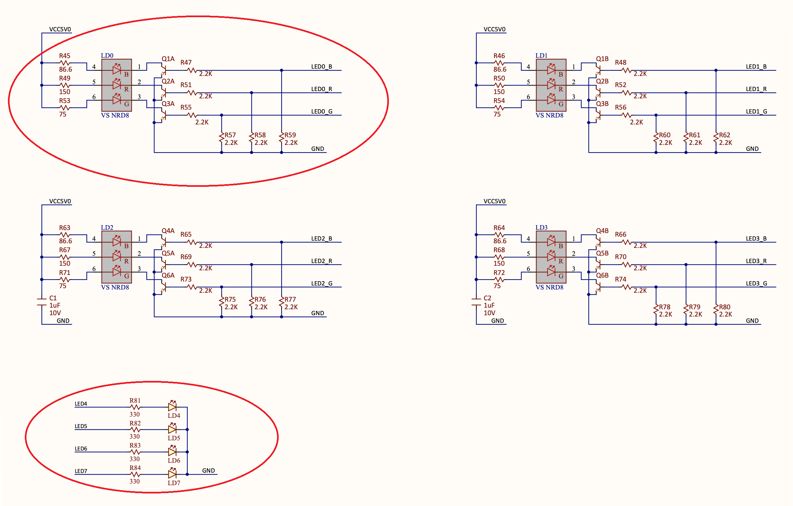

<div align="justify">

# Practicum 2
[[**Home**](https://github.com/lpacher/lae)] [[**Back**](https://github.com/lpacher/lae/tree/master/fpga/practicum)]


## Contents

* [**Introduction**](#introduction)
* [**Practicum aims**](#practicum-aims)
* [**Navigate to the practicum directory**](#navigate-to-the-practicum-directory)
* [**Map and debug fundamental logic gates**](#map-and-debug-fundamental-logic-gates)
* [**Run implementation and programming flows from Makefile**](#run-implementation-and-programming-flows-from-makefile)
* [**Restore a design checkpoint in Vivado**](#restore-a-design-checkpoint-in-vivado)
* [**Implement a parameterized ring-oscillator**](#implement-a-parameterized-ring-oscillator)
* [**Exercises**](#exercises)

<br />
<!--------------------------------------------------------------------->


## Introduction
[**[Contents]**](#contents)

In this practicum you are going to implement and debug fundamental **logic gates** such
as AND, NAND, OR, NOR, XOR and XNOR as already discussed in `lab2` and `lab5`.
For this purpose you will use simple **slide switches** and **general-purpose LEDs**
available on the _Digilent Arty Board_.

Additionally you will implement and verify a **parameterized ring-oscillator** circuit.
Despite the circuit is pretty simple to be coded in Verilog you will need
additional `dont_touch` **synthesis directives** and **special timing constraints**
in order to properly map the RTL code on real FPGA hardware.

<br />
<!--------------------------------------------------------------------->


## Practicum aims
[**[Contents]**](#contents)

This practicum should exercise the following concepts:

* review Verilog bitwise operators and gate-primitives
* implement and debug fundamental logic operators on real FPGA hardware
* use improved _Project Mode_ Tcl scripts and `Makefile` to run the flows in batch mode
* restore a design checkpoint in Vivado
* implement a ring-oscillator circuit on real FPGA hardware
* introduce the usage of _synthesis pragmas_ in RTL
* identify and fix timing-loop issues in combinational circuits
* review and understand the differece between _Auto_ and _Normal_ trigger modes at the oscilloscope
* debug termination issues

<br />
<!--------------------------------------------------------------------->


## Navigate to the practicum directory
[**[Contents]**](#contents)


As a first step, open a **terminal** window and change to the practicum directory:

```
% cd Desktop/lae/fpga/practicum/2_gates
```

<br />

List the content of the directory:

```
% ls -l
% ls -l .solutions
```

<br />
<!--------------------------------------------------------------------->


## Map and debug fundamental logic gates
[**[Contents]**](#contents)

The circuit that you are going to implement and debug is shown in figure.

<br />

<br />

<br />

>
> **NOTE**
>
> As you can inspect from board schematics general-purpose **RGB LEDs** are connected to the main 5V supply
> voltage through inverters implemented with BJT transistors, while general-purpose **standard LEDs** simply
> connect to ground with 330 $\Omega$ series limiting resistors.
>
> The circuit schematic depicted in figure is therefore a simplified reference circuit diagram. 
>
> 
>

<br />

**RTL IMPLEMENTATION**

To save time, copy from the `.solutions/` directory the `Gates.v` source file already
discussed during lectures in `lab2` and `lab5` as follows:

```
% cp .solutions/Gates.v .
```

<br />

>
> **WARNING**
>
> Do not forget the dot `.` to indicate that the **target destination directory**
> for the `cp` command is the current working directory!
>

<br />

Review the code using your preferred text-editor application:

```
% gedit Gates.v &   (for Linux users)

% n++ Gates.v       (for Windows users)
```

<br />

**DESIGN CONSTRAINTS (XDC)**

In order to map the Verilog code on real FPGA hardware you also need to write a **constraints file**
using a **Xilinx Design Constraints (XDC) script**. Create therefore with your **text-editor** application
a new source file named `Gates.xdc` as follows:

```
% gedit Gates.xdc &   (for Linux users)

% n++ Gates.xdc       (for Windows users)
```

<br />

Copy from the `.solutions/` directory the reference XDC file for the _Arty_ board:

```
% cp .solutions/arty_all.xdc .
```

<br />

Try to **write yourself design constraints** required to implement the design on the actual board.
In the following you can find useful information to help you in writing the code.

<br />

**PHYSICAL CONSTRAINTS (PORT MAPPING)**

As a first step you have to write **pin constraints** required to map `A` and `B`
Verilog inputs to slide-witches **SWO** and **SW1** and to map `Z[0]` ... `Z[5]`
Verilog outputs to general-purpose LEDs as in figure. Use the main `arty_all.xdc` as a reference
for the syntax.

```
set_property -dict { PACKAGE_PIN <FPGA pin> IOSTANDARD LVCMOS33 } [get_ports <HDL port name> ]
```

<br />

As already discussed in the introductory practicum each HDL top-level port
needs both an FPGA physical pin name and the I/O voltage to be specified
in the constraints file by setting `PACKAGE_PIN` and `IOSTANDARD`
properties.

The above syntax uses one single `set_property` statement to assign both 
`PACKAGE_PIN` and `IOSTANDARD` in form of a "dictionary", that
is a list of _(key,value)_ pairs.

Alternatively you can set `PACKAGE_PIN` and `IOSTANDARD` properties
using two independent statements targeting the same HDL top-level port:

```
set_property PACKAGE_PIN <FPGA pin> [get_ports <HDL port name> ]
set_property IOSTANDARD LVCMOS33 [get_ports <HDL port name> ]
```

<br />

>
> **IMPORTANT**
>
> Since everything in Tcl at the end is considered a string you need a way to **evaluate** Tcl commands.
> Square brackets `[ ]` are used for this purpose to indicate "command evaluation".
> As you might expect this introduces issues when working with **signal buses** in Verilog
> that also use `[ ]` to access bus items. This happens also if you use `std_logic_vector`
> ports in VHDL, because square brackets are used in XDC to access bus items despite the chosen HDL language used
> for the top-level module.
>
> Usually in the XDC file we use `get_ports` to map top-level RTL ports into physical FPGA pins,
> however in case of HDL signals declared as buses we have to prevent `[ ]` to be used for command
> evaluation. This is done by **adding curly brackets** `{ }` around the signal name.
>
> As an example,
>
> ```
> get_ports Z[0]
> ```
>
> would rise an error, because `[0]` for Tcl means "evaluate" what is between `[`
> and `]` (nothing in this case).
> The following command works fine instead, because curly brackets `{ }` means "this is just a string":
>
> ```
> get_ports {Z[0]}
> ```
>

<br />

**TIMING CONSTRAINTS**

Since this is a pure **combinational circuit** timing constraints are relaxed. A first possibility
is to require some **maximum delay** between inputs and outputs using the `set_max_delay` constraint.

As an example, you can constrain a max. 10 ns delay between any input to any output with the following syntax:

```
set_max_delay 10 -from [all_inputs] -to [all_outputs]
```

<br />

You can also play with the delay value and verify the effect in Vivado **timing reports**.

Alternatively you can simply **disable all timing checks** with `set_false_path` as follows:

```
set_false_path -from [all_inputs] -to [all_outputs]
```

<br />

**ELECTRICAL CONSTRAINTS**

You can re-use same electrical constraints from the introductory practicum:

```
set_property CFGBVS VCCO        [current_design]
set_property CONFIG_VOLTAGE 3.3 [current_design]
```

<br />

Optionally you can include the following additional XDC statements to **optimize the memory configuration file (.bin)**
to program the external **128 Mb (16 MB) Quad Serial Peripheral Interface (SPI) Flash memory** in order to automatically
load the FPGA configuration at power-up:

```
set_property BITSTREAM.CONFIG.SPI_BUSWIDTH 4  [current_design]
set_property CONFIG_MODE SPIx4                [current_design]
```

<br />

**FPGA IMPLEMENTATION AND FIRMWARE DEBUG**

Once ready, open Vivado in graphical mode with

```
% vivado -mode gui &                               (for Linux users)

% echo "exec vivado -mode gui &" | tclsh -norc     (for Windows users)
```

<br />

and try to run the FPGA implementation flow in _Project Mode_ up to bitstream generation:

* create into the current directory a new project named `Gates` targeting the `xc7a35ticsg324-1L` FPGA device
* add the `Gates.v` Verilog file to the project
* add `Gates.xdc` design constraints to the project
* run elaboration and inspect the RTL schematic
* run synthesis and inspect the post-synthesis schematic
* run implementation and inspect place-and-route results into the _Device_ view
* generate the bitstream

<br />

>
> **QUESTION**
>
> Which FPGA device primitives have been used to map the design on real hardware ?
>
>   \___________________________________________________________________________________
>

<br />

After the implementation flow has successfully completed **locate the bitstream file**
to be used for firmware installation. For this purpose remind that when running Vivado
in _Project Mode_ by default both bitstream (.bit) and raw-binary (.bin) programming
files are written by Vivado into the `*.runs/impl_1/` directory automatically created
by the tool as part of the project tree setup.

Verify at the end of the flow that the bitstream file has been properly generated:

```
% ls -lh ./Gates.runs/impl_1/ | grep .bit
```

<br />

>
> **QUESTION**
>
> Which is the on-disk size of the bitstream file ?
>
>   \___________________________________________________________________________________
>

<br />

Program the FPGA using the Vivado _Hardware Manager_ as discussed in the introductory practicum
and debug the expected functionality of the firmware by playing with slide-switches and LEDs
on the board.

<br />
<!--------------------------------------------------------------------->


## Run implementation and programming flows from Makefile
[**[Contents]**](#contents)

In the introductory practicum we already explored the possibility to run both FPGA implementation
and programming flows in **batch mode** using Tcl scripts and a `Makefile`.

For this practicum improved _Project Mode_ Tcl scripts and `Makefile` have been already prepared
for you. Copy into the current directory the following sources:

```
% cp .solutions/Makefile    .
% cp .solutions/setup.tcl   .
% cp .solutions/build.tcl   .
% cp .solutions/install.tcl .
```

<br />

Once all scripts are in place try to re-run all flows from scratch using the `make` utility as follows:

```
% make clean
% make build
% make install
```

<br />

Explore the content of the updated scripts with your preferred text editor or using basic
command-line utilities `cat`, `more` or `less`.

```
% cat Makefile
% cat setup.tcl
% less build.tcl
% less install.tcl
```

<br />

As you can notice the proposed updated flow uses a new `setup.tcl` to specify Tcl variables
that are common to both implementation and programming flows such as the project name
and directory, the top-level RTL module and the target FPGA device.

According to our initial coding conventions for the moment our basic projects only
contain one single Verilog file `ModuleName.v` and one XDC file `ModuleName.xdc`.
Therefore a single `topModuleName` Tcl variable is enough to specify `$topModuleName.v`
and `$topModuleName.xdc` input files and to have a more portable flow.

Later in the course we will export all project information as environment variables from
`Makefile` in a more convenient way.

<br />
<!--------------------------------------------------------------------->


## Restore a design checkpoint in Vivado
[**[Contents]**](#contents)

When running Vivado in _Project Mode_ a so-called **design checkpoint (DCP)** file is automatically
saved for you by Vivado at each major step of the flow (synthesis, placement and routing).

A design checkpoint is a Vivado-specific **binary database** with file extension `.dcp` that
represents a "snapshot" of the entire design at a particular stage of the flow. As an example,
a post-synthesis database contains the synthesized netlist and design constraints, while a placed
or a routed database contains also additional information related to the physical implementation
of the design.

Explore all design checkpoint files that are part of the Vivado project tree:

```
% ls -lh ./Gates.runs/*/* | grep .dcp
```

<br />

By using design checkpoints you can later **restore** a design project back into Vivado.

Try to restore the "routed" design checkpoint automatically generated for you
by the `make build` flow. Start a new Vivado session in GUI mode with
the new `make gui` target:

```
% make gui
```

<br />

Then go through **File > Checkpoint > Open...** and restore the `Gates_routed.dcp` database placed in the
`Gates.runs/impl_1/` directory. Observe the equivalent command in the Tcl console:

```
open_checkpoint ./Gates.runs/impl_1/Gates_routed.dcp
```

<br />

Explore the design in the graphical user interface. Exit Vivado once happy.

A second possibility is to automatically load a design checkpoint by passing
the name of the database as main argument when executing `vivado`
at the commad line.

As an example, try to restore the post-synthesis design checkpoint with the following command:

```
% vivado -mode gui ./Gates.runs/synth_1/Gates.dcp
```

<br />

Explore the design in the graphical user interface. Exit Vivado before moving to the
ring-oscillator implementation.

<br />
<!--------------------------------------------------------------------->


## Implement a parameterized ring-oscillator
[**[Contents]**](#contents)

The second circuit that you are going to map and debug to the _Arty_ board
in this practicum is a parameterized **ring-oscillator** as shown in figure.

<br />

<br />

The proposed circuit uses an AND-gate into the feedback loop to enable/disable the `clk`
output toggle, thus requiring an **odd number** $N = 2k + 1$ of inverters
in the chain to oscillate. A simpler version of this design as been already discussed
and simulated  in `lab2` using a reduced and fixed number of inverters.

Despite its apparent simplicity a ring-oscillator offers a first example of a
**non-trivial implementation** requiring both **special synthesis directives**
and **special timing constraints** in order to properly implement this circuit
on real FPGA hardware.

Copy from the `.solutions/` directory both Verilog and XDC files already prepared for you:

```
% cp .solutions/RingOscillator.v .
% cp .solutions/RingOscillator.xdc .
```

<br />

Inspect yourself the proposed code with your preferred **text-editor** application and review
most important syntax features, new constructs and special statements summarized below.

<br />

**RTL IMPLEMENTATION AND SYNTHESIS PRAGMAS**

In order to easily change the **number of inverters** in the ring-oscillator chain
(and therefore the **frequency** of the `clk` output toggle) the module uses `NUM_INVERTERS`
declared as a `parameter`. A Verilog `generate` **for-loop** is then used to automatically
replicate and interconnect the chosen number of inverters.

<br />

Most important, you should have noticed the usage of the following **non-Verilog syntax** in the code:

```
(* dont_touch = "yes" *) wire [NUM_INVERTERS:0] w ;

...
...

(* dont_touch = "yes" *) not NOT_INST (w[k+1], w[k]) ;
```

<br />

This is a first example of so called **synthesis pragmas**, also referred to as **synthesis attributes**
or **synthesis directives**. Synthesis pragmas are tool-specific **extra comment-like HDL statements**
(ignored by the compiler when you run the simulation flow) to "guide" the synthesis tool in generating
the desired hardware.

When you run the FPGA implementation flow the **synthesis engine** translates the RTL code into FPGA
primitives. During this process the tool also performs several **optimizations** to obtain best
**quality-of-results (QoR)** in terms of **timing**, **power** and **area**.

A ring oscillator needs $N = 2k +1$ (odd number) inverters to oscillate. However if you cascade $2 k$ (even number)
inverters the resulting **logic function** as expected is a simple identity and the synthesis tool properly
recognizes this. As a result from a design-optimization point of view there is no reason for the synthesis engine
to keep $2 k$ un-necessary inverters out of $2k + 1$ and after its logic optimization the initial circuit
would reduce to a simple AND gate plus an inverter connected in feedback, or equivalently one single NAND gate
connected in feedback.

In order to "force" the synthesis tool to **keep all inverters** in the chain special
`dont_touch` statements enclosed within `(*` and `*)` are added into RTL
for this purpose. In particular we ask the synthesis tool to "don't touch" and keep all wires
`w[0]` ... `w[N]` used for internal connections along with all `not`
instances in the for-loop. In fact `dont_touch` can be placed on any signal, module or
instance in your design.

<br />

>
> **IMPORTANT**
>
> As recommended by Xilinx the `dont_touch` attribute **should be set in RTL only**.
> In fact it might happen that signals or instances that need to be kept can often be optimized
> **before the XDC file is parsed** by the synthesis engine! Therefore, setting this attribute
> in the RTL ensures that it is really used and that all signals/instances/modules that you want to keep are effectively
> preserved.
>
> Moreover adding `dont_touch` in RTL is also a **good coding practice**
> because the code is automatically self-documented and when working into a larger design team
> it is much easier for the **back-end designer** (the person in charge of running synthesis and
> implementation flows) to know what the **front-end designer** (who actually writes the RTL code)
> wants to keep in the design.
>

<br />

There are many other synthesis attributes supported by Xilinx Vivado. A few examples are:

* `TRANSLATE_OFF/TRANSLATE_ON`
* `DONT_TOUCH`
* `KEEP`
* `KEEP_HIERARCHY`
* `RAM_STYLE`
* `ROM_STYLE`
* `MARK_DEBUG`
* `FULL_CASE/PARALLEL_CASE` etc.

<br />

Most of these special synthesis directives can be either placed into the RTL code or into the XDC file, however
there are also RTL-only and XDC-only attributes. In Xilinx Vivado these statements are **case-insensitive** and you can
write them either all-capital or lowercase. For a complete list of synthesis attributes supported by Xilinx Vivado
refer to the _Synthesis Attributes_ chapter of the _Vivado Design Suite User Guide: Synthesis (UG901)_:

_<https://www.xilinx.com/support/documentation/sw_manuals/xilinx2019_2/ug901-vivado-synthesis.pdf>_

<br />

Please be aware that synthesis pragmas are always tool-specific, therefore always refer to the
official documentation of the synthesis tool that you are working with.

<br />

**DESIGN CONSTRAINTS**

Beside the usage of `dont_touch` synthesis pragmas we also need **special timing constraints** to successfully
generate a bitstream file to program the FPGA.

The ring-oscillator is a combinational circuit that by purpose uses a "feedback" in the inverter chain in order to oscillate.
However this feedback also introduces a **timing loop issue** detected by the **Static Timing Analysis (STA) engine**
that Vivado runs during synthesis and physical implementation (place-and-route) flows to compute propagation delays and
to check the timing.

Combinational timing loops are created whenever the output of a combinational circuit is fed back to its input, resulting
in a timing loop. This loops unnecessarily increase the number of cycles by infinitely going around the same path and
the propagation delay cannot be computed by the STA tool.

As a result despite we already disable all timing checks in the constraints file with

```
set_false_path -from [all_inputs] -to [all_outputs]
```

<br />

the following statement is required to resolve the timing loop and let Vivado to complete
the implementation flow and to generate the bitstream:

```
set_property ALLOW_COMBINATORIAL_LOOPS TRUE [get_nets w* ]
```

<br />

Without this statement the flow runs up to synthesis but later Vivado rises an error at the end of the implementation.
You can easily confirm this by running the `build` flow at the command-line using the `make`
utility with/without this `ALLOW_COMBINATORIAL_LOOPS` property as described below.

Please refer to the _Vivado Design Suite User Guide: Design Analysis and Closure Techniques (UG906)_ for more details
about timing analysis and results in Xilinx Vivado:

_<https://www.xilinx.com/support/documentation/sw_manuals/xilinx2019_2/ug906-vivado-design-analysis.pdf>_

<br />

**FPGA IMPLEMENTATION AND FIRMWARE DEBUG**

Before running the FPGA implementation flow modify with your preferred **text-editor** the main project setup script `setup.tcl`

```
% gedit setup.tcl &   (for Linux users)

% n++ setup.tcl       (for Windows users)
```

<br />

and update the values set for `projectName` and `topModuleName` variables as follows:

```
#set projectName {Gates}
set projectName {RingOscillator}

...

#set topModuleName {Gates}
set topModuleName {RingOscillator}
```

<br />

Save the file after modifications. Once ready launch the flow at the command line with:

```
% make clean
% make build
```

<br />

After the implementation has successfully completed install the firmware to the FPGA board with:

```
% make install
```

<br />

Verify the functionality of the ring-oscillator you have mapped on real hardware.
Use the **SW0** slide-switch assigned to the `start` Verilog input port
to enable/disable the oscillator and probe the `clk` signal at the oscilloscope.
Verify that the **LD4** general-purpose standard LED properly turns on/off to indicate
that the oscillator is running or not. An additional `start_probe` Verilog output
is available to also display `start` at the oscilloscope. 

<br />

>
> **HINT**
>
> In order to "capture" the transition of the `start` signal from logic 0 to logic 1
> and observe the `clk` output starting oscillating you have to properly set **trigger options**
> of the oscilloscope you are working with to use a _single-trigger_ or _single shot_ trigger mode.
>
> Disable the ring-oscillator by setting `start` to logic 0 with the slide-switch
> and ensure that the status-led turns off.
> Then open the **Trigger Menu** and switch the trigger-mode from **Auto** (default)
> to **Normal**. Ensure that a positive-edge transition is used as
> trigger condition. Finally select the channel used to display the
> `start_probe` Verilog output port for the trigger and enable the ring-oscillator.
>
> In _Normal_ trigger mode in fact the trigger only occurs if the specified trigger
> conditions are met, freezing the display after the trigger event.
> In _Auto_ mode (default) a trigger is always forced instead, continuously updating
> displayed waveforms.
>
> Do not forget to set the trigger mode back to _Auto_ once done.
>

<br />

<br />

<br />

<br />

>
> **QUESTION**
>
> Which is the frequency of the resulting clock waveform ?
>
>   \___________________________________________________________________________________
>

<br />

Modify the `RingOscillator.xdc` file by commenting out the `set_property` statement
setting the`ALLOW_COMBINATORIAL_LOOPS` property as follows:

```
#set_property ALLOW_COMBINATORIAL_LOOPS TRUE [get_nets w* ]
```

<br />

Save and try to re-run the flow from scratch with:

```
% make clean build
```

<br />

Observe the following **Design Rule Check (DRC) error** generated by Vivado when the `write_bitstream`
command is invoked at the end of the flow:

```
ERROR: [DRC LUTLP-1] Combinatorial Loop Alert: 284 LUT cells form a combinatorial loop. This can create a race condition.
Timing analysis may not be accurate. The preferred resolution is to modify the design to remove combinatorial logic loops.
If the loop is known and understood, this DRC can be bypassed by acknowledging the condition and setting the following
XDC constraint on any one of the nets in the loop: 'set_property ALLOW_COMBINATORIAL_LOOPS TRUE [get_nets <myHier/myNet>]'.
One net in the loop is xxx. Please evaluate your design. The cells in the loop are: xxx ...
```

<br />

Restore the XDC file back to its initial version by removing the extra comment character `#` added before. Do not
forget to save your file after modifications:

```
set_property ALLOW_COMBINATORIAL_LOOPS TRUE [get_nets w* ]
```

<br />
<!--------------------------------------------------------------------->


## Exercises
[**[Contents]**](#contents)

<br />

**EXERCISE 1**

The number of inverters in the ring-oscillator chain determines the **frequency** of the `clk`
output toggle. Since `NUM_INVERTERS` is a Verilog `parameter` you can easily change this number
and perform a study of the **frequency vs. number of inverters** relationship.

Let suppose $t_p$ the propagation delay of a single inverter cell. The total input-to-output propagation delay (half-period)
for a cascade of $N$ inverters is therefore:

$$
\frac{T}{2} = N t_p
$$

As a result the expected oscillation frequency is:

$$
f_{osc} = \frac{1}{T} = \dfrac{1}{2 N t_p}
$$

Hence the frequency shoul be proportional to $1/N$:

$$
f_{osc} \propto \frac{1}{N}
$$

In the proposed implementation we have one additional propagation delay in the feedback loop
due to the presence of the AND control gate. Indeed we can assume that the AND and the inverters
have comparable propagation delays. This is also a reasonable assumption since at end all cells
are mapped to LUT primitives inside the FPGA. As a result we can expect that:

$$
f_{osc} \approx \frac{1}{2 (N + 1) t_p } \propto \frac{1}{N+1}
$$

You can therefore map to FPGA the ring-oscillator for different values of `NUM_INVERTERS`, measure
at the oscilloscope the frequency of the `clk` output toggle and verify with a **linear fit** the
expected linear trend versus $1/(N+1)$. Given the large number of inverters in the chain we can also
simply approximate $N + 1 \approx N$ and perform the study versus $1/N$.

Open the `RingOscillator.v` Verilog code with your preferred text editor application and run the FPGA
implementation and programming flows at the command line by exploring 5-10 different `NUM_INVERTERS` values.
At the end of each implementation install the new firmware to the FPGA and measure at the oscilloscope
the frequency of the output toggle.

In order to significantly change the frequency you have to generate the firmware for $\approx 2N_0$ , $\approx 3N_0$ ... $\approx 5N_0$ etc.
assuming $N_0$ the initial value chosen for you for `NUM_INVERTERS` in the Verilog code.

Most important, be always sure that `NUM_INVERTERS` is an **odd number**, otherwise the circuit will never oscillate!
As an example:


<br />

|   $N$    |   $f_{osc}$   |
|:--------:|:-------------:|
|   283    |      ...      |
|   567    |      ...      |
|   849    |      ...      |
|   1133   |      ...      |
|   1417   |      ...      |
|   ...    |      ...      |
|   ...    |      ...      |

<br />

The overall procedure can be summarized as follows:

* stop the ring-oscillator on the _Arty_ board
* change `NUM_INVERTERS` in the `RingOscillator.v` Verilog code
* save the modified Verilog file after your changes
* cleanup the working area (`make clean`)
* generate the bitstream (`make build`)
* install the firmware (`make install`)
* enable the ring-oscillator
* measure at the oscilloscope the frequency of the output toggle
* repeat for 5-10 different **odd** values of `NUM_INVERTERS`

<br />

>
> **IMPORTANT**
>
> After each measurement **disable the ring-oscillator** by setting `start` to logic 0 with the corresponding slide
> switch and ensure that the status led turns-off. At the end of the `make install` flow restart the oscillator.
> If you don't restart the oscillator whenever a new firmware is installed the output toggle seen at the oscilloscope
> remains corrupted!
>

<br />

Create a new directory for your data analysis developments:

```
% mkdir data
```

<br />

Use **ROOT** for your data analysis and make `TGraph` plots for the frequency vs. $(N+1)$
and for the frequency vs. $1/(N+1)$. Verify the expected linearity of the characteristic with a fit.


<br />

> **HINT**
>
> Simple plots of experimental data in form of y-values vs. x-values in ROOT are implemented using the `TGraph` class,
> which also allows to **read and plot measurements data from a text file**.
>
> With your text-editor application create a new text file e.g. `data/RingOscillator.dat` and register your
> measurements as follows:
>
> ```
> # N   Fosc
> 283   ...
> 567   ...
> 849   ...
> 1133  ...
> 1417  ...
> ...   ...
> ...   ...
> ```
>
> <br />
>
> Start an **interactive ROOT session** at the command line:
>
> ```
> % root -l
> ```
>
> <br />
>
> Plot the characteristic interactively with:
>
> ```
> root[] TGraph gr("data/RingOscillator.dat")
> root[] gr.Draw("ALP")
> ```
>
> <br />
>
> Alternatively you can place your measurements into **standard C/C++ arrays** and use them
> into the `TGraph` constructor:
>
> ```
> root[] int Npt = ...
> root[] double xData[Npt] = {283 , 567 , 849 , 1133 , 1415 ... }
> root[] double yData[Npt] = { ... }
> root[] TGraph gr(Npt,xData,yData)
> root[] gr.Draw("ALP")
> ```
>

<br />

Sample **ROOT un-named scripts** have been already prepared for you as a reference starting point for your analysis. You
can copy a first example code from the `sample/` directory at the top of the Git repository as follows:

```
% cp ../../../sample/ROOT/plotDataArray.cxx .
```

<br />

Ask to the teacher if you are not confident in using the ROOT software.

<br />
<!--------------------------------------------------------------------->


**EXERCISE 3**


By default the ring-oscillator output toggle has been assigned to the **A5** pin of the **chipKIT** header
but you can decide to map this output to any other programmable I/O pin available on the _Arty_ board.

Edit the `RingOscillator.xdc` constraints file and change to **JA1** he target pin for the `clk` output toggle as follows:

```
set_property PACKAGE_PIN G13 [get_ports clk] ;   # JA1 - 200 ohm series resistance
#set_property PACKAGE_PIN E15 [get_ports clk] ;   # JB1 - NO termination resistance
#set_property PACKAGE_PIN D5  [get_ports clk] ;   # A5 (chipKIT header)
```

<br />

Save your changes and re-run from scratch all flows in batch mode at the command-line:

```
% make clean build
% make install
```

<br />

>
> **QUESTION**
>
> What happens if you probe at the oscilloscope the ring-oscillator output assigned to a programmable I/O pin
> **with or without a series resistor** already integrated into the I/O electrical path ?
>
>   \___________________________________________________________________________________
>

<br />

Repeat the test targeting the **JB1** PMOD pin and experiment yourself with **termination issues**.

<br />
<!--------------------------------------------------------------------->


**EXERCISE 3**

The proposed ring-oscillator implementation uses `NUM_INVERTERS` specified as a Verilog **module parameter**.
Another possibility to easily change the number of inverters in the chain is to define and later use `NUM_INVERTERS`
as a Verilog **macro** with the following syntax:

```
`define NUM_INVERTERS 237 
```

<br />

Try yourself to modify the `RingOscillator.v` code in order to use this Verilog feature. For this purpose it might be useful
to remind that the **value** of a Verilog macro is accessed in the code with the **back-tick** character ``` followed
by the **name** of the macro. As an example:

```
(* dont_touch = "yes" *) wire [`NUM_INVERTERS:0] w ;
```

<br />
<!--------------------------------------------------------------------->

**EXERCISE 4**

Try yourself to implement and debug a simple **full-adder** combinational block.

```
assign {Cout, Sum}  = A + B + Cin ;
```

<br />
<!--------------------------------------------------------------------->

</div>
