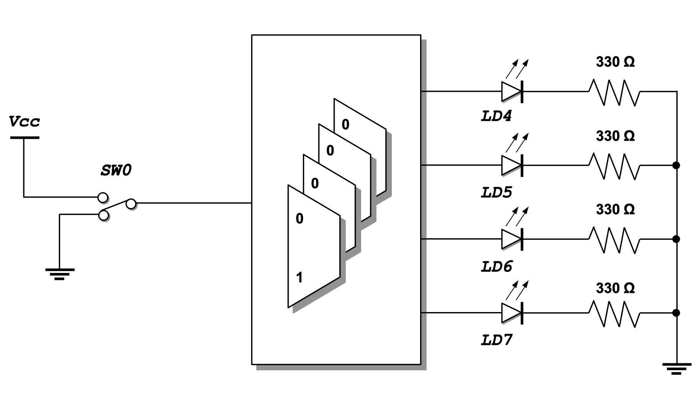
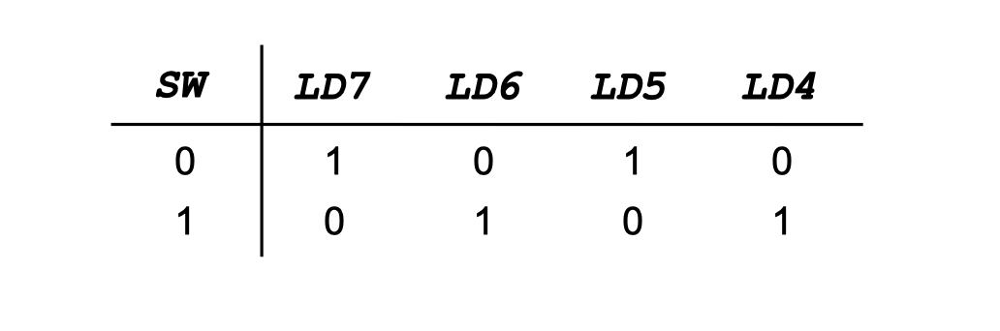

<div align="justify">

# Practicum 3
[[**Home**](https://github.com/lpacher/lae)] [[**Back**](https://github.com/lpacher/lae/tree/master/fpga/practicum)]

For this practicum **try yourself** to write a suitable multiplexing logic
to alternatively drive the four standard LEDs available on the Digilent _Arty_ board
with either `1010` or `0101` patterns according to the position of a slide-switch.

<br />




<br />

All scripts and `Makefile` can be copied from the `.solutions/` directory as follows:

```
% cp .solutions/Makefile .
% cp .solutions/setup.tcl .
% cp .solutions/build.tcl .
% cp .solutions/install.tcl .
```

Try yourself to:

* create new `LED_pattern_mux.v` and `LED_pattern_mux.xdc` source files from scratch
* implement a `LED_pattern_mux` module that performs the requested functionality
* use XDC statements to map the MUX selector to switch **SW0** and output LEDs to standard LEDs **LD7-LD6-LD5-LD4**
* check project settings into `setup.tcl` script
* run the implementation flow from `Makefile`
* install and debug the firmware

<br />

Once you have verified the proper functionality of the firmware restore the routed design checkpoint in Vivado
as follows:

```
% vivado -mode gui ./LED_pattern_mux.runs/impl_1/LED_pattern_mux_routed.dcp
```

<br />

>
> **QUESTION**
>
> Which FPGA device primitives have been used to map the design on real hardware? <br />
> Is the final **gate-level schematic** the expected one?
>
>   \___________________________________________________________________________________
>

<br />

<!--------------------------------------------------------------------->

</div>
