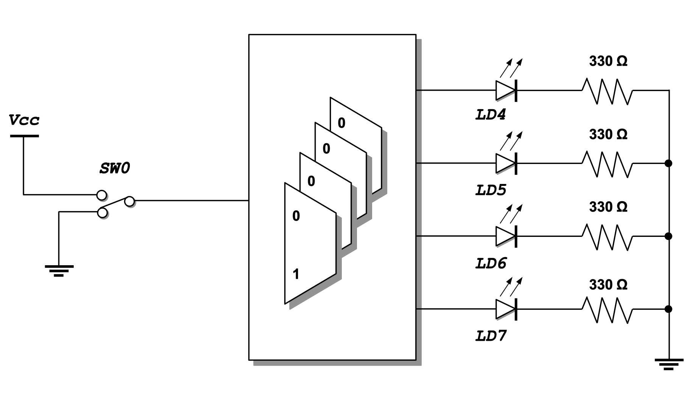
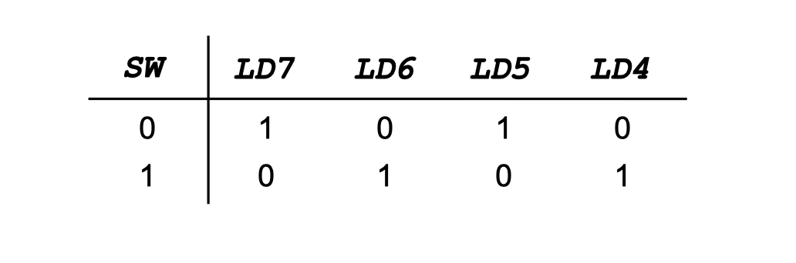
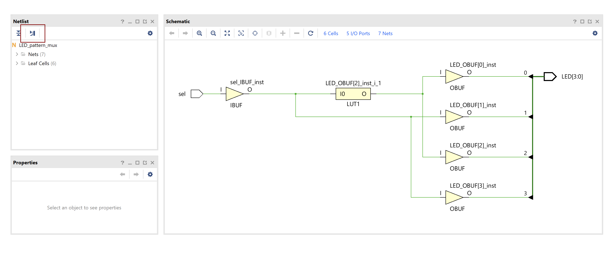
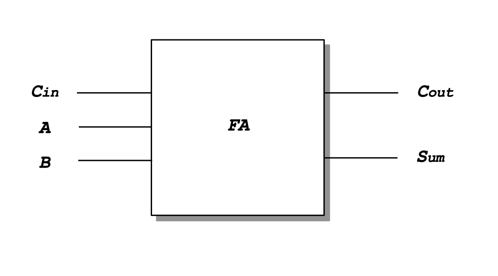
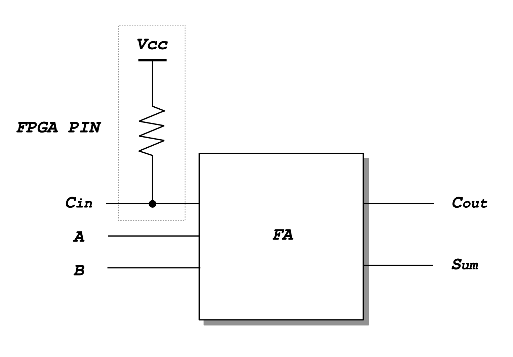

<div align="justify">

# Practicum 3
[[**Home**](https://github.com/lpacher/lae)] [[**Back**](https://github.com/lpacher/lae/tree/master/fpga/practicum)]

## Estimated time: **20 minutes**

For this practicum **try yourself** to write a suitable **multiplexing logic**
to alternatively drive the four standard LEDs available on the Digilent _Arty_ board
with either `1010` or `0101` patterns according to the position of a slide-switch.

<br />



<br />

All scripts and `Makefile` can be copied from the `.solutions/` directory as follows:

```
% cp .solutions/Makefile .
% cp .solutions/setup.tcl .
% cp .solutions/build.tcl .
% cp .solutions/install.tcl .
```

<br />

As depicted in figure the block that you are requested to implement has one input and
four outputs. The circuit is a pure **combinational circuit** and according to
the desired functionality the **truth-table** for the block is the following:

<br />



<br />

Try yourself to:

* create new `LED_pattern_mux.v` and `LED_pattern_mux.xdc` source files from scratch
* implement a `LED_pattern_mux` module that performs the requested functionality
* use XDC statements to map the MUX selector to switch **SW0** and output LEDs to standard LEDs **LD7-LD6-LD5-LD4**
* check project settings into `setup.tcl` script
* run the implementation flow from `Makefile`
* install and debug the firmware

<br />

In case of implementation errors debug the Vivado **log file** at the command line with:

```
% grep ERROR build.log
```

<br />

Once you have verified the proper functionality of the firmware **restore the final routed design checkpoint (DCP)**
in the Vivado graphical interface.

For Linux users:

```
% vivado -mode gui ./LED_pattern_mux.runs/impl_1/LED_pattern_mux_routed.dcp &
```

<br />

For Windows users:

```
% echo "exec vivado -mode gui ./LED_pattern_mux.runs/impl_1/LED_pattern_mux_routed.dcp &" | tclsh -norc
```

<br />

Inspect in the GUI the final **gate-level schematic**.

<br />



<br />

<br />

>
> **QUESTION**
>
> Which FPGA device primitives have been used to map the design on real hardware? <br />
> Is the final **gate-level schematic** the expected one?
>
>   \___________________________________________________________________________________
>

<br />

Let now suppose that you don't have a synthesis tool to infer the hardware starting from some HDL code.
Try to derive yourself **logic equations** from the proposed truth-table of the circuit.
Draw **on paper** the resulting gate-level schematic and compare your results with Vivado synthesis
results.

<br />
<!--------------------------------------------------------------------->


**EXERCISE 4**

Implement and debug a simple **Full-Adder (FA)** combinational block as depicted in figure:

<br />

<br />

As already discussed in `lab2` the block is a pure **combinational circuit**, therefore you can use a **truth-table** implemented
using a Verilog `case` statement. Alternatively, from the truth-table you can also write a **Karnaugh map** for each full-adder
output and derive **logic equations** for `Sum` and `Cout`.

Indeed, you can simply use the standard sum operaror `+` as in other programming languages for this purpose:

```
assign {Cout, Sum}  = A + B + Cin ;
```

<br />

The **synthesis tool** will be then responsible to infer necessary logic gates to implement the binary
addition in real hardware.

Try yourself to:

* create new `FullAdder.v` and `FullAdder.xdc` source files from scratch
* implement a `FullAdder` module that performs a 2-bit binary addition with both input and output carry
* use XDC statements to map full-adder inputs `Cin`, `A` and `B` to slide-switches **SW2**, **SW1** and **SW0** (use the left-most switch for the input-carry)
and outputs to standard LEDs **LD5** and **LD4** (use the left-most LED for the output carry)
* update project settings with the `setup.tcl` script
* run the implementation flow from `Makefile`
* install and debug the firmware

<br />
<!--------------------------------------------------------------------->

**EXERCISE 5**

In the previous exercise we connected all full-adder inputs to slide-switches.
Let now suppose that we want to update design constraints to map the input-carry
`Cin` to a general-purpose **pin-header** in place of a slide-switch.
However **without an external driving component** (can be as simple as a push-button
implemented on the breadboard) the input `Cin` of the full-adder would remain **floating**.

<br />

>
> **IMPORTANT !**
>
> Keeping unconnected FPGA pins configured as **input** pins is a **BAD practice** because
> this can lead to unstable logic values, increase the power consumption ad cause
> **potential damage to the device itself**. In fact unconnected input pins can act as **antennas**,
> picking-up **electromagnetic interference (EMI)** and **noise**.
>
> &nbsp;&nbsp;&nbsp;&nbsp;&nbsp;&nbsp;&nbsp; <b>\*\* NEVER KEEP FPGA PINS PROGRAMMED AS INPUT PINS FLOATING ! \*\*</b>
>

<br />

As discussed during lectures FPGA programmable I/O pins allows to optionally specify also
a **pull-up** or **pull-down** condition, thus fixing all above issues.

Modify design design constraints in order to:

* map the full-adder `Cin` input port to pin **IO41** of the _Arty_ board
* additionally, configure the pin to be internally **pulled-up** using the `PULLUP` property

<br />

<br />

<br />

```
#set_property -dict { PACKAGE_PIN C10  IOSTANDARD LVCMOS33 } [get_ports Cin] ;   ##COMMENTED
set_property -dict { PACKAGE_PIN N17 IOSTANDARD LVCMOS33 } [get_ports Cin] ;   ## IO41
set_property PULLUP TRUE [get_ports Cin]
```

<br />

Save the file after modifications. Once ready re-run the flow at the command line with:

```
% make clean
% make build

<br />

After the implementation has successfully completed install the firmware to the FPGA board with:

```
% make install
```

<br />

Verify the functionality of the updated firmware:

* check logic values for `Cout` and `Sum` LEDs by changing **SW0** and **SW1** while keeping **IO41** floating
* **connect a jumper wire** between **IO41** and ground **GND** though an approx. 220 $\Omega$ resistor
  to force `Cin` to be zero and re-check the expected functionality of the summing circuit

<br />


<br />

>
> **IMPORTANT !**
>
> Depending on board-specific implementation details some FPGA pins might already have **pre-placed**
> pull-up or pull-down **external resistors** on the board itself! As an example, try to replace pin **IO41**
> with pin **A0** while keeping the `PULLUP` property on the input-carry as follows:
> 
> ```
> #set_property -dict { PACKAGE_PIN N17 IOSTANDARD LVCMOS33 } [get_ports Cin] ;   ## IO41
> set_property -dict { PACKAGE_PIN F5 IOSTANDARD LVCMOS33 } [get_ports Cin] ;   ## A0
> set_property PULLUP TRUE [get_ports Cin]
> ```
>
> <br />
>
> Re-run the flow from scratch:
>
> ```
> % make clean build install
> ```
>
> <br />
>
> You should now see that despite the `PULLUP` property set into the constraints file `Cin` remains low
> if pin **A0** is left floating. This is expected, in fact as you can find in board schematics pin **A0**
> already has approx. 3.3 k$\Omega$ pull-down resistors soldered on the board.
>
> <br />
>
>  &nbsp;&nbsp;&nbsp;&nbsp;&nbsp;&nbsp;&nbsp; <b>\*\* ALWAYS DOUBLE-CHECK BOARD SCHEMATICS ! \*\*</b>
>
> <br />
>
> 
>
>

<br />

<!--------------------------------------------------------------------->

</div>
