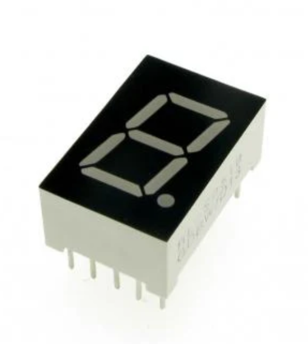
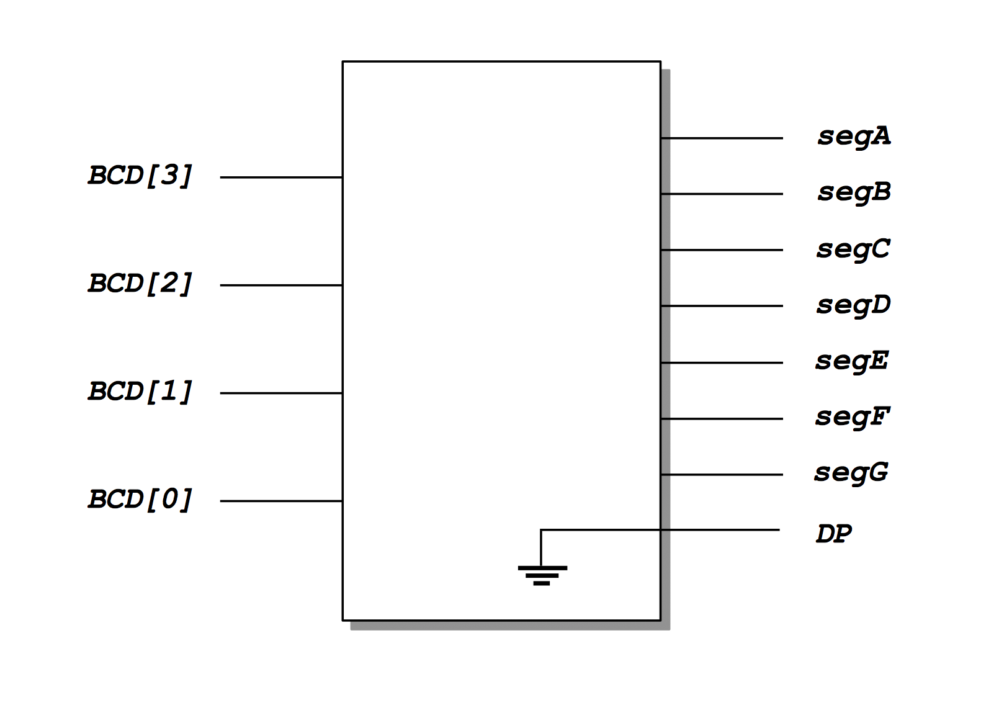
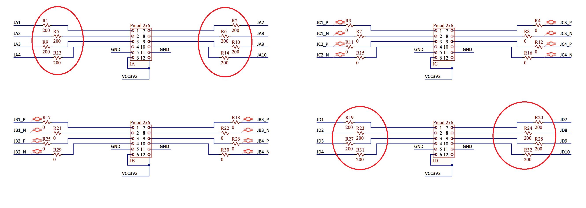

<div align="justify">

<!-- TODO: add k-Maps solution ... -->

<!-- TODO: make a first 4-bit counter driven by a push-button to increment BCD !!! -->

# Practicum 3
[[**Home**](https://github.com/lpacher/lae)] [[**Back**](https://github.com/lpacher/lae/tree/master/fpga/practicum)]

## Contents

* [**Introduction**](#introduction)
* [**Practicum aims**](#practicum-aims)
* [**Navigate to the practicum directory**](#navigate-to-the-practicum-directory)
* [**Seven-segment- display**](#seven-segment-display)
* [**Explore datasheets**](#explore-datasheets)
* [**RTL coding**](#rtl-coding)
* [**Design constraints**](#design-constraints)
* [**Run the Vivado implementation flow targeting the Arty board**](#run-the-vivado-implementation-flow-targeting-the-arty-board)
* [**Implement the circuit on breadboard**](#implement-the-circuit-on-breadboard)
* [**Debug your firmware on real hardware**](#debug-your-firmware-on-real-hardware)
* [**Further readings**](#further-readings)

<br />
<!--------------------------------------------------------------------->


## Introduction
[**[Contents]**](#contents)

In this practicum you will learn how to drive a simple **one-digit 7-segment display** in order to display
a **4-bit Binary-Coded Decimal (BCD) word** as a human-readable **base-10 decimal number**.



<br />

For this purpose a **binary to 7-segment display decoder** is required. Despite very popular dedicated integrated circuits
exist for this task (such as the **CMOS 4511** or **TTL 7447**) you will implement the decoder in FPGA using the Verilog HDL.

<br />
<!--------------------------------------------------------------------->


## Practicum aims
[**[Contents]**](#contents)

This practicum should exercise the following concepts:

* review the Binary Coded Decimal (BCD) code
* introduce the 7-segment display electronic component
* learn the difference between common-anode and common-cathode displays
* write a suitable combinational block in Verilog to drive a 7-segment display
* implement the circuit on breadboard
* debug the firmware on real hardware
* avoid to infer unwanted latches when writing combinational code
* re-spin a design after small Engineering Change Order (ECO) changes

<br />
<!--------------------------------------------------------------------->


## Navigate to the practicum directory
[**[Contents]**](#contents)

As a first step, open a **terminal** window and change to the practicum directory:

```
% cd Desktop/lae/fpga/practicum/3_seven_segment_display
```

<br />

List the content of the directory:

```
% ls -l
% ls -la
```


<br />
<!--------------------------------------------------------------------->


## Seven-segment display
[**[Contents]**](#contents)

The seven-segment display represents one of the simplest "human-readable" interface with the digital world.
This electronic component in fact allows to visually display **base-10 (decimal) digits** `0`, `1`, `2` ... `9`
using a **set of seven LEDs** arranged into seven "segments". Therefore each "segment" of the display is just a LED.
Optionally one more LED can be used to turn on a "dot" to indicate the **decimal point (DP)**
in case you need to work with more complex **floating-point numbers**.

If you need more information please ref. to this article:

_<http://www.electronics-tutorials.ws/blog/7-segment-display-tutorial.html>_

<br />
<!--------------------------------------------------------------------->


## Explore datasheets
[**[Contents]**](#contents)

Datasheets for the 7-segment display available in the lab have been placed in the `doc/datasheets/` directory:

```
% ls -l doc/datasheets
```

<br />

Open the required PDF according to the 7-segment display module you are working with. Understand the working principle
of the 7-segment display module.

<br />

>
> **QUESTION**
>
> The 7-segment display you are working with is a **common-anode (CA)** or a **common-cathode (CC)** module ?
>
>   \___________________________________________________________________________________
>

<br />
<!--------------------------------------------------------------------->


## RTL coding
[**[Contents]**](#contents)

Create with your **text-editor** application a new **Verilog file** named `SevenSegmentDecoder.v` as follows:

```
% gedit SevenSegmentDecoder.v &   (for Linux users)

% n++ SevenSegmentDecoder.v       (for Windows users)
``` 

<br />

The `SevenSegmentDecoder` Verilog module that you are going to implement has **4-inputs** corresponding to a 4-bit binary code interpreted as BCD, e.g. `BCD[3:0]`
or `Bin[3:0]` and **8-outputs** to drive the LEDs of the 7-segment display. e.g. `seg[7:0]` or `segA`, `segB` etc.
If you want you can also decide to simply tie-down the decimal point (DP) LED of the display.

<br />



<br />

As an example, the main `module` declaration could be the following: 

```verilog
module SevenSegmentDecoder (

   // BCD input code
   input wire [3:0] BCD,

   // **DEBUG: display the BCD binary value on general-purpose standard LEDs
   output wire [3:0] LED,

   // 7-segment display control pins
   output wire DP,
   output ... segA,
   output ... segB,
   output ... segC,
   output ... segD,
   output ... segE,
   output ... segF,
   output ... segG ) ;

   ...

endmodule
```

<br />

The **digital functionality** that we want to implement is to **map** a 4-bit Binary-Coded Decimal (BCD) word `0000`, `0001`, ... , `1001`
into another 8-bit binary code (or 7-bit if you decide to tie-down the decimal point) corresponding to the on/off status of the 7-segment
display LEDs. Therefore the block is a **decoder**.

For **easier debug** you should also display the BCD input code to general-purpose **standard LEDs** available on the _Arty_ board:

```
assign LED = BCD ;
```

<br />

Try to **write yourself** synthesizable Verilog code that implements this functionality. Remind that you can **check for syntax errors**
at any time by **compiling the code** with `xvlog` at the command line:

```
% xvlog SevenSegmentDecoder.v
```

<br />

>
> **HINT**
>
> The block is a pure **combinational circuit**, therefore you can use a **truth-table** implemented using a Verilog `case` statement.
> Alternatively, from the truth-table you can also write a **Karnaugh map** for each decoder output and derive **logic equations**
> to drive the LEDs of the 7-segment display.
>
> Ref. also to:
>
> _<https://www.electricaltechnology.org/2018/05/bcd-to-7-segment-display-decoder.html>_
>

<br />
<!--------------------------------------------------------------------->


## Design constraints
[**[Contents]**](#contents)

In order to map the Verilog code on real FPGA hardware you also need to write a **constraints file** using a
**Xilinx Design Constraints (XDC) script**.

Create with your **text-editor** application a second source file named `SevenSegmentDecoder.xdc` as follows:

```
% gedit SevenSegmentDecoder.xdc &   (for Linux users)

% n++ SevenSegmentDecoder.xdc       (for Windows users)
```

<br />

Copy from the `.solutions/` directory the reference XDC file for the _Arty_ board:

```
% cp .solutions/arty_all.xdc .
```

<br />

Try to **write yourself** design constraints required to implement the design on real hardware.
Use the main `arty_all.xdc` file as a reference starting point for the syntax.
In the following you can find additional information to help you in writing the code.

<br />

**PHYSICAL CONSTRAINTS (PORT MAPPING)**

Map decoder **inputs** to **slide-switches** **SW0**, **SW1**, **SW2** and **SW3** available on the board:

```
set_property -dict { PACKAGE_PIN A8   IOSTANDARD LVCMOS33 } [get_ports {BCD[0]} ] ;  ## SW0
set_property -dict { PACKAGE_PIN C11  IOSTANDARD LVCMOS33 } [get_ports {BCD[1]} ] ;  ## SW1
set_property -dict { PACKAGE_PIN C10  IOSTANDARD LVCMOS33 } [get_ports {BCD[2]} ] ;  ## SW2
set_property -dict { PACKAGE_PIN A10  IOSTANDARD LVCMOS33 } [get_ports {BCD[3]} ] ;  ## SW3
```

<br />

>
> **REMINDER**
>
> Since everything in Tcl at the end is considered a string you need a way to **evaluate** Tcl commands.
> Square brackets `[ ]` are used for this purpose to indicate "command evaluation".
> As you might expect this introduces issues when working with **signal buses** in Verilog
> that also use `[ ]` to access bus items. This happens also if you use `std_logic_vector`
> ports in VHDL, because square brackets are used in XDC to access bus items despite the chosen HDL language used
> for the top-level module.
>
> Usually in the XDC file we use `get_ports` to map top-level RTL ports into physical FPGA pins,
> however in case of HDL signals declared as buses we have to prevent `[ ]` to be used for command
> evaluation. This is done by **adding curly brackets** `{ }` around the signal name.
>
> As an example,
>
> ```
> get_ports BCD[0]
> ```
>
> would rise an error, because `[0]` for Tcl means "evaluate" what is between `[`
> and `]` (nothing in this case).
> The following command works fine instead, because curly brackets `{ }` means "this is just a string":
>
> ```
> get_ports {BCD[0]}
> ```
>

<br />

For decoder **outputs** you can use for instance a **Peripheral MODule (PMOD) pin header**, but feel free
to choose **chipKit pins** instead. Please, remind that both **JA** and **JD** pin headers already have
a **200 ohm resistor** placed in series, while **JB** and **JC** doesn't.

<br />



<br />

>
> **IMPORTANT !**
>
> Remind that at the end you are driving LED devices! Be sure that a **current-limiting series resistor** is always placed on the
> current path of a LED! If you don't use PMODs that already have resistors in series it's **UP TO YOU** to place
> approx. 100-200 ohm resistors on 7-segment display input pins!
>
> **WITHOUT LIMITING RESISTORS YOU WILL DESTROY THE 7-SEGMENT DISPLAY MODULE !**

<br />

Finally use general-purpose **standard LEDs** (labeled as **LD4**, **LD5**, **LD6** and **LD7**)
to display the BCD code on the board for easier debug:

```
set_property -dict { PACKAGE_PIN H5  IOSTANDARD LVCMOS33 } [get_ports { LED[0] }]   ; ## LD4
set_property -dict { PACKAGE_PIN J5  IOSTANDARD LVCMOS33 } [get_ports { LED[1] }]   ; ## LD5
set_property -dict { PACKAGE_PIN T9  IOSTANDARD LVCMOS33 } [get_ports { LED[2] }]   ; ## LD6
set_property -dict { PACKAGE_PIN T10 IOSTANDARD LVCMOS33 } [get_ports { LED[3] }]   ; ## LD7
```

<br />

**TIMING CONSTRAINTS**

Our decoder is a pure combinational block, therefore **timing constraints** are relaxed.
We can assume that after a certain amount of propagation time all outputs settle to **static logic values**
by changing the inputs.

Nevertheless for pure combinational timing paths you can define a **maximum delay constraint** between an input
and an output using the `set_max_delay` constraint.

As an example, define a max. 10 ns delay between all decoder inputs and all decoder outputs:

```
set_max_delay 10 -from [all_inputs] -to [all_outputs]
```

<br />

You can also play with the delay value and verify the effect in Vivado **timing reports**.

Alternatively you can also **disable all timing checks** with `set_false_path` as follows:

```
set_false_path -from [all_inputs] -to [all_outputs]
```

<br />

**ELECTRICAL CONSTRAINTS**

You can re-use same electrical constraints as already discussed in the previous practicum:

```
set_property CFGBVS VCCO        [current_design]
set_property CONFIG_VOLTAGE 3.3 [current_design]
```

<br />

Ref. also to:

* _<https://www.xilinx.com/support/answers/55660.html>_
* _<https://forums.xilinx.com/t5/Other-FPGA-Architecture/set-property-CFGBVS-set-property-CONFIG-VOLTAGE/td-p/782750>_

<br />

Optionally you can include the following additional XDC statements to **optimize the memory configuration file (.bin)**
to program the external **128 Mb (16 MB) Quad Serial Peripheral Interface (SPI) Flash memory** in order to automatically
load the FPGA configuration at power-up:

```
set_property BITSTREAM.CONFIG.SPI_BUSWIDTH 4  [current_design]
set_property CONFIG_MODE SPIx4                [current_design]
```

<br />
<!--------------------------------------------------------------------->


## Run the Vivado implementation flow targeting the Arty board
[**[Contents]**](#contents)

Once ready try to run the FPGA implementation flow in _Project Mode_ up to bitstream generation.

From now on the **recommended approach** will be to always run all FPGA implementation and programming
flows in **batch-mode** from the command-line using the `make` utility and later opening the Vivado graphical
user interface (GUI) only for debug purposes whenever required.

Copy from the `.solutions/` directory all Tcl scripts and the `Makefile` already prepared for you as follows:

```
% cp .solutions/Makefile    .
% cp .solutions/setup.tcl   .
% cp .solutions/build.tcl   .
% cp .solutions/install.tcl .
```

<br />

Double-check the contents of the main project-setup script:

```
% cat setup.tcl
```

<br />

Once all scripts are in place try to map your RTL code to real FPGA hardware:

```
% make clean
% make build
```

<br />

Review and fix all syntax errors.

At the end of the implementation flow review in the console the content of the **post-synthesis utilization report**:

```
% less SevenSegmentDecoder.runs/synth_1/SevenSegmentDecoder_utilization_synth.rpt
```

<br />

>
> **QUESTION**
>
> Which FPGA device primitives have been used to map the design on real hardware ?
>

<br />

For easier debug inspect also the **post-synthesis gate-level schematic** in the Vivado graphical user interface.
Since you executed everything in batch mode you have to **restore** the **post-synthesis design checkpoint (DCP)**
automatically generated by the `make build` flow. To do this start a new Vivado session in GUI mode with the `make gui` target:

```
% make gui
```

<br />

Then go through **File > Checkpoint > Open...** and restore the `SevenSegmentDecoder.dcp` database placed in the
`SevenSegmentDecoder.runs/synth_1/` directory. Observe the equivalent command in the Tcl console:

```
open_checkpoint ./SevenSegmentDecoder.runs/synth_1/SevenSegmentDecoder.dcp
```

<br />

>
> **QUESTION**
>
> Is your circuit a pure combinational block as expected ? What is the output of the `all_latches` command ?
> In case **latches** have been inferred for you in the design where is the source of the mistake ?
>
>   \___________________________________________________________________________________
>

<br />
<!--------------------------------------------------------------------->


## Implement the circuit on breadboard
[**[Contents]**](#contents)

Plug the 7-segment display module on your breadboard and use **jumper wires** to make all necessary connections between the
breadboard and the FPGA according to output pins that you use in XDCs. Use the datasheet to understand the pinout of the module.

<br />

>
> **IMPORTANT**
>
> You can always use a Digital Multi-Meter (DMM) to perform a "continuity test" to identify which pins of the 7-segment display
> are shorted together and a "diode test" to verify the mapping found into the datasheet !
>
> Moreover you can easily check the mapping of the pins by placing a limiting resistor to the common catode (anode)
> of the module and then connecting each pin to the **VCC** power (ground) of the board.
>

<br />


<br />
<!--------------------------------------------------------------------->


## Debug your firmware on real hardware
[**[Contents]**](#contents)

Program the FPGA using the Vivado _Hardware Manager_. You can do this either from the graphical user interface
of from the command line with:

```
% make install
```

<br />

Debug the functionality of the firmware on real hardware.

<br />

>
> **QUESTION**
>
> In case your design contains **unwanted latches**, which is the effect on real hardware ?
>
>   \___________________________________________________________________________________
>

<br />

Fix the RTL code to solve the problem. Once done, re-run the flows in batch mode:

```
% make clean build
```

<br />

Re-program the FPGA and debug the new firmware:

```
% make install
```

<br />
<!--------------------------------------------------------------------->


## Further readings
[**[Contents]**](#contents)


* _<https://www.electricaltechnology.org/2018/05/bcd-to-7-segment-display-decoder.html>_
* _<https://www.electronics-tutorials.ws/blog/7-segment-display-tutorial.html>_
* _<https://www.electronics-tutorials.ws/counter/7-segment-display.html>_
* _<https://www.geeksforgeeks.org/seven-segment-displays>_
* _<https://www.electronicshub.org/seven-segment-displays>_
* _<https://www.electronicshub.org/bcd-7-segment-led-display-decoder-circuit>_

<br />
<!--------------------------------------------------------------------->

</div>
