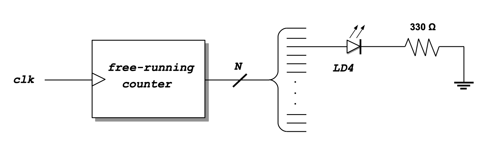

<div align="justify">

# Practicum 4
[[**Home**](https://github.com/lpacher/lae)] [[**Back**](https://github.com/lpacher/lae/tree/master/fpga/practicum)]


## Contents

* [**Introduction**](#introduction)
* [**Practicum aims**](#practicum-aims)
* [**Navigate to the practicum directory**](#navigate-to-the-practicum-directory)
* [**Setting up the work area**](#setting-up-the-work-area)
* [**RTL coding**](#rtl-coding)
* [**Simulate the design (optional)**](#simulate-the-design-optional)
* [**Design constraints**](#design-constraints)
* [**Implement the design on target FPGA**](#implement-the-design-on-target-fpga)
* [**Install and debug the firmware**](#install-and-debug-the-firmware)
* [**Exercises**](#exercises)

<br />
<!--------------------------------------------------------------------->


## Introduction
[**[Contents]**](#contents)

In this practicum you are requested to **implement yourself** on FPGA a simple **free-running counter** driven by the external
100 MHz clock available on the _Digilent Arty_  board. The counter is then used as a **clock-divider** in order to automatically
**turn on/off** and "blink" one of the **general-purpose LEDs** available on the board with a certain toggle period.

After this you are requested to extend your initial design and **drive a 7-segment display** module with a suitable
**4-bit count-slice** extracted from the free-running counter itself. For this purpose you will simply
**re-use** the same HDL code for the **BCD/7-segment decoder** already developed and tested in the previous practicum.

You will also start using a **better working area organization** as the one already adopted for RTL simulations during lectures
and a new set of _**Non Project Mode**_ Tcl scripts to run Vivado flows in batch-mode from the command line.

<br />
<!--------------------------------------------------------------------->


## Practicum aims
[**[Contents]**](#contents)

This practicum should exercise the following concepts:

* introduce a better working area organization
* review how to implement a free-running counter in Verilog HDL
* run the FPGA implementation flow in _Non Project Mode_ from the command line
* automate the FPGA firmware installation in batch mode from the command line
* automate the Quad SPI Flash programming in batch mode from the command line 
* understand the role of the Global Set/Reset (GSR)

<br />
<!--------------------------------------------------------------------->


## Navigate to the practicum directory
[**[Contents]**](#contents)

As a first step, open a **terminal** window and change to the practicum directory:

```
% cd Desktop/lae/fpga/practicum/4_LED_blink
```

<br />

List the content of the directory:

```
% ls -l
% ls -la
```

<br />
<!--------------------------------------------------------------------->


## Setting up the work area
[**[Contents]**](#contents)

As already discussed during lectures it is always recommended to keep design sources (RTL and simulation
code, design constraints, Tcl scripts etc.) away from the "scratch" **working directory** actually used
to run the flows.

For this reason from this practicum on we will start to adopt a better working-area organization as already
introduced into `lab3`. The proposed directory-tree is summarized below.

<br />

|       Folder       |                           Description                                |
|--------------------|----------------------------------------------------------------------|
| `rtl/`             | RTL sources (synthesizable code that can be mapped on a target FPGA) |
| `bench/`           | simulation sources (non-synthesizable code) |
| `scripts/common/`  | Tcl scripts common to all flows|
| `scripts/sim/`     | Tcl scripts for compilation/elaboration/simulation |
| `scripts/build/`   | Tcl scripts for physical implementation to target FPGA |
| `scripts/install/` | Tcl scripts for firmware installation |
| `work/sim/`        | scratch simulation working area where `xvlog/xvhdl/xelab/xsim` executables are invoked |
| `work/build/`      | scratch implementation working area where the `vivado` executable is invoked |
| `bin/`             | additional directory for non-Tcl scripts and programs (e.g. Bash/Batch, Python) |
| `log/`             | all log files |
| `cores/`           | IP sources (compiled from the IP Catalog within Vivado) |
| `xdc/`             | implementation design constraints |
| `test/`            | directory for additional user tests |
| `tmp/`             | temporary directory |
| `doc/`             | specifications, design documentation, PDF etc. |

<br/>

Copy from the `.solutions/` directory the main `Makefile` already prepared for you:

```
% cp .solutions/Makefile .
```

<br />

Create a new fresh working area:

```
% make area
```

<br />

Additionally, recursively copy from the `.solutions/` directory the following design sources and scripts already prepared for you:

```
% cp -r .solutions/bench/    .
% cp -r .solutions/scripts/  .
% cp -r .solutions/xdc/      .
```
<br />

>
> **REMINDER**
>
> In this case we want to perform a **recursive copy**, do not forget to add the `-r` option.
> The above `cp` command works fine under Windows also if you use back-slashes in the path.
>

<br />
<!--------------------------------------------------------------------->


## RTL coding
[**[Contents]**](#contents)

The first circuit that you are requested to implement and test is depicted in figure.

<br />



<br />


Create with your **text-editor** application a new Verilog file named `rtl/LED_blink.v` as follows:

```
% gedit rtl/LED_blink.v &   (for Linux users)

% n++ rtl\LED_blink.v       (for Windows users)
```

<br />

The module that we want to implement is a simple **free-running counter** driven by the external on-board 100 MHz clock.
We then use the counter as a **clock-divider**, driving a general purpose LED available on the board with a suitable
count-slice.

Try to **complete yourself** the following **code skeleton** already prepared for you:

```verilog

`timescale 1ns / 100ps

module (

   input  wire clk,   // assume 100 MHz input clock from on-board oscillator

   output wire LED,
   output wire LED_probe  // optionally, probe at the oscilloscope the LED control signal

   ) ;


   //////////////////////////////
   //   free running counter   //
   //////////////////////////////

   reg [...] count = ... ;   // choose yourself the size of the counter

   always @(posedge clk) begin

      ...                    // increment the counter

   end


   //////////////////////////////
   //   drive the LED output   //
   //////////////////////////////

   // simply turn on/off the LED with a proper count-slice in order to blink the LED with a period approx. 1s
   assign LED = ... ;

   // **DEBUG: probe at the oscilloscope the LED control signal on some general-purpose I/O
   assign LED_probe = ... ;

endmodule
```

<br />

In particular, choose yourself the **size (number of bits) of the counter** in order to turn on/off the
LED with a **toggle period** of about **one second or more**.

Save the source code once done and compile the file to check for syntax errors:

```
% make compile hdl=rtl/LED_blink.v
```

<br />

>
> **QUESTION**
>
> Which is the expected blink frequency of the LED ?  
>
>   \___________________________________________________________________________________
>

<br />
<!--------------------------------------------------------------------->


## Simulate the design (optional)
[**[Contents]**](#contents)

Before mapping the RTL code into real FPGA hardware verify the expected functionality of your block with a behavioral simulation:

```
% make sim mode=gui
```

<br />

>
> **IMPORTANT !**
>
> The default value for the `mode` variable in the `Makefile` has been changed from `gui` to `batch`.
> If you need to run a flow with the graphical interface use `mode=gui`, otherwise for the remaining of the
> course the `batch` mode is assumed as default.
>

<br />
<!--------------------------------------------------------------------->


## Design constraints
[**[Contents]**](#contents)

Inspect the content of the **Xilinx Design Constraints (XDC)** file already prepared for you:

```
% cat xdc/LED_blink.xdc
```

<br />

>
> **QUESTION**
>
> On which general-purpose LED available on the board is mapped the `LED` module output ? 
>
>   \___________________________________________________________________________________
>

<br />

Pay attention to the following **timing constraints** used for the Static Timing Analysis (STA):

```
## create a 100 MHz clock signal with 50% duty cycle for reg2reg Static Timing Analysis (STA)
create_clock -period 10.000 -name clk100 -waveform {0.000 5.000} -add [get_ports clk]

## constrain reg2out timing paths (assume approx. 1/2 clock period)
set_output_delay -clock clk100 5.000 [all_outputs]
```
<br />
<!--------------------------------------------------------------------->


## Implement the design on target FPGA
[**[Contents]**](#contents)

In this practicum and for the remaining of the course you will use _**Non Project Mode**_ scripts from the command-line.

Verify that all required scripts are in place:

```
% ls -l scripts/build/
```

<br />

Map your RTL code on real FPGA hardware running the Xilinx FPGA implementation with:

```
% make build
```

<br />

Once done, verify that the **bitstream file** has been properly generated:

```
% ls -l work/build/outputs/  | grep .bit
``` 

<br />


Review in the console the content of the **post-synthesis utilization report**:

```
% less SevenSegmentDecoder.runs/synth_1/SevenSegmentDecoder_utilization_synth.rpt
```

<br />

>
> **QUESTION**
>
> How many **FlipFlops** have been inferred after synthesis from your RTL code ?
>
>   \___________________________________________________________________________________
>

<br />

Review in the console also the content of the final **timing report** summary:

```
% less SevenSegmentDecoder.runs/synth_1/SevenSegmentDecoder_utilization_synth.rpt
```

<br />
<!--------------------------------------------------------------------->


## Install and debug the firmware
[**[Contents]**](#contents)

Connect the board to the USB port of your personal computer using a **USB A to micro USB cable**.
Verify that the **POWER** status LED turns on. To save time, all **FPGA programming flows** using
the Vivado _**Hardware Manager**_ have been automated using Tcl scripts.

Verify that all required scripts are in place:

```
% ls -l scripts/install/
```

<br />

Assuming that a board is connected to the host computer, **install the firmware** from the command line using:

```
% make install 
```

<br />

Verify that the LED blinks as expected. Display the `LED_probe` at the **oscilloscope** and verify that
the **frequency** of the resulting clock waveform is the expected one as implemented in your RTL code.

<br />
<!--------------------------------------------------------------------->


## Program the external Quad SPI Flash memory
[**[Contents]**](#contents)

As already discussed the firmware loaded into the FPGA is stored into a volatile RAM inside the chip.
By default the FPGA configuration is therefore **non-persistent** across power cycles and you have
to **re-program the FPGA** whenever you **disconnect the power** from the board.

In order to get the FPGA automatically programmed at power up you have to write the FPGA configuration into a dedicated
**external flash memory**. Also this flow has been automated using a Tcl script.

Before running the flow, verify that the **raw binary memory configuration file** has been properly generated:

```
% ls -l work/build/outputs/  | grep .bin
``` 

<br />

Students working with the legacy **Arty** board can program the external **128 MB Quad SPI Flash memory** as follows:

```
% make install/flash board=Arty
```

<br />

For students working with the new **Arty A7** board revision instead:

```
% make install/flash board=ArtyA7
```

<br />

Disconnect and reconnect the USB cable from your computer and verify that the firmware is properly loaded from
the external Quad SPI Flash memory at FPGA startup.

<br />
<!--------------------------------------------------------------------->

 
## Exercises
[**[Contents]**](#contents)

**EXERCISE 1**

Modify the **constraints file** `xdc/LED_blink.xdc` in order to map the `LED` output on the **PMOD header JA1 pin** as follows:

```
#set_property -dict {PACKAGE_PIN T10 IOSTANDARD LVCMOS33} [get_ports LED]
`##``

<br />

Save the file once done and re-run the flows from scratch up to FPGA programming with:

```
% make clean
% make build install
```

<br />

<br />
<!--------------------------------------------------------------------->


**EXERCISE 1**

Modify your project in order to add an external **count-enable** control for your free-running counter:


```verilog
if ( enable ) begin
   ...
   ...
end
```

<br />

Assign the new input port to a slide-switch on the board, Re-run all flows from scratch from the command line.
Install and debug the new firmware.


<br />
<!--------------------------------------------------------------------->

</div>
