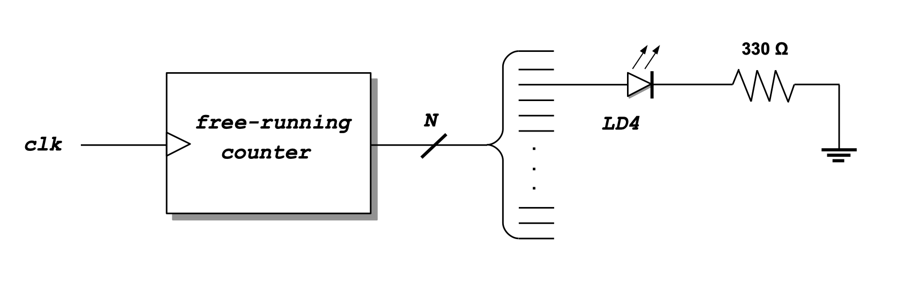
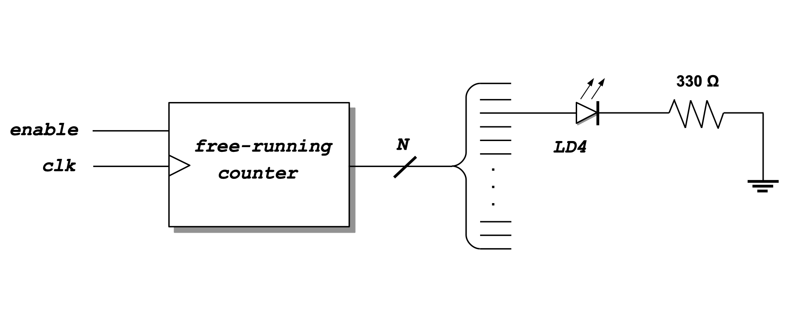
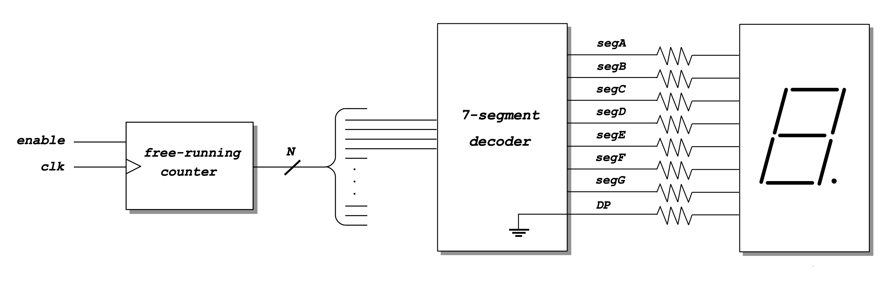

<div align="justify">

# Practicum 5
[[**Home**](https://github.com/lpacher/lae)] [[**Back**](https://github.com/lpacher/lae/tree/master/fpga/practicum)]


## Contents

* [**Introduction**](#introduction)
* [**Practicum aims**](#practicum-aims)
* [**Navigate to the practicum directory**](#navigate-to-the-practicum-directory)
* [**Setting up the work area**](#setting-up-the-work-area)
* [**RTL coding**](#rtl-coding)
* [**Simulate the design (optional)**](#simulate-the-design-optional)
* [**Design constraints**](#design-constraints)
* [**Implement the design on target FPGA**](#implement-the-design-on-target-fpga)
* [**Install and debug the firmware**](#install-and-debug-the-firmware)
* [**Exercises**](#exercises)

<br />
<!--------------------------------------------------------------------->


## Introduction
[**[Contents]**](#contents)

In this practicum you are requested to **implement yourself** on FPGA a simple **free-running counter** driven by the external
100 MHz clock available on the _Digilent Arty_  board. The counter is then used as a **clock-divider** in order to automatically
**turn on/off** and "blink" one of the **general-purpose LEDs** available on the board with a certain toggle period.

After this you are requested to extend your initial design and **drive a 7-segment display** module with a suitable
**4-bit count-slice** extracted from the free-running counter itself. For this purpose you will simply
**re-use** the same HDL code for the **BCD/7-segment decoder** already developed and tested in the previous practicum.

You will also start using a **better working area organization** as the one already adopted for RTL simulations during lectures
and a new set of _**Non-Project Mode**_ Tcl scripts to run Vivado flows from the command line.

<br />
<!--------------------------------------------------------------------->


## Practicum aims
[**[Contents]**](#contents)

This practicum should exercise the following concepts:

* introduce a better working area organization
* review how to implement a free-running counter in Verilog HDL
* run the FPGA implementation flow in _Non-Project Mode_ from the command line
* inspect and understand post-synthesis timing and utilization reports
* display at the oscilloscope low-frequency (< 1Hz) signals
* understand the role of the Global Set/Reset (GSR)
* automate the Quad SPI Flash programming in batch mode from the command line 

<br />
<!--------------------------------------------------------------------->


## Navigate to the practicum directory
[**[Contents]**](#contents)

As a first step, open a **terminal** window and change to the practicum directory:

```
% cd Desktop/lae/fpga/practicum/4_LED_blink
```

<br />

List the content of the directory:

```
% ls -l
% ls -l .solutions/
```

<br />
<!--------------------------------------------------------------------->


## Setting up the work area
[**[Contents]**](#contents)

As already discussed during lectures it is always recommended to keep design sources (RTL and simulation
code, design constraints, Tcl scripts etc.) away from the "scratch" **working directory** actually used
to run the flows.

For this reason from this practicum on we will start to adopt a better working-area organization as already
introduced into `lab3`. The proposed directory-tree is summarized below.

<br />

|       Folder       |                           Description                                |
|--------------------|----------------------------------------------------------------------|
| `rtl/`             | RTL sources (synthesizable code that can be mapped on a target FPGA) |
| `bench/`           | simulation sources (non-synthesizable code) |
| `scripts/common/`  | Tcl scripts common to all flows|
| `scripts/sim/`     | Tcl scripts for compilation/elaboration/simulation |
| `scripts/build/`   | Tcl scripts for physical implementation to target FPGA |
| `scripts/install/` | Tcl scripts for firmware installation |
| `work/sim/`        | scratch simulation working area where `xvlog/xvhdl/xelab/xsim` executables are invoked |
| `work/build/`      | scratch implementation working area where the `vivado` executable is invoked |
| `bin/`             | additional directory for non-Tcl scripts and programs (e.g. Bash/Batch, Python) |
| `cores/`           | IP sources (compiled from the IP Catalog within Vivado) |
| `xdc/`             | implementation design constraints |
| `test/`            | directory for additional user tests |
| `tmp/`             | temporary directory |
| `doc/`             | specifications, design documentation, PDF etc. |

<br/>

Copy from the `.solutions/` directory the main `Makefile` already prepared for you:

```
% cp .solutions/Makefile .
```

<br />

List all available `Makefile` targets:

```
% make help
```

<br />

Create a new fresh working area:

```
% make area
```

<br />

Additionally, recursively copy from the `.solutions/` directory the following design sources and scripts already prepared for you:

```
% cp -r .solutions/bench/    .
% cp -r .solutions/scripts/  .
% cp -r .solutions/xdc/      .
```
<br />

>
> **REMINDER**
>
> In this case we want to perform a **recursive copy**, do not forget to add the `-r` option.
> The above `cp` command works fine under Windows also if you use back-slashes in the path.
>

<br />
<!--------------------------------------------------------------------->


## RTL coding
[**[Contents]**](#contents)

The first circuit that you are requested to implement and test is depicted in figure.

<br />



<br />


Create with your **text-editor** application a new Verilog file named `rtl/LED_blink.v` as follows:

```
% gedit rtl/LED_blink.v &   (for Linux users)

% n++ rtl\LED_blink.v       (for Windows users)
```

<br />

The module that we want to implement is a simple **free-running counter** driven by the external on-board 100 MHz clock.
We then use the counter as a **clock-divider**, driving a general purpose LED available on the board with a suitable
count-slice. For debug purposes we want to also include the possibility to probe at the oscilloscope the signal driving this LED.

Try to **complete yourself** the following **code skeleton** already prepared for you:

```verilog

`timescale 1ns / 100ps

module LED_blink (

   input  wire clk,        // assume 100 MHz external clock from on-board oscillator
   output wire LED,
   output wire LED_probe   // probe at the oscilloscope the LED control signal

   ) ;


   //////////////////////////////
   //   free running counter   //
   //////////////////////////////

   reg [...] count ;   // choose yourself an appropriate size for the counter

   initial
      count = ... ;    // initialize the counter to the desired value


   always @(posedge clk) begin

      ...              // increment the counter

   end


   //////////////////////////////
   //   drive the LED output   //
   //////////////////////////////

   // simply turn on/off the LED with a proper count-slice in order to blink the LED with a period approx. 1s
   assign LED = ... ;

   // **DEBUG: probe at the oscilloscope the LED control signal on some general-purpose I/O
   assign LED_probe = LED ;

endmodule
```

<br />

In particular, choose yourself the **size (number of bits) of the counter** in order to turn on/off the
LED with a **toggle period** of about **one second or more**.

Save the source code once done and compile the file to check for syntax errors:

```
% make compile hdl=rtl/LED_blink.v
```

<br />

>
> **QUESTION**
>
> Which is the expected blink frequency of the LED ?  
>
>   \___________________________________________________________________________________
>

<br />
<!--------------------------------------------------------------------->


## Simulate the design (optional)
[**[Contents]**](#contents)

Before mapping the RTL code into real FPGA hardware verify the expected functionality of your block with a behavioral simulation:

```
% make sim mode=gui
```

<br />

>
> **IMPORTANT**
>
> The default value for the `mode` variable in the `Makefile` has been changed from `gui` to `batch`.
> If you need to run a flow with the graphical interface use `mode=gui`, otherwise for the remaining of the
> course the `batch` mode is assumed as default.
>

<br />
<!--------------------------------------------------------------------->


## Design constraints
[**[Contents]**](#contents)

Inspect the content of the **Xilinx Design Constraints (XDC)** file already prepared for you:

```
% cat xdc/LED_blink.xdc
```

<br />

>
> **QUESTION**
>
> On which general-purpose I/O available on the board is mapped the `LED_probe` module output ? 
>
>   \___________________________________________________________________________________
>

<br />

Pay attention to the following **timing constraints** used for the Static Timing Analysis (STA):

```
## create a 100 MHz clock signal with 50% duty cycle for reg2reg Static Timing Analysis (STA)
create_clock -period 10.000 -name clk100 -waveform {0.000 5.000} -add [get_ports clk]

## constrain reg2out timing paths (assume approx. 1/2 clock period)
set_output_delay -clock clk100 5.000 [all_outputs]
```

<br />
<!--------------------------------------------------------------------->


## Implement the design on target FPGA
[**[Contents]**](#contents)

In this practicum and for the remaining of the course you will use _**Non-Project Mode**_ scripts from the command-line.

Verify that all required scripts are in place:

```
% ls -l scripts/build/
```

<br />

Map your RTL code on real FPGA hardware running the Xilinx FPGA implementation with:

```
% make build
```

<br />

Once done, verify that the **bitstream file** has been properly generated:

```
% ls -l work/build/outputs/  | grep .bit
``` 

<br />


Review in the console the content of the post-synthesis **utilization report**:

```
% less work/build/reports/post_syn_utilization.rpt
```

<br />

>
> **QUESTION**
>
> How many **FlipFlops** have been inferred after synthesis from your RTL code ? Is this number expected ?
>
>   \___________________________________________________________________________________
>

<br />

Review in the console also the content of the post-synthesis **timing summary report**:

```
% less work/build/reports/post_syn_timing_summary.rpt
```

<br />

>
> **QUESTION**
>
> Is your design affected by timing violations ?
>
>   \___________________________________________________________________________________
>

<br />
<!--------------------------------------------------------------------->


## Install and debug the firmware
[**[Contents]**](#contents)

Connect the board to the USB port of your personal computer using a **USB A to micro USB cable**.
Verify that the **POWER** status LED turns on. To save time, all **FPGA programming flows** using
the Vivado _Hardware Manager_ have been automated using Tcl scripts.

Verify that all required scripts are in place:

```
% ls -l scripts/install/
```

<br />

Assuming that a board is connected to the host computer, **install the firmware** from the command line using:

```
% make install 
```

<br />

Verify that the LED blinks as expected. Display the `LED_probe` at the **oscilloscope** and verify that
the **frequency** of the resulting clock waveform is the expected one as implemented in your RTL code.

<br />

>
> **WARNING**
>
> A typical entry-level **digital-storage oscilloscope (DSO)** samples voltage values with a **sampling rate** of the order of 1&nbsp;GSa/s.
> These sampled "points" (pts) are then stored into an **internal memory** for later display or additional data processing before visualization.
> Standard values for the **memory-depth** range from a few Kpts/channel to 1&nbsp;Mpts/channel. Some oscilloscopes also include the possibility to
> work in "long-storage mode", increasing the memory-depth to hundreds Mpts/channel.
>
> The `LED_probe` waveform that you are going to display at the oscilloscope is a quite **low-frequency** (around 1&nbsp;Hz or below) signal.
> As&nbsp;you might expect the number of sampled values with a time-scale of few seconds is very large.
> As an example, a 1&nbsp;GSa/s oscilloscope samples $2~\times~10^9$ voltage values within a 2&nbsp;s time-scale. Given the limited depth
> the internal memory simply overflows.
>
> As a result you will be not able to properly trigger and "freeze" the `LED_probe` waveform if running in _Auto_ mode, observing
> the trace continuously "moving" and updating in time.
>
> If you want to "freeze" the waveform to measure its frequency you need to use the _Normal_ trigger mode or press the _Run/Stop_ button.
>

<br />
<!--------------------------------------------------------------------->


## Program the external Quad SPI Flash memory
[**[Contents]**](#contents)

As already discussed the firmware loaded into the FPGA is stored into a volatile RAM inside the chip.
By default the FPGA configuration is therefore **non-persistent** across power cycles and you have
to **re-program the FPGA** whenever you **disconnect the power** from the board.

In order to get the FPGA automatically programmed at power up you have to write the FPGA configuration into a dedicated
**external flash memory**. Also this flow has been automated using a Tcl script.

Before running the flow, verify that the **raw binary memory configuration file** has been properly generated:

```
% ls -l work/build/outputs/  | grep .bin
``` 

<br />

Students working with the legacy **Arty** board can program the external **128 MB Quad SPI Flash memory** as follows:

```
% make install/flash board=Arty
```

<br />

For students working with the new **Arty A7** board revision instead:

```
% make install/flash board=ArtyA7
```

<br />

Ensure that the **MODE** programming jumper is properly inserted. Disconnect and reconnect the USB cable from your computer
and verify that the firmware is properly loaded from the external Quad SPI Flash memory at FPGA startup.

<br />
<!--------------------------------------------------------------------->

 
## Exercises
[**[Contents]**](#contents)

**EXERCISE 1**

In the proposed code skeleton an `initial` block has been used to **initialize the free-running counter** to some default value.
As an example, the following code initializes to zero all FlipFlop outputs in the counter:

```verilog
initial
   count = 'b0 ;    // initialize the counter to all-zeroes
```

<br />

As you might expect this kind of initialization is mandatory before running a digital simulation of the `LED_blink` module, otherwise
the simulation engine can only assume an **unknown value** `1'bx` for all FlipFlop outputs at the beginning of the simulation.

Indeed this is not what happens on real FPGA hardware. In fact after the FPGA configuration a special **Global Set/Reset (GSR)** signal
initializes ALL storage elements in the FPGA chip. 

Modify the `LED_blink.v` code and **comment-out** the initialization of the free-running counter:

```verilog
//initial
//   count = 'b0 ;    // initialize the counter to all-zeroes
```

<br />

Save the file once done a re-run all flows from scratch from the command line up to FPGA programming with:

```
% make clean
% make build install
```

<br />

Verify that the new firmware works properly despite the lack of a counter-initialization value and without
a dedicated reset signal.

<br />

>
> **IMPORTANT**
>
> This is a very **FPGA-specific feature** which represents a **major difference** with respect to the **ASIC digital design flow**!
> If you write some HDL code targeting an ASIC it will be always up to you to properly reset all FlipFlops in the design to the desired
> startup value!
>
> A professional synthesis tool (e.g. _Genus_ by Cadence or _Design Compiler_ by Synopsys) used to make real integrated circuits
> would simply ignore the `initial` statement in your code.
>

<br />

<br />
<!--------------------------------------------------------------------->


**EXERCISE 2**

Modify the `LED_blink` module in order to add an `enable` Verilog input port to be used as external
**count-enable** control for your free-running counter:

<br />



<br />

```verilog
if ( enable ) begin
   ...
   ...
end
```

<br />

Update also the XDC file in order to assign the new `enable` input port to the slide-switch **SW0**
on the _Arty_ board. Save all files once done and re-run the flows from scratch from the command line
up to FPGA programming with:

```
% make clean
% make build install
```

<br />

Debug the functionality of the new firmware.

<br />
<!--------------------------------------------------------------------->


**EXERCISE 3**

Extend your initial design and **drive a 7-segment display** module with a suitable
**4-bit count-slice** extracted from the free-running counter itself:

<br />



<br />

For this purpose simply **re-use** the same `SevenSegmentDecoder` module and pin constraints for the **BCD/7-segment decoder**
already developed and tested in the previous practicum:

```
% cp ../3_seven_segment_display/SevenSegmentDecoder.v ./rtl/
```

<br />

Complete yourself the following code skeleton:

```verilog
module LED_blink (

   input  wire clk,         // assume 100 MHz external clock from on-board oscillator
   input  wire enable,      // external count-enable control (e.g. slide-switch)

   // **REMOVE this ports (and update XDC properly...)
   //output wire LED,
   //output wire LED_probe    // probe at the oscilloscope the LED control signal

   // drive a 7-segment display module with a suitable 4-bit slice of the counter
   output wire segA,
   output wire segB,
   output wire segC,
   output wire segD,
   output wire segE,
   output wire segF,
   output wire segG,
   output wire DP

   ) ;


   ...
   ...

   wire [3:0] BCD ;
   assign BCD = { count[...] , count[...] , count[...] , count[...] } ;

   SevenSegmentDecoder  SevenSegmentDecoderInst (

      .BCD  ( BCD[3:0] ),
      .segA ( segA     ),
      .segB ( segB     ),

      ...
      ...

   );

endmodule
```

<br />

Compile the file to check for syntax errors:

```
% make compile hdl=rtl/LED_blink.v
```

<br />

In order to elaborate the design update also the `RTL_VLOG_SOURCES` variable into `Makefile` as follows:

```
#RTL_VLOG_SOURCES := $(RTL_DIR)/LED_blink.v
RTL_VLOG_SOURCES := $(RTL_DIR)/LED_blink.v $(RTL_DIR)/SevenSegmentDecoder.v
```

<br />

Save all files once done and re-run the implementation flow from scratch from the command line:

```
% make clean
% make build
```

<br />

Connect with jumper wires the 7-segment display to the board and install the bitstream file:

```
% make install 
```

<br />

Debug the functionality of the new firmware.

<br />

**EXERCISE 4**

Further extend your design and add a **reset signal** for the free-running counter.

<br />
<!--------------------------------------------------------------------->

</div>
