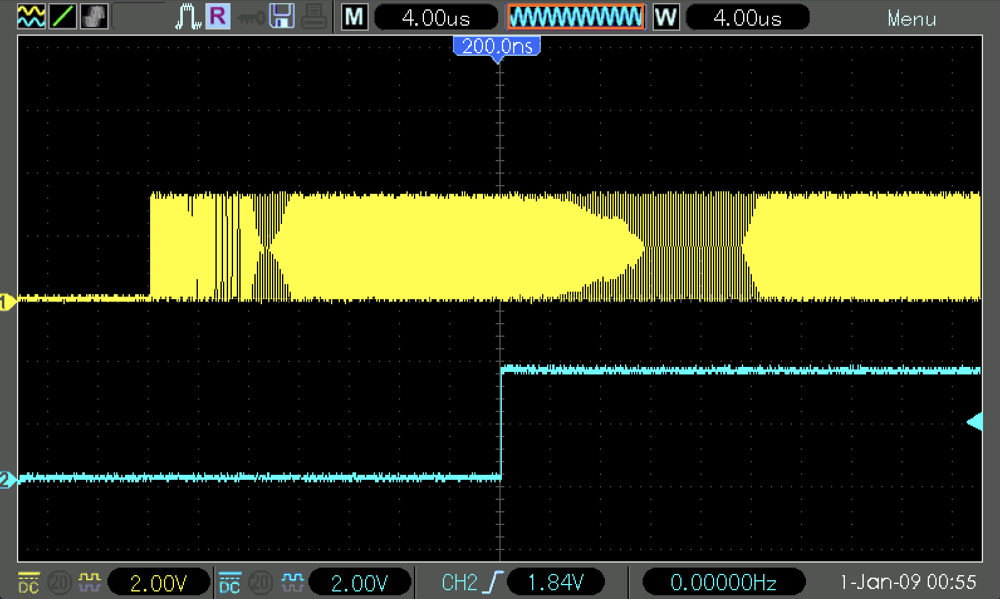
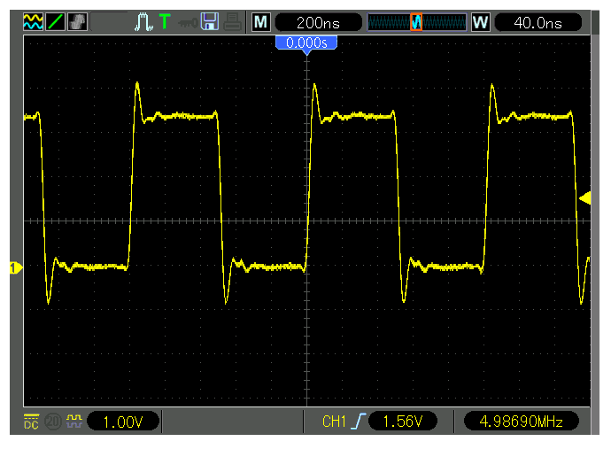

# Practicum 5
[[**Home**](https://github.com/lpacher/lae)] [[**Back**](https://github.com/lpacher/lae/tree/master/fpga/practicum)]


## Contents

* [**Introduction**](#introduction)
* [**Practicum aims**](#practicum-aims)
* [**Navigate to the practicum directory**](#navigate-to-the-practicum-directory)
* [**Setting up the work area**](#setting-up-the-work-area)
* [**Compile the PLL IP core**](#compile-the-pll-ip-core)
* [**Simulate the design (optional)**](#simulate-the-design-optional)
* [**Implement the design on target FPGA**](#implement-the-design-on-target-fpga)
* [**Install and debug the firmware**](#install-and-debug-the-firmware)
* [**Debug termination issues**](#debug-termination-issues)

<br />
<!--------------------------------------------------------------------->


## Introduction
[**[Contents]**](#contents)

In this practicum we are going to test on real FPGA hardware the functionality of a **Phase-Locked Loop (PLL)** compiled as a Xilinx IP core
using the _Clocking Wizard_. The proposed circuit under test is the following:

<br />


<br />

In particular the PLL is customized in order to generate **four different lower-frequency clocks** starting from the default 100 MHz
external clock available on the Arty board. A **special 4:1 multiplexer** driven by two slide-switches is then used to select the clock
waveform to be displayed at the oscilloscope, along with the PLL "locked" status flag.
Additionally you can reset the PLL at any time with a dedicated active-high reset pin.

Since MUX inputs are clock signals in this case the MUX functionality cannot be implemented in a simple way using
behavioral code. Due to FPGA-specific architecture limitations in fact **you cannot buffer and route too many clock signals
inside a single CLB**. The workaround is to use the dedicated Xilinx `BUFGMUX` FPGA primitives to build "by hand" a 4:1 multiplexer
with PLL output clocks as MUX inputs along with additional special design constraints.

<br />
<!--------------------------------------------------------------------->


## Practicum aims
[**[Contents]**](#contents)

This practicum should exercise the following concepts:

* review how to compile a Xilinx IP core from a pre-existing XCI configuration file
* test on real hardware the functionality of a PLL
* debug termination issues

<br />
<!--------------------------------------------------------------------->


## Navigate to the practicum directory
[**[Contents]**](#contents)

As a first step, open a **terminal** window and change to the practicum directory:

```
% cd Desktop/lae/fpga/practicum/5_PLL
```

<br />

List the content of the directory:

```
% ls -l
% ls -la
```

<br />
<!--------------------------------------------------------------------->


## Setting up the work area
[**[Contents]**](#contents)


Copy from the `.solutions/` directory the main `Makefile` already prepared for you:

```
% cp .solutions/Makefile .
```

<br />

Create a new fresh working area:

```
% make area
```

<br />

Additionally, recursively copy from the `.solutions/` directory the following design sources and scripts already prepared for you:

```
% cp -r .solutions/rtl/      .
% cp -r .solutions/bench/    .
% cp -r .solutions/scripts/  .
% cp -r .solutions/xdc/      .
```
<br />

>
> **REMINDER**
>
> In this case we want to perform a **recursive copy**, do not forget to add the `-r` option. <br />
> The above `cp` command works fine under Windows also if you use back-slashes in the path.
>

<br />
<!--------------------------------------------------------------------->


## Compile the PLL IP core
[**[Contents]**](#contents)

The main **Xilinx Core Instance (XCI)** XML file containing the configuration of the IP has been already prepared for you.

Create a new `cores/PLL/` directory to contain IP sources that will be generated by the Vivado IP flow:

```
% mkdir cores/PLL
```

<br />

Copy from the `.solutions/cores/PLL` directory the main XCI configuration file:

```
% cp .solutions/cores/PLL/PLL.xci  cores/PLL/
```

<br />

Finally, **compile the IP in batch mode** using `make` as follows:

```
% make ip mode=batch xci=cores/PLL/PLL.xci
```

<br />

At the end of the flow verify that all IP sources are in place:

```
% ls -l cores/PLL/
```

<br />

Inspect the **Verilog instantiation template** generated for you by Vivado in order to understand the port list
of the IP that we are going to use in the RTL code:

```
% cat cores/PLL/PLL.veo
```

<br />

>
> **QUESTION**
>
> Which are output clock frequencies generated by the PLL IP core ?
>
>   \____________________________________________________________________________________________________
>

<br />
<!--------------------------------------------------------------------->


## Simulate the design (optional)
[**[Contents]**](#contents)

Before mapping the RTL code into real FPGA hardware verify the expected functionality of the PLL with a behavioral simulation:

```
% make sim mode=gui
```

<br />

Additionally open with your text editor application the main RTL module `rtl/PLL_wrapper.v` and the testbench module `bench/tb_PLL_wrapper.v`
and inspect the HDL code.

<br />
<!--------------------------------------------------------------------->


## Implement the design on target FPGA
[**[Contents]**](#contents)

Copy from the `.solutions/` directory the main **Xilinx Design Constraints (XDC)** file used to implement the design on real FPGA hardware:

```
% cp .solutions/xdc/PLL_wrapper.xdc  xdc/
```

<br />

Inspect the content of the file at the command line:

```
% cat xdc/PLL_wrapper.xdc
```

<br />

>
> **QUESTION**
>
> On which board pins have been mapped Verilog ports `rst`, `sel[1:0]`, `pll_clk` and `pll_locked` ?
>
>   \____________________________________________________________________________________________________
>

<br />

Verify that all required scripts are in place:

```
% ls -l scripts/common/
% ls -l scripts/build/
```

<br />

Finally, run the implementation flow in _**Non Project mode**_ from the command line as follows:

```
% make build
```

<br />

Once done, verify that the **bitstream file** has been properly generated:

```
% ls -l work/build/outputs/  | grep .bit
```

<br />
<!--------------------------------------------------------------------->


## Install and debug the firmware
[**[Contents]**](#contents)


Connect the board to the USB port of your personal computer using a **USB A to micro USB cable**. Verify that the **POWER** status LED turns on.
To save time, all **FPGA programming flows** using the Vivado _**Hardware Manager**_ have been automated using Tcl scripts.

Verify that all required scripts are in place:

```
% ls -l scripts/install/
```

<br />

Assuming that a board is connected to the host computer, **upload the firmware** from the command line using:

```
% make install
```

<br />

Connect oscilloscope probes to board pins that have been mapped as `pll_clk` and `pll_locked` and verify the expected
functionality of the PLL. Measure at the oscilloscope the frequency of the MUX output clock for all possible combinations
`2'b00`, `2'b01`, `2'b10` and `2'b11` of MUX selection bits. Compare your results with expected values.

<br />

>
> **HINT**
>
> In order to display the PLL locking process it it recommended to trigger on the `pll_locked` signal and
> set the oscilloscope acquisition mode to **RUN/STOP** with a time scale of a few tens <span>&#181;</span>s.
>
> <br />
>
> 
>

<br />
<!--------------------------------------------------------------------->


# Debug termination issues
[**[Contents]**](#contents)

Modify the **constraints file** `xdc/PLL_wrapper.xdc` in order to map the `pll_clk` output on a PMOD pin **without a 200 ohm series
resistor**.

As an example:

```
set_property -dict { PACKAGE_PIN E15  IOSTANDARD LVCMOS33 } [get_ports pll_clk]
```

<br />

Save the file once done and re-run the flows from scratch up to FPGA programming with:

```
% make clean
% make build install
```

<br />

Probe at the oscilloscope the new pin position and observe the new clock waveform.

<br />




<br />

>
> **QUESTION**
>
> What causes the ringing in the displayed clock waveform ?
>
>   \____________________________________________________________________________________________________
>

<br />

