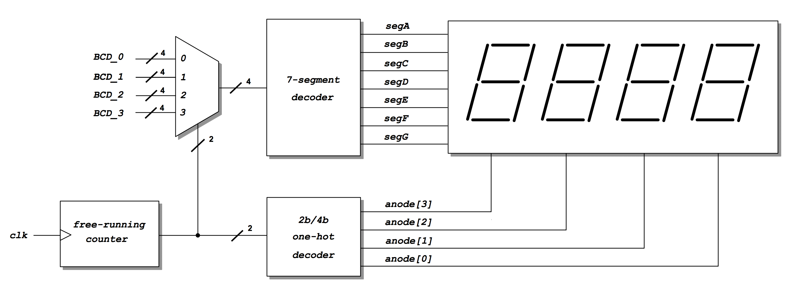

<div align="justify">

# Practicum 6
[[**Home**](https://github.com/lpacher/lae)] [[**Back**](https://github.com/lpacher/lae/tree/master/fpga/practicum)]


## Contents

* [**Introduction**](#introduction)
* [**Practicum aims**](#practicum-aims)
* [**Navigate to the practicum directory**](#navigate-to-the-practicum-directory)
* [**Setting up the work area**](#setting-up-the-work-area)
* [**Inspect RTL sources**](#inspect-rtl-sources)
* [**Simulate the design (optional)**](#simulate-the-design-optional)
* [**Explore the RTL design hierarchy**](#explore-the-rtl-design-hierarchy)
* [**Implement the design on target FPGA**](#implement-the-design-on-target-fpga)
* [**Build the circuit on breadboard**](#build-the-circuit-on-breadboard)
* [**Install and debug the firmware**](#install-and-debug-the-firmware)
* [**Exercises**](#exercises)

<br />
<!--------------------------------------------------------------------->


## Introduction
[**[Contents]**](#contents)

In this practicum we implement and test on real hardware a **BCD counter driving a 4-digit 7-segment display module** <br />
using the **anode (cathode) multiplexing technique**.

<br />
<!--------------------------------------------------------------------->


## Practicum aims
[**[Contents]**](#contents)

This practicum should exercise the following concepts:

* learn how to drive a multiple-digits 7-segment display module with the anode (cathode) multiplexing technique
* test the difference between synchronous and asynchronous reset
* appreciate the need of debouncing push-button inputs

<br />
<!--------------------------------------------------------------------->


## Navigate to the practicum directory
[**[Contents]**](#contents)

As a first step, open a **terminal** window and change to the practicum directory:

```
% cd Desktop/lae/fpga/practicum/6_BCD_counter
```

<br />

List the content of the directory:

```
% ls -l
% ls -la
```

<br />
<!--------------------------------------------------------------------->


## Setting up the work area
[**[Contents]**](#contents)


Copy from the `.solutions/` directory the main `Makefile` already prepared for you:

```
% cp .solutions/Makefile .
```

<br />

Create a new fresh working area:

```
% make area
```

<br />

Additionally, recursively copy from the `.solutions/` directory the following design sources and scripts already prepared for you:

```
% cp -r .solutions/rtl/      .
% cp -r .solutions/bench/    .
% cp -r .solutions/scripts/  .
% cp -r .solutions/xdc/      .
```

<br />
<!--------------------------------------------------------------------->


## Inspect RTL sources
[**[Contents]**](#contents)

The circuit that you are going to implement and test on real hardware is the following:

<br />



<br />

The top-level RTL module is `CounterBCD_4digit_display.v`. Open with a text editor application most relevant RTL sources
already prepared for you and try to understand the working principle of the proposed digital design.

The RTL code of the BCD counter (not shown in the above schematic) has been already discussed and simulated in:

_<https://github.com/lpacher/lae/tree/master/fpga/labs/lab7>_

<br />
<!--------------------------------------------------------------------->


## Simulate the design (optional)
[**[Contents]**](#contents)

A simplified testbench can be used to verify that all connections are OK and that the BCD counter counts properly.
Before mapping the RTL code into real FPGA hardware it is recommended to run a behavioral simulation of the proposed RTL code:

```
% make sim mode=gui
```

<br />

>
> **QUESTION**
>
> Which is the reset scheme adopted in the design ?
>
>   \____________________________________________________________________________________________________
>

<br />
<!--------------------------------------------------------------------->


## Explore the RTL design hierarchy
[**[Contents]**](#contents)

Despite its simplicity the proposed design provides a first example of an RTL design with **multiple-levels of hierarchy**.
In fact the top-level module instantiates other sub-modules such as a 7-segment decoder and an N-digit BCD-counter, with
the N-digit BCD-counter itself composed of a module-9 counter.

In order to graphically visualize and better understand the overall design organization you can perform a simple
**RTL elaboration** in Vivado that at the end generates a so called **RTL schematic**. For this purpose
run the following command in the terminal:

```
% make build/import mode=gui
```

<br />

Explore the RTL schematic generated by Vivado and try yourself to reconstruct the design hierarchy.
Close Vivado once happy.

<br />

>
> **QUESTION**
>
> How many levels of design hierarchy you can identify in the design ?
>
>   \____________________________________________________________________________________________________
>

<br />
<!--------------------------------------------------------------------->


## Implement the design on target FPGA
[**[Contents]**](#contents)

Inspect the content of the main **Xilinx Design Constraints (XDC)** file used to implement the design on real FPGA hardware already
prepared for you:

```
% cat xdc/CounterBCD_4digit_display.xdc
```

<br />

Identify all pins that have been used to map top-level RTL ports.

Run the FPGA implementation flow in _**Non Project mode**_ from the command line as follows:

```
% make build
```

<br />

Once done, verify that the **bitstream file** has been properly generated:

```
% ls -l work/build/outputs/  | grep .bit
```

<br />
<!--------------------------------------------------------------------->


## Build the circuit on breadboard
[**[Contents]**](#contents)

Plug the **7-segment display module** on your breadboard and use **jumper wires** to make all necessary connections between the breadboard
and the FPGA according to **output pins specified in the constraints file**. Use datasheets placed in the `doc/datasheets/` directory
to understand the pinout of the module.

<br />
<!--------------------------------------------------------------------->

## Install and debug the firmware
[**[Contents]**](#contents)

Connect the board to the USB port of your personal computer using a **USB A to micro USB cable**. Verify that the **POWER** status LED turns on.
Once the board has been recognized by the operating system **upload the firmware** from the command line using:

```
% make install
```

<br />

Debug the functionality of the firmware on real hardware:

* display at the oscilloscope the one-hot code generated for `anode[3:0]` outputs
* increment the BCD counter by pressing the appropriate push-button on the board and observe the result onto the display
* play with the reset button

<br />
<!--------------------------------------------------------------------->


## Exercises
[**[Contents]**](#contents)


**EXERCISE 1**

Modify the `rtl/CounterBCD.v` code and **change the reset scheme from synchronous to asynchronous**.
Once done, save the file and try to re-run the flows from scratch up to FPGA programming with:

```
% make clean
% make build install
```

<br />

Verify the expected functionality of the new firmware after your changes.

<br />

**EXERCISE 2**

Add a **debouncer** to the `button` input in order to **filter out spurious glitches** due to **mechanical chattering** when pressing
the external push-button to increment the counter:

```verilog
wire button_debounced ;

Debouncer  Debouncer_button ( .clk(clk), .button(button), .pulse(button_debounced) ) ;

...
...

CounterBCD_Ndigit  #(.NDIGITS(4)) counter (

   .clk       ( button_debounced ),
   .en        (               en ),
   .rst       (              rst ),
   .BCD       (              BCD ),
   .eos       (                  ),
   .overflow  (                  )

   ) ;

```

<br />

Once done, save the file and try to re-run the flows from scratch up to FPGA programming with:

```
% make clean
% make build install
```

<br />

Verify if with a debouncer the BCD counter now counts as expected.

<br />

**EXERCISE 3**

Modify the top-level RTL module `rtl/CounterBCD_4digit_display.v` in order to **automatically increment the BCD counter**
instead of using the external push-button. Try to increment the BCD counter with a frequency of the order of 1 Hz.

For this purpose **run the BCD counter** with the external 100 MHz clock but **instantiate a tick-counter** to slow-down
the logic by generating a "tick" pulse used as additional enable condition:

```verilog
wire tick ;

TickCounter #(.MAX(100000)) TickCounter_inst ( .clk(clk), .tick(tick) ) ;

...
...

CounterBCD_Ndigit  #(.NDIGITS(4)) counter (

   //.clk       (    button ),
   //.en        (        en ),
   .clk       (       clk ),
   .en        ( en & tick ),
   .rst       (       rst ),
   .BCD       (       BCD ),
   .eos       (           ),
   .overflow  (           )

   ) ;

```

<br />

Once done, save the file and try to re-run the flows from scratch up to FPGA programming with:

```
% make clean
% make build install
```

<br />

Verify the functionality of the new firmware after your changes.


<br />

**EXERCISE 4**

Reduce the **refresh frequency** for the 7-segment display module below 0.1 Hz. Re-run the flows from scratch up to FPGA programming and
verify the functionality of the new firmware after your changes.

<br />
<!--------------------------------------------------------------------->

</div>
