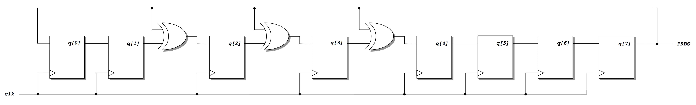
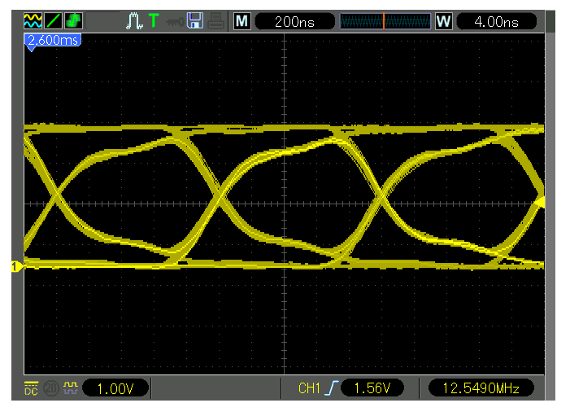
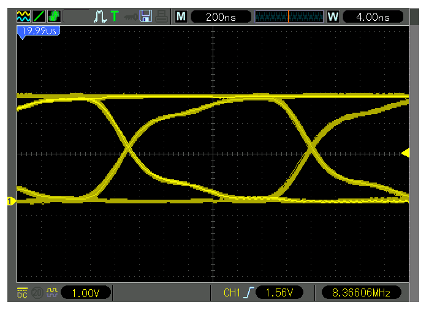
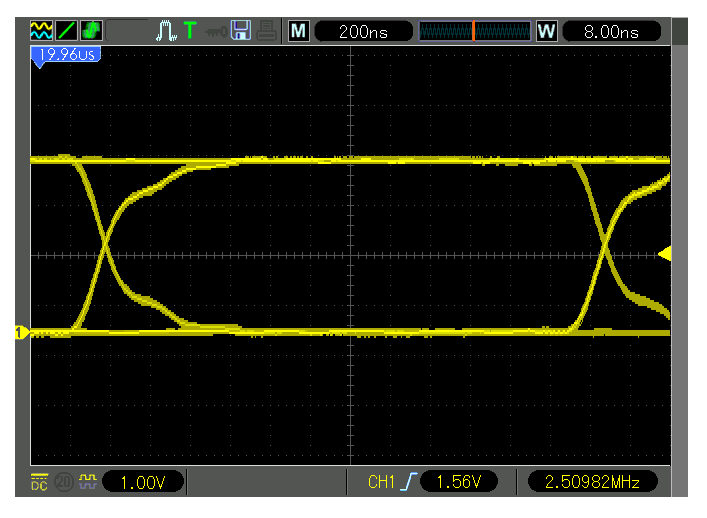
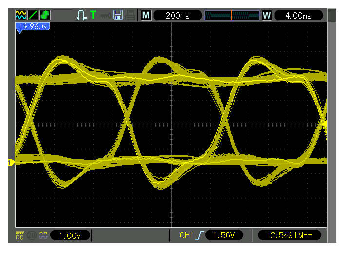

# Practicum 7
[[**Home**](https://github.com/lpacher/lae)] [[**Back**](https://github.com/lpacher/lae/tree/master/fpga/practicum)]


## Contents

* [**Introduction**](#introduction)
* [**Practicum aims**](#practicum-aims)
* [**Navigate to the practicum directory**](#navigate-to-the-practicum-directory)
* [**Setting up the work area**](#setting-up-the-work-area)
* [**Compile the PLL IP core**](#compile-the-pll-ip-core)
* [**Review RTL sources (optional)**](#review-rtl-sources-optional)
* [**Simulate the design (optional)**](#simulate-the-design-optional)
* [**Implement the design on target FPGA**](#implement-the-design-on-target-fpga)
* [**Install and debug the firmware**](#install-and-debug-the-firmware)
* [**Display the eye-diagram at the oscilloscope**](#display-the-eye-diagram-at-the-oscilloscope)
* [**Exercises**](#exercises)

<br />
<!--------------------------------------------------------------------->


## Introduction
[**[Contents]**](#contents)

In this practicum we implement and test on real FPGA hardware a
**Pseudo-Random Bit Sequence (PRBS) generator** using an **8-bit Linear-Feedback Shift-Register (LFSR)**.

The pseudo-random bit sequence generated by the circuit can be then used to display an **eye-diagram**
at the oscilloscope in order to qualify the quality of terminations and transmission lines.

The RTL code of the digital block has been already discussed and simulated in:

_<https://github.com/lpacher/lae/tree/master/fpga/labs/lab9>_

<br />



<br />
<!--------------------------------------------------------------------->


## Practicum aims
[**[Contents]**](#contents)

This practicum should exercise the following concepts:

* review the working principle of a PRBS generator using a LFSR
* implement and test the circuit on real FPGA hardware
* display an eye-diagram at the oscilloscope

<br />
<!--------------------------------------------------------------------->


## Navigate to the practicum directory
[**[Contents]**](#contents)

As a first step, open a **terminal** window and change to the practicum directory:

```
% cd Desktop/lae/fpga/practicum/7_eye_diagram
```

<br />

List the content of the directory:

```
% ls -l
% ls -la
```

<br />
<!--------------------------------------------------------------------->


## Setting up the work area
[**[Contents]**](#contents)


Copy from the `.solutions/` directory the main `Makefile` already prepared for you:

```
% cp .solutions/Makefile .
```

<br />

Create a new fresh working area:

```
% make area
```

<br />

Additionally, recursively copy from the `.solutions/` directory the following design sources and scripts already prepared for you:

```
% cp -r .solutions/rtl/      .
% cp -r .solutions/bench/    .
% cp -r .solutions/scripts/  .
% cp -r .solutions/xdc/      .
```

<br />
<!--------------------------------------------------------------------->


## Compile the PLL IP core
[**[Contents]**](#contents)

A Phase-Locked Loop (PLL) IP core is used in RTL to **filter the jitter on the external input clock**
fed to the core logic. The main **Xilinx Core Instance (XCI)** XML file containing the configuration of the IP has been
already prepared for you.

Create a new `cores/PLL/` directory to contain IP sources that will be generated by the Vivado IP flow:

```
% mkdir cores/PLL
```

<br />

Copy from the `.solutions/cores/PLL/` directory the main XCI configuration file:

```
% cp .solutions/cores/PLL/PLL.xci  cores/PLL/
```

<br />


Finally, **compile the IP** using `make` as follows:

```
% make ip xci=cores/PLL/PLL.xci
```

<br />

At the end of the flow verify that all IP sources are in place:

```
% ls -l cores/PLL/
```

<br />
<!--------------------------------------------------------------------->


## Review RTL sources (optional)
[**[Contents]**](#contents)

The proposed block is a shift-register with a special "feedback" that causes register outputs to assume binary values that "seems" random.
A parameterized tick-counter can be used to slow-down the data processing, while the PLL is used to filter the
input clock.

If needed, review in your text-editor application the main RTL module `rtl/LFSR.v` before continuing.

<br />
<!--------------------------------------------------------------------->


## Simulate the design (optional)
[**[Contents]**](#contents)

Before mapping the RTL code into real FPGA hardware it is recommended to run a behavioral simulation of the proposed RTL code
in order to verify that all RTL and IP sources are in place and to review the functionality of the digital block:

```
% make sim mode=gui
```

<br />
<!--------------------------------------------------------------------->


## Implement the design on target FPGA
[**[Contents]**](#contents)

Inspect the content of the main **Xilinx Design Constraints (XDC)** file used to implement the design on real FPGA hardware already
prepared for you:

```
% cat xdc/LFSR.xdc
```

<br />

If not already in place, copy the file from the `.solutions/` directory as follows:

```
% cp .solutions/xdc/LFSR.xdc  xdc/
```

<br />

Identify all pins that have been used to map top-level RTL ports.

<br />

>
> **QUESTION**
>
> On which board pin has been mapped the `PRBS` Verilog output port ?
>
>   \____________________________________________________________________________________________________
>

<br />

Run the FPGA implementation flow in _**Non Project mode**_ from the command line:

```
% make build
```

<br />

Once done, verify that the **bitstream file** has been properly generated:

```
% ls -l work/build/outputs/  | grep .bit
```

<br />
<!--------------------------------------------------------------------->


## Install and debug the firmware
[**[Contents]**](#contents)

Connect the board to the USB port of your personal computer using a **USB A to micro USB cable**. Verify that the **POWER** status LED turns on.
Once the board has been recognized by the operating system **upload the firmware** from the command line using:

```
% make install
```

<br />

Observe the pseudo-random bit sequence at the oscilloscope.

<br />

>
> **QUESTION**
>
> Which is the rate of the pseudo-random bit sequence ? Compare your answer with the behavioral simulation.
>
>   \____________________________________________________________________________________________________
>

<br />
<!--------------------------------------------------------------------->


## Display the eye diagram at the oscilloscope
[**[Contents]**](#contents)

The pseudo-random serial output generated by the circuit can be used to display a so called **eye-diagram**. This is
a well-known technique extensively employed to qualify the **goodness and reliability of a data-transmission system**.

In order to display the eye diagram simply trigger on the pseudo-random serial output and set the oscilloscope acquisition mode to **infinite persistence**.
The **overlay** between all low-to-high and high-to-low transitions generates the diagram. The quality of the data transmission is then quantified
by the _**opening**_ of the "eye", while **RMS and peak-to-peak jitter** can be measured by sampling and histogramming the arrival time.

<br />



<br />
<!--------------------------------------------------------------------->

## Exercises
[**[Contents]**](#contents)


**EXERCISE 1**

Modify the `rtl/LFSR.v` code in order to decrease the frequency of the "tick" generated by the tick-counter by changing
the `MAX` value. As an exemple:

```verilog
TickCounterRst #(.MAX(3)) TickCounter_inst (.clk(clk), .rst(~pll_locked), .tick(enable)) ;
```

<br />

Once done, save the file and try to re-run the flows from scratch up to FPGA programming with:

```
% make clean
% make build install
```

<br />

Display the new eye diagram after your changes.

<br />




<br />

>
> **QUESTION**
>
> What happens to the "eye" by lowering the frequency of the "tick" ?
>
>   \____________________________________________________________________________________________________
>

<br />

**EXERCISE 2**

Modify the constraints file `xdc/LFSR.xdc` in order to map the `PRBS` output on a PMOD pin **without a 200 ohm series resistor**.

As an example:

```
% set_property -dict { PACKAGE_PIN E15  IOSTANDARD LVCMOS33 } [get_ports PRBS]
```

<br />

Once done, save the file and try to re-run the flows from scratch up to FPGA programming with:

```
% make clean
% make build install
```

<br />

Display the new eye diagram after your changes. Observe the additional "ringing" in the waveforms due to the lack of a 
series resistance.

<br />



<br />

**EXERCISE 3**

Change the default `SEED` value of the LFSR from `8'hFF` to `8'h00` in the `rtl/LFSR.v` module declaration:

```verilog
module LFSR #(parameter [7:0] SEED = 8'h00) (

...
...

endmodule
```

<br />

Once done, save the file and try to re-run the flows from scratch up to FPGA programming with:

```
% make clean
% make build install
```

<br />

>
> **QUESTION**
>
> What happens to the pseudo-random bit sequence generated by the LFSR ?
>
>   \____________________________________________________________________________________________________
>

<br />

