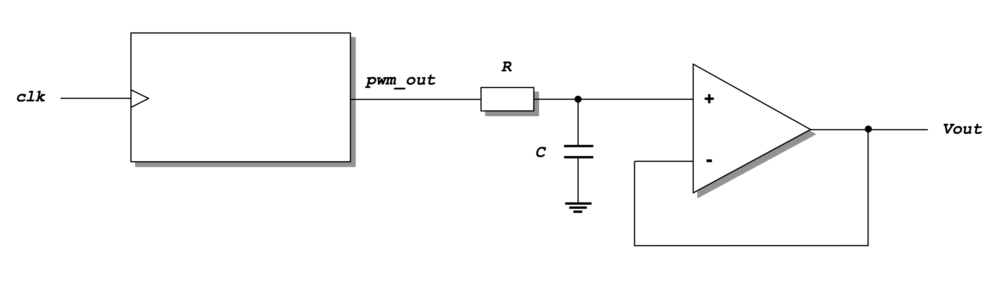

<div align="justify">

# Practicum 8
[[**Home**](https://github.com/lpacher/lae)] [[**Back**](https://github.com/lpacher/lae/tree/master/fpga/practicum)]

## Contents

* [**Introduction**](#introduction)
* [**Practicum aims**](#practicum-aims)
* [**Navigate to the practicum directory**](#navigate-to-the-practicum-directory)
* [**Setting up the work area**](#setting-up-the-work-area)
* [**Compile the PLL IP core**](#compile-the-pll-ip-core)
* [**Review RTL sources (optional)**](#review-rtl-sources-optional)
* [**Simulate the design (optional)**](#simulate-the-design-optional)
* [**Implement the design on target FPGA**](#implement-the-design-on-target-fpga)
* [**Install and debug the firmware**](#install-and-debug-the-firmware)
* [**Implement a 1-bit DAC on breadboard**](#implement-a-1-bit-dac-on-breadboard)
* [**Data analysis**](#data-analysis)


<br />
<!--------------------------------------------------------------------->

## Introduction
[**[Contents]**](#contents)

In this practicum we implement and test on real FPGA hardware a free-running **programmable 4-bit Pulse-Width Modulation (PWM) generator**.
The threshold value for the PWM comparator can be changed through **slide-switches** available on the Arty A7 board. <br />
Additionally, the resulting variable duty-cycle PWM output signal can be used to generate a **programmable DC voltage** using a simple <br />
**RC low-pass filter**, thus realizing a so-called **1-bit DAC**.

The RTL code of the digital block has been already discussed and simulated in:

_<https://github.com/lpacher/lae/tree/master/fpga/labs/lab8>_


<br />
<!--------------------------------------------------------------------->


## Practicum aims
[**[Contents]**](#contents)

This practicum should exercise the following concepts:

* review the working principle of Pulse Width Modulation (PWM)
* implement and test a free-running programmable 4-bit PWM generator on real FPGA hardware
* measure the PWM period and compare its value with expectations
* display the frequency-spectrum of a signal at the oscilloscope with the FFT
* implement a 1-bit DAC to generate a programmable DC voltage
* verify the PWM linear characteristics duty-cycle vs. threshold code
* verify the DAC linear characteristics output voltage vs. threshold code

<br />
<!--------------------------------------------------------------------->


## Navigate to the practicum directory
[**[Contents]**](#contents)

As a first step, open a **terminal** window and change to the practicum directory:

```
% cd Desktop/lae/fpga/practicum/8_pwm_dac
```

<br />

List the content of the directory:

```
% ls -l
% ls -la
```

<br />
<!--------------------------------------------------------------------->


## Setting up the work area
[**[Contents]**](#contents)


Copy from the `.solutions/` directory the main `Makefile` already prepared for you:

```
% cp .solutions/Makefile .
```

<br />

Create a new fresh working area:

```
% make area
```

<br />

Additionally, recursively copy from the `.solutions/` directory the following design sources and scripts already prepared for you:

```
% cp -r .solutions/rtl/      .
% cp -r .solutions/bench/    .
% cp -r .solutions/scripts/  .
% cp -r .solutions/xdc/      .
```

<br />
<!--------------------------------------------------------------------->


## Compile the PLL IP core
[**[Contents]**](#contents)

As usual a Phase-Locked Loop (PLL) IP core is used in RTL to **filter the jitter on the external input clock**
fed to the core logic. The main **Xilinx Core Instance (XCI)** XML file containing the configuration of the IP has been
already prepared for you.

Create a new `cores/PLL/` directory to contain IP sources that will be generated by the Vivado IP flow:

```
% mkdir cores/PLL
```

<br />

Copy from the `.solutions/cores/PLL/` directory the main XCI configuration file:

```
% cp .solutions/cores/PLL/PLL.xci  cores/PLL/
```

<br />

Finally, **compile the IP** using `make` as follows:

```
% make ip xci=cores/PLL/PLL.xci
```

<br />

At the end of the flow verify that all IP sources are in place:

```
% ls -l cores/PLL/
```

<br />
<!--------------------------------------------------------------------->


## Review RTL sources (optional)
[**[Contents]**](#contents)

The proposed block is a 4-bit free-running counter followed by a binary-comparator that compares the count value with
an external 4-bit programmable threshold. A parameterized tick-counter can be used to slow-down the data processing, while the
PLL core is used to filter the 100 MHz input clock.

If needed, review in your text-editor application the main RTL module `rtl/PWM.v` before continuing.

<br />
<!--------------------------------------------------------------------->


## Simulate the design (optional)
[**[Contents]**](#contents)

Before mapping the RTL code into real FPGA hardware it is recommended to run a behavioral simulation of the proposed RTL code
in order to verify that all RTL and IP sources are in place and to review the functionality of the digital block:

```
% make sim mode=gui
```

<br />
<!--------------------------------------------------------------------->


## Implement the design on target FPGA
[**[Contents]**](#contents)

Inspect the content of the main **Xilinx Design Constraints (XDC)** file used to implement the design on real FPGA hardware already
prepared for you:

```
% cat xdc/PWM.xdc
```

<br />

If not already in place, copy the file from the `.solutions/` directory as follows:

```
% cp .solutions/xdc/PWM.xdc  xdc/
```

<br />


Identify all pins that have been used to map top-level RTL ports.

<br />

>
> **QUESTION**
>
> On which board pin has been mapped the `pwm_out` Verilog output port ?
>
>   \____________________________________________________________________________________________________
>

<br />

Run the FPGA implementation flow in _**Non Project mode**_ from the command line:

```
% make build
```

<br />

Once done, verify that the **bitstream file** has been properly generated:

```
% ls -l work/build/outputs/  | grep .bit
```

<br />
<!--------------------------------------------------------------------->


## Install and debug the firmware
[**[Contents]**](#contents)

Connect the board to the USB port of your personal computer using a **USB A to micro USB cable**. Verify that the **POWER** status LED turns on.
Once the board has been recognized by the operating system **upload the firmware** from the command line using:

```
% make install
```

<br />

Observe the PWM output signal at the oscilloscope. Change the 4-bit threshold value using the slide-switches available on the board.

<br />

>
> **QUESTION**
>
> Which is the period of the PWM signal ? Is this value as expected from the RTL code ?
>
>   \____________________________________________________________________________________________________
>

<br />
<!--------------------------------------------------------------------->


## Implement a 1-bit DAC on breadboard
[**[Contents]**](#contents)

The PWM output signal is a **periodic signal**, thus it can be expressed in form of **Fourier series** as the sum
of a first **frequency-independent contribution**, corresponding to the **average value of the signal**, plus a sum
of infinite frequency-dependent sine/cosine terms:

$$
v(t) = V_{DC} + \sum_{n=0}^{\infty} \left[ a_n \cos(\omega_n t) + b_n \sin(\omega_n t) \right]
$$

<br />

With a large-enough **low-pass filter** (it can be as simple as a low-pass _RC_ filter) we can therefore obtain a constant
DC voltage from a PWM signal by removing all remaining frequency-dependent terms of the series.
This is the working principle of a so-called **1-bit D/A converter**.

As a first step display the **frequency-spectrum** of the PWM waveform at the oscilloscope by means of the
**Fast Fourier Transform (FFT)** function. Choose a threshold code at the middle of the range e.g. `4'b0111`
in order to generate a PWM waveform with approx. 50% duty cycle that mimics a square wave. Compare FFT results
with the well-known theoretical Fourier expansion of a square wave. 

Once happy with FFT implement the following circuit on breadboard:

<br />



<br />

Choose yourself proper resistance and capacitance values for the filter. If you have time, you can **optionally** place
an additional **buffer** implemented with an **operational amplifier** (e.g. **uA741**, **LM324**)
working in **voltage-follower** configuration.


<br />
<!--------------------------------------------------------------------->

## Data analysis
[**[Contents]**](#contents)

Once done, connect the PWM signal generated by the FPGA to the breadboard and verify at the oscilloscope that at the
output of the low-pass filter you obtain a constant DC voltage. Play with slide-switches on the board.

Create a new directory for your data analysis:

```
% mkdir data
```

<br />

Explore all possible threshold values and derive the **DAC characteristic**. For each code measure
the **DC output voltage** with a digital multimeter (DMM) and the **duty-cycle** of the PWM signal
at the oscilloscope. Plot output voltage vs. threshold code and duty-cycle vs. threshold code.


<br />

|   threshold code   |   Vout   |   Ton   |   Ton/T   |
|:------------------:|:--------:|:-------:|:---------:|
|        0           |   ...    |   ...   |    ...    |
|        1           |   ...    |   ...   |    ...    |
|        2           |   ...    |   ...   |    ...    |
|        ...         |   ...    |   ...   |    ...    |
|        ...         |   ...    |   ...   |    ...    |
|        15          |   ...    |   ...   |    ...    |

<br />

Use **ROOT** for your data analysis and make a `TGraph` plot of collected _output voltage_ vs. _code_ values.
Verify the expected linearity of the characteristic with a fit. Feel free to use a **PyROOT** script instead.

<br />

>
> **HINT**
>
> Simple plots of experimental data in form of y-values vs. x-values in ROOT are implemented using the `TGraph` class,
> which allows to also **read measurements data from a text file**.
>
> With your text-editor application create a new text file e.g. `data/pwm_dac.txt` and register your measurements as follows:
>
> ```
> # code  Vout  Ton  Ton/T
> 0       ...   ...   ...
> 1       ...   ...   ...
> 2       ...   ...   ...
> ...     ...   ...   ...
> ...     ...   ...   ...
> 15      ...   ...   ...
> ```
>
> <br />
>
> You can use as many blank characters as you want to indent your measurements. 
> Once finished start an **interactive ROOT session** at the command line:
>
> ```
> % root -l
> ````
>
> <br />
>
> Plot and fit the characteristic interactively with:
>
> ```
> root[] TGraph gr("data/pwm_dac.txt")
> root[] gr.Draw("ALP")
> ```
>
> <br />
>
> Finally perform a linear fit with:
>
> ```
> root[] gr.Fit("pol1")
> ```
>
> <br />
>
> Alternatively you can place your measurements into **standard C/C++ arrays** and use them
> into the `TGraph` constructor:
>
> ```
> root[] int Npt = 16
> root[] double xData[Npt] = {0,1,2,3 ... 15}
> root[] double yData[Npt] = { ... }
> root[] TGraph gr(Npt,xData,yData)
> root[] gr.Draw("ALP")
> root[] gr.Fit("pol1")
> ```
>

<br />

Sample **ROOT un-named scripts** have been already prepared for you as a reference starting point
for your analysis, you can copy them from the `.solutions/bin/` directory as follows:

```
% cp -r .solutions/bin/  .
```

<br />

Ask to the teacher if you are not confident in using the ROOT software.

</div>
