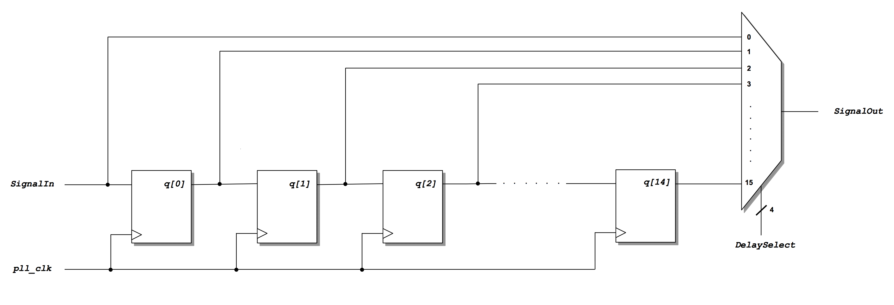
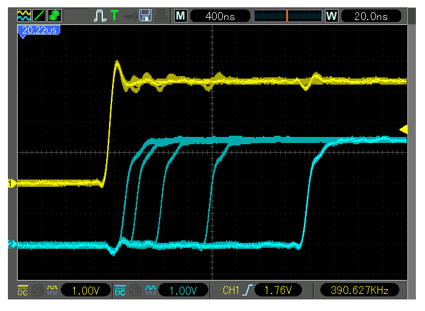

# Practicum 9
[[**Home**](https://github.com/lpacher/lae)] [[**Back**](https://github.com/lpacher/lae/tree/master/fpga/practicum)]

## Contents

* [**Introduction**](#introduction)
* [**Practicum aims**](#practicum-aims)
* [**Navigate to the practicum directory**](#navigate-to-the-practicum-directory)
* [**Setting up the work area**](#setting-up-the-work-area)
* [**Compile the PLL IP core**](#compile-the-pll-ip-core)
* [**Inspect RTL sources**](#inspect-rtl-sources)
* [**Simulate the design (optional)**](#simulate-the-design-optional)
* [**Implement the design on target FPGA**](#implement-the-design-on-target-fpga)
* [**Install and debug the firmware**](#install-and-debug-the-firmware)
* [**Data analysis**](#data-analysis)


<br />
<!--------------------------------------------------------------------->

## Introduction
[**[Contents]**](#contents)

In this practicum we implement and test on real FPGA hardware a **Digitally-Controlled Delay Line (DCDL)**
using a **Serial-In Parallel-Out (SIPO) shift register** and a multiplexer. The circuit can be then used to
add a **4-bit programmable delay** on an input signal by changing the amount of delay through **slide-switches** available on the Arty A7 board.
Optionally, a **PLL core** can be used to **multiply the input clock** in order to increase the resolution
of the delay. An **auxiliary PWM generator** has been also included in the RTL code in order to test the circuit
without the need of an external waveform generator.


<br />
<!--------------------------------------------------------------------->


## Practicum aims
[**[Contents]**](#contents)

This practicum should exercise the following concepts:

* review how to  describe a shift register in Verilog HDL
* implement and test on real FPGA hardware a programmable delay line
* use a PLL IP core for clock multiplication
* verify the linear characteristics delay value vs. MUX selection code

<br />
<!--------------------------------------------------------------------->


## Navigate to the practicum directory
[**[Contents]**](#contents)

As a first step, open a **terminal** window and change to the practicum directory:

```
% cd Desktop/lae/fpga/practicum/9_delay_line
```

<br />

List the content of the directory:

```
% ls -l
% ls -la
```

<br />
<!--------------------------------------------------------------------->


## Setting up the work area
[**[Contents]**](#contents)


Copy from the `.solutions/` directory the main `Makefile` already prepared for you:

```
% cp .solutions/Makefile .
```

<br />

Create a new fresh working area:

```
% make area
```

<br />

Additionally, recursively copy from the `.solutions/` directory the following design sources and scripts already prepared for you:

```
% cp -r .solutions/rtl/      .
% cp -r .solutions/bench/    .
% cp -r .solutions/scripts/  .
% cp -r .solutions/xdc/      .
```

<br />
<!--------------------------------------------------------------------->


## Compile the PLL IP core
[**[Contents]**](#contents)

As usual a PLL IP core is used in RTL to **filter the jitter on the external input clock**
fed to the core logic. Additionally, we use the PLL to **double the clock frequency** up to 200 MHz in order to
increase the resolution of the fine-delay. Both 100 MHz and 200 MHz clocks are generated by the core and can
be used in the core logic.

The main **Xilinx Core Instance (XCI)** XML file containing the configuration of the IP has been
already prepared for you.

Create a new `cores/PLL/` directory to contain IP sources that will be generated by the Vivado IP flow:

```
% mkdir cores/PLL
```

<br />

Copy from the `.solutions/cores/PLL/` directory the main XCI configuration file:

```
% cp .solutions/cores/PLL/PLL.xci  cores/PLL/
```

<br />

Finally, **compile the IP** using `make` as follows:

```
% make ip xci=cores/PLL/PLL.xci
```

<br />

At the end of the flow verify that all IP sources are in place:

```
% ls -l cores/PLL/
```

<br />

Inspect the **Verilog instantiation template** generated for you by Vivado in order to understand the port list
of the IP that we are going to use in the RTL code:

```
% cat cores/PLL/PLL.veo
```

<br />
<!--------------------------------------------------------------------->


## Inspect RTL sources
[**[Contents]**](#contents)

The circuit that you are going to implement and test on real hardware is the following:

<br />



<br />

An auxiliary 8-bit PWM generator (not shown in the schematic) has been also included in the RTL code in order to test the
functionality of the programmable delay-line without the need of an external waveform generator.

Open with a text editor application the main `rtl/DelayLine.v` RTL code already prepared for you and try to understand
the working principle of the proposed digital design.

<br />
<!--------------------------------------------------------------------->


## Simulate the design (optional)
[**[Contents]**](#contents)

Before mapping the RTL code into real FPGA hardware it is recommended to run a behavioral simulation of the proposed RTL code:

```
% make sim mode=gui
```

<br />

Debug your simulation results.

<br />
<!--------------------------------------------------------------------->


## Implement the design on target FPGA
[**[Contents]**](#contents)

Inspect the content of the main **Xilinx Design Constraints (XDC)** file used to implement the design on real FPGA hardware already
prepared for you:

```
% cat xdc/DelayLine.xdc
```

<br />

If not already in place, copy the file from the `.solutions/` directory as follows:

```
% cp .solutions/xdc/DelayLine.xdc  xdc/
```

<br />

Identify all pins that have been used to map top-level RTL ports.

<br />

>
> **QUESTION**
>
> On which board pin have been mapped `SignalIn`, `SignalOut` and `PWM` Verilog ports ?
>
>   \____________________________________________________________________________________________________
>

<br />


Run the FPGA implementation flow in _**Non Project mode**_ from the command line:

```
% make build
```

<br />

Once done, verify that the **bitstream file** has been properly generated:

```
% ls -l work/build/outputs/  | grep .bit
```

<br />
<!--------------------------------------------------------------------->


## Install and debug the firmware
[**[Contents]**](#contents)

Connect the board to the USB port of your personal computer using a **USB A to micro USB cable**. Verify that the **POWER** status LED turns on.
Once the board has been recognized by the operating system **upload the firmware** from the command line using:

```
% make install
```

<br />

Observe the `PWM` output signal at the oscilloscope. Then use a jumper wire to feed the PWM signal as input
for the delay line and change the amount of delay using on-board slide-switches. Verify at the oscilloscope
the expected functionality of the firmware.

<br />



<br />
<!--------------------------------------------------------------------->


## Data analysis
[**[Contents]**](#contents)

Explore all possible MUX selection codes and derive the **_delay vs. MUX code_ characteristic**. For each MUX code measure
at the oscilloscope the delay inserted between input and output signals. 

<br />

|   MUX code   |  delay  |
|:------------:|:-------:|
|     0        |   ...   |
|     1        |   ...   |
|     2        |   ...   |
|     ...      |   ...   |
|     ...      |   ...   |
|     15       |   ...   |

<br />

Use **ROOT** for your data analysis and make a `TGraph` plot of collected _delay_ vs. _MUX code_ values.
Verify the expected linearity of the characteristic with a fit. Feel free to use a **PyROOT** script instead.

<br />

> **HINT**
>
> Simple plots of experimental data in form of y-values vs. x-values in ROOT are implemented using the `TGraph` class,
> which also allows to **read and plot measurements data from a text file**.
>
> With your text-editor application create a new text file e.g. `data/DelayLine.dat` and register your measurements
> as follows:
>
> ```
> # code   delay[ns]
> 0        ...
> 1        ...
> 2        ...
> ...      ...
> ...      ...
> 15       ...
> ```
>
> <br />
>
> You can use as many blank characters as you want to indent your measurements. 
> Once finished start an **interactive ROOT session** at the command line:
>
> ```
> % root -l
> ```
>
> <br />
>
> Plot the characteristic interactively with:
>
> ```
> root[] TGraph gr("data/DelayLine.dat")
> root[] gr.Draw("ALP")
> ```
>
> <br />
>
> Finally perform a linear fit with:
>
> ```
> root[] gr.Fit("pol1")
> ```
>
> <br />
>
> Alternatively you can place your measurements into **standard C/C++ arrays** and use them
> into the `TGraph` constructor:
>
> ```
> root[] int Npt = 16
> root[] double xData[Npt] = {0,1,2,3 ... 15}
> root[] double yData[Npt] = { ... }
> root[] TGraph gr(Npt,xData,yData)
> root[] gr.Draw("ALP")
> root[] gr.Fit("pol1")
> ```

<br />

Sample **ROOT un-named scripts** have been already prepared for you as a reference starting point
for your analysis, you can copy them from the `.solutions/bin/` directory as follows:

```
% cp -r .solutions/bin/  .
```

<br />

Ask to the teacher if you are not confident in using the ROOT software.

<br />

>
> **QUESTION**
>
> The linear fit on the experimental data shows a **non-zero input/output delay** when the digital code is `4'b0000`.
> Is this "offset" expected ? How much is this extra delay ?
>
>   \___________________________________________________________________________________
>

<br />

Compare your answer with a quick **timing analysis** in Vivado. For this purpose restore into a **Vivado interactive Tcl session**
the final "routed" design checkpoint automatically created for you by the `make build` flow:

```
% vivado -mode tcl -nolog -nojournal work/build/outputs/routed.dcp
```
<br />

Then execute interactively the following commands in the Vivado Tcl console:

```
vivado% set_case_analysis 0 [get_ports DelaySelect*]
vivado% report_timing -from [get_ports SignalIn] -to [get_ports SignalOut]
```

<br />

Review the **timing report** in the console and identify the values for the input/output delay computed
by the STA engine. iCompare this value with your fit results. Exit from Vivado once happy:

```
vivado% exit
```


<br />
<!--------------------------------------------------------------------->


## Exercise
[**[Contents]**](#contents)

By default the PLL output clock used in the core logic runs at 100 MHz. However the PLL IP core has been compiled
such that it can also **multiply the clock up to 200 MHz** in order to **increase the resolution of the delay**.

Modify the `rtl/DelayLine.v` code in order to run the core logic at 200 MHz instead of 100 MHz as follows:

```
PLL  PLL_inst ( .CLK_IN(clk), . CLK_OUT_100(UNCONNECTED), .CLK_OUT_200(pll_clk), .LOCKED(pll_locked) ) ;
```

<br />

Once done, save the file and try to re-run the flows from scratch up to FPGA programming with:

```
% make clean
% make build install
```

<br />

Verify at the oscilloscope the functionality of the new firmware. If you have time
re-measure the _delay vs. MUX code_ characteristic and perform a linear fit on experimental data using ROOT.


